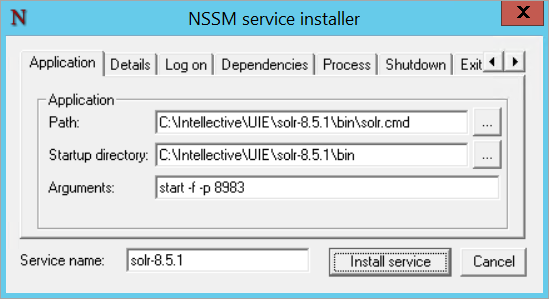
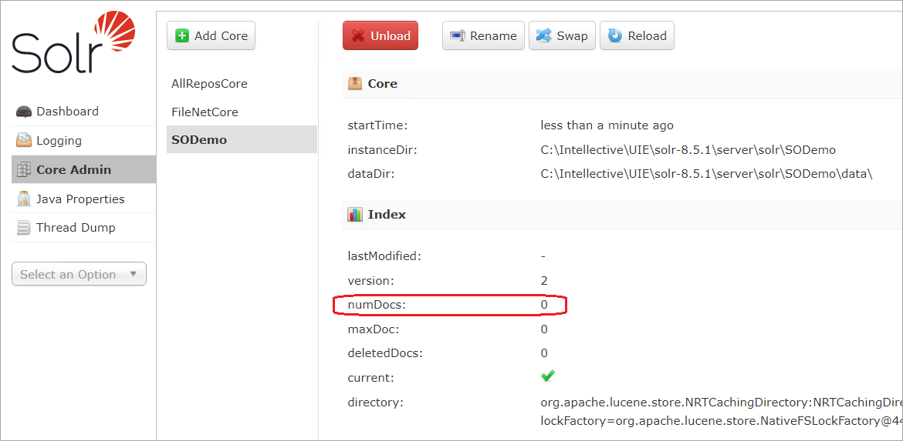
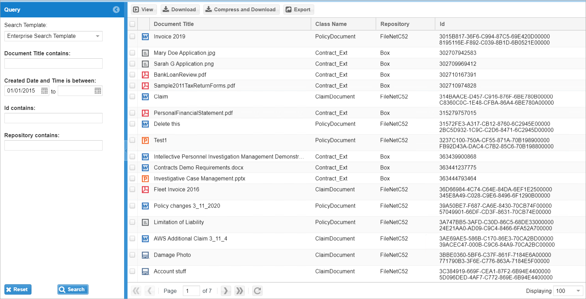

---
title: Configure UIE for Use
layout: docs
category: Enterprise Search
--- 
# Post-Installation Configuration   

## Configure UIE crawler and Solr as services 

### Windows 

Solr and Crawler scripts can be installed as Windows services. To install these as services, download [NSSM](https://nssm.cc/download) and extract files to a folder. 
**Note**: Do not delete `nssm.exe`, since it will be used when services need to be uninstalled in the future. 

To install Solr as a service: 
- In Command Prompt, go to the folder where `nssm.exe` is located (e.g `C:\Program Files\nssm\win64\nssm`) and type `nssm install solr-8.5.1` 

- Select the path to the `solr.cmd` folder and enter the arguments as shown: 
 
	 

- On Details tab, enter the information below and click `Install service`: 

	 

To install Crawler as a service: 
- In Command Prompt, go to the folder where `nssm.exe` is located (e.g `C:\Program Files\nssm\win64\nssm`) and type `nssm install crawler-7.6.1`
- Select the path to the `run-crawler.cmd` folder:
	
	 
	
- On Details tab, enter the information below and click `Install service`:
	
	 
	
- Verify that the services have been installed in Windows Services: 
	
	 
	
To remove Solr and Crawler services: 
- In Command Prompt, go to the folder where `nssm.exe` is located (e.g `C:\Program Files\nssm\win64\nssm`) and type `nssm remove solr-8.5.1`
- Click `Yes` to remove the service
- Type `nssm remove crawler-7.6.1`
- Click `Yes` to remove the service
- Verify that the services have been removed in Windows Services 

### Linux 

*Content should be added* 

## Clear UIE Solr Index 

If there is a need to re-crawl the repositories after an index schema change, first clear the Solr index using the instructions in this section, then run the crawler again as discussed in the previous section.
- Edit `solrconfig.xml` for SODemo under `<solr_install>/server/solr/SODemo/conf` 
	
	 
	
- Search for `enableRemoteStreaming` and update the settings as shown below (add `enableStreamBody` attribute if not already present) 
	
	 
	
- Restart Solr by stopping and starting the service
- Log into the Solr Admin page using `http://<servername>:<port>/solr`, by default [http://localhost:8983/solr](http://localhost:8983/solr) 
- From the Core Selector drop-down, select `SODemo` core, then select `Query` to open the Query page
- In the `Request-Handler (qt)` field, enter `/update` 
- In the Raw Query Parameters field, enter `stream.body=<delete><query>*:*</query></delete>&commit=true` 
	
	 
	
- Click `Execute Query`
- From the left-side menu bar, select `Core Admin`
- From the Core Selector drop-down, select `SODemo` core, then click `Reload`. The `numDocs` value should display 0 indicating there are no documents in the index anymore: 

	 
	
- From the Core Selector drop-down, select `SODemo` core, then select `Query` to open the Query page
- In the `Request-Handler (qt)` field, enter `/select`
- In the `q` field, enter `*:*`
- Click `Execute Query`
- Search for the `numFound` value and verify it is 0: 

	 
	
# UIE Crawler Logs 

Crawler log files below are located, by default, under `/uie-crawl/logs`:
- `error.log`
- `debug.log`

To change logging level, edit `logback.xml` under `/uie-crawl/ext` folder and change logging at the root level. Restart UIE crawler service. 
	
 
	
# Configure Unity for UIE 
	
## Prerequisites in WebSphere 

### JDBC providers 

Verify all required database JDBC providers are configured in WebSphere:
	
 
	
### CMOD Document Search 

- In WebSphere admin console, go to `Environment > Shared libraries`: 
	
	 
	
- Create a new shared library to include `ODApi.jar` in classpath: 
	
	 
	
- Go to the installed Unity application and click `Shared library references`: 
	
	 
	
- Reference the newly created shared library: 
	
	 
	
### Box Document Search 

- In WebSphere admin console, go to `Environment > Naming > Name space bindings`
	
	 
	
- Create a new binding for searching Box documents with the information below:
	- Binding Type: `String`
	- Binding Identifier: `box/appSettings`
	- Name in name space relative to lookup name prefix 'cell/persistent/': `box/appSettings` 
	- String value: copy the entire text from RSA Key Pair JSON file created above 
	
		 
		
- Restart WebSphere 

## Configure Datasource and Connector 

- Login to Unity `http://<servername>:<port>/<contextroot>`, by default [http://localhost:9080/vu](http://localhost:9080/vu) using admin username, password is available by request
- Go to Configuration Console tab and `Global > System > Connectors` and create a UIE connector: 
	
	ID: `uie_provider` 
	
	Type: `Unity Intelligence Engine` 
	
	 
	
- On Parameters tab, select Operators Set `Unity` (or the appropriate operators set available): 

	 
	
- On Properties mapping tab, enter the following mapping: 
	
	 

- On Additional properties tab, enter the following: 

	 
	
	**Note**: Index group need to be added from XML configuration once the connector is created under `<RepositoryDataProvider ID="uie_provider">` node as shown below and should match exactly with the one configured in crawler configurations: 
	
	 
	
- On Custom section tab, add two new sections: 
 
	- Communication
	
		Enter the following in Custom Section XML:  
	
		```xml 
		<Communication>
			<EncryptionKeyId>3DES</EncryptionKeyId>
		</Communication>
		``` 
		 
		
	- ViewerProperties 
	
		Enter the following in Custom Section XML, and Repositary internal name (`CE52` here) should match the repository ID configured in crawler config:
		
		```xml
		<ViewerProperties>
			<Repository internal="CE52"> 
				<DefineProperties>
					<Property ID="repositoryType" value="cpe_provider"/>
					<Property ID="documentId.Id" value="{This.document_id@s}"/>
					<Property ID="documentId.$os" value="${solution.object_store}"/>
				</DefineProperties>
			</Repository>
			<Repository internal="CMIS">
				<DefineProperties>
					<Property ID="repositoryType" value="cmis_alfresco_provider"/>
					<Property ID="documentId.cmis:objectId" value="{This.Id}"/>
				</DefineProperties>
			</Repository>
			<Repository internal="CmodRepository">
				<DefineProperties>
					<Property ID="repositoryType" value="cmod_provider"/>
					<Property ID="documentId.Id" value="{This.Id}"/>
				</DefineProperties>
			</Repository>
			<Repository internal="Cm8Repository">
				<DefineProperties>
					<Property ID="repositoryType" value="cm8_provider"/>
					<Property ID="documentId.cmis:objectId" value="{This.Id}"/>
					<Property ID="documentId.Id" value="{This.Id}"/>
				</DefineProperties>
			</Repository>
			<Repository internal="BoxRepository">
				<DefineProperties>
					<Property ID="documentId.Id" value="{This.$id}"/>
					<Property ID="repositoryType" value="box_provider"/>
				</DefineProperties>
			</Repository>
		</ViewerProperties>
		``` 
		
## Configure	Content Lists 

- Go to Configuration Console tab and `Global > User Interface > Content Lists` and create a new content list: 
	
	 
	
- On Define column sets tab, create default and all column sets with fields as shown below: 
	
	 
	
- On Add toolbar actions tab, add the toolbars as shown below: 
	
	 
	
- On Define listeners tab, add the listeners as shown below: 
	
	 
	
## Configure Search Template 

- Go to Configuration Console tab and `Global > User Interface > Search Templates` and create a new search template: 
	
	 
	
- On Define search criteria tab, enter the criteria as shown below: 
	
	 
	
- On Define operation tab, enter the information as shown below: 
	
	 
	
## Configure Tab and assign Search Template 

- Go to Configuration Console tab and `Global > User Interface > Tabs` and create a new tab: 
	
	 
	
- On Assign search template tab, enter the information as shown below: 
	
	 
	
- On Content List, select the appropriate grid as shown below: 
	
	 
	
- On Define security, select Unity Users group as shown below: 
	
	 
	
## UIE Search Test 

- Login to Unity using `http://<servername>:<port>/<context-root>`, by default [http://localhost:9080/vu](http://localhost:9080/vu) 
- Enter some search criteria and click search:  
	
	 
	
	 
	
	 

# Crawler configuration XML 

Crawlers use configuration XML which can be modified to crawl specific types of entities, e.g. documents. The table below lists all the tag names, usage, value and description of all the tags used in the XML: 
[https://confluence.intellective.com/display/PRODUCTxDOCUMENTATIONxVUx6x16xDRAFT/VU+Configuration+XML+Reference](https://confluence.intellective.com/display/PRODUCTxDOCUMENTATIONxVUx6x16xDRAFT/VU+Configuration+XML+Reference)

|      Tag Name      | Value | Crawler Usage | Description |
|:------------------:|:-----:|:-------------:|:-----------:|
| <GetPropertiesSQL> |       | CE 5.2, ...   |             |
|      <JobSQL>      |       | CE 5.2, ...   |             |
| <DocumentCheckSQL> |       | CE 5.2, ...   |             |
|                    |       |               |             |

*Content should be added* 
