# Introduction

Interchange package contains maven archetype project to quickly create connectors and transformers customization project.

# Maven archetype
Before you can use archetype project, you should update your `$HOME/.m2/settings.xml`. Add the following lines:

```xml
<server>
    <id>archetype</id>
    <username>username@intellective.com</username>
    <password>password</password>
<server>
<profiles>
        <profile>
          <id>intellective-archetype</id>
          <repositories>
            <repository>
              <id>archetype</id><!-- id expected by maven-archetype-plugin to avoid fetching from everywhere -->
              <url>https://maven.intellective.com/repository/maven-public/</url>
              <releases>
                <enabled>true</enabled>
                <checksumPolicy>fail</checksumPolicy>
              </releases>
              <snapshots>
                <enabled>true</enabled>
                <checksumPolicy>warn</checksumPolicy>
              </snapshots>
            </repository>
          </repositories>
        </profile>
</profiles>
```

To install archetype project, run maven command (check `README.md` file in Interchange build package dispatcher folder):

```
mvn archetype:generate \
-DarchetypeGroupId=com.intellective.interchange \
-DarchetypeArtifactId=streams-archetype \
-DarchetypeVersion=7.7.0-RC2-SNAPSHOT \
-DgroupId=my-groupdId \
-Dpackage=com.intellective.interchange.custom.my \
-DartifactId=custom-connectors
```

In provided example, modify archetype version to match Interchange version.
Package name should start from `com.intellective.interchange`, otherwise fix reflection scopes in the schema generator java class in the archetype project.

Open archetype project in IDE as maven project using Java 8 SDK:

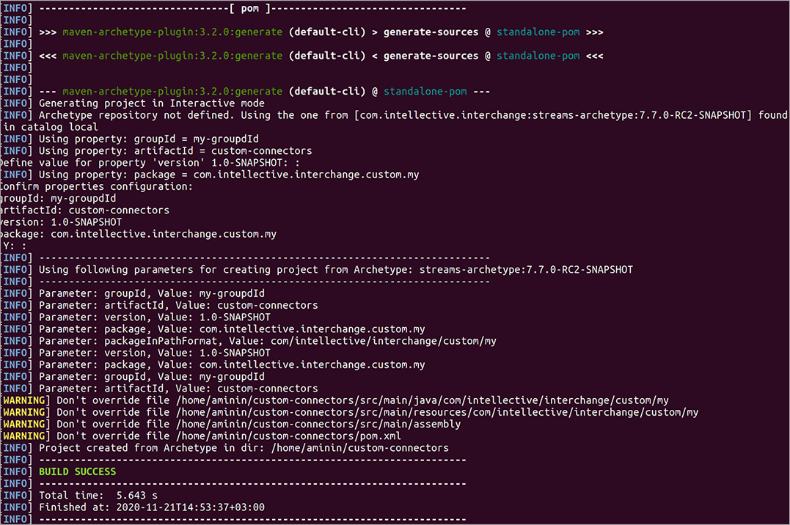

# Project structure

`$PROJECT/src/README.md` contains instructions how to install custom project artefacts:

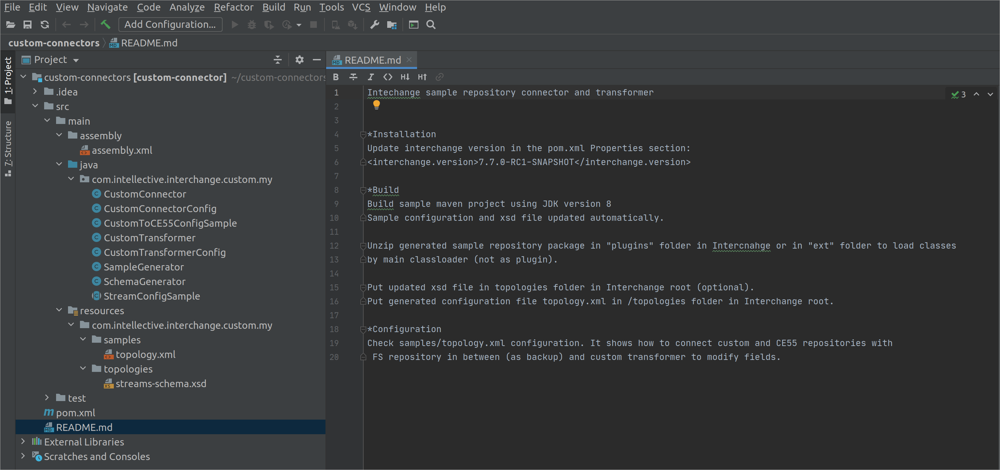

`CustomConnectorConfig` class is Jaxb annotated configuration bean for a custom connector class `CustomConnector`:

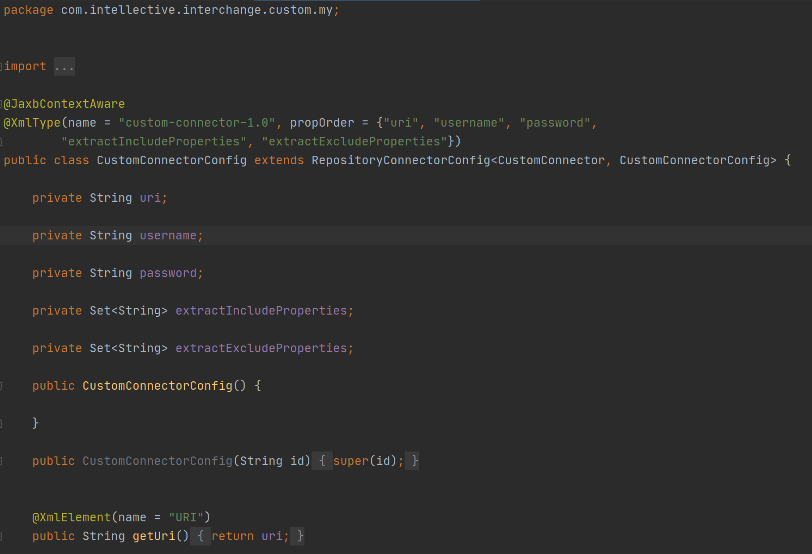

`CustomConnector` class is custom connector that implements `LOAD` and `EXTRACT` repository functions:

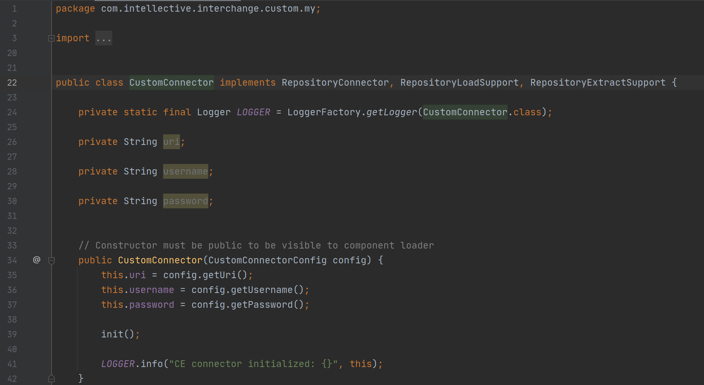

Check regular and `TODO` comments in the class. Sample code shows to work with extract and load methods and read/write content items to content store.

Transformer is another flowcomponent type. Transformer modifies documents in Kafka stream:

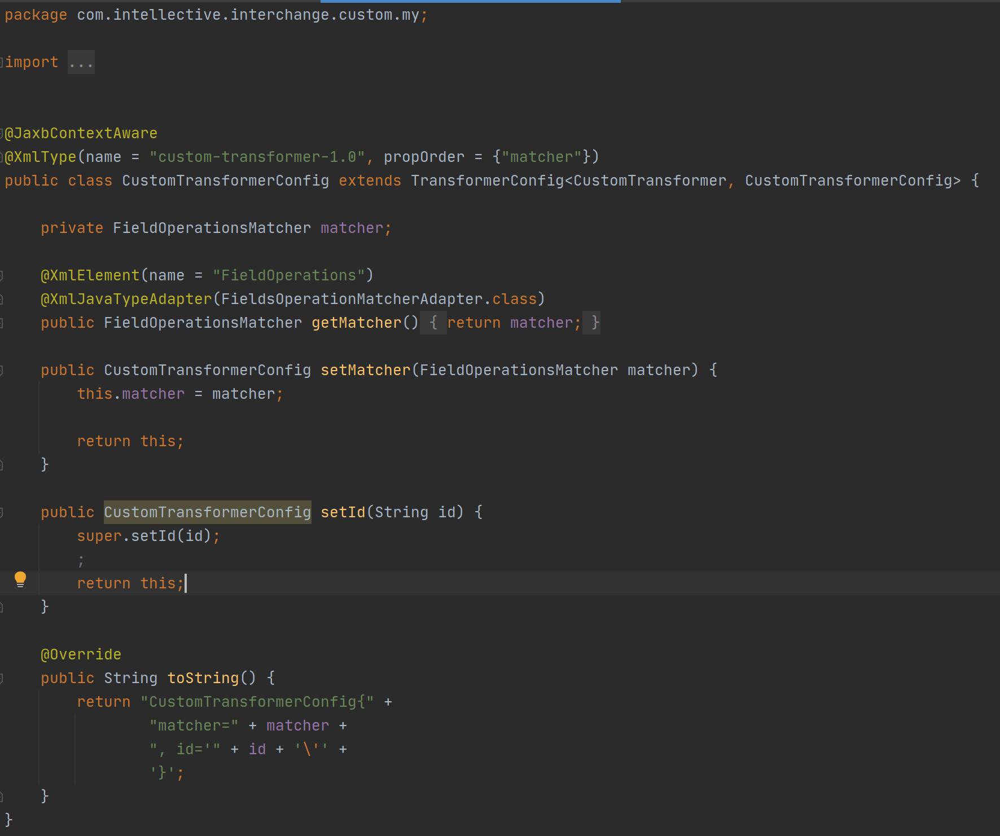

This transformer allows to modify document fields using exact or regex match:

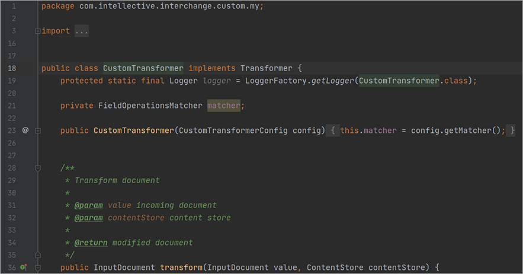

`CustomToCE55ConfigSample` class shows how to create programatically Interchange dispatcher configuration xml (`topology.xml`) file:

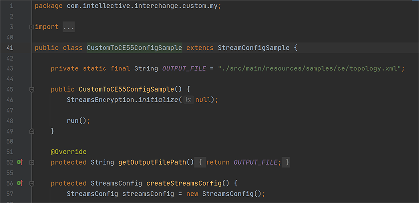

1. The custom connector extracts a document from the repository (in the sample, document is generated).
2. Document fields modified using the custom transformer.
3. Document is stored in json format in a folder using the FS repository connector.
4. Document is loaded in the FileNET repository using the CE 5.5 repository connector.
5. Finally, document is sent to the sink topic.

Samples generated by maven plugin on project build:

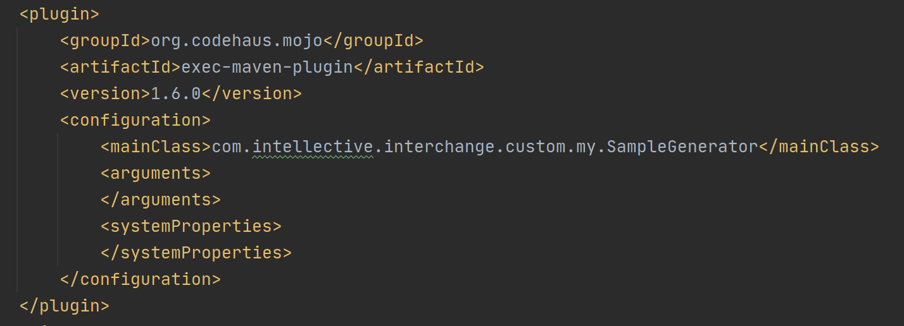

Code:

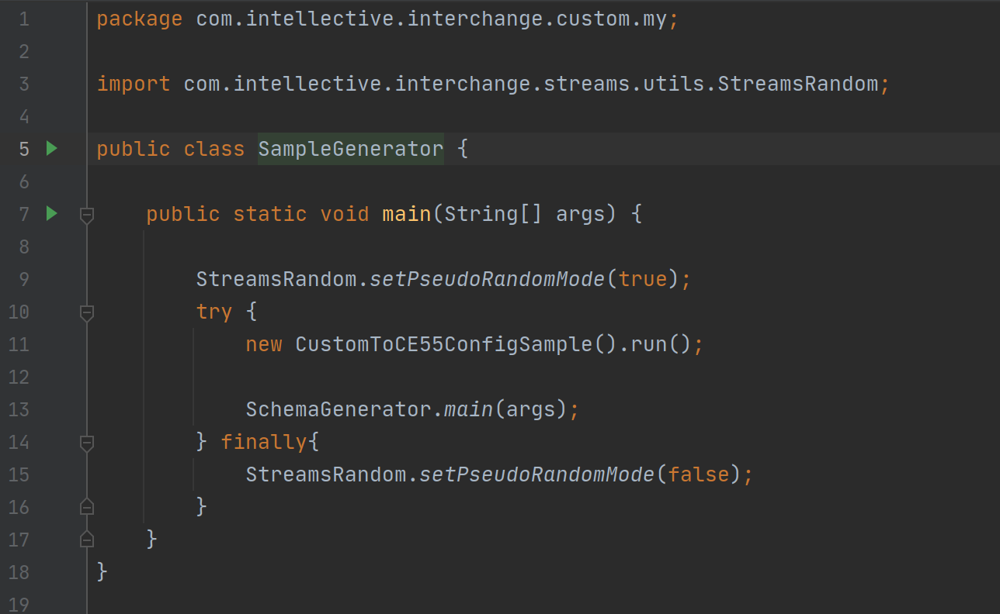

`assembly.xml` should be modified to include dependencies missing in Interchange product. 
Commented CE 5.5 dependencies, as a reference:

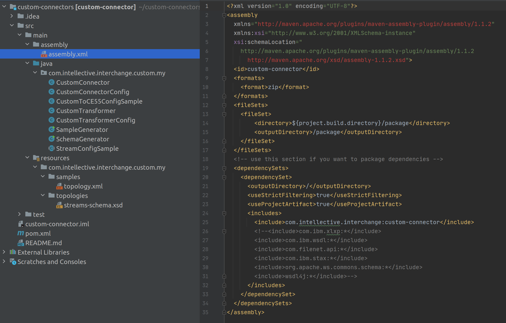

# Build custom code and integrate in Interchange product 

1. Build project and review project artefacts:

    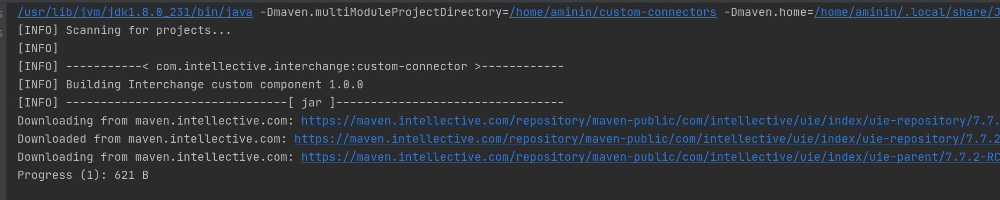

2. Take zip file from the target folder:

    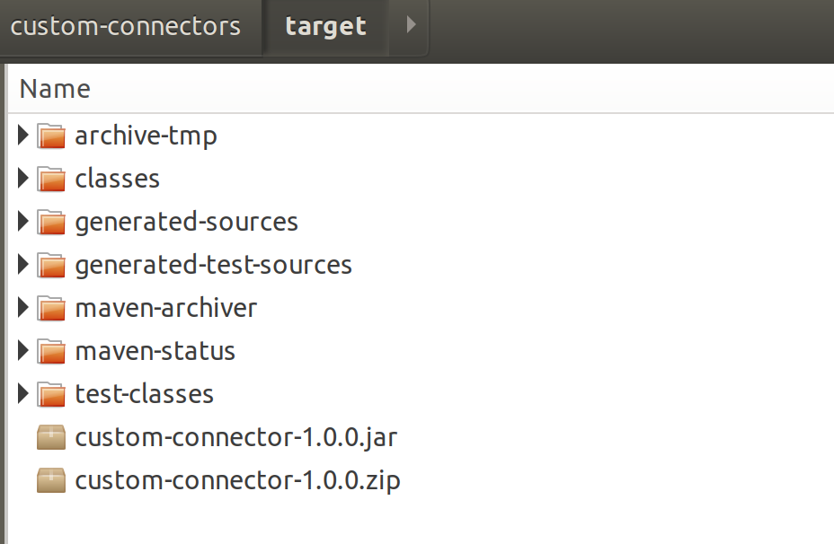

3. This file should be extracted in plugins or ext folder in the Interchange root:

    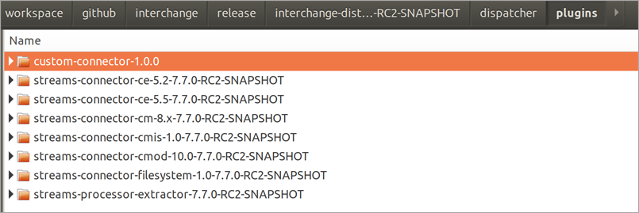

    Folder content:

    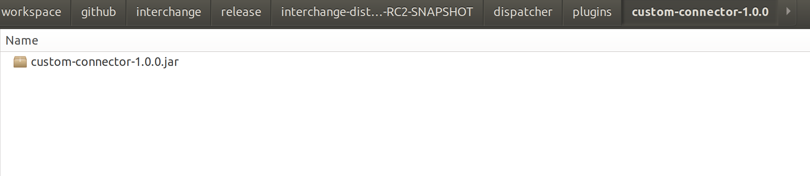

    Also, you can put custom classes in the ext folder to load by main class loader:

    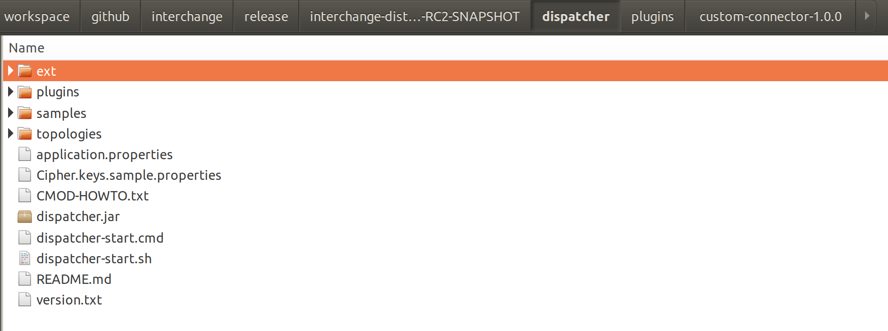

4. Now, check generated `topology.xml`:

    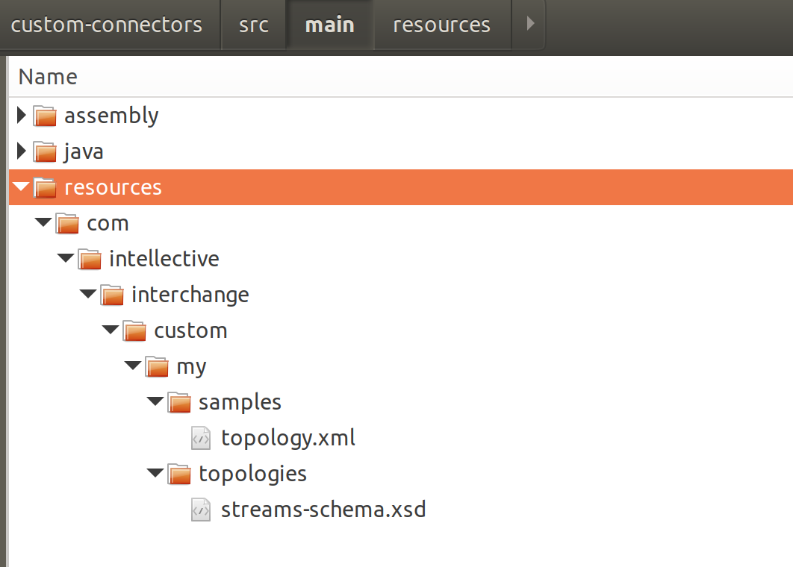

    `topology.xml` is dispatcher configuration file, `streams-schema.xsd` is updated xml reference that contains custom code objects:

    Topology section contains flow objects relations:

    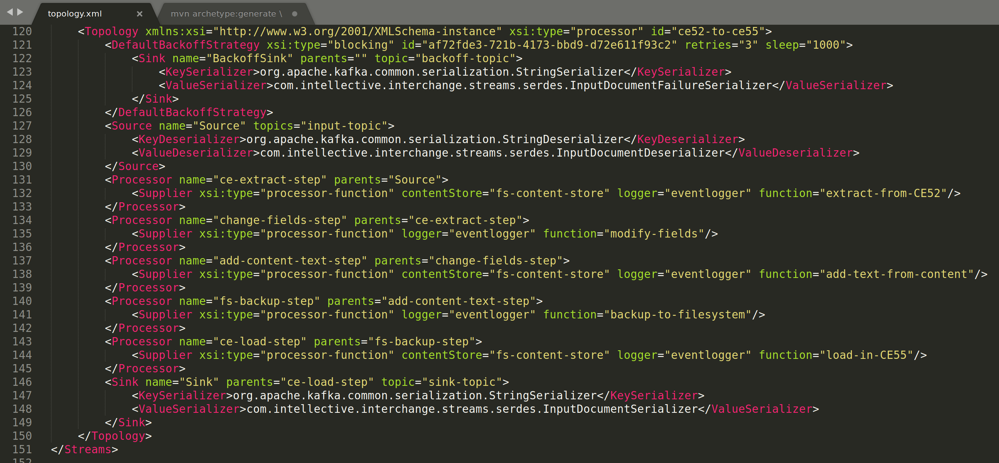

5. Copy `topology.xml` and `streams-schema.xsd` into topologies folder in Interchange root:

    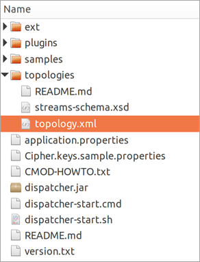

# Running Interchange

Check `README.md` file for instructions how to install and start Kafka, zookeeper and Interchange dispatcher:

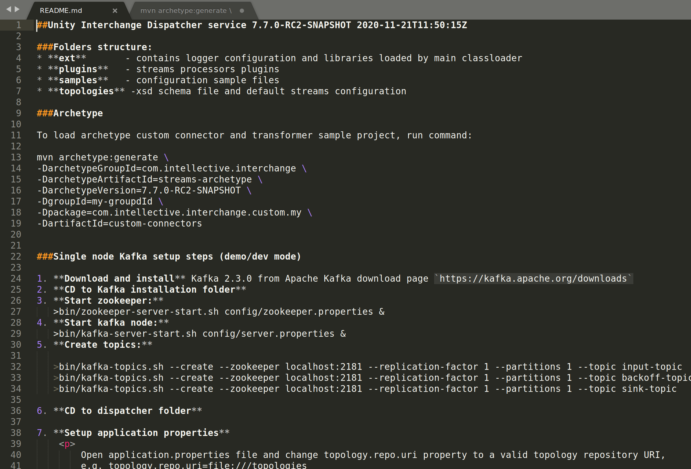