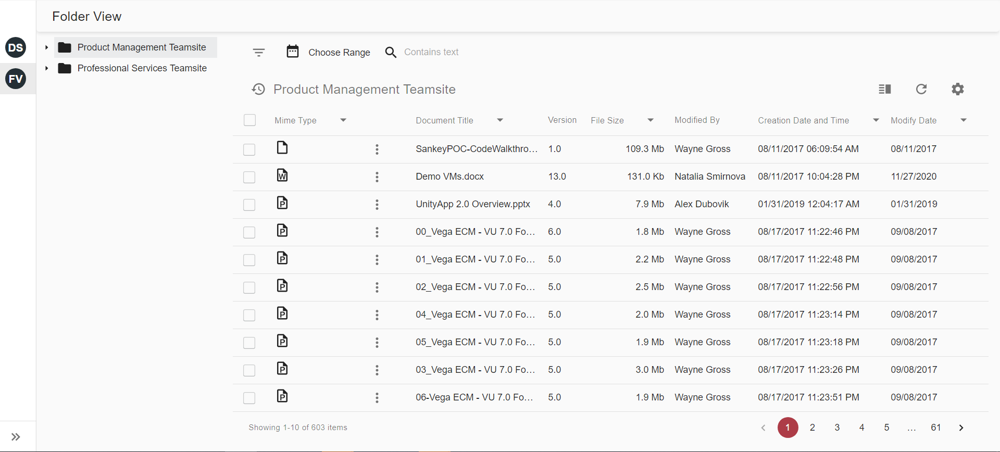
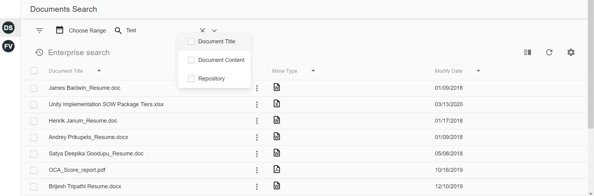
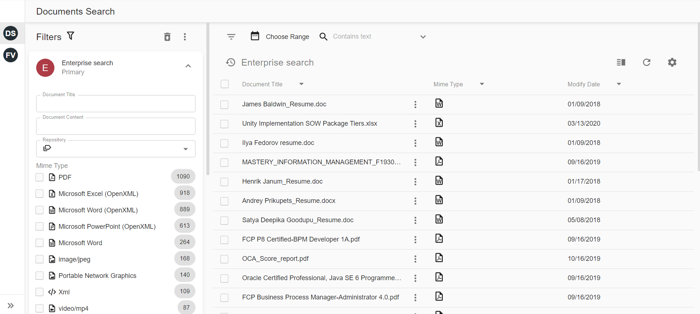
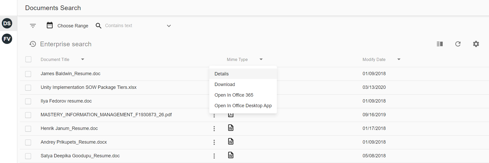
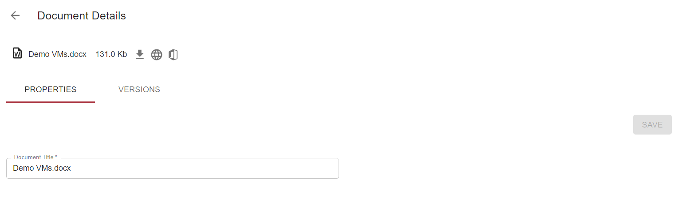
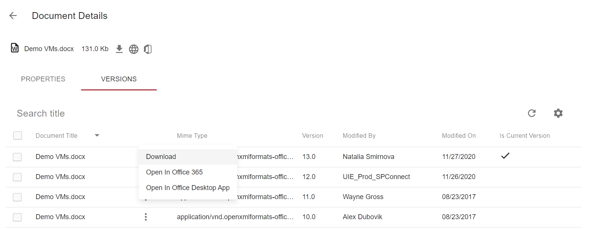

# Unity for Intellective common description

Unity for Intellective can be reached using the folliwng link
[Unity for Intellctive](https://u4i.unity7.devops.intellectivelab.com/vu/main.jsp).
Login and password should be matched with intellective login and password. **Note** pop-ups should be enabled in the browser.

Unity for Intellective contains 2 dashboards: Documents Search, Folder View.
Documents Search can be used for documents searching that are stored in the indixes.

Folder View is used for searching documents in different Folders

## Documents searching
Both dashboards support quick search and detailed search.

User can enter word or sentences for searching to the search field. Searching will be executed in Document Title, Document Content and Reporitory properties for Document Search dashboard and only in Document Title for Folder View dashboard

More parameters for searching can be used on searching panel

## Documents Search actions
The following actions are supported in the Documents Search dashboard for Office documents: Word, Excel, PowerPoint, etc
- Details
- Download
- Open in Office 365
- Open in Office Desktop App

The following actions are supported for non Office documents:
- Details
- Download
- View Content

## Folder View actions
The following actions are supported in the Folder View dashboard for Office document:
- Details
- Download
- Copy Link
- Open in Office 365
- Open in Office Desktop App
- Delete

The following actions are supported for non Office documents:
- Details
- Download
- Copy Link
- View Content
- Delete

## Details dialog
Details dialog contains information about document properties and versions. 

The following actions can be executed from Details dialog
Office documents:
- Download
- Open in Office 365
- Open in Office Desktop App

Non Office documents:
- Download
- View Content

# New Features

The following tasks and stories were implemented in the Unity for Intellective release. The ID and Description are from Intellective’s internal ticket tracking system:

| ID      | Summary                                                                                                                    |
| ------- | -------------------------------------------------------------------------------------------------------------------------- |
| U7-3319 | Action View                                                                                                                |
| U7-3316 | Action Get Info                                                                                                            |
| U7-3321 | Actions Open In Office                                                                                                     |
| U7-3317 | Actions Check In/Out                                                                                                       |
| U7-3318 | Action Delete                                                                                                              |
| U7-3520 | Filter sites list in faceted combobox by Site security                                                                     |
| U7-3320 | Actions Copy/Move to Folder                                                                                                |
| U7-3168 | UIE: SharePoint connector - content crawling                                                                               |
| U7-3491 | U4I: For Mime Types replace the text name of the Mime Type with the Icon                                                   |
| U7-3493 | U4I: On the Search Page please default Not to execute a search when the search field is empty                              |
| U7-3492 | U4I: For MS Office Mime Types remove the View Content menu item                                                            |
| U7-3315 | Unity/UIE: SharePoint connector - document actions configuration for UIE SharePoint documents                              |
| U7-3496 | U4I: UIE documents - show in search result only documents user has at least View permission                                |
| U7-3519 | Implement Site level security for UIE searches                                                                             |
| U7-3226 | Implement Open in Office actions in React for Sharepoint                                                                   |
| U7-3325 | React & public API: Add ability to show several sites inside FolderView                                                    |
| U7-3465 | React: View Document properties can't be opened for Container = tree if several Sharepoint data providers were configured             |
| U7-3464 | React: New document can not be added for Container = tree if several Sharepoint data providers were configured             |
| U7-3478 | React: Document Versions tab can't be configured for a specific dataprovider for Container = tree if several Sharepoint data providers were configured                                                                                                         |
| U7-3635 | Sharepoint: Folders should be hidden if user hasn't permissions to read  them                                              |

# Resolved Issues

The following issues were resolved in the Unity for Intellective release. The ID and Description are from Intellective’s internal ticket tracking system:

| ID      | Summary                                                                                                                   |
| ------- | ------------------------------------------------------------------------------------------------------------------------- |
| PR-14   | Unity for Intellective - Folder Search Error on UI Load                                                                   |
| U7-3353 | UIE: SharePoint connector - documents placed in folders of Document library not crawled                                   |
| U7-3245 | UIE: SharePoint connector - not all documents crawled                                                                     |
| U7-3523 | Sharepoint: Incorrect document is opened in Office from Versions tab                                                      |
| U7-3596 | U4I: Exception is displayed while Folder View opening for https://vegaecm2com.sharepoint.com/                             |
| U7-3617 | Sharepoint: Exception is displayed while folders displaying if Site containts space                                       |
| U7-3354 | UIE: SharePoint connector - error when crawling multiple Lists                                                            |
| U7-3620 | UIE: SharePoint connector - crawling documents with special symbols in title                                              |

# Known Issues

Unity for Intellective contains the following known issues. The ID and Description are from Intellective’s internal ticket tracking system:

| ID      | Summary                                                                                                                   |
| ------- | ------------------------------------------------------------------------------------------------------------------------- |
| U7-3540 | Secondary actions in UIE index                                                                                            |
| U7-3180 | SharePoint: Connectors pool configuration                                                                                 |
| U7-3657 | Sharepoint: Subsites should be displayed in one root folder                                                               |
| U7-3479 | React: Implement Copy/Move to Folder actions                                                                              |
| U7-3642 | Remove "Opening Selected Documents" dialog that is displayed after Open in Office 365                                     |
| U7-3613 | React: Implement Rename for Folder actions                                                                                |
| U7-3234 | SharePoint: Connectors pool configuration in UIE                                                                          |
| PR-47   | UI Improvement suggestions                                                                                                |
| PR-38   | PS Project Folders in the Folder view                                                                                     |
| PR-45   | Slow Performance when attempting to build site tree in U4I                                                                |
| PR-40   | Selecting the Folder a second time loses focus to the actual folder                                                       |
| U7-3647 | Unity: infinite paging grid shows result cyclically                                                                       |
| U7-3619 | UIE security filtering improvements                                                                                       |
| U7-3694 | SharePoint: optimize folder browse requests                                                                               |
| U7-3715 | Sharepoint: replace OAuth popup with redirect                                                                             |