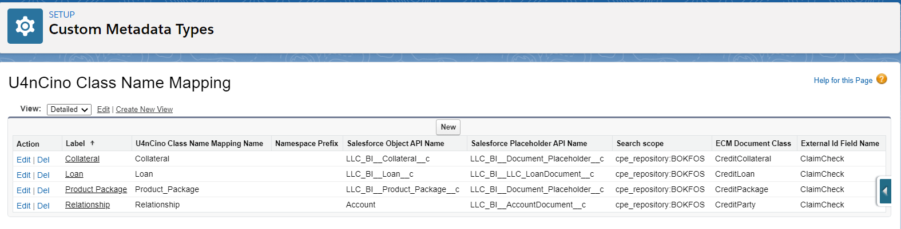
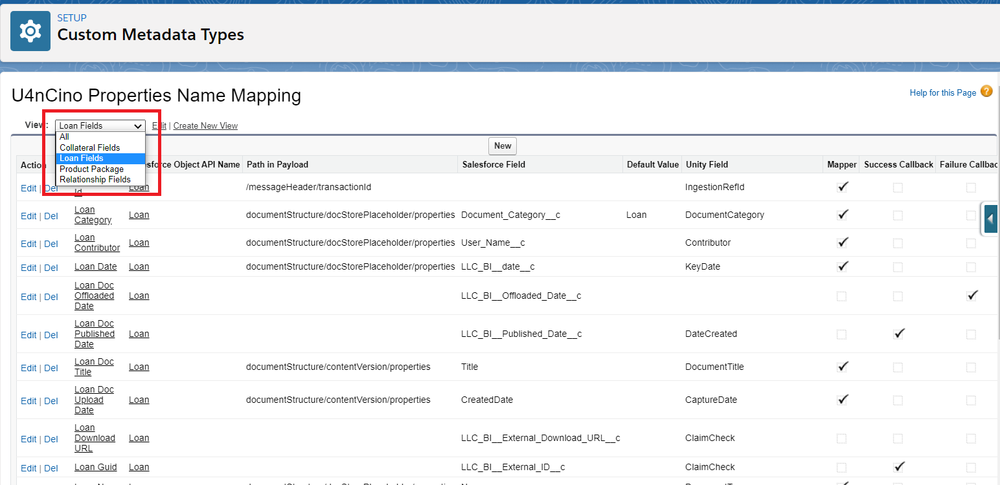
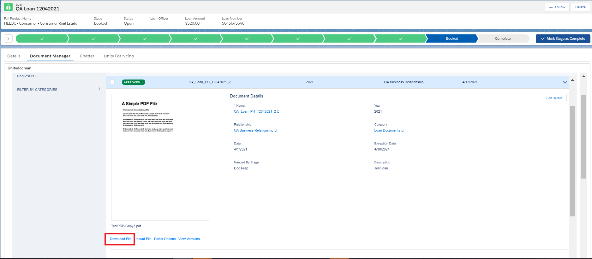

# Introduction
Unity for nCino supports archiving content from nCino (Salesforce) to one or more ECMs, with seamless integration to nCino's Document Manager to access archived Content.
 
Unity for nCino provides prospective customers with a No Code configurable product which provides fast hands-on access to Unity Search and Index capability through nCino's User Interface.
 
Unity for nCino provides additional strategic search capabilities accessible from the nCino UI to access archived content (i.e., loan docs, loan collateral docs, insurance docs, banking docs, KYC Docs, and other documents that are or may need to be archived in FileNet).

Link to requirements in Confluence can be found [here](https://confluence.intellective.com/display/ENG/nCino+Integration) .

Link to All User Stories in Jira can be found [here](https://jira.intellective.com/issues/?jql=fixVersion%20%3D%20%22U4nCino%201.0%22%20AND%20issuetype%20not%20in%20(Test%2C%20Task%2C%20Sub-task%2C%20Epic)%20ORDER%20BY%20priority%20DESC%2C%20status%20DESC) .

# Unity for nCino Overview

## Documents migration
Separate Integration Service was implemented for migration documents that were attach to the Loan, Relationships, Collateral or Product Packages Salesforce objects.

Each document that was attached to the object and for what Placeholder has status = `Approved` can be migrated to the FileNet repository. Please note that Loan object also should has stage = `Booked` and not null Loan Number for documents migration.

OffLoader job checks all Placeholders with status = `Approved` and move information to the Integration Service. In accordance with Class Name and Properties mapping that are configured in Salesforce documents are created in the FileNet repository with appropriate Document Class and properties.

Class Name mapping:

Properties mapping:

## Document viewing after migration
Each document after migration to the FileNet repository can be viewed or downloaded using Unity application.
Document is opened in the separate browser tab in Unity application after clicking on `Download File` link in appropriate Salesforce object in Document Manager tab:

Standard download dialog for file saving is opened in the separate browser tab if document can't be opened in browser, for example for Microsoft Office documents.

# New Features

The following tasks and stories were implemented in the Unity 8.0 release. 
The ID and Description are from Intellective’s internal ticket tracking system:

| ID      | Summary                                                                                              |
| ------- | ---------------------------------------------------------------------------------------------------- |
| U7-4086 | nCino: Seamless Access from nCino's Doc Manager to View/Download Docs Archived to an ECM             |
| U7-4082 | nCino: Archive Documents stored in Salesforce as New Documents to my ECM                             |
| U7-4093 | nCino: Configuration - Mapping nCino Properties to ECM Properties                                    |
| U7-5427 | Manual and automatic error handling                                                                  |
| U7-5345 | Create Integration Service audit files                                                               |
| U7-4840 | Design for Download content from Salesforce                                                          |
| U7-4087 | nCino: Seamless Access from nCino's Doc Manager to Download Docs Archived to an ECM                  |
| U7-5344 | Change package name to com.intellective.unity.ncino                                                  |
