# Introduction

Unity for SharePoint provides an advanced user interface allowing users to search, organize, and transact on content stored across multiple SharePoint Sites more efficiently. It extends and expands the search features of SharePoint to a more granular level, giving the user the ability to quickly access more refined search results.  

Searching in SharePoint is limited to a single field, and often returns too much content that cannot be refined. With Unity for SharePoint, a user can: 
- Refine their search criteria using separate fields for Document Title and Document Content, and 
- Refine the Operator to use OR (Default behavior to match SharePoint) or AND. 

SharePoint provides the capability to search across the Entire Organization (All SharePoint Sites) or select a Specific SharePoint Site, and does not allow sorting of results, which can either provide either a too broad, or too narrow search window.  With Unity for SharePoint a user can: 

- Select Multiple SharePoint Sites: without having to select All SharePoint Sites to perform a more refined search. 
- Customize which search result columns to display or hide and control the order. 
- Sort on one more of the search result columns and control the sort order. 
- Access Custom Metadata fields configured by an administrator to leverage in Search Criteria or Results.

SharePoint does not provide a capability to Save Content as Favorite or Save Search Criteria.  With Unity for SharePoint a user can: 

- Indicate a Document as a Favorite and view a list of Favorites.  Favorites are displayed by default on Log In.   
- Save Search Criteria as a Saved Search, and access Saved Searches to quickly execute the search without re-entering the Search Criteria. 

Link to requirements in Confluence can be found [here](https://confluence.intellective.com/display/ENG/Unity+for+SharePoint) .

Link to All User Stories in Jira can be found [here](https://jira.intellective.com/issues/?jql=fixVersion%20%3D%20%22U4SP%201.0%22%20AND%20issuetype%20%3D%20story) .

# User Interface Overview

Unity for SharePoint can be reached using the following link: [https://dev.u4sp.devops.intellectivelab.com/](https://dev.u4sp.devops.intellectivelab.com/).  
Microsoft login and password are used, no need to enter login and password if user has already been logged to Sharepoint in the current browser.

Unity for SharePoint window when first opened:

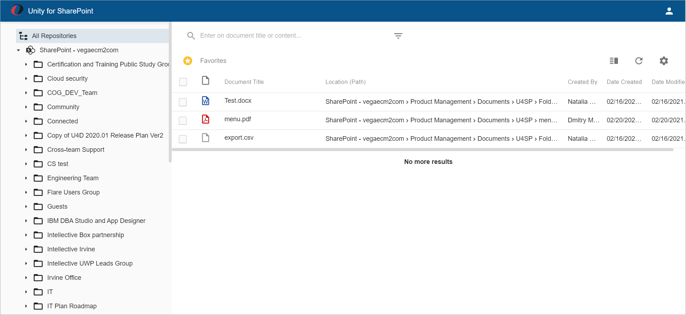

Tree View on the left displays all crawled Sites (if user has permissions for Site), Sites contain Sub-Sites, Folders and Sub-Folders:

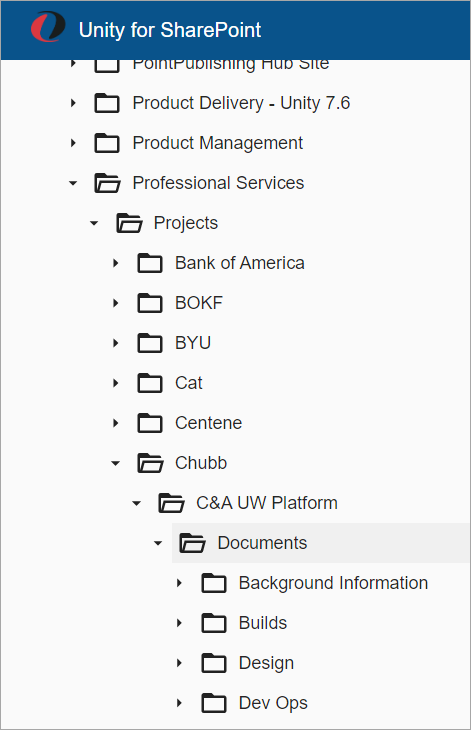

## Grid

Grid contains a list of Favorite documents only for the first time opening. 
If user selects any folder and then returns to `All Repositories` folder, then documents from all sites are displayed in the grid. 

List of Favorite documents can be opened using the following menu:

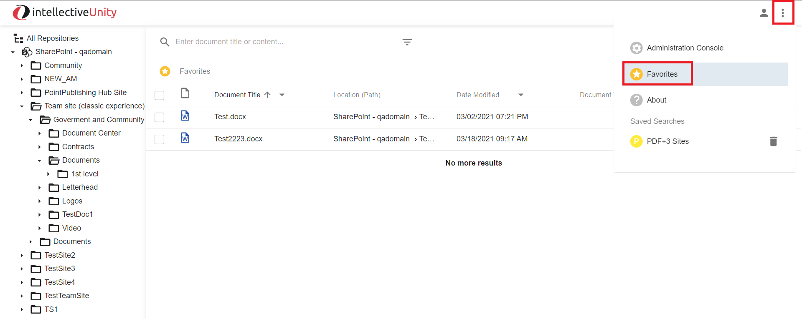

Grid contains Full Path for selected folder in the header, and each grid row contains full path for a document:

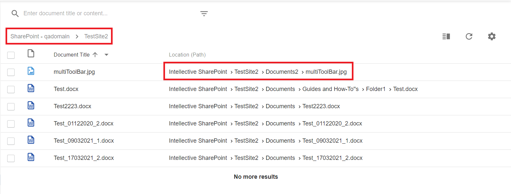

If Path is displayed incompletely in the grid, then tooltip with full path is displayed when hovering mouse to the Path value.

If Path contains long values with several sub-folders then it's displayed as:

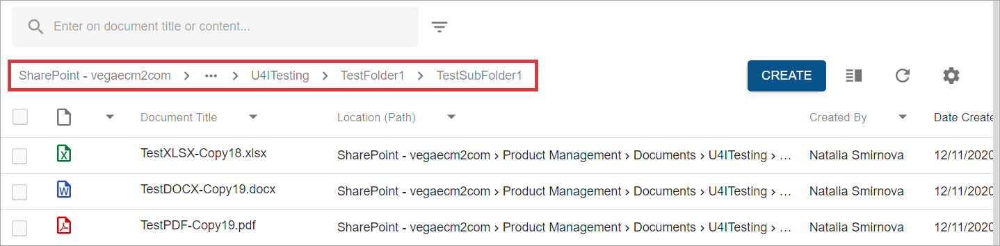

## Advanced Search

Advanced Search can be opened from the Grid:

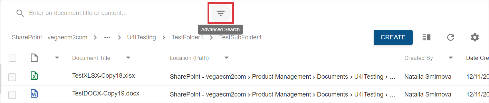

Advanced Search contains 3 sections with criteria:

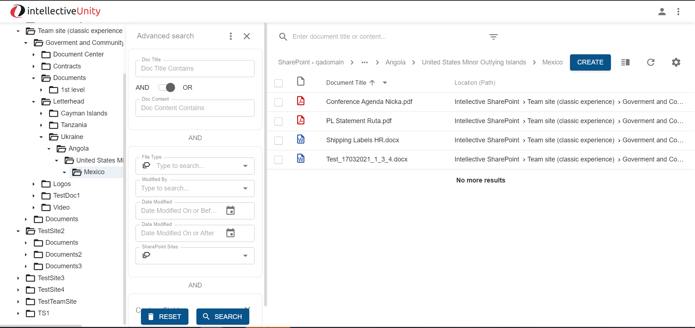

- `Document Title contains` and `Document Content contains` queries with `AND`/`OR` operators between them
- Selectors and dates: `File Type`, `Modified By`, `Sharepoint` Sites contain list of all values that are stored in crawled indices
- `Custom Fields` section contains only filter for `Date Added` property

All these sections work as `AND` operator.

Searching is executed only after clicking `Search` button.  
All values in Advanced Search are reset to default values after clicking `Reset` button.

## Quick search

Quick search allows searching across the documents titles and content.  
`Document Title contains` or `Document Content contains` queries are used for it:

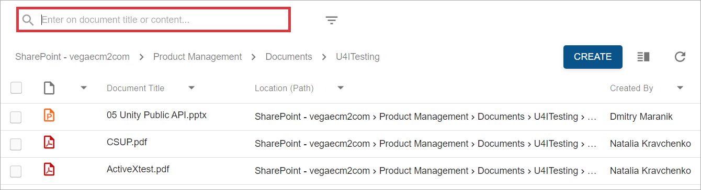

## Main actions

The following actions are supported for any Office document:

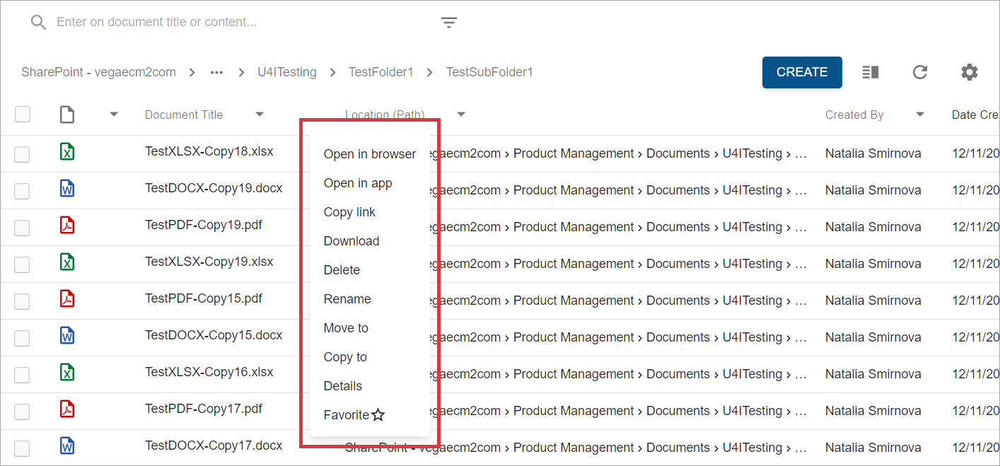

Non Office document context menu contains all these actions except `Open in app` action".

- `Open in` actions are used to view document content in browser or in appropriate Office Desktop application.
- `Copy link` action provides a link to open document Details View. The following dialog is displayed for this action:

    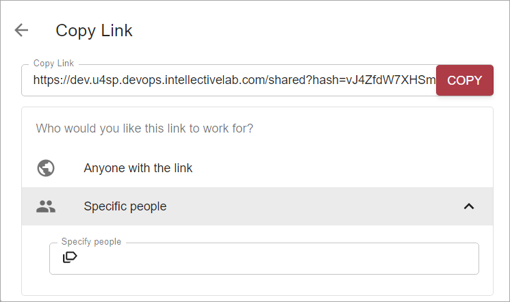

    `Copy link` can be configured only for specific users.
    
- `Download`: to download selected documents without changes in format
- `Delete`: to delete a document from indices and repository
- `Rename`: to change Document Title without opening Document Details View:

    
    
- `Move to/Copy to`: to move or copy document to other folder (Drag and Drop also can be used for it)  
    The target folder should be selected in dialog:

    

- `Details`: to open Document Details View:

    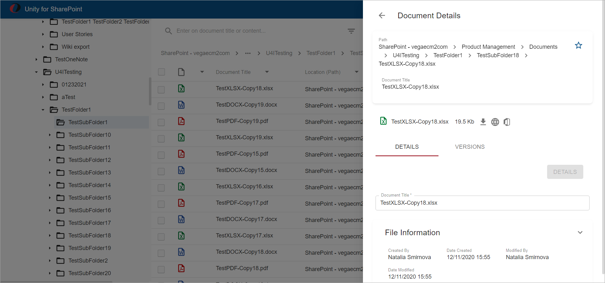
    
    See [Document Details View](#document-details-view) for more information.

- `Favorite`: to mark document as fast used. All favorite documents can be shown in one grid.

Value in Document Title column in the grid is a link, document is opened in a separate browser tab after clicking on it.

The following actions are supported for several selected documents:

- `Download`: selected documents are downloaded as ZIP archive with current datetime as the name
- `Move to/Copy to`: moving or copying selected documents to other folder:

    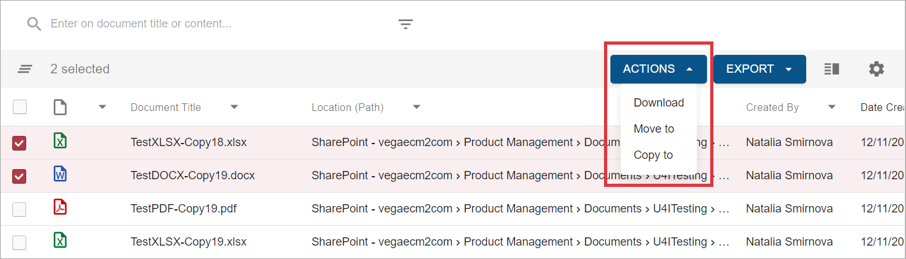

- `Export to CSV`: to export to CSV file all fields that can be displayed in the grid or only selected columns:

    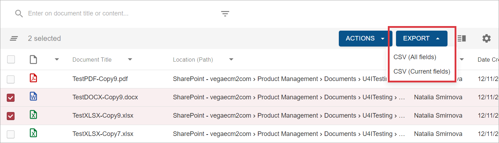

## Create document

`Create` action is accessible from grid toolbar or using Drag and Drop.  
The following view is displayed after file selection:

Only Document Title can be changed on Create Document view.

Document can't be created if Site or Sub-site was selected in the Tree.

## Document Details View

Document Details View contains the following information:

- Full document path
- Icon for adding document to the `Favorites` list:

    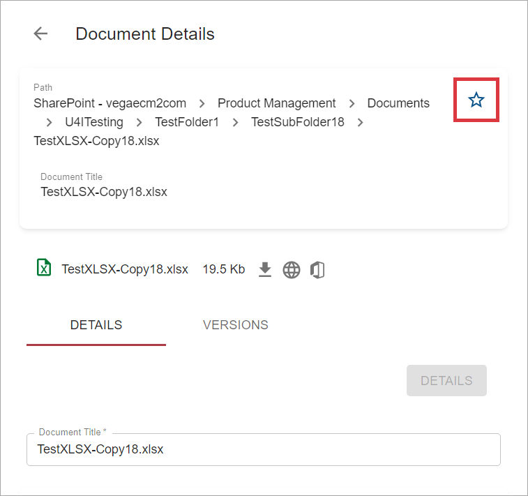

- Document Title
- Link to open document in browser:

    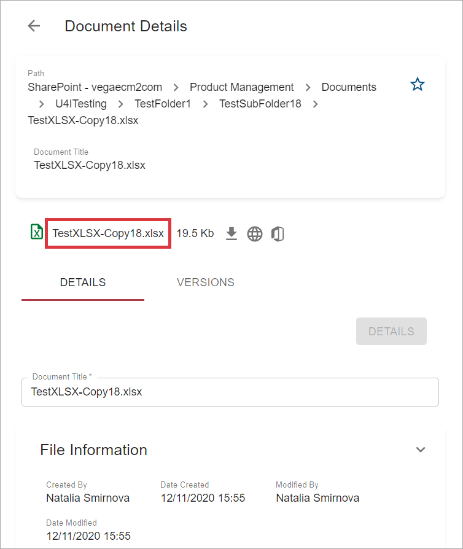

`Details` tab contains information about File Size, links to download document, open in browser or desktop application (only for Office documents)

- Document Title can be changed in Details View
- System information about document

`Versions` tab contains information about all document versions:

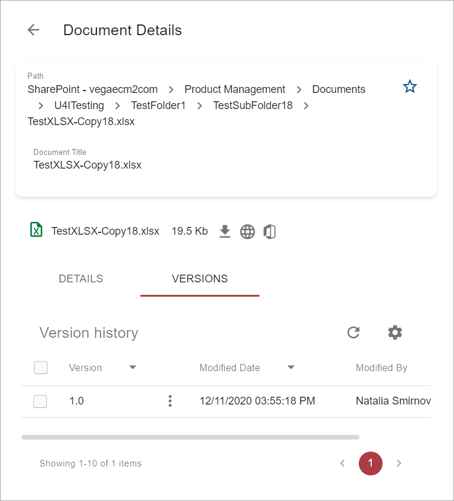

# New Features

The following tasks and stories were implemented in the Unity for SharePoint release. 
The ID and Description are from Intellective’s internal ticket tracking system:

| ID      | Summary                                                                                              |
| ------- | ---------------------------------------------------------------------------------------------------- |
| U7-4918 | Load environment file from classpath or custom Location                                              |
| U7-4421 | (DevOps) Configure automatic U4SP deployment in the DEV environment                                  |
| U7-4097 | (DevOps) Build and publish Unity Headless Services                                                   |
| U7-4098 | (DevOps) Build and publish Unity Gateway and Web app                                                 |
| U7-4825 | (DevOps) Update U4SP component versioning                                                            |
| U7-4819 | U4SP: Displaying path/location                                                                       |
| U7-4406 | (DevOps) Configure release build for U4SP projects                                                   |
| U7-4939 | U4SP configuration console endpoint                                                                  |
| U7-4827 | (DevOps) Implement U4SP Helm chart                                                                   |
| U7-4100 | (DevOps) Configure dev environment management project                                                |
| U7-4447 | Customize document view form - remove Check-in as major version flag                                 |
| U7-4430 | Resign loading of all document classes metadata                                                      |
| U7-4850 | Add favorite link to the Document/Resource model                                                     |
| U7-3567 | Installation Wizard POC                                                                              |
| U7-4767 | U4SP configuration                                                                                   |
| U7-4380 | React: Render MimeType column as fixed width column                                                  |
| U7-4454 | UIE sharepoint ms office document parsing errors                                                     |
| U7-4525 | Folders View must support different icons depending on the folder type                               |
| U7-4491 | Remove bookmarks functionality from React UI                                                         |
| U7-4493 | Do not factor in the SiteAssets when crawling and building the tree                                  |
| U7-4113 | Customize Document Details View Header                                                               |
| U7-3989 | The Advanced Search - Use SharePoint sites selection as criteria                                     |
| U7-3843 | Use INSUBFOLDER operator for searching documents                                                     |
| U7-4789 | U4SP Row actions menu loading                                                                        |
| U7-4111 | Customize Document Search Results Columns                                                            |
| U7-4001 | Must support INFOLDER and INSUBFOLDER operators in HLI query                                         |
| U7-3990 | The Advanced Search - Must allow managing saved searches                                             |
| U7-3986 | Must support Advanced Search                                                                         |
| U7-3985 | Customize Documents Search Results Layout                                                            |
| U7-4778 | Support favorites menu item in user settings menu                                                    |
| U7-4501 | UIE: SharePoint connector - folder MOVE/RENAME support                                               |
| U7-4492 | Add SharePoint instance name to the data provider                                                    |
| U7-4494 | UIE SP connector should process only valid mime types                                                |
| U7-4120 | Must list Favorites and Saved Searches in under the user settings menu                               |
| U7-4122 | Must provide UX to work with Favorite documents                                                      |
| U7-4284 | Implement Folders View Navigation                                                                    |
| U7-4112 | Customize the default action on click of document title                                              |
| U7-3558 | Must provide API for managing Saved Searches                                                         |
| U7-3665 | Must support bulk copy/move actions                                                                  |
| U7-4526 | Implement security for Create Document action                                                        |
| U7-4769 | Do not show actions button on hover when some row is selected                                        |
| U7-4779 | Remove favorite columns control from the Versions Tab grid settings                                  |
| U7-4445 | Customize document title column - show action menu on hovering                                       |