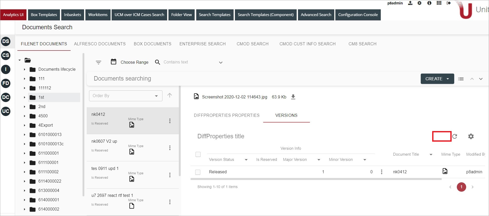
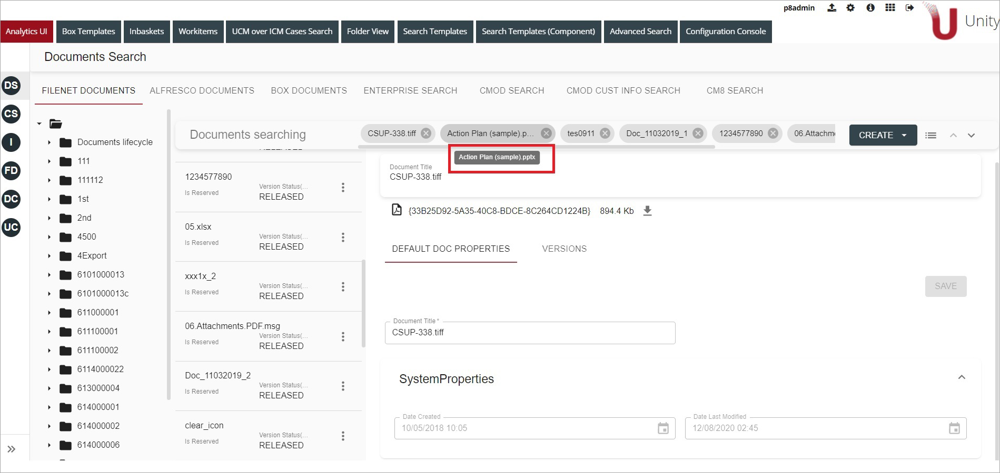

# New Features

The following stories were implemented in the Unity 7.7.2 release. The ID and Description are from Intellective’s internal ticket tracking system:

## Unity for Intellective

| ID      | Summary                                                                                                                                                |
| ------- | ------------------------------------------------------------------------------------------------------------------------------------------------------ |
| U7-3514 | Add support of templateId parameter to the case query API                                                                                              |
| U7-3502 | Detailed view should be implemented on Documents, Cases search grids only                                                                              |
| U7-3498 | Detailed view: add bookmark tooltip                                                                                                                    |
| U7-3491 | U4I: For Mime Types replace the text name of the Mime Type with the Icon                                                                               |
| U7-3478 | React: Document Versions tab can't be configured for a specific dataprovider for Container = tree if several Sharepoint data providers were configured |
| U7-3467 | React: RootFolder = / for Container = tree if several Sharepoint data providers were configured                                                        |
| U7-3465 | React: View Document properties can't be opened for Container = tree if several Sharepoint data providers were configured                              |
| U7-3464 | React: New document can not be added for Container = tree if several Sharepoint data providers were configured                                         |
| U7-3430 | Sharepoint Add Document dialog with Permissions tab                                                                                                    |
| U7-3417 | React Case Folders                                                                                                                                     |
| U7-3157 | Sharepoint: Implement Sharing and Permissions tab for Folders                                                                                          |
| U7-3155 | Sharepoint: Folders with custom class should be displayed in the folder view                                                                           |
| U7-3080 | React UI: Support column configuration for cases                                                                                                       |

## Enterprise Search

| ID      | Summary                                                                              |
| ------- | ------------------------------------------------------------------------------------ |
| U7-3555 | UIE: Support "id" as unique field (document id) in SOLR schema instead of d_ida_s    |
| U7-3547 | UIE: Replace special chars in fields names in index                                  |
| U7-3546 | UIE: SharePoint connector - don't crawl Folder objects                               |
| U7-3452 | UIE CM8 Ability to perform backward crawling and also process current modifications  |
| U7-3451 | UIE CMOD Ability to perform backward crawling and also process current modifications |
| U7-3423 | UIE crawler shutdown command                                                         |
| U7-3404 | Add support for field synonyms in UIE searcher request                               |
| U7-3402 | UIE: "Google like search" - add double quotes around the searched value              |

# Resolved Issues

The following issues were resolved in the Unity 7.7.2 release. The ID and Description are from Intellective’s internal ticket tracking system:

| ID      | Summary                                                                                                     |
| ------- | ----------------------------------------------------------------------------------------------------------- |
| U7-3487 | Multiselect download action does not work for some documents                                                |
| U7-3486 | Information message displayed in ICN if user does not have access to Unity                                  |
| U7-3474 | Unity should check if user has access to view document before trying to open in Daeja viewer                |
| U7-3473 | Analytics grid missing settings dialog                                                                      |
| U7-3472 | Unity doesn't support the "parent last" class loader mode                                                   |
| U7-3471 | Unity Sharepoint connector error after config reset                                                         |
| U7-3446 | Get Info action is executed for the checked document instead of the document with row context menu Get Info |
| U7-3421 | Analytics tab scroll bar hardly visible                                                                     |
| U7-3329 | Error when viewing CMOD document properties for some folders due to date format                             |
| U7-3256 | (CM8/CMOD) SSO - Ability to login to Unity from within Navigator                                            |

# Description

## U7-3514

Added support of the templateId parameter to the case query API.
Using the templateId parameter is needed when a solution architect wants to use UCM related functionality configured within the Unity search template, such as ContextQuery configuration for contextual cases filtering.

## U7-3502

`Detailed view` implementation removed from the following tabs: `Tasks`, `Attach document` and `Documents versions`.
As an example, do the following:

- Open Document Search
- Switch to `Detailed View`
- Open document `Versions` tab

Detailed view element is removed from the upper right corner.

## U7-3498

In order to make bookmarked items readable on `Detailed View`, bookmark tooltips were implemented.
As an example, do the following:

- Open Document Search
- Switch to `Detailed View`
- Add any document's bookmark by clicking `Bookmark this Item` from the context menu
- Hovering over the bookmark shows the tooltip:

    
