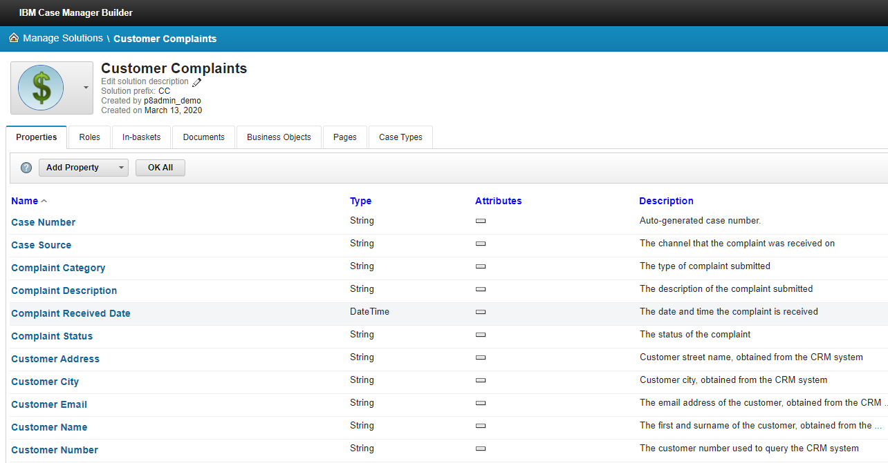
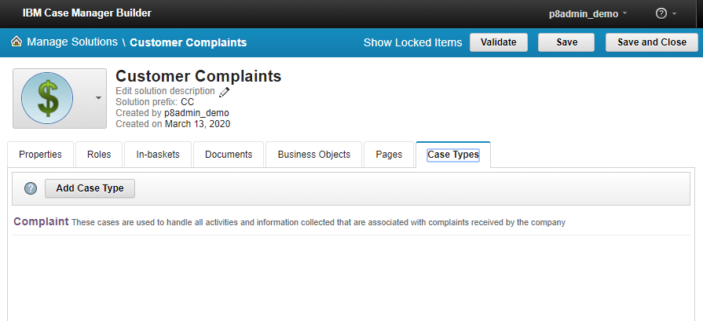

# IBM Case Manager (ICM)

IBM Case Manager (ICM) provides a platform that seamlessly integrates capabilities from across IBM Software Group to deliver the advanced requirements needed to drive better case outcomes.   
The platform combines enterprise content management and business process management, along with integrated rules, events, collaboration, and analytics to deliver a comprehensive case management product. 
On top of this platform, IBM Case Manager provides a set of tooling that enables business analysts to quickly define solutions and then to collaborate with customers and IT to deliver them.

## ICM object model

### Solution

A Solution is a set of related business problems (or case types).

 

### Properties

Properties are used to store details of the case and documents.

### Case Types

Case types define the tasks, the necessary document types to support the task, the task steps, and the roles that must complete those steps to solve a business problem. 
The case type also includes properties that are displayed to case workers in views. Related case types make up a solution.

### Tasks

A Task represents a specific activity that is performed as part of a case. The task consists of one or more steps that must be completed to complete the task.
Generally, a case is not complete until all required tasks are completed or manually disabled, or any running task is completed or canceled.
Tasks can be started when case is created, based on case field property change or can be launched manually. Active task will have one or more work items created.

