This course gives an overview of Unity configuration and explains how different functionality can be defined using Configuration console.

# Unity Configuration File

Unity stores all configuration information for the application in an XML configuration file.  
Location of configuration file is specified in [Environment variables](#environment-variables) configured for application server.

By default, the file is stored to a server drive location of the Web Application Server. 
Default name is `unity_config.xml`.

# Configuration Console Overview

Configuration Console is available for Unity Administrator only and accessible in Unity tab right after installation:

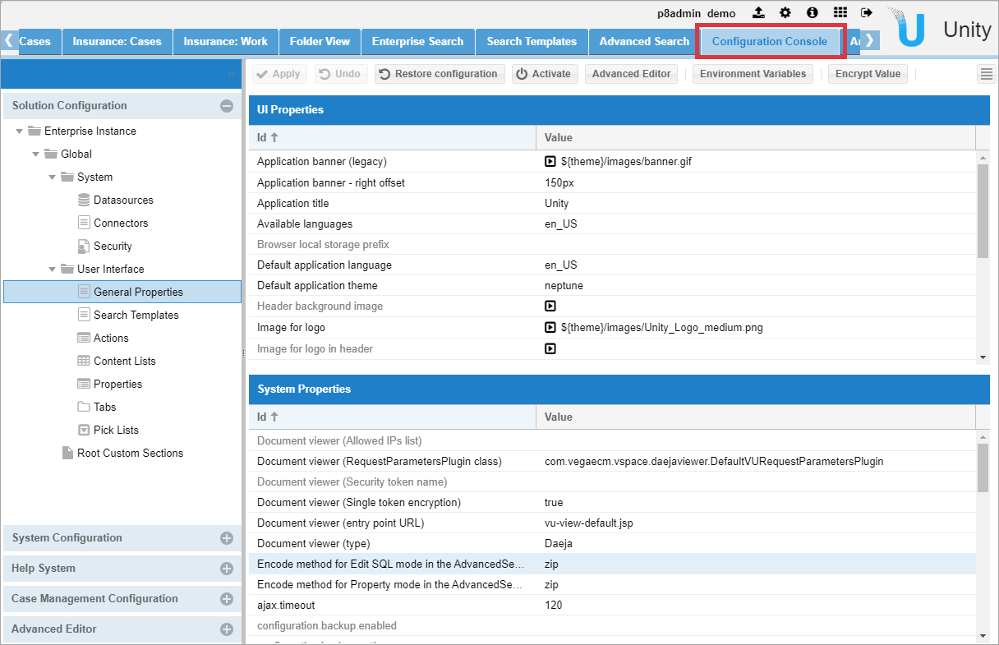

Configuration console is intended to configure: 
- Connectors
- Content List
- Tabs
- Search Template
- Properties
- Actions
- Roles and more.

It allows you to configure connector for the repository, define application properties, configure tab, configure content lists, and assign them to search templates:

- It is possible to edit various sections of the configuration using inline XML editor 
- Administrators and designers can add custom sections to configuration
- Solutions can be managed using toolbar actions

Use Case: Connect to a document repository, configure search template, content list to display results, and assign it to a tab.  
Steps required: 

# Environment Variables

Environment variables are externalized in separate file. It provides the ability to promote application to different environments without changing configuration.
To see a list of environment variables click on `Environment Variables` button on `Configuration Console` toolbar:

A list of environment variables appears:

Name of the variable can be used instead of value in configuration, e.g. `${CE_URL}`

# Connectors

Connectors allow Unity, Enterprise Search and Interchange to read, write and search for the purpose of basic CRUD operations and crawling for data migration and index creation. 

## Datasources configuration

Datasource is the configuration of the authentication and access parameters that allow connection to the repository:

## Connectors configuration

Connector is the configuration of the "view" of the information (properties, metadata, objects, etc.) from the datasource that will be used by Unity for actions.

To see a list of connectors select `Connectors` in the `Solution Configuration` tree:

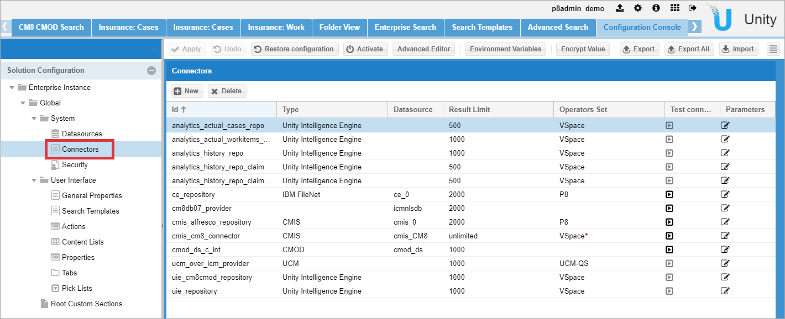

Each connector has `ID` for further linking, connector `Type`, linked `Datasource`, max number of returned results `Result Limit` and other parameters.  
To see and edit connector parameters click on `Edit` icon in `Parameters` column in the connector row. `Edit Connector` window appears:

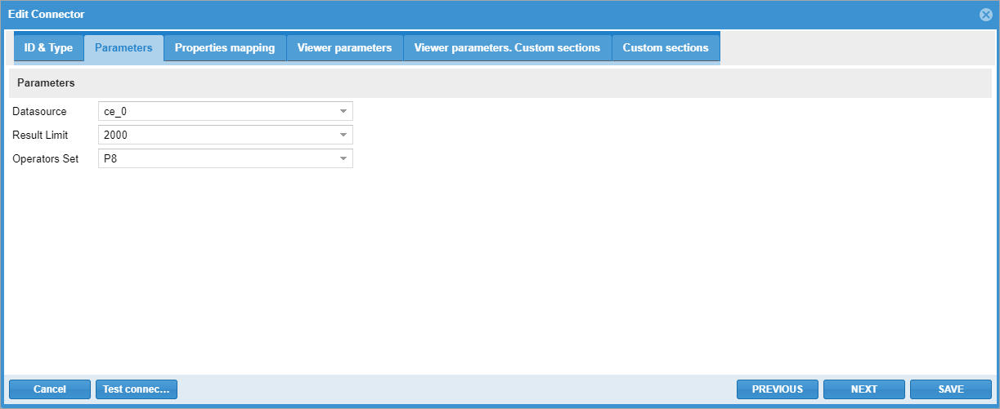

### Properties mapping

Unity allows for the creation of an application-level consolidated model (properties). External repositories data models can be mapped into the application model allowing users to have unified view of documents and/or cases.

In `Edit Connector` window click on `Properties Mapping` tab:

Each connector property should be mapped to Unity property.

To add a new property click on `New mapping` button on toolbar:

It is possible to make a mapping manually or automatically using `Auto Map` button, some expressions are possible.

### Properties configuration

To configure Unity properties select `Properties` in the `Solution Configuration` tree:

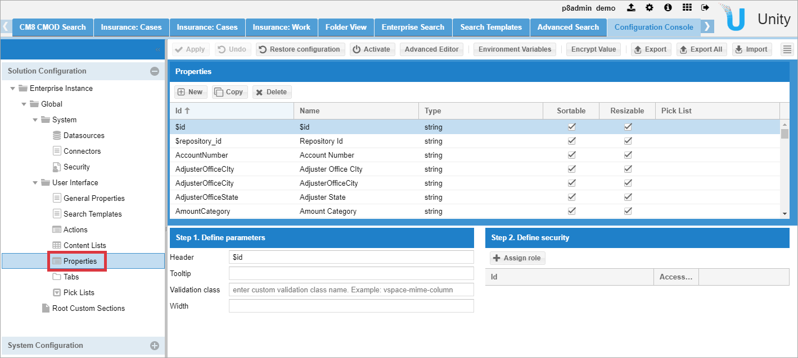

Properties parameters contain settings for Content List: Name, Tooltip, Sortable, Resizable, Pick List and more.

### Pick Lists configuration

Pick Lists, also called `Selectors` are predefined selection lists that are used in association with `Properties` to assist in limiting values to a property to a specific and limited set of choices.

Pick Lists:
- can also be used to translate a stored code or numeric value into a UI friendly value to display in a Content List, Search Criteria or other Unity Construct
- are required for List Filters in a Content List column
- can be a Static list created in Unity or a cached or non-cached list retrieved from a connected data source

To see and edit Pick Lists select `Pick Lists` in the `Solution Configuration` tree:

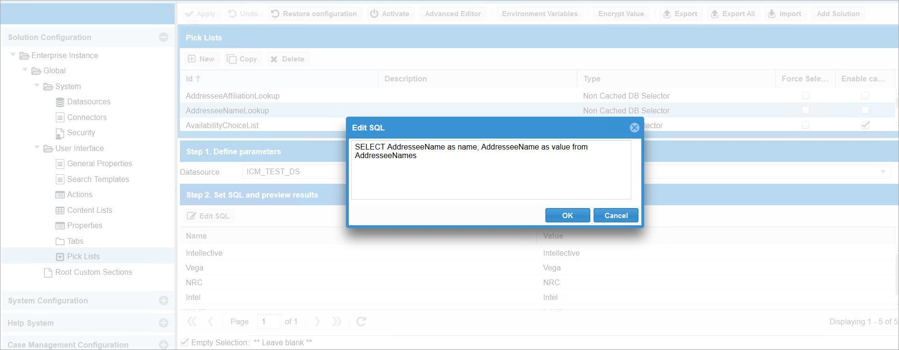

# Content List Configuration

The Content List (Grid) is used by Search Templates , Actions and Tabs to present search results to a user.

Unity provides following configuration features for Content List :

- Define column set for the grid
- Enable/disable column re-order
- Enable/disable multi-column sort and set sort order
- Configure toolbar actions
- Configure listeners for grid events
- Configure Filters for Search results

To see all content lists select `Content Lists` in the `Solution Configuration` tree:

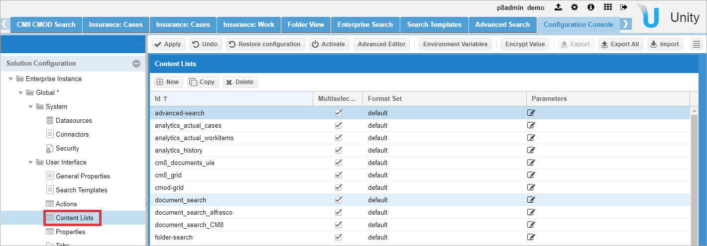

To see and edit content list parameters click on `Edit` icon in `Parameters` column in the content list row:

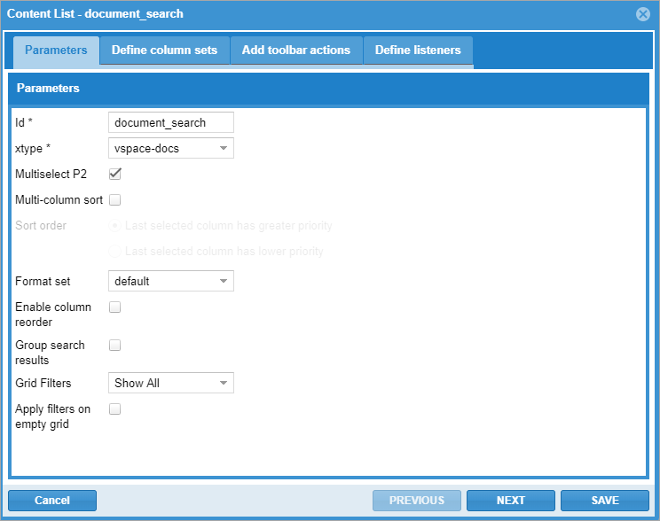

On `Define column sets` tab list of columns, column name from the properties settings, default visibility and sort order are shown:

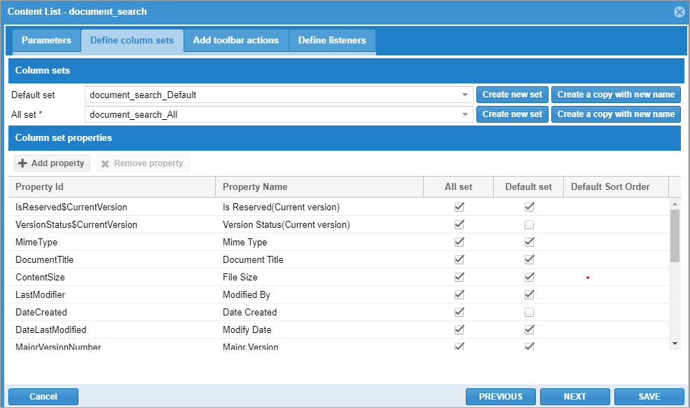

On `Toolbar actions` tab pre-defined set of actions is shown:

# Access Roles Configuration

Access roles allow users and groups to access search templates based on the grant or deny rights assigned.
Access roles can be assigned to search templates or tabs.

To see all access roles select `Security` in the `Solution Configuration` tree: 

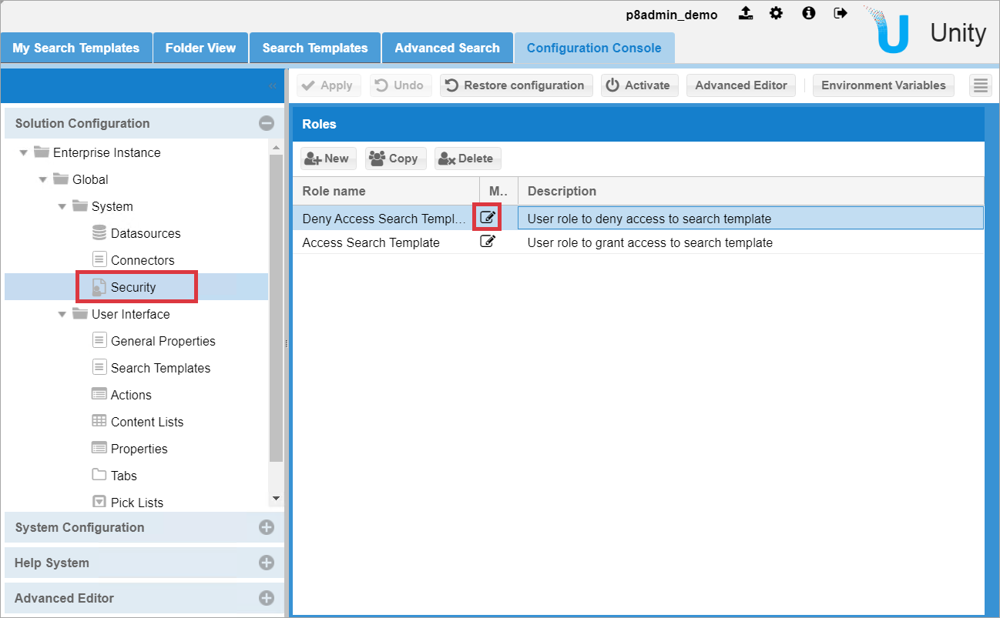

To see and edit role members click on `Edit` icon in `Members` column in the role row, Edit Members window appears:

You can Add or Remove users or groups, set `Grant` or `Deny` rights to users or groups.

# Search Template Configuration

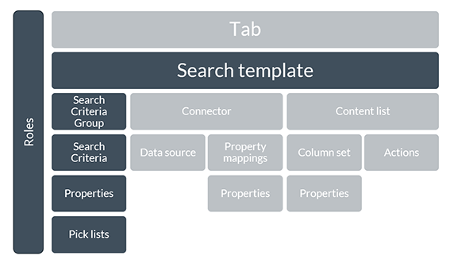

Search template configuration provides the capability to pre-configure and save: 
- selected repository connector
- search criteria
- search results grid (content list) configuration 

Access to search templates is controlled by [Access Roles](#access-roles-configuration).  
Search template should be assigned to the tab to be available to Unity users.

To see all Search Templates select `Search Templates` in the `Solution Configuration` tree: 

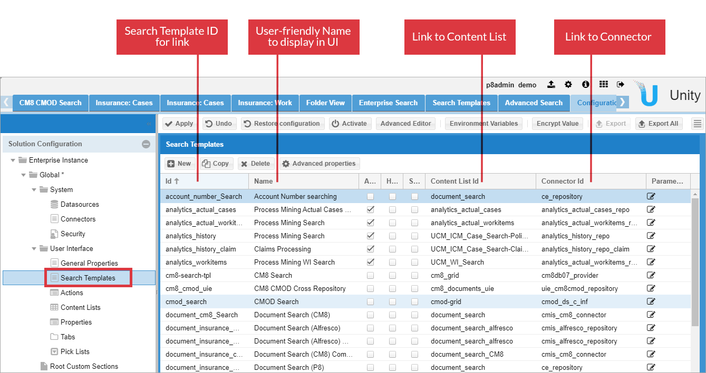

To see and edit search template parameters click on `Edit` icon in `Parameters` column in search template row.  

- Select `Define search criteria` tab:
    
    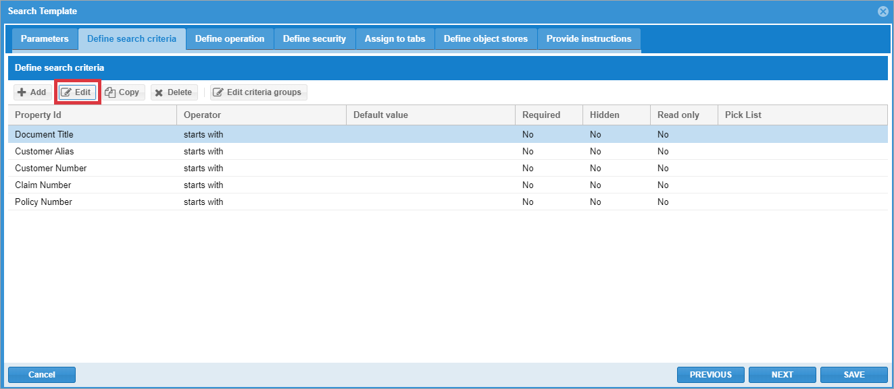
    
    You can Add, Edit, Copy, or Delete search criteria properties.  
    Press `Edit` button to edit search criterion properites:
    
    
    
    - Additional parameters can be configured in `Advanced Configuration` section
    - You can combine criteria in groups: which are then displayed grouped in UI
    - You can define a pick list for values

- Select `Define security` tab and assign roles to search template:

    

# Tab Configuration

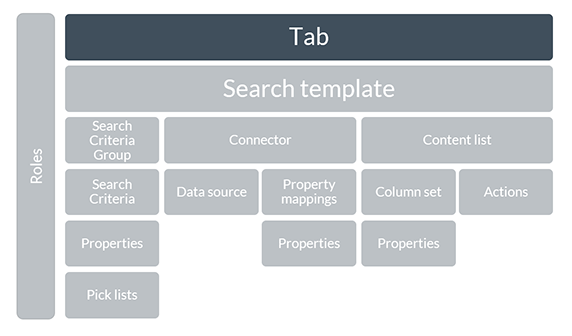

To see all tabs select `Tabs` in the `Solution Configuration` tree: 

To see and edit tab parameters click on `Edit` icon in `Parameters` column in tab row. Edit Tab window appears:  

- Select `Assign search templates` tab and assign search template to the tab:

    

- Select `Define security` tab and assign roles to the tab:

    

# Test Configuration

Execute search and make sure it returns expected results:

