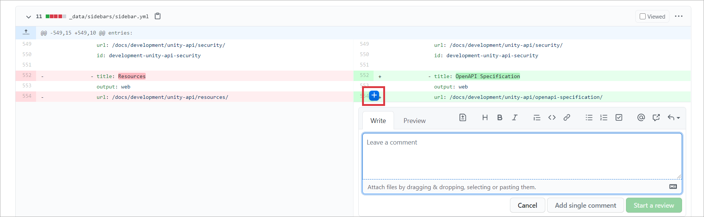

- Open pull request (PR) from [pull requests page](https://github.com/intellectivelab/docs.intellectivelab.com/pulls) 
- Select `Files changed` tab and look through changes in files
- To add a comment use `+` sign on the left of the row:

    

- Use `View file` from dropdown toolbar menu:

    
    
    In this case you will see a page almost how it will look on doc portal, images are shown and links work, but the table of contents is not shown.
- 
