# Introduction

You can search for documents, case, and work items using React UI interface. React UI Interface supports IBM FileNet, CMOD, CM8, SharePoint, Box, Alfresco, other CMIS repositories. All Unity actions are supported in the React UI grid.

# Dashboards

Dashboard container component serves as a container for UI components and as away of grouping components.

On `React UI` application open `Analytics UI` tab, expand sidebar and discover available dashboards:

[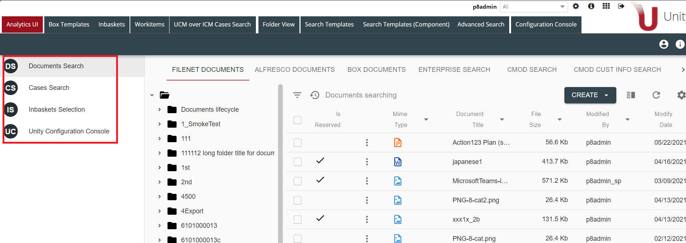](unity-7.8-user-guide/images/dashboards.png)

## Containers

Dashboard containers organize and allow navigation between dashboard components that are related and at the same level of hierarchy. The following types of containers are supported out of the box:

- `Tabs` container allows to switch between components from the Tabs bar:

  

- `Toggle` container allows to switch between components from the Toggle Button group:

  

- `Dropdown` container allows to switch between components from the Dropdown menu:

  [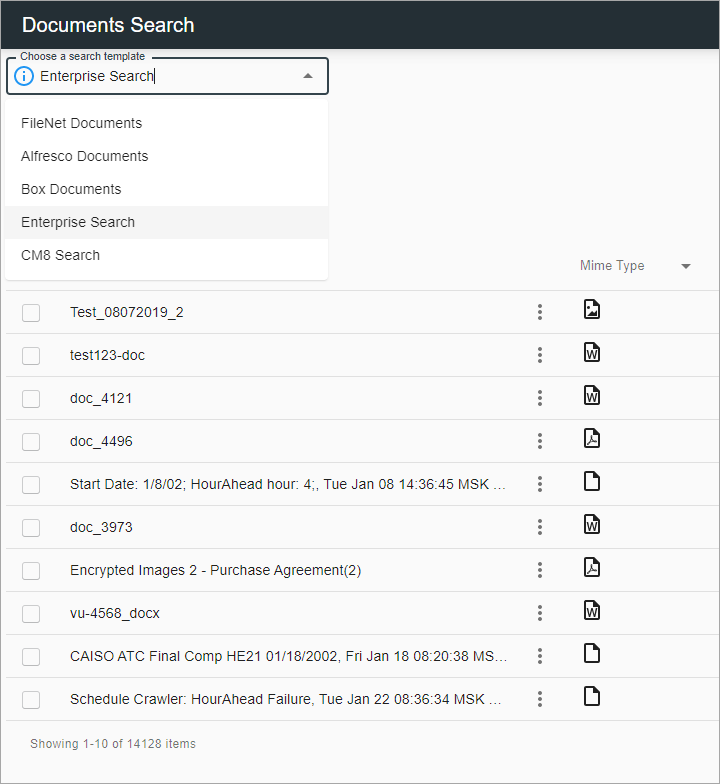](unity-7.8-user-guide/images/dashboard_container_dropdown.png)

- `Tree` container allows to switch between components from the Tree view:

  

# Folder view

Use the `folderPath` parameter to easily browse through the contents of different folders within repository.

Unity has the capability to present a single continuous view of multiple repositories and related folders like IBM FileNet, CMOD, CM8, SharePoint, Box, Alfresco, other CMIS repositories, and more.

Click on a folder to display content within that folder and all subfolders under it:

[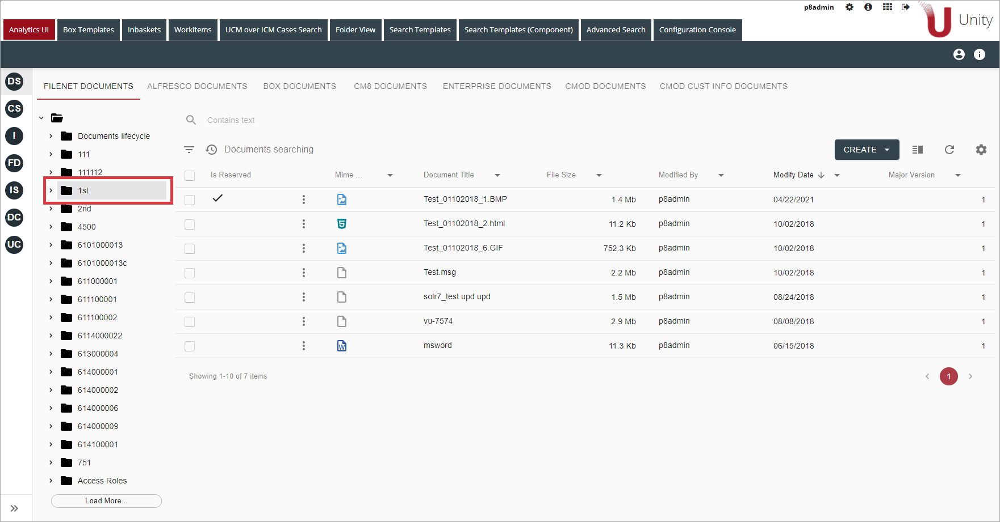](unity-7.8-user-guide/images/folders.png)

# Quick Search

Use Quick Search to quickly find documents across current repository by typing in a related keyword or phrase.

Type in the word or phrase to search for in the `Contains text` box at the top of the screen. The search executes automatically.

The Search results will update, returning all content with the search criteria found anywhere and restricted by your selected repository:

# Advanced Search

Advanced search gives you powerful tools to find the exact document you’re looking for.
You can quickly filter and narrow down your search results via multiple dimensions document title, modifier, custom metadata, and more.

Click the Advanced Search Icon to open the Advanced Search Panel:

[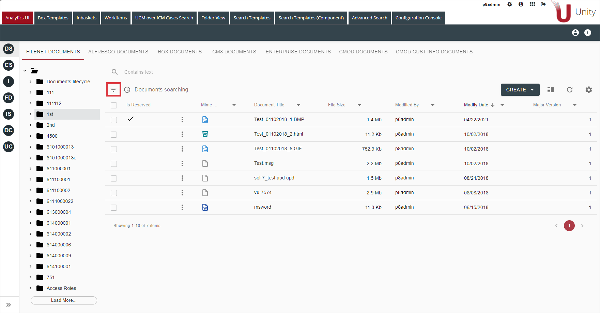](unity-7.8-user-guide/images/advanced-search-icon.png)

Advanced Search panel appears and you can enter search criteria based on the repository you selected:

[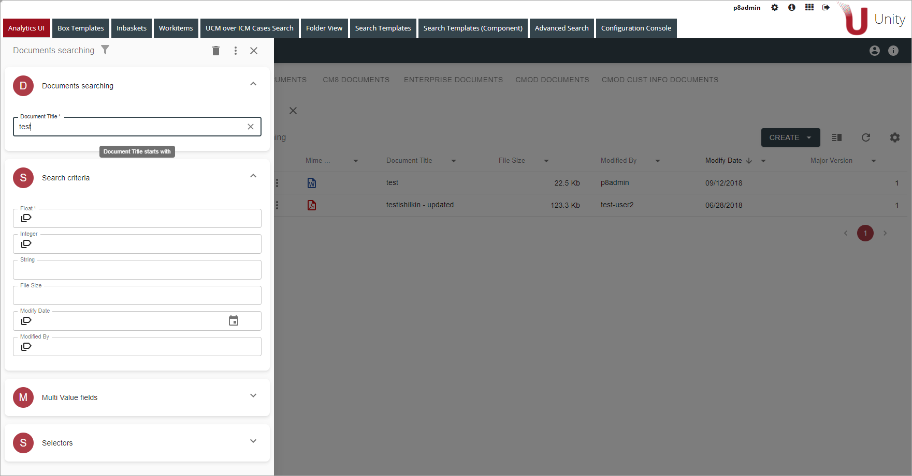](unity-7.8-user-guide/images/advanced-search-panel.png)

## Execute Search and Reset

- Specify search criteria, and the results will be shown in the panel on the right:

    

- To clear your Advanced Search changes and return to the Quick search settings, click the `Reset filters` button:

    [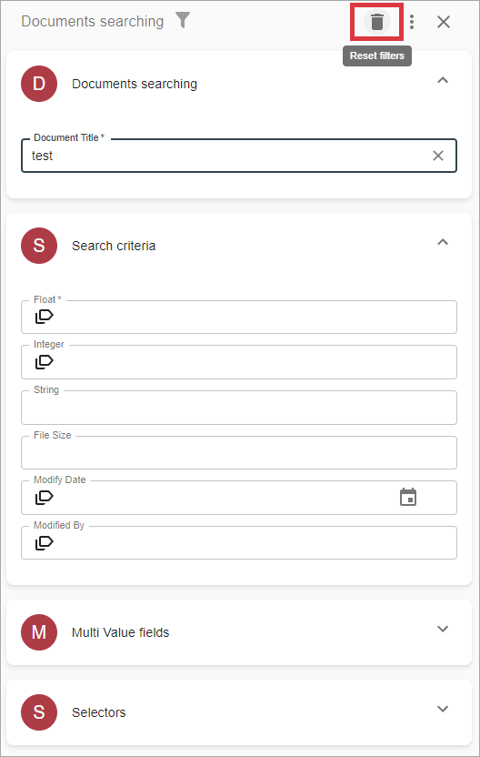](unity-7.8-user-guide/images/reset-filters.png)

# Saved Searches

You can save frequently used searches to quickly access them in the future.

- Enter the search criteria you’d like to use, then click the `Manage Selected Filters`:

    

- On the opened modal window enter a name for the search and click `Save As`:

    [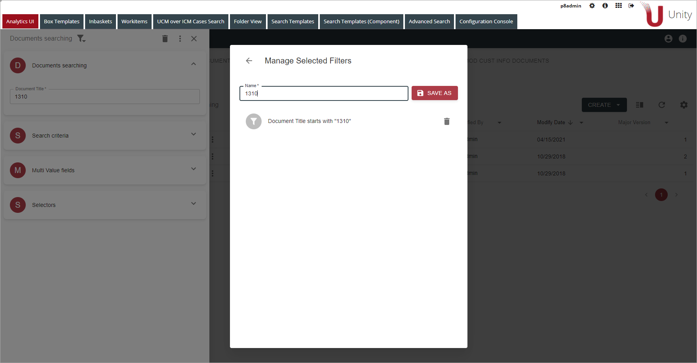](unity-7.8-user-guide/images/save-search.png)

- To access your saved searches, click on the filter icon and select a search on opened `Choose a search` window:

    [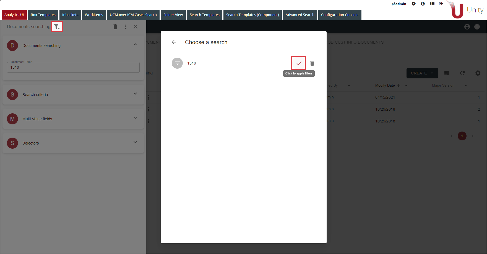](unity-7.8-user-guide/images/choose-saved-search.png)

When a Saved Search is selected, the Advanced panel UI is updated to display the Saved Search Criteria, and the search is executed.

# Search Results

With Unity, you can customize how you view your search results. You can change the look and feel, set and order of displayed columns, sort order, and more. 
To customize the Search Results Panel, click on the gear icon in the upper right:

## Grid mode

For loading data, Grid supports pagination and infinite scrolling. The selected method is defined in the Grid configuration.

- In pagination mode, user may view the grid data by pages, clicking pages in pagination control under the grid. The number of items is restricted by 10 items per page

    [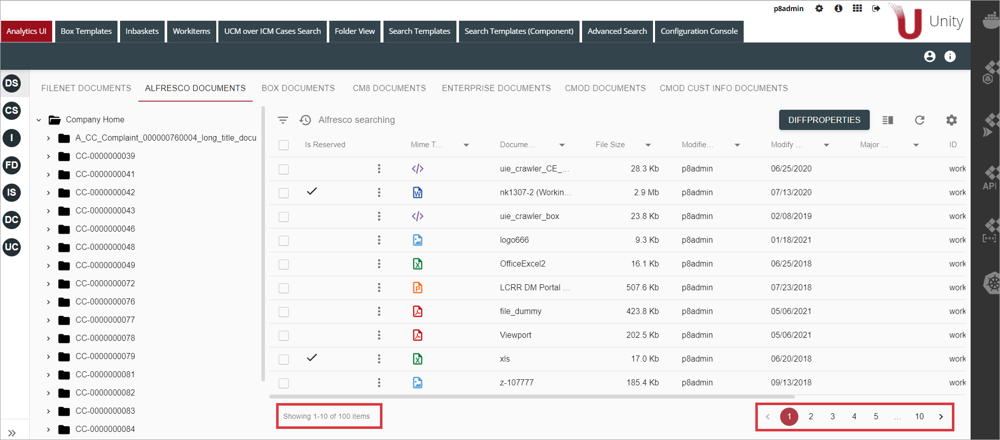](unity-7.8-user-guide/images/grid-pagination-mode.png)

- In infinite scrolling mode, user may load next portion of data into the grid simply by scrolling grid down, until no more data is available.

    

## Grid columns

To make a column visible or hidden, or to control the order in which the columns are displayed, select the `Grid Columns` menu item.
Customize columns dialog appears:

[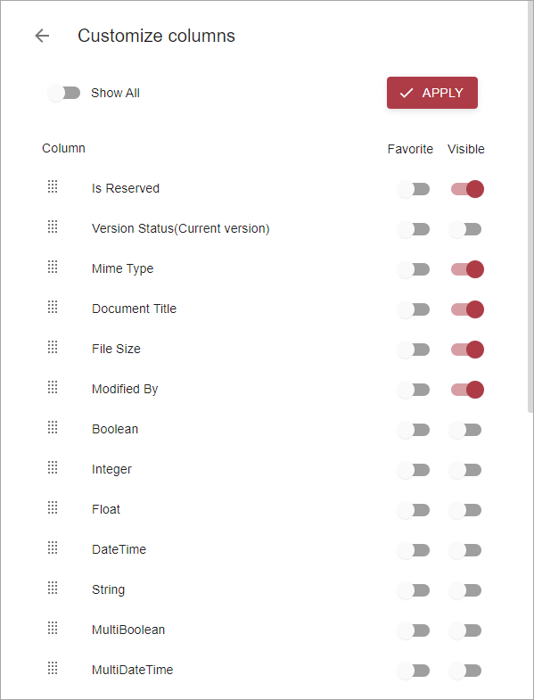](unity-7.8-user-guide/images/customize-columns.png)

For a given field, toggle the Visible toggle switch to the right (Red) to make that column visible. Toggle the switch to the left (Gray) to hide the column.

Any custom fields configured to the Repository will be displayed as columns.

To change the column order, mouse over the Dots icon to the left of the Column name, and then drag and drop the Column in the order it should be displayed.
For example, drag a column from the bottom to the top of the list to see it on the left side of your screen when searching.

When you’re done making changes, select the `Apply` button. Your changes will be saved and kept the same each time you log into the system.

## Column Resizing Grid

Normally grid columns width is set automatically in order to fill whole grid horizontal space. The columns may be resized by mouse by dragging column separators. To show the separators, move mouse over the column heading and left and right side separators will be shown. Hold a separator with mouse and move horizontally to resize the column.

[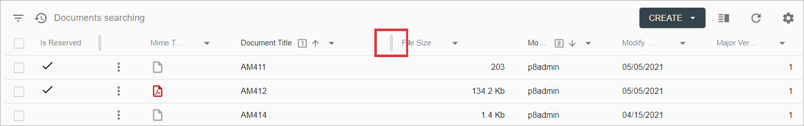](unity-7.8-user-guide/images/resize-columns.png)

Last column width may not be changed. If grid occupies whole container form width, the last column takes all the remaining width till the right side of the grid. However, if grid is wider than its container, the last column width is set automatically by actual content.

The minimum size of the columns is determined by column header, the actual column data in the grid rows may be shortened when shown in too narrow columns.

Width of a column becomes fixed once it was resized. Other columns width remains automatically maintained. To reset the columns width to default (and revert the visible state of the columns and their order) use `Reset` from the grid settings menu:

[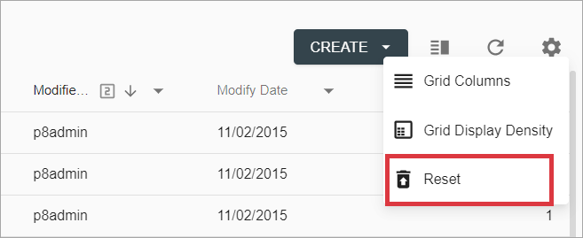](unity-7.8-user-guide/images/grid-reset.png)

## Grid Display Density: Usability Features

Unity can show information in a more compact or a more expanded form, depending on how much data you’d like to see on the screen at once.

To change the grid density of the rows displayed in the search results, click the `Grid Display Density` option and select the view you’d like to use.  
Three options are provided:

- Default
- Medium
- Compact

Click the `Apply` button to save your change:

## Sorting

Unity gives you powerful tools to sort your results, making it much easier to narrow down and identify the documents you want to find.
You can use a simple sort on one column, or create multiple related column sorts to hone in on specific information.

### Quick Sort

- To quickly sort a column, mouse over the Column Name, and click on the arrow icon that appears immediately to the right:

  

  This will sort the column in ascending order.

- Click again to sort in descending order
- Click a third time to remove the sort

### Sort Menu

To sort a column, you can also click the down arrow to the right of the column heading:

[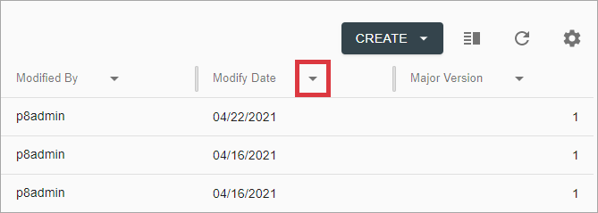](unity-7.8-user-guide/images/sort-column-arrow.png)

The sort options are displayed:

[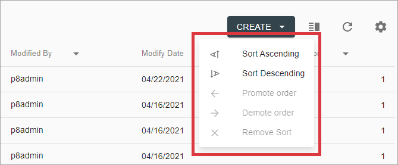](unity-7.8-user-guide/images/sort-column-menu.png)

To set the sort order for the selected column, select either `Sort Ascending` or `Sort Descending`. Ascending will order elements like `1, 2, Alpha, Beta`, while descending will order elements like `9, 8, Zulu, Yankee`.

If you select a sort for multiple columns, a number will appear after the column names, indicating in which order the columns are sorted.

To control the sort order and have a different column be sorted first, select the down arrow to the right of the column heading and select either Promote Order (to increase that column’s precedence in the sort order) ,or Demote Order (to lower that column’s precedence in the sort order).
For example, if you want to sort by Document Title first, and then by Date Modified, promote Document Title until it is labelled `1`, followed by Date Modified labelled `2`.

To remove the Column from Sort, select the `Remove Sort` menu item from the dropdown.

# Actions on documents

Once you’ve located the document you’re looking for, you can take a variety of actions on it.

## Actions menu

For more actions, select the document and click on the vertical ellipse icon consisting of three dots to the right of the name:

[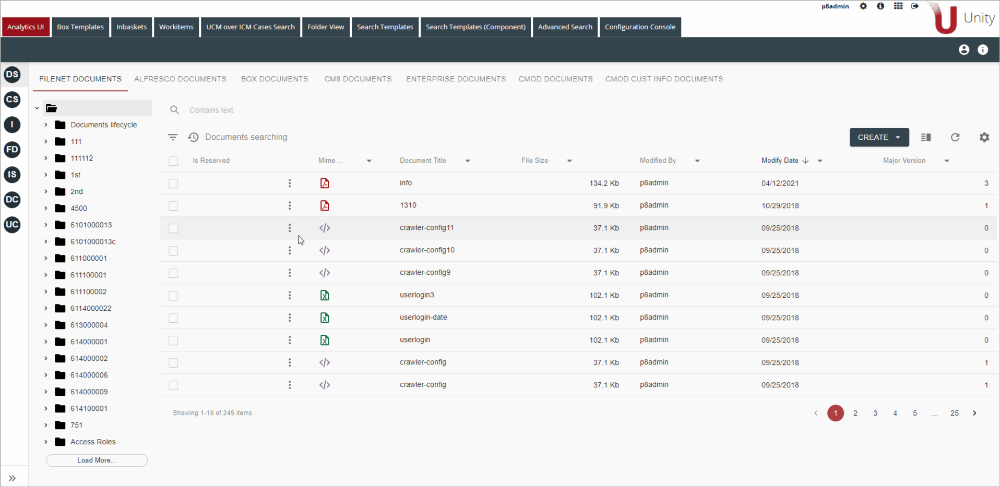](unity-7.8-user-guide/images/actions-menu.gif)

Click on the action to perform it.

### View Content

The application opens the file in a separate tab.

### Download

Downloads the selected file to your default file download location.

### Check Out

The system lets you mark the file as checked out to prevent other users from making changes to the file while you work on it.

### Check In

The system lets you select a file to add as the new version for the file and update any document properties

### Cancel Check Out

The system removes the Checked Out status without making any changes to the file's version.

### Delete

Deletes a document from the system.

You must have security rights to delete the file for this action to be available.

You will be shown a Delete document confirmation prompt:

- If you select `Yes`, the file will be deleted
- If you select `Cancel`, no changes will be made and the prompt will be closed

### Check Out and Open In office

Opens the file in the related desktop application.  
Only applicable for Microsoft Office documents.

### Move to Folder

Moves the file to another folder.

You may move files by dragging and dropping them, or by selecting the `Move to` option.

- Using `Move to Folder`

  Click the `Move to Folder` action, then select the folder you wish to move to. Click the `Select` button to move the document:

  [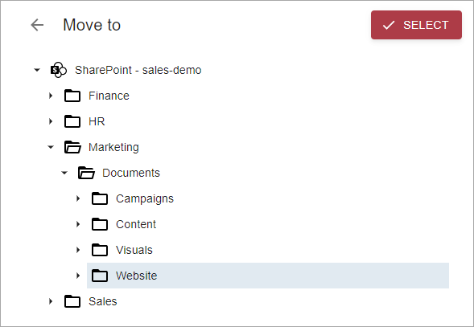](unity-7.8-user-guide/images/move-to.png)

- Using Drag and Drop

  - Click on the file you want to move, then drag and drop the file from the Search Results to a Repository Folder on the Folder View.
  - After dropping the file, you will be asked if you’d like to move or copy the file. Moving will relocate the file to a new location, while copying will duplicate the document and place the copy in the new location:

  - To cancel the Move/Copy action, click outside of the selection box.

### Copy to Folder

Copies the File to another Folder.

You may copy files by dragging and dropping them, or by selecting the `Copy to Folder` action.

- Using `Copy to Folder`

  Click the `Copy to Folder` action, then select the folder you wish to copy it to. Click the `Select` button to copy the document:

  

### Open in Separate tab

Ability to view case/document details in a separate browser tab.

### Edit

Clicking the Edit action displays a Document Details window with the following information:

- Document title
- Link to Open the file in your browser:

  

- Icon to Download the file:

  

- Icon to Open the file in desktop app:

  

- `Document Properties` Tab

  The Details tab displays metadata, which can be modified by an authorized user.
  The Details Tab will be displayed by default.

- `VERSIONS` Tab

  The Version History tab displays information on each version of the file.

## Actions on Multiple Selected Documents

With Unity, you can take action on multiple documents at once.  
Click the checkbox to the left of a document to select it. To take action on multiple documents, select multiple documents and then click the `Actions` button in the upper right:

[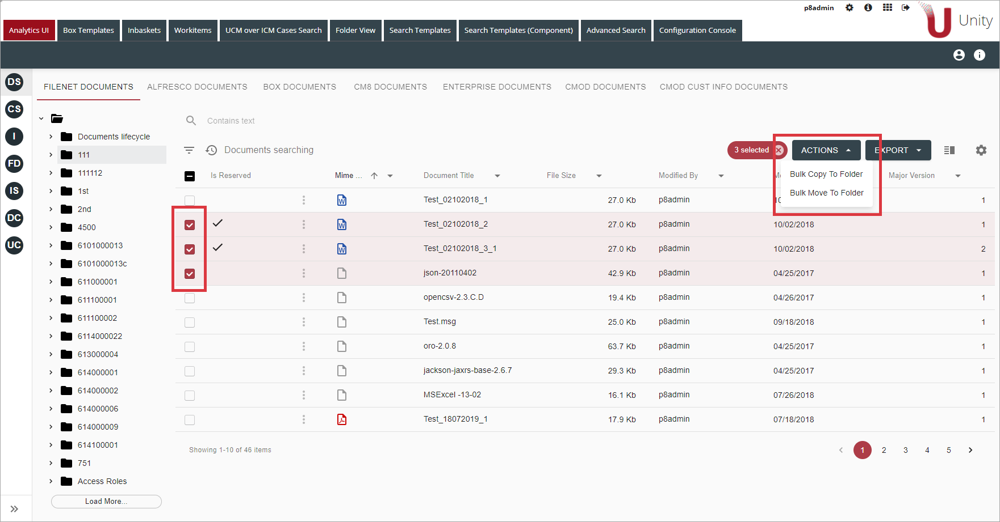](unity-7.8-user-guide/images/multiple-actions.png)

You may take the following actions on multiple selected documents:

- Move to / Copy to
  Shows the same `Move to / Copy to` interface used for single documents, allowing you to copy or move multiple documents at the same time.

By clicking the `Export` button you can export metadata fields for selected documents to CSV file:

[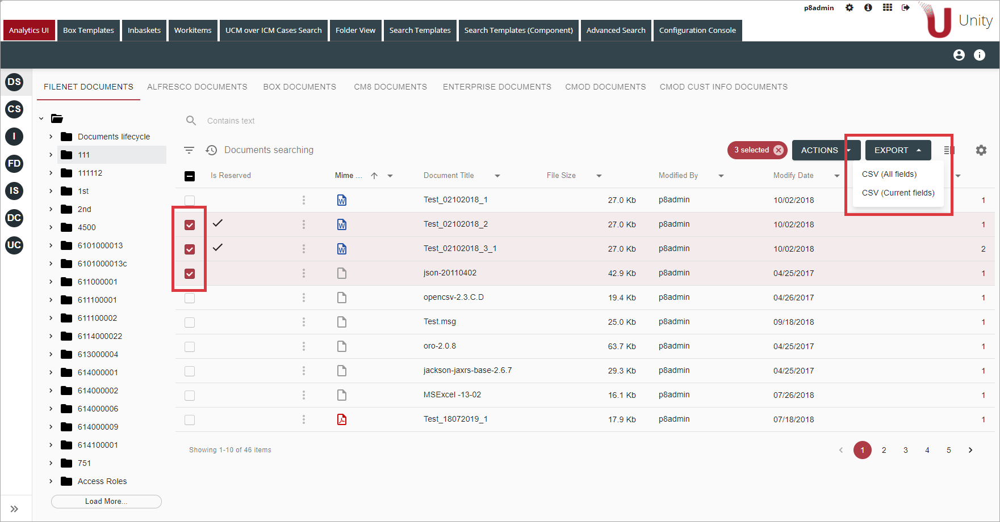](unity-7.8-user-guide/images/export.png)

You may select `CSV(current fields)` option to export fields that are currently shown in grid , or `CSV(all fields)` option to export all fields.

## Create Document

You can easily add new documents to your repositories.

Click the `Create` button to add a file to a Folder:

[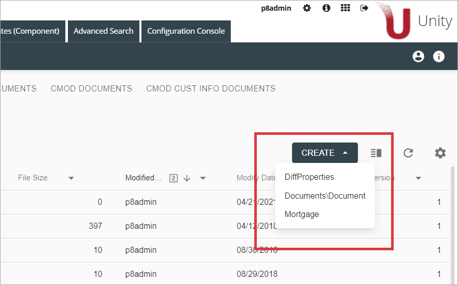](unity-7.8-user-guide/images/create-document-button.png)

The New Document dialog box will be displayed:

[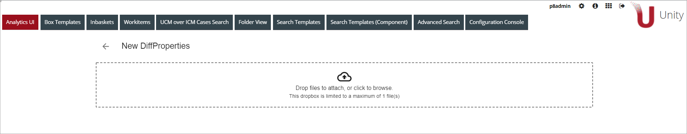](unity-7.8-user-guide/images/new-document-dialog.png)

You can add documents two ways:

- Drag and Drop: Click on a document in a folder on your desktop, and drag it onto the `Drop files to attach` box on the screen.
- Browse and Select: Click the Upload icon in the `Drop files to attach` box. You will be prompted to select.

After dragging and dropping, or browse and selecting a file, you will be prompted to enter metadata for the file.

- Enter a Document Title to be used for the document added. This can be different from the filename:

  
  
- You may optionally provide custom metadata field values, if prompted. Required fields will be marked with a red icon.
- Once all required fields are entered, click the `Create` button.
- Your document will be securely uploaded into the system.

# Detail View

Unity provides an additional Detail View to allow fast browsing and comparison of documents. To activate it, click the `Detail View` toggle button in the upper right of the search results screen:

You can click the button again to easily toggle between `Detail View` and standard `List View`:

[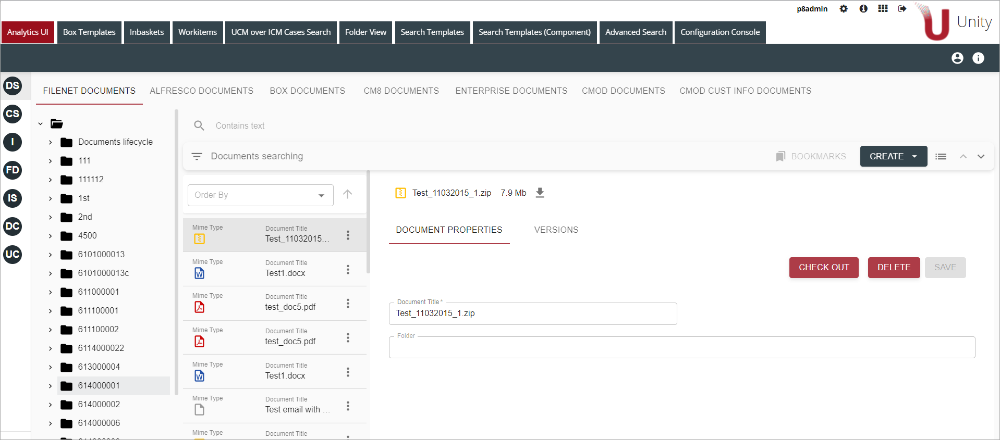](unity-7.8-user-guide/images/detail-view.png)

The Detail View left panel displays the list of files returned from the search.
The Detail middle panel displays the same details information as listed above when the user selects the `Details action`.
You may click on documents in the left panel to refresh the middle panel with their details. In this way, you can quickly switch between documents to compare details or identify the document you’re looking for.

You can open Detail View for all documents returned by a search, or you can first multi-select the specific documents you want to view.
For example, clicking the checkbox next to three documents, then selecting the Detail View toggle, will show only those three documents in Detail View. If no checkboxes are selected, all documents will be shown.

## Bookmarks

On Detail view Bookmarks functionality is available. Bookmarks allow to quickly switch between selected items. List item can be added to Bookmarks bar by clicking Bookmark action in the item actions menu.

A bookmark can also be removed from the Bookmarks bar:

# Recent View History

Recent view history saves and shows a list of links to recently viewed items.
To view the item in the Recent View history you may click the item in the grid and choose item properties. To open a list or Recently viewed items click the `History` icon.

[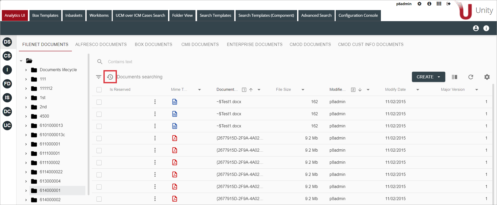](unity-7.8-user-guide/images/recently-viewed-icon.png)

And see the list of `Recently viewed` items

[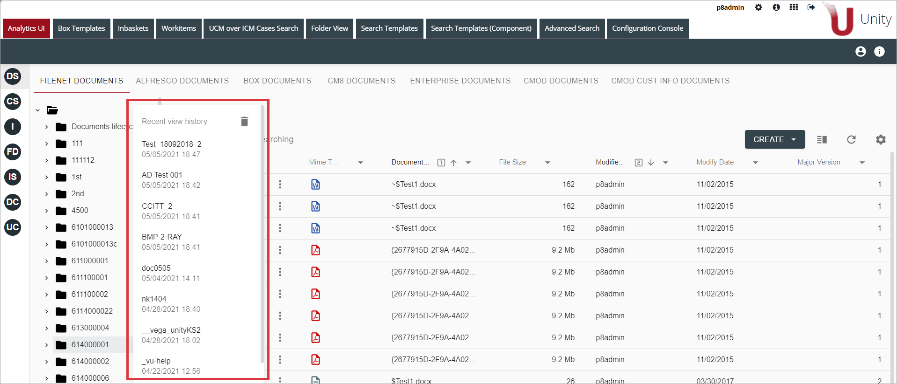](unity-7.8-user-guide/images/recently-viewed-list.png)

To clear recent view history open it and click the `Clear history` icon:

[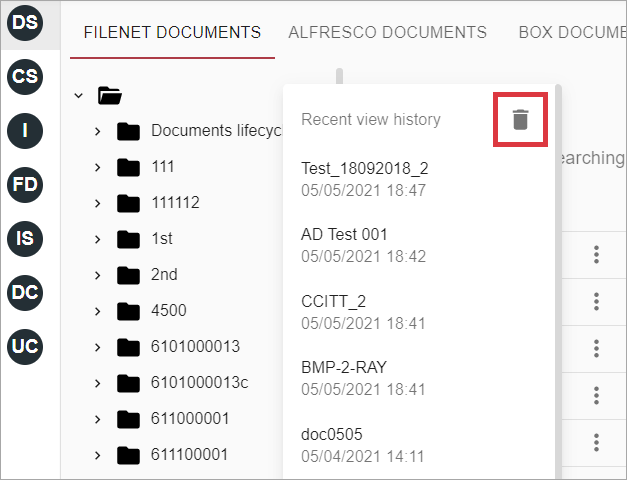](unity-7.8-user-guide/images/clear-recently-viewed.png)

# Actions on Cases

Once you’ve located the case you’re looking for, you can take a variety of actions on it.

## Create a new Case

You can easily create a new Case.

- Click the button with case type name or `Create` button (it's defined in the Unity configuration files):

    

    The following view is displayed:

    [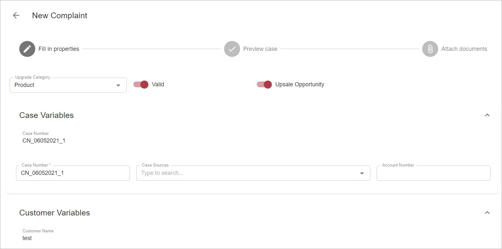](unity-7.8-user-guide/images/new-case-view.png)

    User should fill in all required fields and press `Create` button.

- In the next step user can change properties or return to the back. User can complete case creation pressing to `Complete` button:

    

- View for attaching different documents are displayed after `Next` button pressing:

    [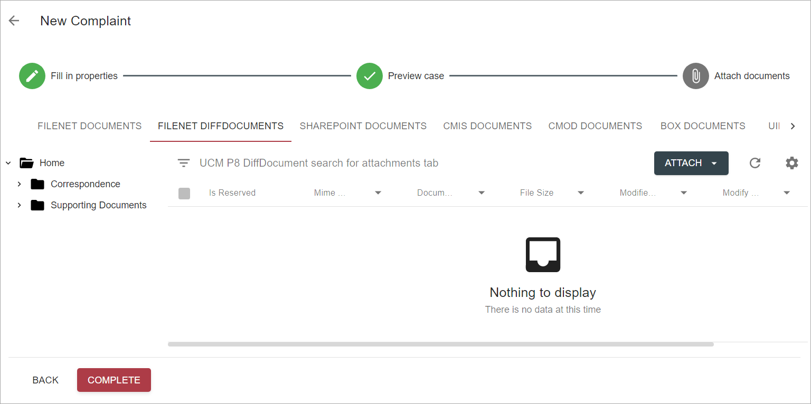](unity-7.8-user-guide/images/new-case-document-attaching.png)

    User can attach already existing document or create a new one for different Document Classes with attaching to the case:

    [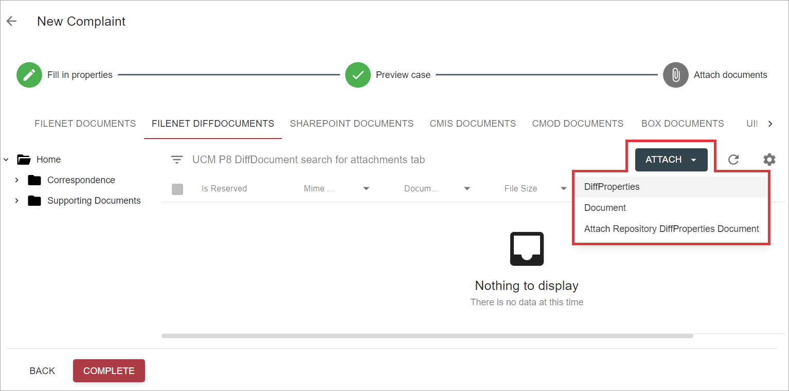](unity-7.8-user-guide/images/context-menu-for-documents-attaching.png)

- User can `Complete` case creation or return to the `Back` for properties changing:

    [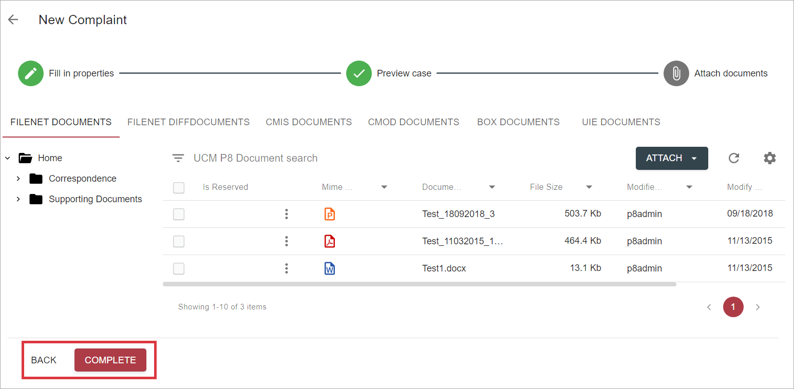](unity-7.8-user-guide/images/complete-case-creation.png)

### Attach existing document

Search template is opened after `Attach existing document` selection. User can find a document to be attached using [Quick Search](#quick-search) or [Advanced Search](#advanced-search):

User should select document(s) for attaching and press `Attach` button.
Attached documents are displayed in the grid:

[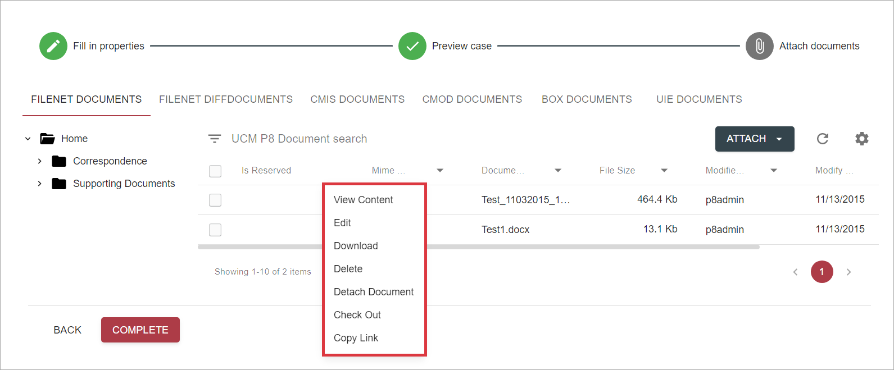](unity-7.8-user-guide/images/list-attached-documents.png)

Actions can be executed for any selected attached document as it described in [Actions on documents](#actions-on-documents). Specific document action is supported for attached document - `Detach Document`. 
Dialog confirmation is displayed after `Detach Document` action selection:

Document disappears from the list of attached documents after clicking `Yes`.

### Attach a new document

View for document creation is displayed after action for new document attaching selection, see [Create Document](#create-document) section.

## Actions menu for cases

For more actions, select the case and click on the vertical ellipse icon consisting of three dots to the right of the name:

Click on the action to perform it.

### Case Details (Properties)

Case Details view can contain the following tabs:
- Properties
- Attached documents
- History/Comments
- Workitems

#### Properties

Properties tab contains fields that were configured in the Unity configuration files. Properties can be grouped to the expandable sections. `Save` button will be enabled after any property changing.

#### Attached document

Contains the same functionality that was described in [Attach existing document](#attach-existing-document) and [Attach a new document](#attach-a-new-document) sections.

#### History/Comments

History/Comments tab contains information about all users actions and user comments:

[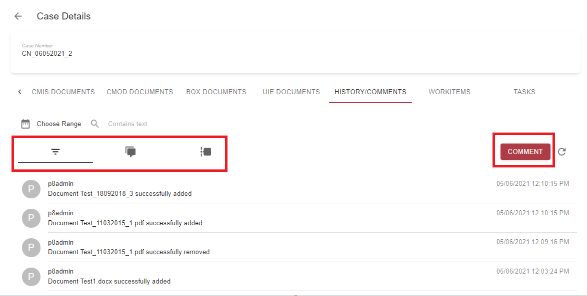](unity-7.8-user-guide/images/history.png)

Only user comments can be displayed:

[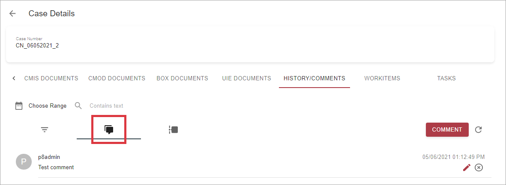](unity-7.8-user-guide/images/user-comments-displaying.png)

Also history/comments can be displayed as timeline:

[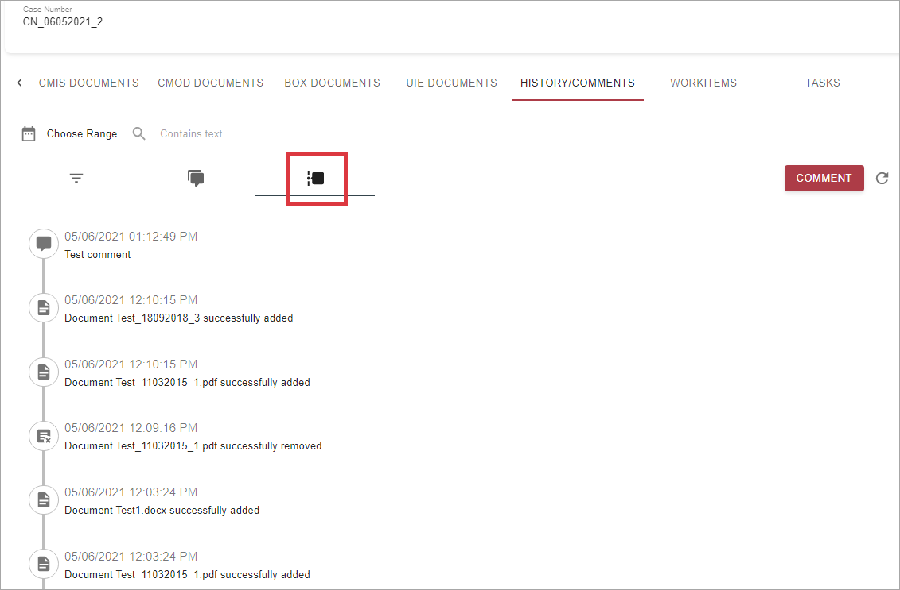](unity-7.8-user-guide/images/comments-timeline.png)

All history/comments can be filtered using [Quick Search](#quick-search) or range:

[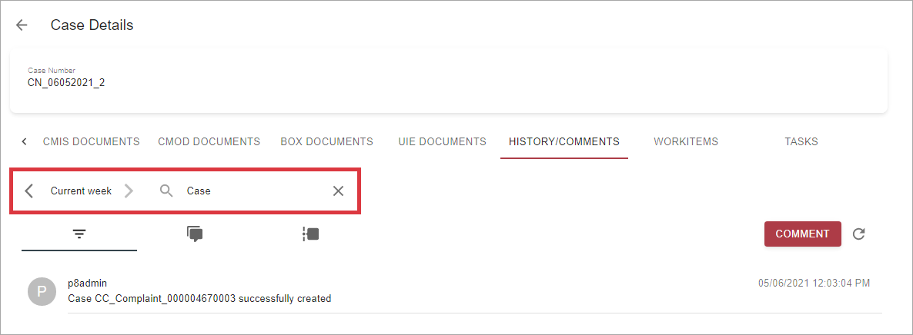](unity-7.8-user-guide/images/history-filtering.png)

User can create comment pressing to `Comment` button.

A new comment is displayed in the grid after `Add` button pressing.

Also user can change any user comment clicking on `Edit` icon:

#### Workitems

Workitems tab contains list of all workitems that were created for the case:

[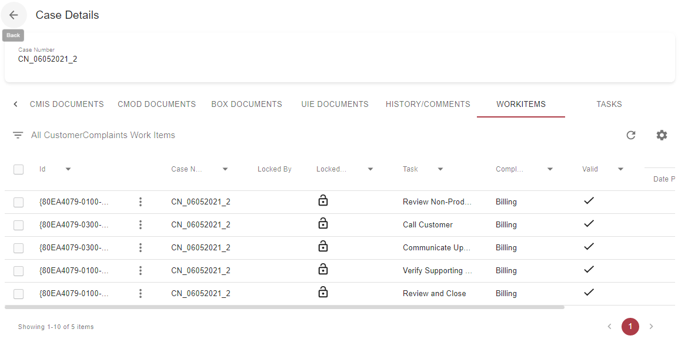](unity-7.8-user-guide/images/workitems.png)

Workitems can be filtered using [Quick Search](#quick-search) or [Advanced Search](#advanced-search).  
Standard Workitem actions can be executed from this tab (see more details in [Actions on Workitems](#actions-on-workitems) section).

### Split Case

User can split case using appropriate action. The following view is displayed after `Split Case` action selection from the context menu:

.

- Step 1. Select Case Type.

    Properties from the parent case are copied to the child case (if it was configured in the Unity configuration files) and displayed in the Read-Only format. 
    User should click `Next` button and select `Case Type` from dropdown menu:

    [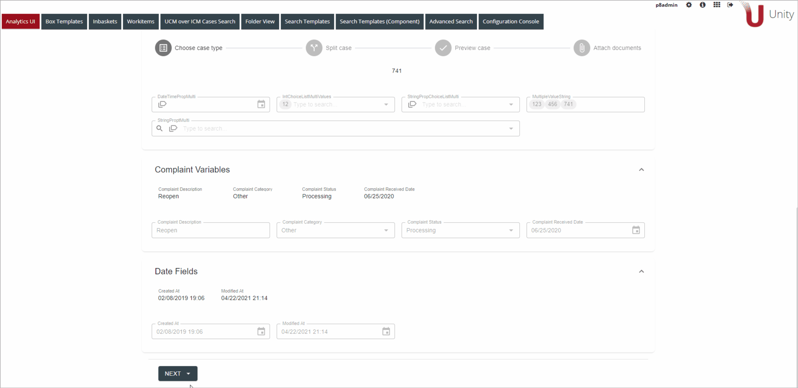](unity-7.8-user-guide/images/split-case-type-selection.gif)
    
- Step 2. Set case properties.

    After Case Type selection user can change or add values to properties on the Case View:
    
    
    
    After properties changing user can select `Back` to change Case Type or `Next` to validate properties values.

- Step 3. Case Preview.
    
    
    
    User can select:
    - `Back` to return to change Case Type or properties
    - `Save` to save changed values
    - `Complete` to finish case splitting
    - `Next` to select document for attaching to a new case from the list of documents that were attached to the parent case

- Step 4. Attach documents to case (optional).
   
    

    User should select document(s) and press `Attach` button to attach documents to the new case. After that user should press `Complete` to finish case creation.

Created case will be displayed in the grid. Case Details view contains all filled in values and attached documents.

### Copy Case

User can copy existing case and create a new case using `Copy Case` action.

The following view is displayed for case copying. This view contains values from the parent case (if it was configured in the Unity configuration files):

- Step 1. User can change or add values to properties and press `Copy` button.

- Step 2. Case preview.

    

    User can select:
    - `Back` to return to change any values
    - `Save` to save changed values
    - `Complete` to finish case copying
    - `Next` to select document for attaching to a new case from the list of documents that were attached to the parent case.
        
- Step 3. Attach documents to case (optional).

    

    User should select document(s) and press `Attach` button to attach documents to the new case. After that user should press `Complete` to finish case creation.

Created case will be displayed in the grid. Case Details view contains all filled in values and attached documents.

### Open by URL

Case Details view will be displayed in the separate browser tab in ExtJS mode after `Open by URL` action execution:

### Open Case in Separate tab

[Case Details view](#case-details-properties) will be displayed in the separate browser tab in the React after `Open in Separate tab` action execution.

### Close Case

Case can be closed and case status will be `Complete` after `Close Case` action execution. All workitems also are completed. Application can be configured for hiding cases and workitems with `Complete` status.

### Delete Case

Any case can be deleted after `Delete Case` action execution.

Confirmation dialog is displayed after action selection:

[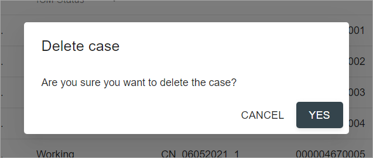](unity-7.8-user-guide/images/delete-case-dialog.png)

Case is physically deleted from case management system.

# Actions on Workitems

## Actions menu for workitems

For more actions, select the workitem and click on the vertical ellipse icon consisting of three dots to the right of the name:

[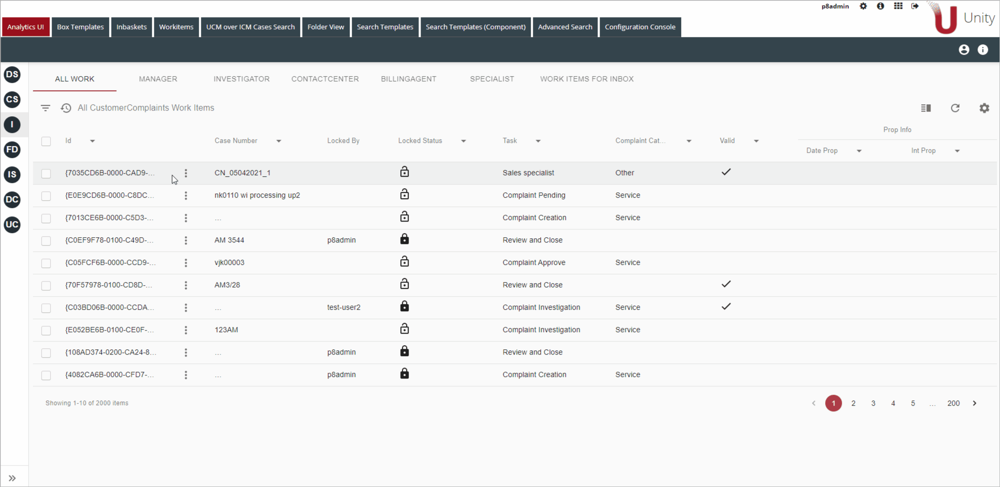](unity-7.8-user-guide/images/workitems-actions-menu.gif)

Click on the action to perform it.

### Workitem Details (Properties)

Workitem Details view can contain the following tabs:
- Properties (see more details in [Case Properties](#case-details-properties) section). Properties that were changed in workitem also will be updated in the case
- Attached documents (see more details in [Attach existing document](#attach-existing-document) and [Attach a new document](#attach-a-new-document) sections). Document that is attached in the workitem also will be displayed in the case and other workitems for this case.
- History/Comments (see more details [History/Comments](#History/Comments) section)

[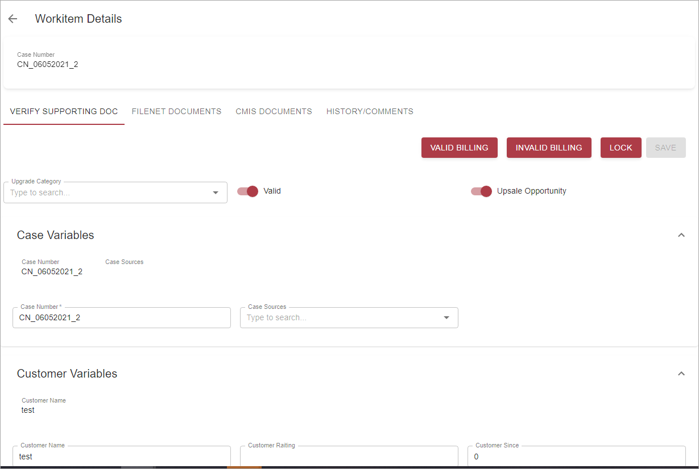](unity-7.8-user-guide/images/workitem-details.png)

### Reassign 

Workitem can be reassigned to other user. This action can be executed from context menu or workitem details view.
The following view is displayed for this action.

Current user should select other user in `Assignee` property to whom this workitem will be assigned. User can start user name typing and possible values will be displayed in the drop-down list.

Also user should add comment to describe why other user should work with this workitem.
Both fields are configured via Unity configuration file. Other properties can be added to this View.

User should press `Reassign` button to finish workitem reassigning.
After the action execution workitem disappears from the list for first user (who resigned) and only the user to whom it was assigned can be seen it.

The same action can be executed for several selected workitems:

### Lock/Unlock workitem

Workitem can be locked by current user:

[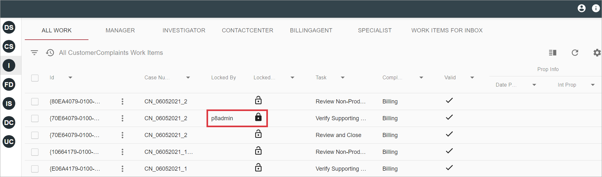](unity-7.8-user-guide/images/locked-workitem.png)

Other users can't open this workitems without `Unlock` action execution:

[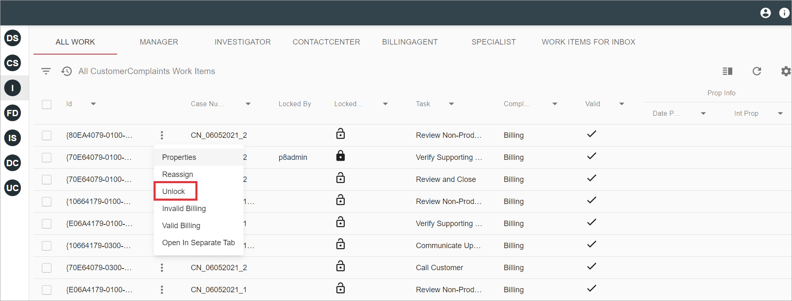](unity-7.8-user-guide/images/unlock-workitem.png)

### Open Workitem in separate tab 

[Workitem Details view](#workitem-details-properties) will be displayed in the separate browser tab in the React after `Open in Separate tab` action execution:

### Dispatch actions

Dispatch actions can be executed for any workitem to move to the next workflow step.
Dispatch actions can be executed from context menu:

[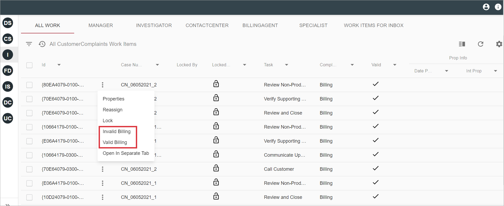](unity-7.8-user-guide/images/dispatch-actions-from-context-menu.png)

or Workitem Details view:

Workitem status changed to `Complete` after dispatch action execution and Workitem for the next workflow step is executed (if it was configured in the case manager system).

Additional Dispatch Workitem view is displayed for case when action is executed from the context menu:

[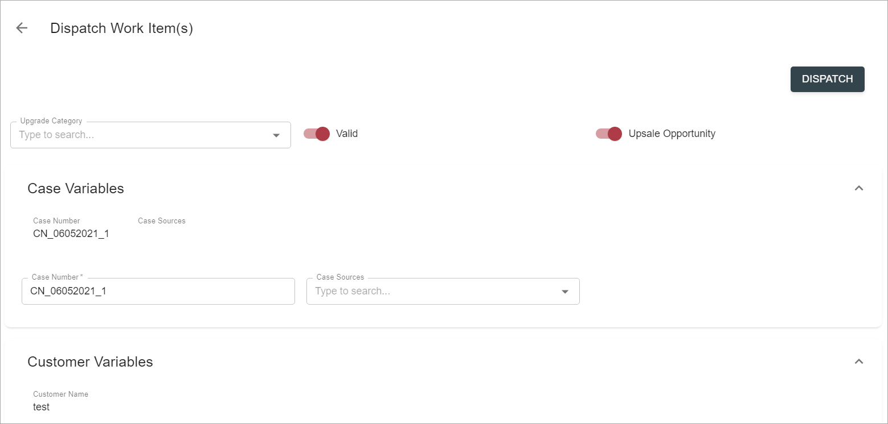](unity-7.8-user-guide/images/dispatch-view.png)

User can change any value for workitem and press `Dispatch` button. After that current workitem will be completed and workitem for the next workflow step will be created.

The same action can be executed for case when several workitems with the same dispatch actions were selected:

[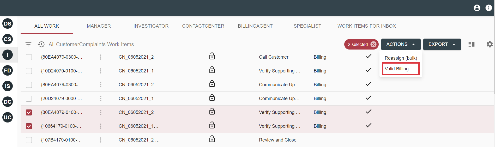](unity-7.8-user-guide/images/bulk-dispatch.png)