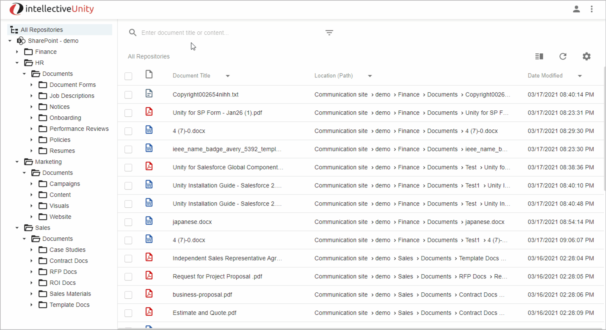
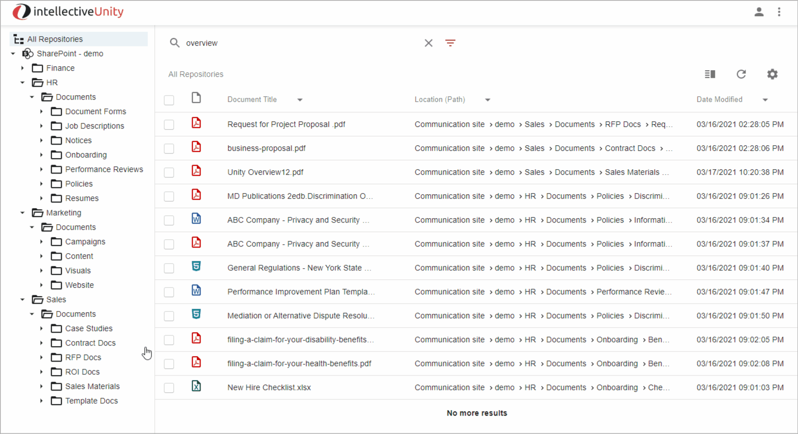

# Getting Started

Your Unity instance contains the following pre-defined SharePoint Sites and content. This is to give you a working example Unity’s capabilities working with different sites and documents:

- Finance
- HR
- Marketing
- Sales

After requesting your Unity instance, the requestor should have received an email detailing how to access your instance. The email contains:

- Two User Ids with passwords.  
    
    These IDs provide different levels of access:
    - User 1: Full access to all sites
    - User 2: Access only to the Sales and Marketing sites  
    
- The URL to use to log into your Unity instance.  
    
    To log in, go to the URL provided in your welcome email, and log in with one of the account User IDs provided.  

# Unity User Interface Overview

When a user signs into Unity the default behavior is to display a list of Favorite files, which are files the user as tagged as a Favorite. 
For more information on Favorites see [Favorites](#favorites) and [Saved Search List](#saved-search-list) sections below.

|**Note for demo instance**: For Evaluation purposes, a short list of files has been tagged as a Favorites.

## Simple Search

Use Simple Search to quickly find documents across all authorized SharePoint sites by typing in a related keyword or phrase.

Type in the word or phrase to search for in the “Enter on Document Title or Content” box at the top of the screen.
The Search results will automatically update, returning all content with the search criteria found anywhere in the Document Title or Content.

## Folder View

Use the folder view to easily browse through the contents of folders in all of your connected sites and instances.

The demo instance contains a single SharePoint instance with multiple sites for you to browse through in one view. 
Unity has the capability to present a single continuous view of multiple SharePoint instances, together with other repositories like IBM FileNet, CMOD, CM8, Box, Alfresco, other CMIS repositories, and more. 

Click on a folder to display content within that folder and all subfolders under it.

- All Repositories 

    When the All Repositories Node is select any Simple Or Advanced search will search across all Configured Repositories.

    |**Note for demo instance**: For the Preconfigured Demo, only SharePoint is configured.  However, the only Repository is SharePoint.  However, Unity also includes other repositories (e.g., IBM FileNet, CMOD, CM8, Box, Alfresco, all CMIS supported repositories)

- SharePoint Instance

    When the SharePoint Instance Node is select any Simple Or Advanced search will search across all Configured Sites for the selected SharePoint Instance.

    |**Note for demo instance**: For the Preconfigured Demo only a single SharePoint Instance is provided.  However, multiple SP Instances are supported. 

- SharePoint Sites

    |**Note for demo instance**: The Preconfigure Demo has been configured with the following four SharePoint sites: HR, Finance, Sales, Marketing

    When a user selects a SharePoint Site, all Simple and Advanced Search are restricted to the selected Site.  

    Note: It is possible to search across multiple specifically selected SharePoint Sites using the Advanced Search SharePoint Sites search criteria (See Advanced Search – SharePoint Sites below)

- SharePoint Site - Folders

    |**Note for demo instance**: The Preconfigured Demo has been configured with specific Folders, Sub-Folders and related Content for each SharePoint Site (see list above). 

    When a user selects a specific Folder, all Simple and Advanced Searches are restricted to the select Folder Content and All Sub-Folder Content.

## Search Results

- Action - Simple Open

    Clicking the Document Title on one of the search results will open the file in the Browser.

## Favorites
## Saved Search List