# Getting Started

Your Unity Pre-Configured SharePoint Demo instance contains the following pre-defined SharePoint Sites and content. 
This is to give you a working example of Unity’s capabilities accessing different sites and documents:

- Finance
- HR
- Marketing
- Sales

After requesting your Unity Pre-Configured SharePoint Demo instance, the requestor should have received an email detailing how to access your Unity. The email contains:

- Two User Ids with passwords.  
    
    These IDs provide different levels of access:
    - User 1: Full access to all sites
    - User 2: Access only to the Sales and Marketing sites  
    
- The URL to use to log into your Unity instance.  
    
    To log in, go to the URL provided in email, and log in with one of the account User IDs provided.  
    
|**Note**: To run Unity in demo mode, without impacting other SharePoint sessions, please open a Private Browser window and enter the Unity Application URL provided in the email you received.

# Unity User Interface Overview

When a user signs into Unity the default behavior is to display a list of [Favorite](#favorites) files, which are files the user has tagged as Favorites. 
For the Pre-Configured SharePoint Demo, a short list of files has been tagged as Favorites.

## Folder View

Use the folder view to easily browse through the contents of repositories and folders.

The demo instance contains a single SharePoint instance with multiple sites for you to browse through in one view. 
Unity has the capability to present a single continuous view of multiple repositories and related folders like IBM FileNet, CMOD, CM8, SharePoint, Box, Alfresco, other CMIS repositories, and more. 

Click on a folder to display content within that folder and all subfolders under it:

- All Repositories 

    When the All Repositories Node is selected any Quick Or Advanced search will search across all configured repositories (e.g., IBM FileNet, CMOD, CM8, SharePoint Box, Alfresco, other CMIS repositories).  
    For the Pre-Configured Demo, only SharePoint is configured. However, Unity can also be configured to include other repositories.

- Repository

    When a Repository, such as a FileNet Domain or SharePoint Instance, Node is selected any Quick Or Advanced search will search across all related folders and content.  
    For the Pre-Configured Demo only a single SharePoint Instance is provided.  However, multiple SharePoint Instances are supported. 

- Folders

    When a user selects a specific Folder, all Quick and Advanced Searches are restricted to the selected Folder content and all Sub-Folder content.
    
    Unity defines a Folder to be any collection of Folders and Sub-Folders.   
    For example: 
    - An IBM FileNet Object Store would be considered a Folder, as would any Folder and Sub-Folder under the Object Store.
    - A SharePoint Site would be considered a Folder, as would any Folder and Sub-Folder under the Site.
    
    The Pre-Configured Demo has been configured with the following four SharePoint sites each with its own set of Folders, Sub Folders and related Content:
    - Finance
    - HR
    - Marketing
    - Sales

## Quick Search

Use Quick Search to quickly find documents across all authorized SharePoint sites by typing in a related keyword or phrase.

Type in the word or phrase to search for in the `Enter on Document Title or Content` box at the top of the screen. Click `Search` icon or press `Enter` on a keyboard to execute search.
The Search results will update, returning all content with the search criteria found anywhere in the Document Title or Content, restricted by your selection in the Folder View:

[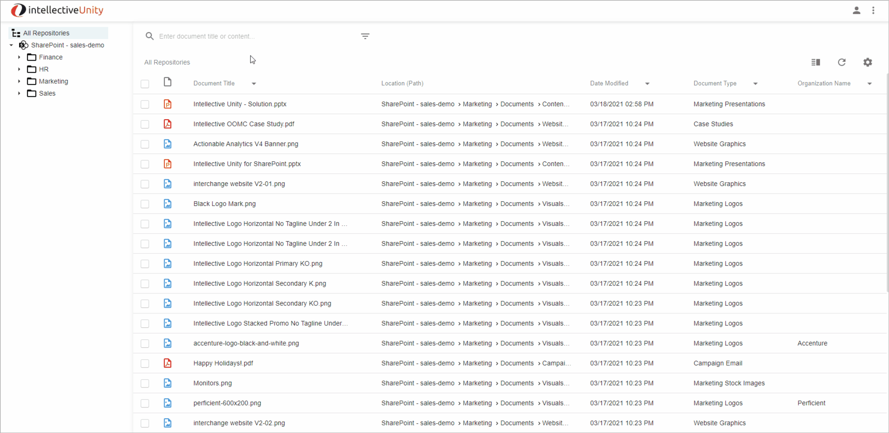](unity-8-user-guide/images/quick-search.gif)

## Advanced Search 

Advanced search gives you powerful tools to find the exact document you’re looking for. 
You can quickly filter and narrow down your search results via multiple dimensions like site, file type, modifier, custom metadata, and more. 

Click the Advanced Search Icon to open the Advanced Search Panel:

[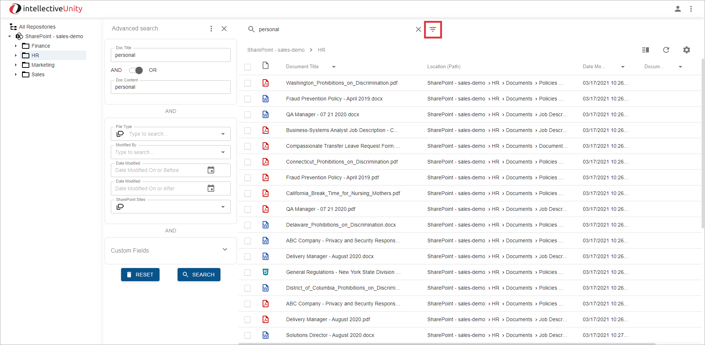](unity-8-user-guide/images/advanced-search-icon.png)

### Search Options: Document Title, Document Contents with AND / OR Condition 

From the Advanced Search Panel, you can:

- Search by Title only, by the contents of the file only, by title and contents, or by either title or content. 

- Enter search values and select `AND` to return documents that both contain the value you entered in the title, and contain the value you entered within the document’s text.

- Select `OR` to find documents that match either the title value, or contain the content value in the document’s text.

The fields will default to match what you previously entered in the `Quick` search view.

Remove one of the values to only search by that criteria. For example, remove the `Doc Content` value to only look in the document’s title:
   
[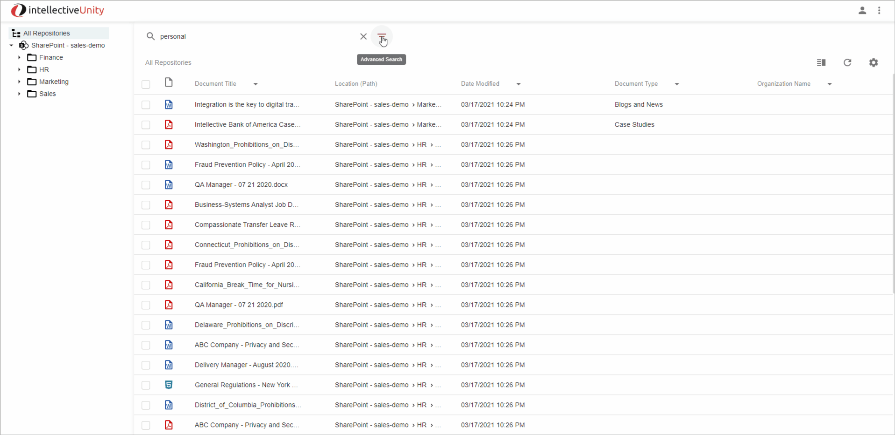](unity-8-user-guide/images/advanced-search.gif)
    
### Search by File Types

To only return documents of a particular type, click on the `File Type` dropdown and select the types of files you want the search to return. For example: MS Word, MS Excel, PDF, etc. 
You may select multiple values to return multiple types of documents:

Remove your selections to see all file types.

### Search by the user who last modified the file

To show documents modified by a particular user, click on the `Modified By` dropdown and select the user’s name.

### Search by Date Modified Range

To show documents modified at a certain date or time, enter values in the `Date Modified On or Before`, or `Date Modified On or After` fields. 

Allows the user to restrict the search results based on the Date Modified. The user can enter a:
- Enter a Date Modified On or Before to return documents last modified on or before that date 
- Enter a Date Modified On or After to return documents last modified on or after that date 
- Enter a date for both fields to return documents modified on or between those two dates. 
- Enter the same date for both to return documents modified on that day.
    
### Search by SharePoint Sites

By default, Unity’s search shows you documents across all of your authorized connected sites.  
If you only want to view documents from a particular site or a set of sites, click the `SharePoint Sites` dropdown and check the sites you want to search:

[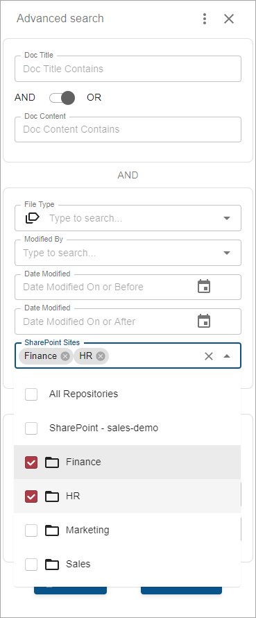](unity-8-user-guide/images/advanced-search-sites.png)  

When the Search executed, the Folder View is updated to displayed only the selected Sites. 
     
### Search by Custom Fields

Some Repository documents may have additional associated metadata that describes the file. 
For example, `Customer Name` or `Order ID.` If the administrator has configured Custom Metadata fields for specific Repository, you can search by these fields in the Custom fields section. 
Click on the `Custom Fields` section to expand it and enter values for the fields you’d like to search on.

For your Pre-Configured Demo instance, example Custom Fields have been created for the following:

- Document Type (Choice List)
- Organization Name (Text Field)

### Execute Search and Reset

- Click the `Search` button to execute your Advanced Search and see the results in the panel on the right.
- To clear your Advanced Search changes and return to the default search settings, click the `Reset` button.

## Saved Searches

You can save frequently used searches to quickly access them in the future.

- Enter the search criteria you’d like to use, then click the `Advanced Search Settings` ellipses and select `Save As`
- Enter a name for the search and click `Save`
- To access your saved searches, click on the [Navigation Settings Menu](#navigation-settings) and select a search listed under the `Saved Searches` section

When a Saved Search is selected, the Quick and Advanced panel UIs are updated to display the Saved Search Criteria, and the search is executed:
  

## Favorites

You can tag frequently accessed documents as Favorites, providing fast access to them without searching.  

You can tag/un-tag a document as a Favorite by selecting the [Favorite action](#favorite-on--favorite-off).  
Also you can do this in [Document Details panel](#details) and in [Detail view](#detail-view).

To display the list of your Favorites select `Favorites` from the [Navigation Settings Menu](#navigation-settings):

[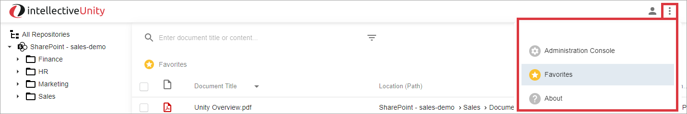](unity-8-user-guide/images/favorites-menu.png)

|**Note**: When you first log on, the Favorites are shown by default.

## Search Results

The Search Results are displayed and updated when the following occurs:

- By default, when you log into Unity, files you previously tagged as Favorites are displayed
- You perform either a Quick or Advanced Search
- You select a Saved Search
- You select a Node in the Folder View
- A new document created and added to the folder

With Unity, you can customize how you view your search results. You can change the look and feel, set and order of displayed columns, sort order, and more. 
To customize the Search Results Panel, click on the gear icon in the upper right:

### Grid columns

To make a column visible or hidden, or to control the order in which the columns are displayed, select the `Grid Columns` menu item.
Customize columns dialog appears:

For a given field, toggle the Visible toggle switch to the right (Red) to make that column visible. Toggle the switch to the left (Gray) to hide the column.

Any custom fields configured to the Repository will be displayed as columns.  

For the Pre-Configured Demo, custom fields will be configured for:
- Document Type
- Organization Name

To change the column order, mouse over the Dots icon to the left of the Column name, and then drag and drop the Column in the order it should be displayed. 
For example, drag a column from the bottom to the top of the list to see it on the left side of your screen when searching.

When you’re done making changes, select the `Apply` button. Your changes will be saved and kept the same each time you log into the system.

### Grid Display Density: Usability Features

Unity can show information in a more compact or a more expanded form, depending on how much data you’d like to see on the screen at once.

To change the grid density of the rows displayed in the search results, click the `Grid Display Density` option and select the view you’d like to use.  
Three options are provided:
- Default
- Medium
- Compact

[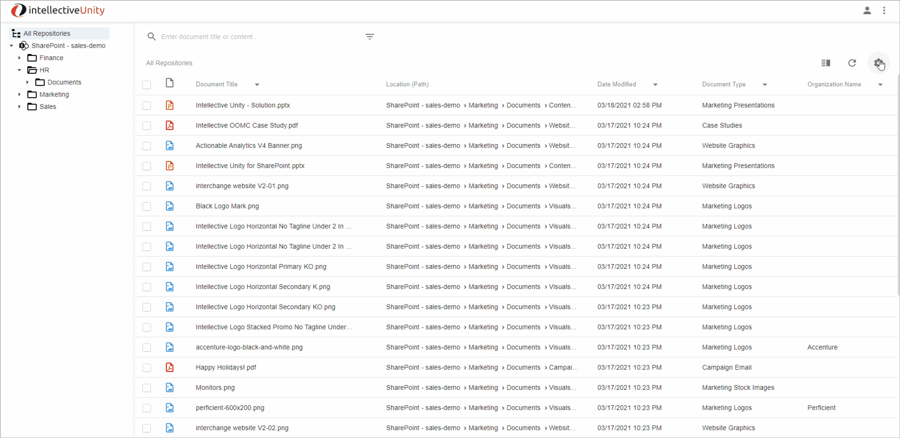](unity-8-user-guide/images/grid-density.gif)

Click the `Apply` button to save your change. 

### Sorting

Unity gives you powerful tools to sort your results, making it much easier to narrow down and identify the documents you want to find. 
You can use a simple sort on one column, or create multiple related column sorts to hone in on specific information.

#### Quick Sort

- To quickly sort a column, mouse over the Column Name, and click on the arrow icon that appears immediately to the right:

    

    This will sort the column in ascending order. 
- Click again to sort in descending order
- Click a third time to remove the sort

#### Sort Menu

To sort a column, you can also click the down arrow to the right of the column heading:

[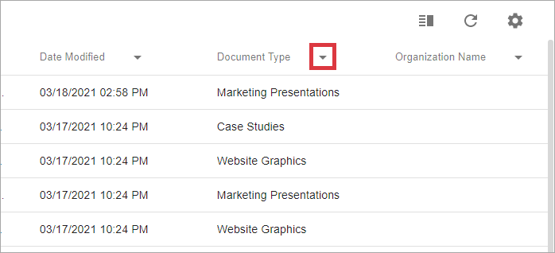](unity-8-user-guide/images/sort-column-arrow.png)

The sort options are displayed:

 
To set the sort order for the selected column, select either `Sort Ascending` or `Sort Descending`. Ascending will order elements like `1, 2, Alpha, Beta`, while descending will order elements like `Zulu, Yankee, 9, 8`.

If you select a sort for multiple columns, a number will appear after the column names, indicating in which order the columns are sorted.

To control the sort order and have a different column be sorted first, select the down arrow to the right of the column heading and select either Promote Order (to increase that column’s precedence in the sort order), or Demote Order (to lower that column’s precedence in the sort order). 
For example, if you want to sort by Document Title first, and then by Date Modified, promote Document Title until it is labelled `1`, followed by Date Modified labelled `2`.

    
To remove the Column from Sort, select the `Remove Sort` menu item from the dropdown.

## Actions on documents

Once you’ve located the document you’re looking for, you can take a variety of actions on it.

### Quick Open file action

Clicking the Document Title on one of the search results will open the file in the browser:

[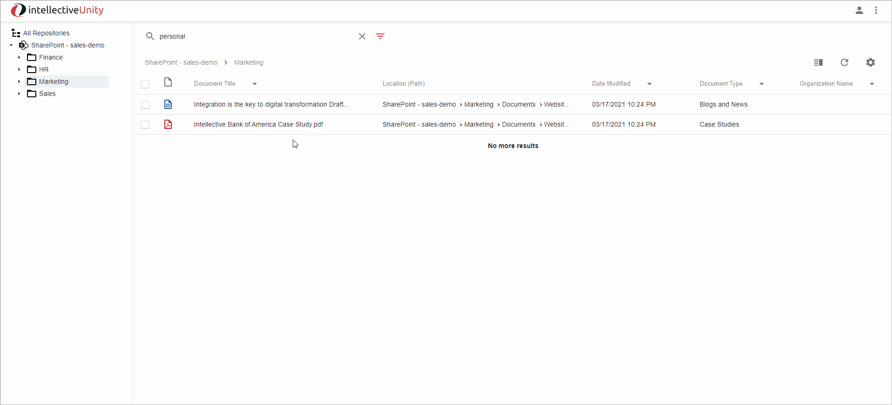](unity-8-user-guide/images/open.gif)
 
### Actions menu

For more actions, mouse over the Document Title and then click on the vertical ellipse icon consisting of three dots to the right of the name:

[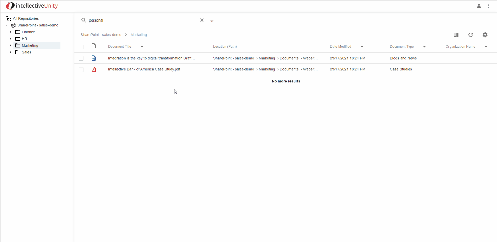](unity-8-user-guide/images/context-menu.gif)

Click on the action to perform it.

#### Open in browser

Opens the file in your browser for quick viewing.

#### Open in app

Opens the file in the related desktop application.  
Only applicable for Microsoft Office documents.  

#### Copy link

Opens a window where the user can copy the URL to the selected file:
 
[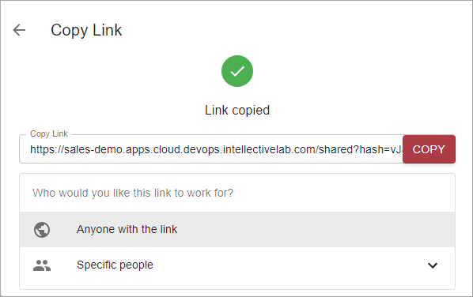](unity-8-user-guide/images/copy-link.png) 
 
This URL provides a fast means of sharing the document with other users, without creating a duplicate copy.

Click `Copy` to copy the URL to your clipboard, then paste (Ctrl-V) to paste the link into an email, message, document, or other location.

You can optionally select to limit the number of people who can access the link.  Select `Specific People` from the menu and choose the people that you want to access the document via the link. 

|**NOTE**: Safari does not support automatic copying. The expected behavior in Safari browser is that the user copies the link manually.

#### Download

Downloads the selected file to your default file download location.

#### Delete

Deletes a document from the system.

You must have security rights to delete the file for this action to be available.

You will be shown a Delete document confirmation prompt: 
- If you select `Yes`, the file will be deleted
- If you select `Cancel`, no changes will be made and the prompt will be closed

#### Rename

Renames the file.

Enter a new name for the file in the dialog box:

 

Click `Rename` to confirm. The file will now be searchable and labelled by the new name.

Select `Cancel` to close the Rename dialog box without renaming the file.
 
#### Move to

Moves the file to another folder.

|**Note**: The folder must be one level before the Parent Level folder related to a SharePoint Site, or FileNet Object Store.

You may move files by dragging and dropping them, or by selecting the `Move to` option. 

- Using `Move to`
    
    Click the `Move to` action, then select the folder you wish to move to.  Click the `Select` button to move the document:

     
 
- Using Drag and Drop

    - Click on the file you want to move, then drag and drop the file from the Search Results to a Repository Folder on the Folder View. 
    - After dropping the file, you will be asked if you’d like to move or copy the file. Moving will relocate the file to a new location, while copying will duplicate the document and place the copy in the new location:
    
         

    - To cancel the Move/Copy action, click outside of the selection box.

#### Copy to

Copies the File to another Folder.

|**Note**: The folder must be one level before the Parent Level folder related to a SharePoint Site, or FileNet Object Store.

You may copy files by dragging and dropping them, or by selecting the `Copy to` action.

- Using `Copy to`

    Click the `Copy to` action, then select the folder you wish to copy it to.  Click the `Select` button to copy the document:

    [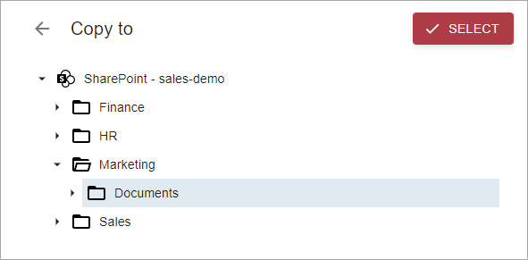](unity-8-user-guide/images/copy-to.png) 

- Using Drag and Drop

    See [Move Action](#move-to) above.

#### Details

Clicking the Detail action displays a Document Details window with the following information:
- Path to the file 
- Document title   
- Favorite icon, indicating if you previously favorited this document and allowing to tag a document as a Favorite or remove from Favorites
- Link to Open the file in your browser:

    [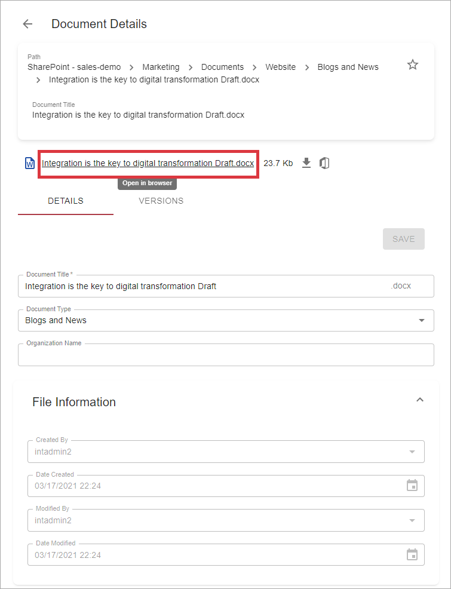](unity-8-user-guide/images/details-link.png) 
    
- Icon to Download the file:
    
     
    
- Icon to Open the file in desktop app:

     

- `DETAILS` Tab
    
    The Details tab displays metadata, which can be modified by an authorized user.  
       
    Standard repository metadata:
    - Document title
    
    For the Pre-Configured Demo, custom fields will be configured for:
    - Document Type
    - Organization Name
    
    The Details Tab will be displayed by default.
    
- `VERSIONS` Tab
 
    The Version History tab displays information on each version of the file. 
    Each time the file is modified, the version capable repositories create a new version of the file to track the changes made. 
    From this tab, you can see and interact with the current version of the document, as well as all prior versions.
 
#### Favorite On / Favorite Off

You may tag a file as a Favorite or remove a file as Favorite, by selecting the `Favorite` action.

Once the file is selected as a Favorite, the `Favorite` action appears with a Yellow Star:

[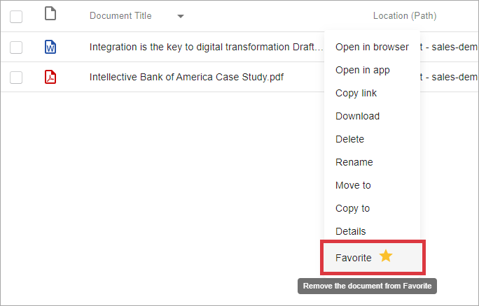](unity-8-user-guide/images/favorite-action-on.png) 

You may un-tag a file as a Favorite by selecting the `Favorite` action again. 

Once the file is de-selected as a Favorite (or not previously selected as a Favorite) the `Favorite` action appears with a Star that is not filled in:

[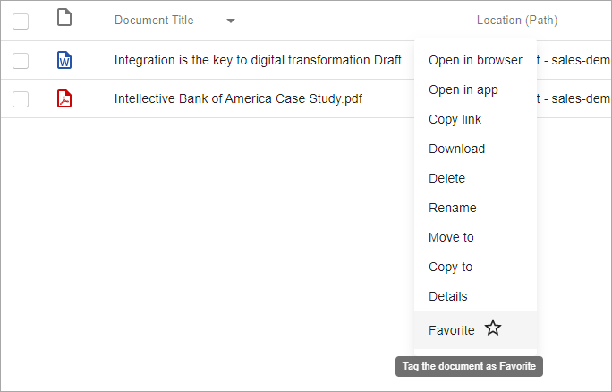](unity-8-user-guide/images/favorite-action-off.png) 

### Actions on Multiple Selected Documents

With Unity, you can take action on multiple documents at once.  
Click the checkbox to the left of a document to select it. To take action on multiple documents, select multiple documents and then click the `Actions` button in the upper right:

 
 
You may take the following actions on multiple selected documents:
- Download
    
    Downloads the selected files as a single zip file.
- Move to / Copy to
    
    Shows the same `Move to / Copy to` interface used for single documents, allowing you to copy or move multiple documents at the same time.

By clicking the `Export` button you can export metadata fields for selected documents to CSV file:

 

You may select `CSV(current fields)` option to export fields that are currently shown in [grid columns](#grid-columns), or `CSV(all fields)` option to export all fields.

### Create Document

You can easily add new documents to your repositories, right from Unity.

Click the `Create` button to add a file to a Folder:

[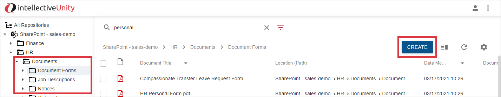](unity-8-user-guide/images/create-button.png)

|**Note**: The `Create` button is only displayed when you have selected a Folder in the Folder View. If All Repositories, or a Folder related to a SharePoint Site node is selected in the Folder View, the `Create` button is hidden.

The New Document dialog box will be displayed:
 

 
 You can add documents two ways:

- Drag and Drop: Click on a document in a folder on your desktop, and drag it onto the `Drop files to attach` box on the screen. 
- Browse and Select: Click the Upload icon in the `Drop files to attach` box. You will be prompted to select.
 
After dragging and dropping, or browse and selecting a file, you will be prompted to enter metadata for the file.
- Enter a Document Title to be used for the document added. This can be different from the filename:
    
    [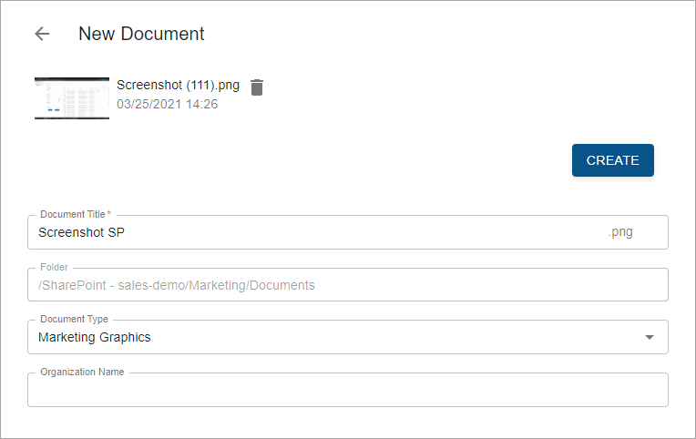](unity-8-user-guide/images/create.png)
    
- You may optionally provide custom metadata field values, if prompted. Required fields will be marked with a red icon.
    
    For the Pre-Configured Demo custom metadata fields for the following have been configured:
    - Document Type (Choice List)
    - Organization Name (Text)
    
- Once all required fields are entered, click the `Create` button.
- Your document will be securely uploaded into the system.
 
## Detail View

Unity provides an additional Detail View to allow fast browsing and comparison of documents. To activate it, click the `Detail View` toggle button in the upper right of the search results screen:

  

You can click the button again to easily toggle between `Detail View` and standard `List View`:

The Detail View left panel displays the list of files returned from the search.
The Detail middle panel displays the same details information as listed above when the user selects the [Details action](#details). 
You may click on documents in the left panel to refresh the middle panel with their details. In this way, you can quickly switch between documents to compare details or identify the document you’re looking for.
 
You can open Detail View for all documents returned by a search, or you can first multi-select the specific documents you want to view. 
For example, clicking the checkbox next to three documents, then selecting the Detail View toggle, will show only those three documents in Detail View. If no checkboxes are selected, all documents will be shown:

Click the `Order By` dropdown to change the order by which files are displayed in the Detail View. 
The Detail View will sort the contents based on the column you select:

 

## Appended Searches

Sometimes, it takes multiple searches to find and assemble the documents you need. 
Unity gives you the ability to collect documents across multiple searches and then download, view, or take action on them.

You can Append documents across multiple searches as follows:
- Perform a search, then select the documents you wish to keep by clicking the checkbox next to each document
- Execute a different search or browse to a different folder, then select more documents by clicking the checkbox 
- Repeat as many times as you needed to identify the collection of documents you require
- Once all documents are selected, click the `Detail View` toggle to view a complete list of the selected documents across multiple searches. You can also take action on one or all of the documents.

[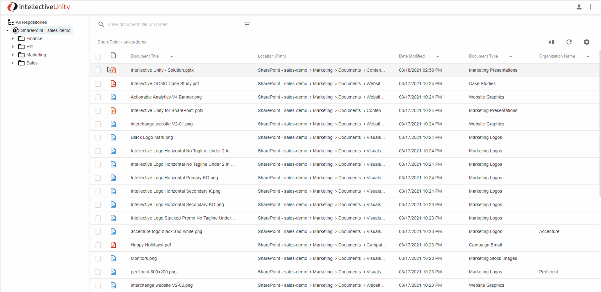](unity-8-user-guide/images/appended-search.gif)

## Menus

Unity provides the Account settings and Navigation settings top-level menus.

### Account Settings

The Account Setting displays your logged-in user account information:

[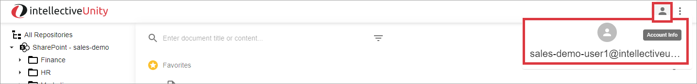](unity-8-user-guide/images/account-settings.png)
 
### Navigation Settings

[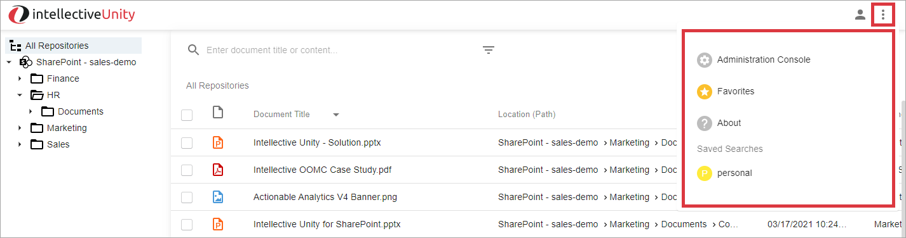](unity-8-user-guide/images/navigation-menu.png) 

The Navigation Setting Menu provides access to the following:
    
- Administration Console     
        
    Allows your organization's Administrators to Configure Unity. For the Pre-Configured Demo the Unity Administration Console UI has been set to Read Only to allow evaluators to view what configuration options are available.  

    [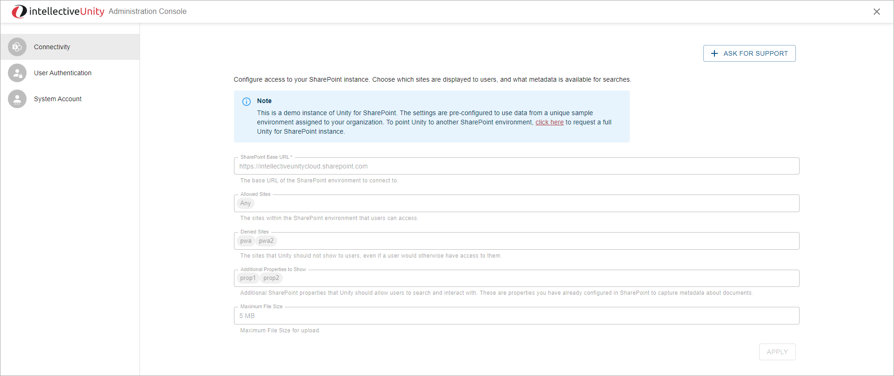](unity-8-user-guide/images/administration-console.png)     

    - Connectivity:  
      Allows the Administrator to indicate the following information:
      - SharePoint Base URL
      - Allowed Sites: SharePoint Sites Unity is Authorized to Access
      - Denied Sites: SharePoint Sites Unity is Denied Access
      - SharePoint Custom Metadata Properties configured for Unity access    
    - User Authentication  
      Allows the Administrator to indicate User Authentication information    
    - System Account  
      Allows the Administrator to indicate System Account Information

- Favorites  
    
    Shows a list of favorite documents. See [Favorites](#favorites) for details. 

- User Guide

    Shows this User Guide.
    
- About Unity
- Saved searches  
    
    Shows a list of saved searches. See [Saved Searches](#saved-searches) for details.
