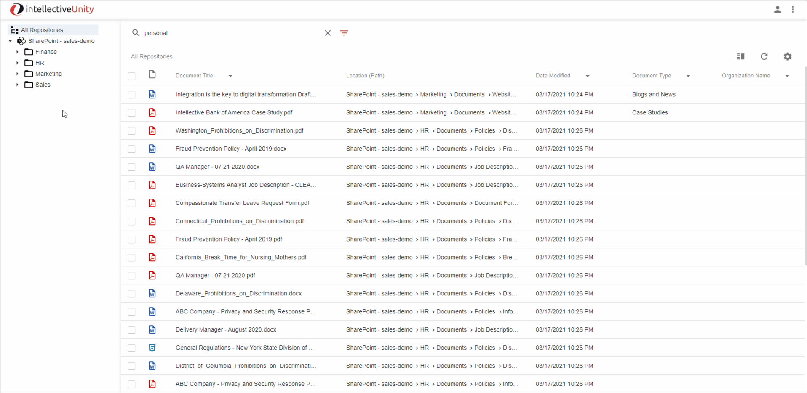
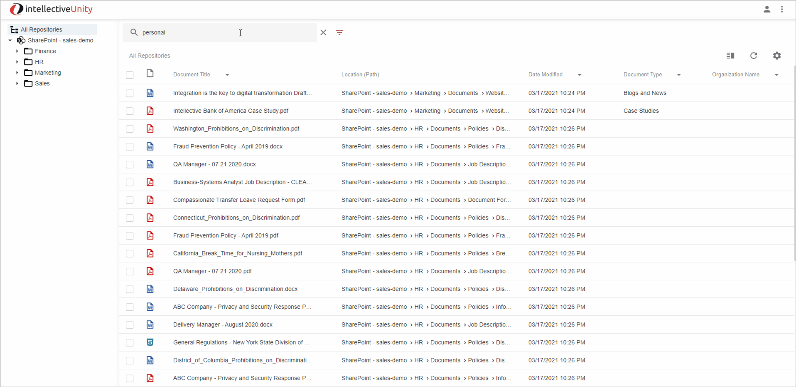

# Getting Started

Your Unity instance contains the following pre-defined SharePoint Sites and content. This is to give you a working example Unity’s capabilities working with different sites and documents:

- Finance
- HR
- Marketing
- Sales

After requesting your Unity instance, the requestor should have received an email detailing how to access your instance. The email contains:

- Two User Ids with passwords.  
    
    These IDs provide different levels of access:
    - User 1: Full access to all sites
    - User 2: Access only to the Sales and Marketing sites  
    
- The URL to use to log into your Unity instance.  
    
    To log in, go to the URL provided in your welcome email, and log in with one of the account User IDs provided.  

# Unity User Interface Overview

When a user signs into Unity the default behavior is to display a list of Favorite files, which are files the user as tagged as a Favorite. 
For more information on Favorites see [Favorites](#favorites) and [Saved Search List](#saved-search-list) sections below.

For Evaluation purposes, a short list of files has been tagged as a Favorites.

## Simple Search

Use Simple Search to quickly find documents across all authorized SharePoint sites by typing in a related keyword or phrase.

Type in the word or phrase to search for in the `Enter on Document Title or Content` box at the top of the screen.
The Search results will automatically update, returning all content with the search criteria found anywhere in the Document Title or Content.

## Folder View

Use the folder view to easily browse through the contents of folders in all of your connected sites and instances.

The demo instance contains a single SharePoint instance with multiple sites for you to browse through in one view. 
Unity has the capability to present a single continuous view of multiple SharePoint instances, together with other repositories like IBM FileNet, CMOD, CM8, Box, Alfresco, other CMIS repositories, and more. 

Click on a folder to display content within that folder and all subfolders under it.

- All Repositories 

    When the All Repositories Node is select any Simple Or Advanced search will search across all Configured Repositories.

    For the Preconfigured Demo, only SharePoint is configured.  However, the only Repository is SharePoint.  However, Unity also includes other repositories (e.g., IBM FileNet, CMOD, CM8, Box, Alfresco, all CMIS supported repositories)

- SharePoint Instance

    When the SharePoint Instance Node is select any Simple Or Advanced search will search across all Configured Sites for the selected SharePoint Instance.

    For the Preconfigured Demo only a single SharePoint Instance is provided.  However, multiple SP Instances are supported. 

- SharePoint Sites

    The Preconfigure Demo has been configured with the following four SharePoint sites: HR, Finance, Sales, Marketing

    When a user selects a SharePoint Site, all Simple and Advanced Search are restricted to the selected Site.  

    Note: It is possible to search across multiple specifically selected SharePoint Sites using the Advanced Search SharePoint Sites search criteria (See Advanced Search – SharePoint Sites below)

- SharePoint Site - Folders

    The Preconfigured Demo has been configured with specific Folders, Sub-Folders and related Content for each SharePoint Site (see list above). 

    When a user selects a specific Folder, all Simple and Advanced Searches are restricted to the select Folder Content and All Sub-Folder Content.

## Search Results

- Action - Simple Open

    Clicking the Document Title on one of the search results will open the file in the Browser.

## Advanced Search 

Advanced search gives you powerful tools to find the exact document you’re looking for. 
You can quickly filter and narrow down your search results via multiple dimensions like site, filetype, modifier, custom metadata, and more. 

Click the Advanced Search Icon to open the Advanced Search Panel

From the Advanced Search Panel, you can:

- Search by Title only, by the contents of the file only, by title and contents, or by either title or content. 

    Enter search values and select `AND` to return documents that both contain the value you entered in the title, and contain the value you entered within the document’s text.

    Select `OR` to find documents that match either the title value, or contain the content value in the document’s text.

    The fields will default to match what you previously entered in the `Simple` search view.

    Remove one of the values to only search by that criteria. For example, remove the `Title` value to only look in the document’s text.
   
    
    
- Search by File Types

    To only return documents of a particular type, click on the `File Type` dropdown and select the types of files you want the search to return. For example: MS Word, MS Excel, PDF, etc. 
    You may select multiple values to return multiple kinds of documents. Remove your selections to see all document types.
    
    <For Video/Gif Continue from last GIF and add to it a File Type Selection (e.g., MS Word, MS PowerPoint, PDF, etc, and select the Search button to show the updated results>

- Search by the user who last modified the file

    To show documents modified by a particular user, click on the `Modified By` dropdown and select the user’s name.
    
    <For Video/Gif Continue from last GIF and add to it a Modified By Search and select the Search button to show the updated results>

- Search by Date Modified Range

    To show documents modified at a certain date or time, enter values in the `Date Modified On or Before`, or `Date Modified On or After` fields. 
   
    Allows the user to restrict the search results based on the Date Modified. The user can enter a:
    - Enter a Date Modified On or Before to return documents last modified on or before that date 
    - Enter a Date Modified On or After to return documents last modified on or after that date 
    - Enter a date for both fields to return documents modified on or between those two dates. 
    - Enter the same date for both to return documents modified on that day.
    
    <For Video/Gif Continue from last GIF and add to it a Date Modified Range Search and select the Search button to show the updated results>

- Search by SharePoint Sites

    By default, Unity’s search shows you documents from everywhere, in all of your connected sites.  
    If you only want to view documents from a particular site or a set of sites, click the `SharePoint Sites` dropdown and check the sites you want to search.
   
    <For Video/Gif Continue from last GIF and add to it a selection of Multiple SharePoint Sites and select the Search button to show the updated results>

- Search by Custom Fields

    Some SharePoint documents may have additional associated metadata that describes the file. 
    For example, `Customer Name` or `Order ID.` If the administrator has configured Custom SP Metadata fields for specific SP Sites, you can search by these fields in the Custom fields section. 
    Click on the `Custom Fields` section to expand it and enter values for the fields you’d like to search on.

    For your Preconfigured Demo instance, example Custom Fields have been created for the following:

    - Organization Name (Text Field)
    - Document Type (Choice List)

    <For Video/Gif Continue from last GIF and add to it Custom Field search including Document Type and /or Organization Name and select the Search button to show the updated results>

Click the `Search` button to execute your search and see the results in the panel on the right.

To clear your changes and return to the default search settings, click the `Reset` button

<For Video/Gif Continue from last GIF and select the `Reset` button to show the Search Criteria fields are cleared>

## Favorites and Saved Search list

Favorites and Saved Search List is accessible from the Navigation Settings menu (See Section 3 Menus below).

### Favorites

You can tag frequently accessed documents as `Favorites`, providing fast access to them without searching.

To tag a document as a `Favorite`, click the ellipses to the right of the document name, and select `Favorite`.

|**Note**: When you first log on, the Favorites are shown by default.  You can re-display the Favorites at any time by selecting Favorites from the Intellective Menu.

<For Video/Gif log in and show that Favorites are displayed by default.  Select a document and Un-tag it as a Favorite using the Content Action Favorite to show that it is removed.  
Then go to the Folder View and open a folder to display a list of documents.  Tag one as a Favorite using the Content Action Favorite, and then open the Navigation Setting Menu and select Favorites to show the List of Favorites>

### Saved Search List

You can save frequently used searches to quickly access them in the future.

- Enter the search criteria you’d like to use, then click the `Advanced Search Settings` ellipses and select `Save As`
- Enter a name for the search and click `Save`
- To access your saved searches, click on the Navigation Settings Menu and select a search listed under the `Saved Searches` section

When a Saved Search is select, the Simple and Advance Panel UIs are updated to display the Save Search Criteria, and the search is executed.
  

## Create Document

You can easily add new documents to your repositories, right from Unity.

Click the `Create` button to add a file to a `SharePoint Site > Folder`:

|**Note**: The `Create` button is only displayed when you have selected a Folder in the Folder View. If All Repositories, SharePoint Instance, or a SharePoint Site node is selected in the Folder View, the `Create` button is hidden.

The New Document dialog box will be displayed:
 

 
 You can add documents two ways:

- Drag and Drop: Click on a document in a folder on your desktop, and drag it onto the `Drop files to attach` box on the screen. 
- Browse and Select: Click the Upload icon in the `Drop files to attach` box. You will be prompted to select.
 
After dragging and dropping, or browse and selecting a file, you will be prompted to enter metadata for the file.
- Enter a document title to be used for the document added. This can be different from the filename.
- You may optionally provide custom metadata field values, if prompted. Required fields will be marked with a red icon.
    
    For the Preconfigured Demo custom metadata fields for the following have been configured:
    - Document Type (Choice List)
    - Organization Name (Text)
 
- Once all required fields are entered, click the `Create` button.
- Your document will be securely uploaded into the system.

< From the Video/Gif, starting from last GIF where Create button is displayed, add a document via Drag and Drop and then provide values for Document Title, Document Type and if appropriate (optionally) Organization Name.  Then select the Create Button and show the Document was added to the folder>

