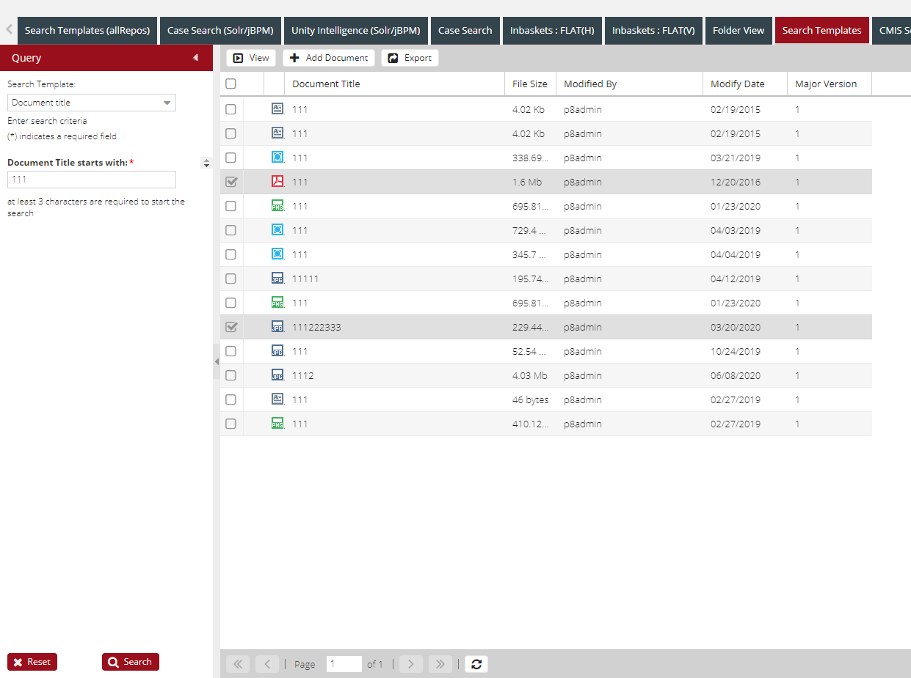
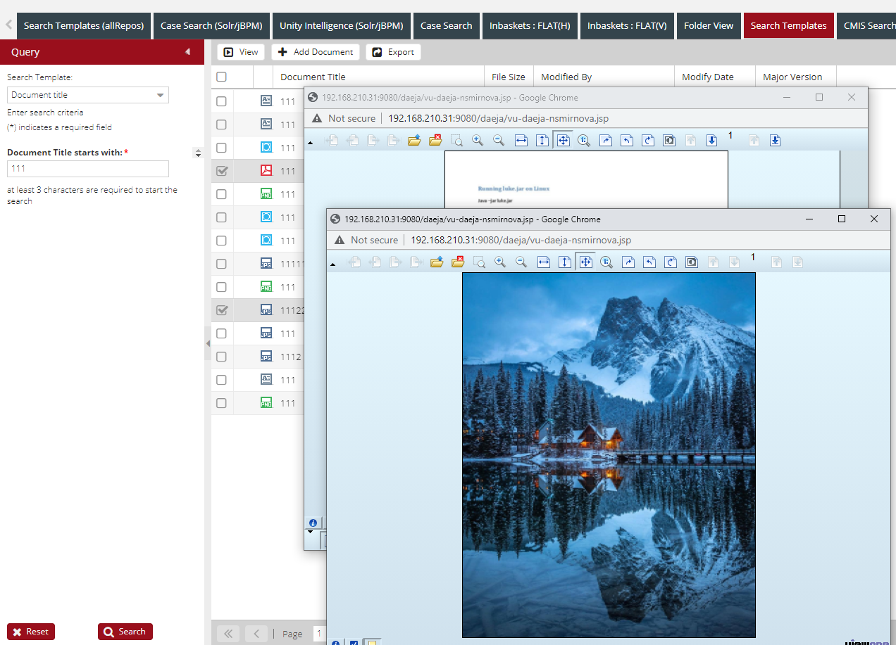

## System properties description

User selects one or more documents, clicks View and these documents are opened in viewer in separate windows. 




To enable separate multiple Daeja viewer windows mode add the following properties,
```xml
<SystemProperties>
    <Property ID="documentviewer.separatewindows.enabled" value="true"/>
    <Property ID="documentviewer.separatewindows.maxopen" value="2"/>
</SystemProperties>
```
where "documentviewer.separatewindows.maxopen" is the maximum number of open viewer windows at a time.  
There is no maximum limit for this field (it can be 10 or 50).  
The meaning of this field is that when the user selects several documents, it opens as many as specified in the property.  
For example, if  
```xml
<Property ID="documentviewer.separatewindows.maxopen" value="4"/>
```
but you select all documents, only 4 will open.