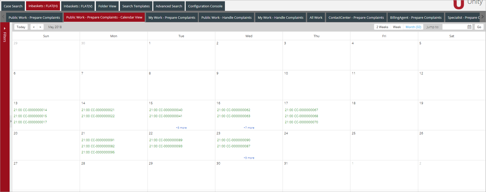

[Case Management Feature description](../features/case-management.md)

*content to be added*

# IBM Case Manager Configuration

The following classes should be created in a Target object store for IBM Case Manager
solution:


# Feature Configuration

## ICM Case Management concepts

### Case types

Case is a basic concept in ICM. ICM Case is an abstraction over the Case entity from any
supported Case Management platforms. ICM Case is a container that provide the case data,
related documents, business processing, and routing to the case workers. An ICM case is an
instance of a case type. 

ICM solution can contain one or more related case types. Each case
types define the tasks, the task steps (work items), and the roles that must complete those steps
to solve a business problem. The case type also includes properties that are displayed to case
workers in ICM case views.

### Tasks

ICM case contains tasks. A task represents a specific activity that is performed as part of a case. 

### Work Items

The task consists of one or more work items. 
Work items are the actions in a process that must be completed for a task.

## ICM Document Management Concepts

ICM module itself is not responsible for document management. All document related
operations like add a new document, search/filter documents, edit document properties and
versioning operations are re-used from Unity document management modules. ICM module
only manages the relationships between documents and ICM entities (Case/Task). Please note
that in Unity only Case document operations are supported.
The mechanism of linking documents and cases depends on the specific Case Management
platform (ICM, jBPM or other) and on the type of target document repository (CE,
CMIS/Alfresco, Box) and is implemented as separate document link strategies. Each document
link strategy implements link/unlink document operations and mechanism of searching
documents related to ICM Case.
Out of the box, the following link strategies are supported:
- 'ucm' prefix strategies are used for non ICM Case Management platforms (i.e. jBPM)
- ucmP8 - operations with documents stored in FileNet Content Engine repository
- ucmCMIS - operations with documents stored in any repository that supports CMIS
standard (i.e. Alfresco)
- ucmBox - operations with documents stored in Box repository

## ICM configuration

### Cases search

At the `SearchTemplate` section `SearchScope` parameter will be used in `FROM` operator
for FN SQL query.

For example:
```xml
<Property ID="SearchScope">CmAcmCaseTask</Property>
“select * from CmAcmCaseTask where {form_filters}”
```
### WorkObjects search

In order to configure SearchTemplate with WorkObjects use the following: 
- through the `Queue`: 
    ```xml
    <OperationProperties> 
        <Property ID="SolutionId">CustomerComplaints</Property> 
        <Property ID="UCM.PE.Queue">CC_Investigator</Property> 
        <Property ID="UCM.PE.StepName">Investigator</Property> 
    </OperationProperties> 
    ```

- through the `Database`: 
    ```xml
    <OperationProperties> 
        <Property ID="SolutionId">CustomerComplaints</Property> 
        <Property ID="UCM.DB.From">PEVQ1_CC_INVESTIGATOR</Property> 
        <Property ID="UCM.DB.OrderBy">F_WorkSpaceId</Property> 
        <Property ID="UCM.DB.Where"></Property>
    </OperationProperties> 
    ```
  
- through the `DB (My Work)`: 
    ```xml
    <OperationProperties> 
        <Property ID="SolutionId">CustomerComplaints</Property> 
        <Property ID="UCM.DB.From">PEVQ1_INBOX</Property> 
        <Property ID="UCM.DB.OrderBy">F_WorkSpaceId</Property> 
        <Property ID="UCM.DB.Where">F_BOUNDUSER = $USER_ID</Property> 
    </OperationProperties> 
    ```

- through the `roster (all workitems)`: 
    ```xml
    <OperationProperties> 
        <Property ID="SolutionId">CustomerComplaints</Property>
        <Property ID="UCM.PE.Queue">*</Property>
    </OperationProperties>
    ```
A workflow roster stores the current location of and other information about all workflows. Workflow rosters provide the PE with an efficient way to locate specific workflows and work items.
FileNet API does not provide the ability to request roster data in an ordered form. Unity columns should be marked as non-sortable when roster search is set up.

ICM configuration is distributed among main Unity configuration file (that is defined through
vSpaceConfigURL entry of Unity web application) and multiple solution related files referenced
from the `Solutions` top level tag at Unity configuration file. 

For example:

```xml
<Solutions configFolder="/opt/vu/nkravchenko/ucm-icm">
    <Solution file="customer-complaints-icm.xml" name="CustomerComplaints">
    ……….
    </Solution>
</Solutions>
```
Most ICM grids are configured as the standard Unity search templates (i.e. column set -> grid ->
search template -> search template set). Here is the list of ICM features that use standard Unity
search templates mechanism:
- Cases search
- Work items search
- Case details: attached documents, tasks, history and annotations

Please note that all actions available at the above grids (either from grid toolbar or via grid item's popup menu) are usual Unity actions defined at main Unity configuration file.

For example:

- Create Case (same tab or separate tab)
- Open Case (same tab or separate tab)
- Open Work Item (same tab or dynamic tab)
- Add comment
- Delete comment

The separate solution related files are used to hold configuration of the following ICM items:
- Case details: set of top toolbar tools, set of tabs, field set for case details tab
- Work item details: set of top toolbar tools, set of tabs, field set for work item details tab, set of workflow actions.
 
## ICM Workbaskets

ICM workbaskets represent the list of cases or work items which are logically grouped by
certain criteria. From the business perspective work baskets can be personal or public.

Personal work basket contains work items for tasks that are assigned to a specific user. 

Public work basket contains work items that are assigned to a role, but not to a specific
person. Work items in a public work basket can be accepted by any user to work on.

From the configuration perspective, ICM workbasket is a standard Unity search template. Based
on this, workbasket can be configured as a separate Unity tab (Cases workbasket on the screen
below)

There is also the possibility to group set of workbaskets into a separate Unity tab. This can be
done through the new Unity tab component which is referenced by `advanced-searchtemplates-tab` XType.
This component is very similar to the standard Unity search templates tab and provide
additional configuration options for grouping search templates:

- `templateSelectionType` – type of search templates grouping/selection. Allowed values:
    - selector - search templates will be displayed as combobox component
    - flat – search templates will be displayed in a tab panel view
- `templateSelectionOrientation` – applicable only for `flat` type. Allowed values:
    - horizontal
    - vertical

Sample workbasket configuration:

```xml
<SearchTemplate ID="Case_Search-CustomerComplaints">
            <DataProviderId>ucm_provider</DataProviderId>
            <Description>CustomerComplaints : Case Search</Description>
            <Comment>Enter search criteria</Comment>
            <Autoexecute>true</Autoexecute>
            <Security>
                <AllowRole>ContactCenter</AllowRole>
                <AllowRole>BillingAgent</AllowRole>
                <AllowRole>Specialist</AllowRole>
                <AllowRole>Investigator</AllowRole>
            </Security>
            <Operation dataProviderId="ucm_provider" type="search">
                <OperationProperties>
                    <Property ID="SolutionId">CustomerComplaints</Property>
                    <Property ID="SearchScope">CASE</Property>
                </OperationProperties>
            </Operation>
            <SortFields />
            <Groups>
                <Group ID="criteriagroup" Title="Sample Case Search" />
            </Groups>
            <Grid ID="Case_Search" />
            <Criteria>
                <Criterion>
                    <FieldName>ucmCaseId</FieldName>
                    <Type>string</Type>
                    <Operator>starts</Operator>
                    <Required>false</Required>
                    <Hidden>false</Hidden>
                    <Readonly>false</Readonly>
                    <MultiValue>false</MultiValue>
                </Criterion>
                <Criterion>
                    <FieldName>ucmStatus</FieldName>
                    <Type>string</Type>
                    <Operator>eq</Operator>
                    <Required>false</Required>
                    <Hidden>false</Hidden>
                    <Readonly>false</Readonly>
                    <MultiValue>false</MultiValue>
                    <SelectorId>ucmCaseStatus</SelectorId>
                </Criterion>
            </Criteria>
        </SearchTemplate>
```
Out of the box, `SearchScope` operation parameter has the following allowed values:

- CASE – search for cases
- TASK – search for tasks
- WORK_ITEM – search for work items

Work Item search scope can be specified by additional filtering scopes. The following formats
are supported:

- `WORK_ITEM:ANY_USER_ROLE` – filter work items by any role of the current user (used in
public workbasket definitions to display all work items where the current user is potential
owner)
- `WORK_ITEM:USER_ROLE:<roles separated by : or , character>` – filter work items by
specified role(s) of the current user (used in public workbasket definitions to display all
work items where the current user is potential owner). 

    For example:

    `WORK_ITEM:USER_ROLE:IT,Admin` – displays only work items where `IT` or `Admin`
    groups is the potential owners. Please note that the logged in user should have
    membership at these groups in terms of Unity configuration (`AccessRoles` top level
    configuration section). Additionally, these roles should be "tab roles" - the roles that
    used at Unity tab definitions.

- `WORK_ITEM:USER` – filter work items assigned to the current user (used in personal
workbasket definitions)
- `ANNOTATION` – search for annotations (history items/comments)
- `WORK_ITEM:SUB_WORK_ITEMS` - designed for jBPM to show splitted workitems and subworkitems 
of the selected case such as TaskResponse and RequestProcessing on Case Details View. 
Spitted workitems are displayed on a separate from the parent workitems tab. 

## Case views

Each ICM view definition includes the list of tabs and the set of top toolbar tools to be displayed
at this view. The definition of each view's tab includes the set of standard parameters like ID,
Label, Tooltip and field set id as well as an arbitrary set of custom parameters. The toolbar tools
are also part of tab definition.

Sample view configuration:

```xml
<Views>
        <Cases>
            <Create>
                …….
            </Create>
            <Active>
                <Tabs CaseType="CustomerComplaints.Complaint" EnableSaveButton="true" EnableCloseButton="true">
                    <Tab ID="1" Type="Details" Label="CustomerComplaints Properties" Tooltip="CustomerComplaints Properties" FieldSet="CustomerComplaints">
                        <Tools>
                            <Tool ID="DeleteCase"/>
                            <Tool ID="UCM_AddDocument"/>
                            <Tool ID="UCM_AttachDocument"/>
                        </Tools> 
                    </Tab>
                    <Tab ID="2" Type="Attachments" Label="FileNet Documents" Tooltip="FileNet Documents">
                        <CustomParameters>
                            <Parameter Name="viewMode" Value="searchTemplate"/>
                            <Parameter Name="templateSet" Value="search-templates-case-docs-p8"/>
                            <Parameter Name="gridId" Value="UCM_Case_Docs_Search_FileNet"/>
                        </CustomParameters>
                        <Tools/>
                    </Tab>
                    <Tab ID="3" Type="Attachments" Label="CMIS Documents" Tooltip="CMIS Documents">
                        <CustomParameters>
                            <Parameter Name="viewMode" Value="searchTemplate"/>
                            <Parameter Name="templateSet" Value="search-templates-case-docs-cmis"/>
                            <Parameter Name="gridId" Value="UCM_Case_Docs_Search_CMIS"/>
                        </CustomParameters>
                        <Tools/>
                    </Tab>
                    <Tab ID="4" Type="Attachments" Label="Box Documents" Tooltip="Box Documents">
                        <CustomParameters>
                            <Parameter Name="viewMode" Value="searchTemplate"/>
                            <Parameter Name="templateSet" Value="search-templates-case-docs-box"/>
                            <Parameter Name="gridId" Value="UCM_Case_Docs_Search_Box"/>
                        </CustomParameters>
                        <Tools/>
                    </Tab>
                    <Tab ID="5" Type="Attachments" Label="UIE Documents" Tooltip="UIE Documents">
                        <CustomParameters>
                            <Parameter Name="viewMode" Value="searchTemplate"/>
                            <Parameter Name="templateSet" Value="search-templates-case-docs-ves"/>
                            <Parameter Name="gridId" Value="UCM_Case_Docs_Search_VES"/>
                        </CustomParameters>
                        <Tools/>
                    </Tab>
                    <Tab ID="6" Type="Tasks" Label="Tasks" Tooltip="Case tasks">
                        <Tools/>
                    </Tab>
                    <Tab ID="7" Type="History" Label="History/Comments" Tooltip="History and Comments">
                        <CustomParameters>
                            <Parameter Name="viewMode" Value="searchTemplate"/>
                            <Parameter Name="templateSet" Value="case-history-search"/>
                            <Parameter Name="gridId" Value="UCM_CaseHistory_Search"/>
                        </CustomParameters>
                        <Tools/>
                    </Tab>
                </Tabs>
            </Active>
            <Closed/>
      </Cases>
```
The following view types are supported at ICM:

- Case view (existing case views, new case views). It's possible to define case view
separately for each case type.
- Work Item / Task view. Each work item type can have different view definition. The rulebased approach is used to establish the link between the existing work item and the view
definition that should be used to display/edit the data of this work item.

## Work Item views

The Work Items view definitions are located at the following section of ICM solution
configuration file: `SolutionConfig/Views/WorkItems` and include two major parts: tab sets
definitions (`TabSets` section) and rules definitions (`Rules` section).

Sample configuration:

```xml
<WorkItems>
            <TabSets>
                <Tabs ID="VerifySupportingDoc" EnableSaveButton="true" EnableCloseButton="true">
                    <Tab ID="1" Type="Details" Label="Verify Supporting Doc" Tooltip="VerifySupportingDoc Properties" FieldSet="VerifySupportingDoc">
                        <Tools>
                            <Tool ID="Reassign"/>
                        </Tools> 
                    </Tab>
                    <Tab ID="2" Type="Attachments" Label="FileNet Documents" Tooltip="FileNet Documents">
                        <CustomParameters>
                            <Parameter Name="viewMode" Value="searchTemplate"/>
                            <Parameter Name="templateSet" Value="search-templates-case-docs-p8-ro"/>
                            <Parameter Name="gridId" Value="UCM_Case_Docs_Search_FileNet_RO"/>
                        </CustomParameters>
                        <Tools/>
                    </Tab>
                    <Tab ID="3" Type="Attachments" Label="CMIS Documents" Tooltip="CMIS Documents">
                        <CustomParameters>
                            <Parameter Name="viewMode" Value="searchTemplate"/>
                            <Parameter Name="templateSet" Value="search-templates-case-docs-cmis-ro"/>
                            <Parameter Name="gridId" Value="UCM_Case_Docs_Search_CMIS_RO"/>
                        </CustomParameters>
                        <Tools/>
                    </Tab>
                    <Tab ID="4" Type="Attachments" Label="Box Documents" Tooltip="Box Documents">
                        <CustomParameters>
                            <Parameter Name="viewMode" Value="searchTemplate"/>
                            <Parameter Name="templateSet" Value="search-templates-case-docs-box-ro"/>
                            <Parameter Name="gridId" Value="UCM_Case_Docs_Search_Box_RO"/>
                        </CustomParameters>
                        <Tools/>
                    </Tab>
                    <Tab ID="5" Type="Attachments" Label="UIE Documents" Tooltip="UIE Documents">
                        <CustomParameters>
                            <Parameter Name="viewMode" Value="searchTemplate"/>
                            <Parameter Name="templateSet" Value="search-templates-case-docs-ves"/>
                            <Parameter Name="gridId" Value="UCM_Case_Docs_Search_VES"/>
                        </CustomParameters>
                        <Tools/>
                    </Tab>
                </Tabs>
……….
            <TabSets>
            <Rules>
              <Rule TabSet="VerifySupportingDoc" TaskType="CustomerComplaints.Complaint" Type="spring">
                 <Parameters>
                   <Parameter Name="skipOnMissingProperty" Value="false"/> 
                   <Parameter Name="entityDataPrefix" Value=" wi_"/>
                 </Parameters>
                 <Definition>#wi_name=='Verify Supporting Doc'</Definition>
              </Rule>
………….
            </Rules>
</WorkItems>
```
The rules definitions include Rule elements:

|Tag   |Description   |
|:-----|:-------------|
|TabSet	              |Tab set reference (refers `SolutionConfig/Views/WorkItems/TabSets/Tabs/@ID`) Used to get specific tab set if the rule evaluation results in `TRUE`.|
|TaskType	          |The work item type. The rule is only evaluated if the source work item has the same type as Rule's `TaskType` value. The rule is skipped otherwise.|
|Type	              |The rule syntax type. The only supported value for Unity 7.2 is `spring`. `spring` type means that rule definition should be in [Spring Expression format](https://docs.spring.io/spring/docs/4.1.6.RELEASE/spring-framework-reference/html/expressions.html).|
|skipOnMissingProperty|	
|entityDataPrefix     |The `@Value` attribute defines the prefix that should be added to the name of each property of the source work item. So if the work item has `name` and `status` properties and the prefix value is `wi_` then the rule definition code should use `wi_name` and `wi_status` references. The default value is `entity_`.|

## ICM View Tabs

There are two main types of ICM view tabs:

- View tabs that represents the standard Unity search template component (for example: Documents and History/Comments tabs). The configuration of such tabs is distributed among
main Unity configuration file and ICM solution configuration file.

- View tabs which UI is fully based on ICM field set definition (for example: case details and work
item details tabs). The configuration of such tabs is located solely at ICM solution configuration
file.

Another possible option of ICM view tab can be `xtype` defined tab. Tab panel `xtype` can be set
using `Tabs/Tab/@XType` attribute.

### Field set definition

Location: `SolutionConfig/FieldSets/FieldSet`

|Tag   |Description   |
|:-----|:-------------|
|FieldSet/`ID`         | Unique field set id, used to link field set with other entities (for example view tabs).|
|FieldSet/Field/`ID`   | Field id should match symbolic name of the property in Content Engine (for CE fields) or workflow property (for PE only fields)|
|FieldSet/Field/`Label`| Field label will be displayed to the user as a column header for grid view or property name for form view|
|FieldSet/Field/`Required`| Application will validate that property values is not null and will not allow to save the changes if `Required="true"` for the field. This property is applicable only for form view and will be ignored for grid view.|
|FieldSet/Field/`Favorite`| Favorite (`Favorite="true"`) field will be displayed as case header for case details. Only one field can be set as Favorite. This property will be ignored for all field sets, except the one used for case fields configuration.|
|FieldSet/Field/`Format`| Format field allows to configure date format (Please see Date format definition for more details) format for example, `d/m/Y`, `m/d/Y`, or `m/d/Y g:i A`)|
|FieldSet/Field/`Hidden`| Hidden (`Hidden = "true"`) fields are not displayed on the screen, but can be used by client code.|
|FieldSet/Field/`ReadOnly`| Read only (`ReadOnly="true"`) fields will be displayed on the screen, but users will not be able to edit them. This property is applicable only for form view and will be ignored for grid view.|
|FieldSet/Field/`Row`| Row property determines the row on a form, where the field will be displayed. Several fields may have the same row, but different columns. Row/column combination should be unique. Fields will be displayed in the same order as in a field set if row property is not populated. This property is applicable only for form view and will be ignored for grid view.|
|FieldSet/Field/`Rows`| Number of rows for multi-row fields (`MultiRow="true"`). This property is applicable only for multi-row fields on a form view and will be ignored for all other fields.|
|FieldSet/Field/`Column`| Column property determines the column on a form, where the field will be displayed. Row property should be configured for fields with column property. Row/column combination should be unique. This property is applicable only for form view and will be ignored for grid view.|
|FieldSet/Field/`MultiRow`| Field box will have multiple rows if `MultiRow="true"`. Number of rows is configured in Rows field.|
|FieldSet/Field/`Custom`| Configure `Custom="true"` for custom fields. XType property is required for custom field configuration.|
|FieldSet/Field/`XType`| XType registered for the custom field.|
|FieldSet/Field/`Length`| Maximum length field in characters. Application will show an error message if field length exceeds the configured length.|
|FieldSet/Field/`SelectorID`| Selector ID for Vega Unity selectors.|
|FieldSet/Expando| Expandos are used to group properties (fields). User can collapse the expando to hide all properties configured for it and save some space on the screen. Only one level of expandos is supported. One expando cannot be placed in another expando. Expandos are applicable for form view only.|
|FieldSet/Expando/`Expanded`| Configure `Expanded="false"` if you want expando to be collapsed by default and `Expanded="true"` if you want it to be expanded by default
|FieldSet/Expando/`Name`| Expando Name will be displayed in expando header|

```xml
<FieldSets>
    <FieldSet ID="ContactCenterCaseList">
        <Field ID="CC_ComplaintCategory" Label="Complaint Category"/>
        <Field ID="CC_CustomerNumber" Label="Customer Number"/>
        <Field ID="CC_CaseNumber" Label="Case Number" Favorite="true"/>
        <Field ID="CC_ComplaintReceivedDate" Label="Complaint Received Date" Format="m/d/Y" SaveTime="15:00:00"/>
        <Field ID="CC_ComplaintStatus" Label="Complaint Status"/>
        <Field ID="F_StepName" Label="Step Name"/>
    </FieldSet>
    <FieldSet ID="CaseList">
        <Field ID="CC_CaseNumber" Label="Case Number" Favorite="true"/>
        <Field ID="F_CreateTime" Label="Create Time" Format="d/m/Y H:i"/>
        <Field ID="F_StepName" Label="Step Name"/>
        <Field ID="F_Subject" Label="Subject"/>
    </FieldSet>
    <FieldSet ID="CaseReview">
        <Expando Expanded="true" Name="Case Variables">
            <Field ID="CC_CaseNumber" Label="Case Number" Favorite="true" Required="false" Row="1" Column="1"/>
            <Field ID="CC_CaseSource" Label="Case Sources" SelectorID="CC_CaseSource" Required="false" Row="1" Column="2"/>
        </Expando>
        <Expando Expanded="true" Name="Customer Variables">
            <Field ID="CC_CustomerNumber" Label="Customer Number" Tooltip="CustomerNumber" Required="false" Row="2" Column="1"/>
            <Field ID="CC_CustomerName" Label="Customer Name" Tooltip="CustomerName" Required="false" Row="2" Column="2"/>
            <Field ID="CC_CustomerRating" Label="Customer Raiting" Required="false" Row="2" Column="3" ReadOnly="true"/>
            <Field ID="CC_CustomerSince" Label="Customer Since" Tooltip="CustomerSince" Required="false" Row="3" Column="1"/>
            <Field ID="CC_CustomerAddress" Label="Customer Address" Required="false" Row="3" Column="2"/>
            <Field ID="CC_CustomerCity" Label="Customer City" Required="false" Row="3" Column="3"/>
            <Field ID="CC_CustomerEmail" Label="Customer Email" Required="false" Row="4" Column="1"/>
            <Field ID="CC_CustomerState" Label="Customer State" Required="false" Row="4" Column="2"/>
        </Expando>
        <Expando Expanded="true" Name="Complaint Variables">
            <Field ID="CC_ComplaintDescription" Label="Complaint Description"/>
            <Field ID="CC_ComplaintCategory" Label="Complaint Category" SelectorID="CC_ComplaintCategorySelector" Required="false" Row="5" Column="1"/>
            <Field ID="CC_ComplaintStatus" Label="Complaint Status" SelectorID="CC_ComplaintStatusSelector" Tooltip="ComplaintStatus" Required="false" Row="5" Column="2"/>
            <Field ID="CC_ComplaintReceivedDate" Label="Complaint Received Date" Format="m/d/Y" Tooltip="ComplaintReceivedDate" Required="false" Row="6" Column="1" SaveTime="14:00:00"/>
        </Expando>
            <Field ID="CC_UpgradeCategory" Label="Upgrade Category" SelectorID="CC_UpgradeCategorySelector"/>
            <Field ID="CC_Valid" Label="Valid" Tooltip="Valid" Required="false" Row="7" Column="1"/>
            <Field ID="CC_UpsaleOpportunity" Label="Upsale Opportunity" Required="false" Row="7" Column="2"/>
<!-- <Field ID="CC_TotalTransactionAmount" Label="Total Transaction Amount" Tooltip="${VCM7.TotalTransactionAmount}"/> -->
        <Expando Expanded="true" Name="Custom Properties">
            <Field ID="CC_BooleanPropMulti" Label="BooleanMultiValues" Required="false" Row="8" Column="1"/>
            <Field ID="CC_IntPropChoiceListMulti" Label="IntChoiceListMultiValues" SelectorID="CC_IntChoiceList" Required="false" Row="8" Column="2"/>
            <Field ID="CC_MultipleValueString" Label="MultipleValueString" Required="false" Row="8" Column="3"/>
            <Field ID="CC_StringPropChoiceListMulti" Label="StringPropChoiceListMulti" SelectorID="CC_StringPropChoiceListMulti" Required="false" Row="9" Column="1"/>
            <Field ID="CC_StringProptMulti" Label="StringProptMulti" Required="false" Row="9" Column="2"/>
        </Expando>
    </FieldSet>
    <FieldSet ID="TaskList">
        <Field ID="TaskState" Label="Task State"/>
        <Field ID="Id" Label="Task ID"/>
        <Field ID="DateStarted" Label="Date Started" Format="m/d/Y"/>
        <Field ID="ClassDescription" Label="Class Description"/>
        <Field ID="CmAcmTaskName" Label="Task Name"/>
        <Field ID="CmAcmDisabledState" Label="Disabled State"/>
        <Field ID="CmAcmIsToDo" Label="Is To Do"/>
        <Field ID="CmAcmRequiredState" Label="Required State"/>
        <Field ID="PostCondition" Label="Post Condition"/>
        <Field ID="PreCondition" Label="Pre Condition"/>
    </FieldSet>
    <FieldSet ID="TaskCreate">
        <Field ID="CmAcmTaskName" Label="Task Name"/>
    </FieldSet>
    <FieldSet ID="History">
        <Field ID="DateCreated" Label="" Format="m/d/Y g:i a"/>
        <Field ID="Creator" Label="Creator"/>
        <Field ID="CmAcmAction" Label="Action"/>
        <Field ID="CommentType" Label="Type"/>
        <Field ID="CmAcmCommentText" Label="Comment" Length="100"/>
    </FieldSet>
    <FieldSet ID="UserComment">
        <Field ID="Description" Label="Problem description"/>
        <Field ID="Priority" Label="Problem priority"/>
        <Field ID="Justification" Label="Justification"/>
    </FieldSet>
</FieldSets>
```

## Case Details Tab

ICM Case details Tab displays the case properties and allows to edit them.  
Case details tab configuration is a part of Case details view definition at
`SolutionConfig/Views/Cases/(Create|Active)|Closed/Tabs/Tab(@Type=’Details’)` section of the
ICM solution configuration file.

The case details tab definition has two main parts: the list of case tools at `Tabs/Tab(@Type=’Details’)/Tools/Tool` that will be added to the top toolbar of the case details
view and the reference to the field set at`Tabs/Tab(@Type=’Details’)/@FieldSet` that will be used to display case properties.

The available attributes:  

|Attribute    |Description   |
|:------------|:-------------|
|ID           |Unique tab id (unique inside the `Tabs` root element)|
|Label        |Tab label displayed at tab panel header|
|Tooltip      |Tab tooltip displayed when user hovers the mouse over the tab header|
|FieldSet     |Field set ID used to configure tab fields|

Sample configuration:

```xml
<Views>
        <Cases>
            ……….
            <Active>
                <Tabs CaseType="CustomerComplaints.Complaint" EnableSaveButton="true" EnableCloseButton="true">
                    <Tab ID="1" Type="Details" Label="CustomerComplaints Properties" Tooltip="CustomerComplaints Properties" FieldSet="CustomerComplaints">
                        <Tools>
                            <Tool ID="DeleteCase"/>
                            <Tool ID="UCM_AddDocument"/>
                            <Tool ID="UCM_AttachDocument"/>
                        </Tools> 
                    </Tab>
                        ………..
                </Tabs>
…….
		</Active>
	</Cases>
</Viewes>
```

## Work Item Details Tab

ICM Work item details Tab displays the work item properties and allows to edit them.
Work item details tab configuration is a part of Work item details view definition at
`SolutionConfig/Views/WorkItems/TabSets/Tabs/Tab(@Type=’Details’)` section of the ICM
solution configuration file.

The work item details tab definition has two main parts: the list of case tools
at `Tabs/Tab(@Type=’Details’)/Tools/Tool` that will be added to the top toolbar of the work item
details view and the reference to the field set at `Tabs/Tab(@Type=’Details’)/@FieldSet` that will be
used to display work item properties.

The available attributes:

|Attribute    |Description   |
|:------------|:-------------|
|ID           |Unique tab id (unique inside the `Tabs` root element)|
|Label        |Tab label displayed at tab panel header|
|Tooltip      |Tab tooltip displayed when user hovers the mouse over the tab header|
|FieldSet     |Field set ID used to configure tab fields|

Sample configuration:

```xml
<WorkItems>
            <TabSets>
                <Tabs ID="VerifySupportingDoc" EnableSaveButton="true" EnableCloseButton="true">
                    <Tab ID="1" Type="Details" Label="Verify Supporting Doc" Tooltip="VerifySupportingDoc Properties" FieldSet="VerifySupportingDoc">
                        <Tools>
                            <Tool ID="Reassign"/>
                        </Tools> 
                    </Tab>
…….

                </Tabs>
</WorkItems>
```
## Tasks Tab

ICM Tasks Tab represents the list of tasks related to the ICM Case.
Tasks Tab configuration is a part of Case details view definition at
`SolutionConfig/Views/Cases/Create|(Active|Closed)/Tabs/Tab(@Type=’Tasks’)` section of the ICM
solution configuration file.

Sample configuration:

```xml
<TemplateSet ID="UCM_Case_Tasks-templates-set">
            <Template>UCM_Case_Tasks</Template>
</TemplateSet>

<SearchTemplate ID="UCM_Case_Tasks">
            <DataProviderId>ucm_provider</DataProviderId>
            <Description>UCM Case Tasks search</Description>
            <Comment/>
            <Autoexecute>true</Autoexecute>
            <Operation dataProviderId="ucm_provider" type="search">
                <OperationProperties>
                    <Property ID="SearchScope">TASK</Property>
                    <Property ID="ContextQuery">
                        {operation:'eq',operand:[{field:'ucmCaseId'},{value:'{Level.CaseId}'}]}
                    </Property>
                </OperationProperties>
            </Operation>
            <SortFields/>
            <Grid ID="UCM_Case_Tasks"/>
            <Criteria/>
        </SearchTemplate>
```
Parameter `templateSet` should refer to the template set definition from the Unity configuration (if not provided, 'UCM_Case_Tasks' template set is used by default).

Search operation has the following operation properties:

|Property    |Description   |
|:------------|:-------------|
|SearchScope  | `TASK` value to search Task entities|
|ContextQuery | query expression to filter task result set by current case identifier|

## Documents Tab

ICM Documents Tab represents the list of documents associated with ICM Case.
Documents Tab configuration is a part of Case details view definition at
`SolutionConfig/Views/Cases/Create|(Active|Closed)/Tabs/Tab(@Type=’Attachments’)` section of
the ICM solution configuration file.

Sample configuration (1):

```xml
<Views>
        <Cases>
            <Create>
                ……..
            </Create>
            <Active>
                <Tabs CaseType="CustomerComplaints.Complaint" EnableSaveButton="true" EnableCloseButton="true">
                    ……..
                    <Tab ID="2" Type="Attachments" Label="FileNet Documents" Tooltip="FileNet Documents">
                        <CustomParameters>
                            <Parameter Name="viewMode" Value="searchTemplate"/>
                            <Parameter Name="templateSet" Value="search-templates-case-docs-p8"/>
                            <Parameter Name="gridId" Value="UCM_Case_Docs_Search_FileNet"/>
                        </CustomParameters>
                        <Tools/>
                    </Tab>
………
			</Tabs>
			</Active>
		</Cases>
	</Views>
```
Custom parameter `viewMode` defines the layout of Documents Tab. Out of the box, only
`searchTemplate` mode is supported. This mode involves displaying case documents as a
standard Unity search template. Parameter `templateSet` is required for `searchTemplate` mode
and should refer to the template set definition from the Unity configuration.

Sample configuration (2):

```xml
<TemplateSet ID="search-templates-case-docs-p8-templates-set">
            <Template>UCM_Case_Docs_Search_P8</Template>
</TemplateSet>

<SearchTemplate ID="UCM_Case_Docs_Search_P8">
            <DataProviderId>ucm_provider</DataProviderId>
            <Description>UCM P8 Document search</Description>
            <Comment>Enter search criteria</Comment>
            <Autoexecute>true</Autoexecute>
            <Security>
                <AllowRole>Unity Users</AllowRole>
            </Security>
            <Operation dataProviderId="ucm_provider" type="ucm_search_documents">
                <OperationProperties>
                    <Property ID="objectStore" type="FIRST">
                        <SecuredValue>
                            <Value>SODemo</Value>
                        </SecuredValue>
                    </Property>
                    <Property ID="query" value="SELECT {Macro.ResultProperties}, [Reservation] FROM Document WHERE IsCurrentVersion=TRUE AND ({UCM.IN_FOLDER}) AND {Macro.QueryCriterion} AND {Macro.FilterCriterion} "/>
                    <Property ID="DocumentLinkStrategy">ucmP8</Property>
                    <Property ID="DocumentLinkScope">CASE</Property>
                    <Property ID="TargetDataProviderId">ce_repository</Property>
                </OperationProperties>
            </Operation>
            <SortFields/>
            <Grid ID="UCM_Case_Docs_Search_FileNet"/>
            <Criteria>
                <Criterion>
                    <FieldName>DocumentTitle</FieldName>
                    <Type>string</Type>
                    <Operator>starts</Operator>
                    <Required>false</Required>
                    <Hidden>false</Hidden>
                    <Readonly>false</Readonly>
                    <MultiValue>false</MultiValue>
                </Criterion>
                <Criterion>
                    <FieldName>DateLastModified</FieldName>
                    <Type>datetime</Type>
                    <Operator>range</Operator>
                    <Required>false</Required>
                    <Hidden>false</Hidden>
                    <Readonly>false</Readonly>
                    <MultiValue>false</MultiValue>
                </Criterion>
            </Criteria>
        </SearchTemplate>
```

`ucm_search_documents` operation configuration depends on the document link strategy used.  
The following are examples of operation configurations for different strategies:

Sample configuration (3) - ucmP8 link strategy:

```xml
<Operation dataProviderId="ucm_provider" type="ucm_search_documents">
                <OperationProperties>
                    <Property ID="objectStore" type="FIRST">
                        <SecuredValue>
                            <Value>SODemo</Value>
                        </SecuredValue>
                    </Property>
                    <Property ID="query" value="SELECT {Macro.ResultProperties}, [Reservation] FROM Document WHERE IsCurrentVersion=TRUE AND ({UCM.IN_FOLDER}) AND {Macro.QueryCriterion} AND {Macro.FilterCriterion} "/>
                    <Property ID="DocumentLinkStrategy">ucmP8</Property>
                    <Property ID="DocumentLinkScope">CASE</Property>
                    <Property ID="TargetDataProviderId">ce_repository</Property>
                </OperationProperties>
        </Operation>
```
Search query should be provided and contain special UCM macro `{UCM.IN_FOLDER}`.

Sample configuration (4) - ucmCMIS link strategy:

```xml
<Operation dataProviderId="ucm_provider" type="ucm_search_documents">
                <OperationProperties>
                    <Property ID="query" value="SELECT {Macro.ResultProperties} FROM cmis:document WHERE ({UCM.IN_FOLDER}) AND {Macro.QueryCriterion} AND {Macro.FilterCriterion}"/>
                    <Property ID="DocumentLinkStrategy">ucmCMIS</Property>
                    <Property ID="DocumentLinkScope">CASE</Property>
                    <Property ID="TargetDataProviderId">cmis_alfresco_repository</Property>
                </OperationProperties>
            </Operation>
```
Sample configuration (5) - ucmBox link strategy:

```xml
<Operation dataProviderId="ucm_provider" type="ucm_search_documents">
                <OperationProperties>                    
                    <Property ID="DocumentLinkStrategy">ucmBox</Property>
                    <Property ID="DocumentLinkScope">CASE</Property>
                    <Property ID="TargetDataProviderId">box_provider</Property>
                </OperationProperties>
            </Operation>
```
Sample configuration (6) - ucmUie link strategy:

```xml
<Operation dataProviderId="ucm_provider" type="ucm_search_documents">
                <OperationQuery>
                    <Query>
                        <IndexGroups>
                            <IndexGroup>allRepos</IndexGroup>
                        </IndexGroups>
                        <Join fromField="Id" toField="DocumentId" className="Link">
                            <Where>
                                <Field id="ucmCaseId"/>
                            </Where>
                        </Join>
                        <Where>
                        </Where>
                    </Query>
                    <ResultPropertyNameMapper>
                        <Class name="*">
                            <Mapping name="DocumentId" repositoryName="document_id@s"/>
                            <Mapping name="DateLastModified" repositoryName="$modify_date@d"/>
                            <Mapping name="MimeType" repositoryName="$mime_type@s"/>
                            <Mapping name="DocumentTitle" repositoryName="$title@s"/>
                            <Mapping name="Id" repositoryName="$id@s"/>
                            <Mapping name="$repository_id" repositoryName="$repository_id@s"/>
                            <Mapping name="ucmCaseId" repositoryName="case_id@s"/>
                        </Class>
                    </ResultPropertyNameMapper>
                </OperationQuery>
                <OperationProperties>
                    <Property ID="DocumentLinkStrategy">ucmUie</Property>
                    <Property ID="DocumentLinkScope">CASE</Property>
                    <Property ID="TargetDataProviderId">uie_repository_allRepos</Property>
                </OperationProperties>
        </Operation>
```
## History/Comments Tab

ICM History/Comments Tab represents the list of history items and user comments associated
with ICM Case.

Out of the box, the following system history events are supported:

|History Action	|Comment template|
|:--------------|:---------------|
|Case created	|Case <Case_Id> successfully created|
|Case updated	|Case <Case_Id> successfully updated|
|Work Item completed	|Workflow action <Action_Name> executed successfully|
|Document added	|Document <Document_Title> successfully added|
|Document removed	|Document <Document_Title> successfully removed|

History/Comments Tab configuration is a part of Case details view definition at
`SolutionConfig/Views/Cases/Create|(Active|Closed)/Tabs/Tab(@Type=’History’)` section of the
ICM solution configuration file.

Sample configuration (1):
```xml
<Tab ID="7" Type="History" Label="History/Comments" Tooltip="History and Comments">
       <CustomParameters>
             <Parameter Name="viewMode" Value="searchTemplate"/>
             <Parameter Name="templateSet" Value="case-history-search"/>
             <Parameter Name="gridId" Value="UCM_CaseHistory_Search"/>
       </CustomParameters>
       <Tools/>
</Tab>
```
Custom parameter `viewMode` defines the layout of History/Comments Tab. Out of the box,
only `searchTemplate` mode is supported. This mode involves displaying case history/comments
as a standard Unity search template. Parameter `templateSet` is required for `searchTemplate`
mode and should refer to the template set definition from the Unity configuration.

Sample configuration (2):

```xml
<TemplateSet ID="case-history-search-templates-set">
            <Template>UCM_CaseHistory_Search</Template>
</TemplateSet>

<SearchTemplate ID="UCM_CaseHistory_Search">
    <DataProviderId>ucm_provider</DataProviderId>
    <Description>CustomerComplaints: Case History Search</Description>
    <Comment>Enter search criteria</Comment>
    <Autoexecute>true</Autoexecute>
    <Security>
        <AllowRole>Unity Users</AllowRole>
    </Security>
    <Operation dataProviderId="ucm_provider" type="search">
        <OperationProperties>
             <Property ID="SolutionId">CustomerComplaints</Property>
             <Property ID="SearchScope">ANNOTATION</Property>
             <Property ID="ContextQuery">
                        {operation:'eq',operand:[{field:'_ucmAnnotatedInstanceId'},{value:'{Level.CaseId}'}]}
              </Property>
        </OperationProperties>
        <DefineProperties>
              <Property ID="Id" value="{This.annotationId}"/>
        </DefineProperties>
    </Operation>
    <SortFields />
    <Groups>
        <Group ID="criteriagroup" Title="Sample Case comment Search" />
    </Groups>
    <Grid ID="UCM_CaseHistory_Search" />
    <Criteria>
        <Criterion>
                    <FieldName>ucmAnnotationComment</FieldName>
                    <Type>string</Type>
                    <Operator>starts</Operator>
                    <Required>false</Required>
                    <Hidden>false</Hidden>
                    <Readonly>false</Readonly>
                    <MultiValue>false</MultiValue>
                </Criterion>
            </Criteria>
        </SearchTemplate>
```
Search operation has the following operation properties:

|Property    |Description   |
|:------------|:-------------|
|SolutionId   | ICM solution identifier|
|SearchScope  | `ANNOTATION` value to search Task entities|
|ContextQuery | query expression to filter task result set by current case identifier|

## ICM Tools & Actions

The Unity 7.2 introduces the new supported action custom parameter named ActionHandlerId
(HandlerId) that can be used to define which actual Java Script action handler should be used to
handle the concrete action. This allows to create generic/parametric JS action handlers that can
handle multiple actions with different parameters for each concrete action. For example, the
generic `ucmCreateCaseAtSameTab` action handler is used to create actions with different solution
ids, case types and role assignments.

### Case Tools

Out of the box, the following tools are supported for the ICM case:

- [Delete Case](#delete-case)
- [Split Case](#split-case)
- [Copy Case](#copy-case)

#### Delete Case
Deletes selected case with all related entities (case tasks, work items, associated documents)

Sample configuration:

```xml
<Tool ID="DeleteCase" Label="Delete Case" Tooltip="Delete Case" Action="DeleteCase">
            <Roles>
                <Role>ContactCenter</Role>
                <Role>Specialist</Role>
                <Role>Investigator</Role>
                <Role>BillingAgent</Role>
            </Roles>
            <CustomParameters>
                <Parameter Name="linkStrategy" Value="ucmP8,ucmCMIS,ucmBox,ucmUie"/>
            </CustomParameters>
        </Tool>
```

|Parameter    |Description   |
|:------------|:-------------|
|linkStrategy | Required. Comma-separated string of document link strategies that will be used for unlinking documents|

#### Split Case
Creates a new case based on information from the original case

Sample configuration:

```xml
<Tool ID="SplitCase" Type="CC_Complaint" SplitTarget="CC_Complaint" Label="Split Case" Tooltip="Split Case" Action="SplitCase">
  <Roles>
    <Role>ContactCenter</Role>
    <Role>Specialist</Role>
    <Role>BillingAgent</Role>
    <Role>Investigator</Role>
    <Role>Manager</Role>
    <Role>SalesAgent</Role>
  </Roles>
  <CopyFields>
     <CopyField OriginalFieldID="CC_CaseNumber" TargetFieldID="CC_CaseNumber" Expression=""/>
    <CopyField OriginalFieldID="CC_CustomerNumber" TargetFieldID="CC_CustomerNumber" Expression=""/>
    <CopyField OriginalFieldID="CC_ComplaintReceivedDate" TargetFieldID="CC_ComplaintReceivedDate" Expression=""/>
    <CopyField OriginalFieldID="CC_ComplaintCategory" TargetFieldID="CC_ComplaintCategory" Expression=""/>
  </CopyFields>
</Tool>
```

#### Copy Case
When some Case is being copied no documents are copied to the target
Case.

Sample comfiguration:

```xml
<Tool ID="CopyCase" Type="CC_Complaint" SplitTarget="CC_Complaint" Label="Copy Case" Tooltip="Copy Case" Action="CopyCase">
  <Roles>
    <Role>ContactCenter</Role>
    <Role>Specialist</Role>
    <Role>BillingAgent</Role>
    <Role>Investigator</Role>
    <Role>Manager</Role>
    <Role>SalesAgent</Role>
  </Roles>
  <CopyFields>
    <CopyField OriginalFieldID="CC_CaseNumber" TargetFieldID="CC_CaseNumber" Expression="$CC_CaseNumber"/>
    <CopyField OriginalFieldID="CC_CustomerNumber" TargetFieldID="CC_CustomerNumber" Expression=""/>
    <CopyField OriginalFieldID="CC_ComplaintReceivedDate" TargetFieldID="CC_ComplaintReceivedDate" Expression=""/>
    <CopyField OriginalFieldID="CC_ComplaintCategory" TargetFieldID="CC_ComplaintCategory" Expression=""/>
  </CopyFields>
</Tool>
```

### Case Actions
These actions are used at the ICM case search template tab (scope: `CASE`)

#### ucmOpenCaseAtSameTab
Opens selected case at the same tab where the source case search template is located. Does not require any specific configuration besides the actual declaration of the action at the main Unity configuration file.  
[Limit on the number of simultaneously opened cases](grids/limit-opened-cases.md) can be set.

#### ucmOpenCaseAtSeparateTab
Opens selected case at newly created Unity tab. Does not require any specific configuration besides the actual declaration of the action at the main Unity configuration file.|

#### ucmCreateCaseAtSameTab
Toolbar action that displays the new case details panel at the same tab where the source case search template is located. 

Required custom parameters:

|Parameter    |Description   |
|:------------|:-------------|
|ActionHandlerId| Always set to `ucmCreateCaseAtSameTab`|
|Solution|ICM solution name|
|CaseType|Case type (jBPM only)|
|RoleAssignment|Defines the role assignment data for the created case. The JSON object with users and groups role assignments arrays (see the sample below).|

This is the generic/parametric action that is referenced via ActionHandlerId custom parameter
from the concrete action. See the sample `ucmCreateCaseAtSameTab_CustomerComplaints` action below.

#### ucmCreateCaseAtSeparateTab
Toolbar action that displays the new case details panel at newly created Unity tab. 
Required custom parameters:

|Parameter    |Description   |
|:------------|:-------------|
|ActionHandlerId| Always set to `ucmCreateCaseAtSameTab`|
|Solution|ICM solution name|
|CaseType|Case type (jBPM only)|
|RoleAssignment|Defines the role assignment data for the created case. The JSON object with users and groups role assignments arrays (see the sample below).|

This is the generic/parametric action that is referenced via ActionHandlerId custom parameter
from the concrete action. See the sample `ucmCreateCaseAtSeparateTab_CustomerComplaints`
action below.

Sample role assignments configuration sample:

```xml
<RoleAssignment>{
                  "users": [
                    { "role": "manager", "name": "p8admin" }
                  ],
                  "groups": [
                    { "role": "Contact Center", "name": "ContactCenter" },
                    { "role": "Billing Agent", "name": "BillingAgent" },
                    { "role": "Specialist", "name": "Specialist" },
                    { "role": "Investigator", "name": "Investigator" }
                  ]
                }</RoleAssignment>
```
Sample configuration:
```xml
<Grid ID="Case_Search" enableColumnReorder="false" groupSearchResults="false">
            <Toolbar>
                <Actions>
                    <Action ID="ucmCreateCaseAtSameTab_CustomerComplaints"/>
                    <Action ID="ucmCreateCaseAtSameTab_TestProcess"/>
                    <Action ID="ucmUnlockCase"/>
                </Actions>
            </Toolbar>
            <Listeners>
                <Listener ID="RowContextMenu">
                    <Action>ucmCaseRowContextMenu</Action>
                </Listener>
                <Listener ID="DoubleClickColumn">
                    <Action>ucmCaseGridColumnDblClick</Action>
                </Listener>
            </Listeners>
            <XType>vspace-docs</XType>
            <Columns checkBoxModel="true" formatSet="default">
                <ColumnSet ID="Case_Search_Default" type="default"/>
                <ColumnSet ID="Case_Search_All" type="all"/>
            </Columns>
        </Grid>

<Action ID="ucmCaseGridColumnDblClick" multiselect="false" scope="any" type="column-click">
            <Name/>
            <IconCls/>
            <Tooltip/>
            <Uri/>
            <Parameters/>
            <CustomParameters>
                <Actions>
                    <Action>ucmOpenCaseAtSameTab</Action>
                </Actions>
            </CustomParameters>
            <Security>
                <AllowRole>Unity Users</AllowRole>
            </Security>
        </Action>
        <Action ID="ucmCaseRowContextMenu" multiselect="false"
            scope="any" type="context-menu">
            <Name/>
            <IconCls/>
            <Tooltip/>
            <Uri/>
            <Parameters/>
            <CustomParameters>
                <ActionHandlerId>rowcontextmenu</ActionHandlerId>
                <Actions>
                    <Action>ucmOpenCaseAtSameTab</Action>
                    <Action>ucmOpenCaseAtSeparateTab</Action>
                    <Action>ucmCloseCase</Action>
                </Actions>
            </CustomParameters>
            <Security>
                <AllowRole>Unity Users</AllowRole>
            </Security>
        </Action>
        <Action ID="ucmOpenCaseAtSameTab" multiselect="false" scope="any" type="toolbar">
            <Name>Detailed View (same tab)</Name>
            <IconCls>business-object-action-view-new-tab</IconCls>
            <Tooltip>Open Case at same tab</Tooltip>
            <Uri>uri</Uri>
            <Parameters/>
            <CustomParameters>
            </CustomParameters>
            <Security>
                <AllowRole>Unity Users</AllowRole>
            </Security>
        </Action>
        <Action ID="ucmOpenCaseAtSeparateTab" multiselect="false" scope="any" type="toolbar">
            <Name>Detailed View (separate tab)</Name>
            <IconCls>business-object-action-view-new-tab</IconCls>
            <Tooltip>Open Case at separate tab</Tooltip>
            <Uri>uri</Uri>
            <Parameters/>
            <CustomParameters>
            </CustomParameters>
            <Security>
                <AllowRole>Unity Users</AllowRole>
            </Security>
        </Action>
        <Action ID="ucmCreateCaseAtSameTab_CustomerComplaints" multiselect="false" scope="single" type="toolbar">
            <Name>Create Case (CustomerComplaints, same tab)</Name>
            <IconCls>action-download</IconCls>
            <Tooltip>Create Case (CustomerComplaints, same tab) TT</Tooltip>
            <Uri>uri</Uri>
            <CustomParameters>
                <ActionHandlerId>ucmCreateCaseAtSameTab</ActionHandlerId>
                <Solution>CustomerComplaints</Solution>
                <CaseType>CustomerComplaints.Complaint</CaseType>
                
                <RoleAssignment>{
                  "users": [
                    { "role": "manager", "name": "p8admin" }
                  ],
                  "groups": [
                    { "role": "Contact Center", "name": "ContactCenter" },
                    { "role": "Billing Agent", "name": "BillingAgent" },
                    { "role": "Specialist", "name": "Specialist" },
                    { "role": "Investigator", "name": "Investigator" }
                  ]
                }</RoleAssignment>
            </CustomParameters>
        </Action>
```

### Work Item Tools

#### Reassign

Allows to reassign selected work item to another user.

Sample configuration for `Assign To` field as a `Lookup`:
- Add to solution configuration file:

    ```xml
    <Lookup ID="SelectorLookup" Type="Selector">
        <Header>
            <Column>assignUser</Column>
        </Header>
        <Parameters>
            <Parameter Name="SelectorID" Value="reassignUsers"/>
        </Parameters>
    </Lookup>
    ```
  
- Add to solution configuration file:

    ```xml
    <Tool ID="Reassign" Label="Reassign" Tooltip="Reassign Work Item" Action="Reassign">
    ...
        <CustomParameters>
            <Parameter Name="lookup" Value="SelectorLookup?query={assignUser}"/>
        </CustomParameters>
    </Tool>
    
    ```
  
- Add to main configuration file:

    ```xml
    <Selector ID="reassignUsers">
        <ClassName>com.vegaecm.vspace.selectors.XMLSelector</ClassName>
        <Description/>
        <Option name="p8admin" value="p8admin"/>
        <Option name="test_user" value="test_user"/>
        <Option name="test-user2" value="test-user2"/>
        <Option name="test-user3" value="test-user3"/>
        <Option name="test-user4" value="test-user4"/>
    </Selector>
    ```
  
Sample configuration for `Assign To` field as a `Selector`:

- Add to solution configuration file:

    ```xml
    <Tool ID="Reassign" Label="Reassign" Tooltip="Reassign Work Item" Action="Reassign">
    ...
        <CustomParameters>
            <Parameter Name="selectorid" Value="reassignUsers"/>
        </CustomParameters>
    </Tool>
    ```
  
- Add to main configuration file:

    ```xml
    <Selector ID="reassignUsers">
        <ClassName>com.vegaecm.vspace.selectors.XMLSelector</ClassName>
        <Description/>
        <Option name="p8admin" value="p8admin"/>
        <Option name="test_user" value="test_user"/>
        <Option name="test-user2" value="test-user2"/>
        <Option name="test-user3" value="test-user3"/>
        <Option name="test-user4" value="test-user4"/>
    </Selector>
    ```

### Work Item Actions
These actions are used at the UCM work item search template tab (scope: `WORK_ITEM` or `WORK_ITEM:*`)

#### ucmOpenWorkItemAtSameTab
This action is used to open selected work
item at the same tab where work items search
template is located. Does not require any
specific configuration besides the actual
declaration of the action at the main Unity
configuration file.

#### ucmOpenWorkItemAtSeparateTab 
Opens selected work item at newly created
Unity tab. Does not require any specific
configuration besides the actual declaration
of the action at the main Unity configuration
file.

Sample configuration:

```xml
<Action ID="ucmWorkItemGridColumnDblClick" multiselect="false" scope="any" type="column-click">
            <Name/>
            <IconCls/>
            <Tooltip/>
            <Uri/>
            <Parameters/>
            <CustomParameters>
                <ActionHandlerId>ucmCaseGridColumnDblClick</ActionHandlerId>
                <Actions>
                    <Action>ucmOpenWorkItemAtSameTab</Action>
                </Actions>
            </CustomParameters>
            <Security>
                <AllowRole>Unity Users</AllowRole>
            </Security>
        </Action>
        <Action ID="ucmWorkItemRowContextMenu" multiselect="false" scope="any" type="context-menu">
            <Name/>
            <IconCls/>
            <Tooltip/>
            <Uri/>
            <Parameters/>
            <CustomParameters>
                <ActionHandlerId>rowcontextmenu</ActionHandlerId>
                <Actions>
                    <Action>ucmOpenWorkItemAtSameTab</Action>
                    <Action>ucmOpenWorkItemAtSeparateTab</Action>
                </Actions>
            </CustomParameters>
            <Security>
                <AllowRole>Unity Users</AllowRole>
            </Security>
        </Action>
        <Action ID="ucmOpenWorkItemAtSameTab" multiselect="false" scope="any" type="toolbar">
            <Name>Open Work Item (same tab)</Name>
            <IconCls>business-object-action-view-new-tab</IconCls>
            <Tooltip>Open Case at same tab</Tooltip>
            <Uri>uri</Uri>
            <Parameters/>
            <CustomParameters>
            </CustomParameters>
            <Security>
                <AllowRole>Unity Users</AllowRole>
            </Security>
        </Action>

<Grid ID="UCM_WI_Search" enableColumnReorder="false" groupSearchResults="false">
            <Toolbar>
                <Actions/>
            </Toolbar>
            <Listeners>
                <Listener ID="RowContextMenu">
                    <Action>ucmWorkItemRowContextMenu</Action>
                </Listener>
                <Listener ID="DoubleClickColumn">
                    <Action>ucmWorkItemGridColumnDblClick</Action>
                </Listener>
            </Listeners>

            <XType>vspace-docs</XType>
            <Columns checkBoxModel="true" formatSet="default">
                <ColumnSet ID="UCM_WI_Search_Default" type="default"/>
                <ColumnSet ID="UCM_WI_Search_All" type="all"/>
            </Columns>
        </Grid>
```

### Document Tools

ICM documents tools are used to take actions on documents in the ICM context. You can link
existing repository document to the ICM Case or upload a new document to the repository and
associate this document with ICM Case. Also, you can unlink associated documents from the
ICM Case.

All known document actions like editing document properties or versioning operations can be
also configured and added to the ICM documents representations as a standard Unity actions.

### Attach Repository Document Tool

Attach Repository Document tool allows link existing repository documents to the ICM Case.
Documents search is carried out through the Unity search templates mechanism. Both single and multi-selection mode are supported.

The tool configuration is in ICM solution configuration file at
`SolutionConfig/Tools/Tool(@Action=’AttachDocument’)` section.

```xml
<Tool ID="UCM_AttachDocument" Label="Attach Repository Document" Tooltip="Attach Repository Document" Action="AttachDocument">
    <CustomParameters>
        <Parameter Name="templateSet" Value="search-templates-case-docs-for-linking"/>
    </CustomParameters>
   </Tool>
```
Custom parameter `templateSet` is required for tool configuration and should refer to the
template set definition from the Unity configuration. Each search template of the specified
template set should provide the ability to search for documents from specific document
repository. From the configuration perspective it should be a standard Unity search template
without any ICM specificity. Search template should also have definition of `ucmAttachDocument`
action to link selected documents to the ICM Case. 

The following are examples of action
definitions for different document repositories:

```xml
<Action ID="ucmAttachFileNetDocument" multiselect="true" scope="single" type="toolbar">
            <Name>Attach Case Document</Name>
            <IconCls>action-download</IconCls>
            <Tooltip>Attach Case Document</Tooltip>
            <Uri>uri</Uri>
            <CustomParameters>
                <ToolId>UCM_AttachFileNetDocument</ToolId>
                <DocumentsTabIds>2,5</DocumentsTabIds>
            </CustomParameters>
        </Action>
        <Action ID="ucmAttachCMISDocument" multiselect="true" scope="single" type="toolbar">
            <Name>Attach Case Document</Name>
            <IconCls>action-download</IconCls>
            <Tooltip>Attach Case Document</Tooltip>
            <Uri>uri</Uri>
            <CustomParameters>
                <ToolId>UCM_AttachCMISDocument</ToolId>
                <DocumentsTabIds>3,5</DocumentsTabIds>
            </CustomParameters>
        </Action>
        <Action ID="ucmAttachBoxDocument" multiselect="true" scope="single" type="toolbar">
            <Name>Attach Case Document</Name>
            <IconCls>action-download</IconCls>
            <Tooltip>Attach Case Document</Tooltip>
            <Uri>uri</Uri>
            <CustomParameters>
                <ToolId>UCM_AttachBoxDocument</ToolId>
                <DocumentsTabIds>4,5</DocumentsTabIds>
            </CustomParameters>
        </Action>
```
Each action has the following configuration parameters:

|Parameter    |Description   |
|:------------|:-------------|
|ToolId|Reference to the UCM `AttachDocument` tool definition|
|DocumentsTabIds|Comma-separated string of UCM tab ids that will be refreshed after document link operation|

The following are examples of ICM `AttachDocument` tool definitions for different document
repositories:

```xml
<Tool ID="UCM_AttachFileNetDocument" Label="Attach FileNet Repository Document" Tooltip="Attach FileNet Repository Document" Action="AttachDocument">
            <CustomParameters>
                <Parameter Name="linkStrategy" Value="ucmP8,ucmUie"/>
            </CustomParameters>
        </Tool>

        <Tool ID="UCM_AttachCMISDocument" Label="Attach CMIS Repository Document" Tooltip="Attach CMIS Repository Document" Action="AttachDocument">
            <CustomParameters>
                <Parameter Name="linkStrategy" Value="ucmCMIS,ucmUie"/>
                <Parameter Name="rootPath" Value="/Shared/ashmelev/UCMLinks"/>
            </CustomParameters>
        </Tool>
<Tool ID="UCM_AttachBoxDocument" Label="Attach Box Repository Document" Tooltip="Attach Box Repository Document" Action="AttachDocument">
            <CustomParameters>
                <Parameter Name="linkStrategy" Value="ucmBox,ucmUie"/>
                <Parameter Name="templateSet" Value="search-templates-case-docs-box-for-linking"/>
                <Parameter Name="gridId" Value="UCM_Case_Docs_Search_Box_For_Linking"/>
            </CustomParameters>
        </Tool>
```
Each tool has the following configuration parameters:

|Parameter    |Description   |
|:------------|:-------------|
|linkStrategy|Comma-separated string of document link strategies that will be used for linking documents|
|rootPath| Optional. Applicable only for `ucmP8` and `ucmCMIS` document link strategies. Refers to the UCM root folder path in target document repository. For FileNet Content Engine repository, the default value `/UCMLinks` is used unless otherwise defined.|

## Add Local Document Tool

Add Local Document tool allows upload new document to the repository and associate this document with UCM Case. Tool is implemented as a wizard-based component. 

In the first step, user selects target document repository to upload document to. 

The second step displays the standard form of adding new document (Unity Add document action).

Depending on the configuration, the first step can be skipped (in case single repository configuration for UCM Add Local Document tool).
Tool configuration is in UCM solution configuration file at `SolutionConfig/Tools/Tool(@Action=’AddDocument’)` section.

Sample configuration:

```xml
<Tool ID="UCM_AddDocument" Label="Add Local Document" Tooltip="Add Local Document" Action="AddDocument">
    <CustomParameters>
       <Parameter Name="addDocumentAction" Value="ucm_add_document"/>
    </CustomParameters>
 </Tool>
```
Custom parameter `addDocumentAction` is required for tool configuration and should refer to
the action definition from the Unity configuration.

```xml
<Action ID="ucm_add_document" multiselect="true" scope="single" type="toolbar">
            <Name>Add Document</Name>
            <IconCls>action-add-document</IconCls>
            <Tooltip>Add Document</Tooltip>
            <Uri/>
            <CustomParameters>
                <DocumentSources>
                    <DocumentSource ID="CE_Documents" Title="Documents CE">
                        <RepositoryDataProvider>ce_repository</RepositoryDataProvider>
                        <AddDocumentAction>ucmAddFileNetDocument</AddDocumentAction>
                        <AttachDocumentAction>ucmAttachFileNetDocument</AttachDocumentAction>
                        <DocumentTabId>2</DocumentTabId>
                    </DocumentSource>
                    <DocumentSource ID="CMIS_Documents" Title="Documents CMIS/Alfresco">
                        <RepositoryDataProvider>cmis_alfresco_repository</RepositoryDataProvider>
                        <AddDocumentAction>ucmAddCMISDocument</AddDocumentAction>
                        <AttachDocumentAction>ucmAttachCMISDocument</AttachDocumentAction>
                        <DocumentTabId>3</DocumentTabId>
                    </DocumentSource>
                    <DocumentSource ID="Box_Documents" Title="Documents Box">
                        <RepositoryDataProvider>box_provider</RepositoryDataProvider>
                        <AddDocumentAction>ucmAddBoxDocument</AddDocumentAction>
                        <AttachDocumentAction>ucmAttachBoxDocument</AttachDocumentAction>
                        <DocumentTabId>4</DocumentTabId>
                    </DocumentSource>
                </DocumentSources>
            </CustomParameters>
        </Action>
```
Action configuration contains a list of document sources. Each document source has the
following configuration parameters:

|Parameter    |Description   |
|:------------|:-------------|
|RepositoryDataProvider| Reference to the target document repository definition. Used by Unity Add Document action.|
|AddDocumentAction| Reference to the standard Unity Add Document action definition.|
|AttachDocumentAction| Reference to the ICM Attach Document action definition.|
|DocumentTabId | Reference to the ICM Document tab id that corresponds to the document source.|

### Detach Document Tool

Detach Document tool allows unlink associated documents from the ICM Case. Both single- and
multi-selection mode are supported.

Detach Document tool is implemented as a standard Unity action and associated with the
correspondent document search template grid. The following are examples of detach document
action definitions for different document repositories:

```xml
<Action ID="ucmDetachFileNetDocument" multiselect="true" scope="single" type="toolbar">
            <Name>Unfile Case Document</Name>
            <IconCls>action-download</IconCls>
            <Tooltip>Unfile Case Document</Tooltip>
            <Uri>uri</Uri>
            <CustomParameters>
                <ToolId>UCM_DetachFileNetDocument</ToolId>
            </CustomParameters>
        </Action>
        <Action ID="ucmDetachCMISDocument" multiselect="true" scope="single" type="toolbar">
            <Name>Unfile Case Document</Name>
            <IconCls>action-download</IconCls>
            <Tooltip>Unfile Case Document</Tooltip>
            <Uri>uri</Uri>
            <CustomParameters>
                <ToolId>UCM_DetachCMISDocument</ToolId>
            </CustomParameters>
        </Action>
        <Action ID="ucmDetachBoxDocument" multiselect="true" scope="single" type="toolbar">
            <Name>Unfile Case Document</Name>
            <IconCls>action-download</IconCls>
            <Tooltip>Unfile Case Document</Tooltip>
            <Uri>uri</Uri>
            <CustomParameters>
                <ToolId>UCM_DetachBoxDocument</ToolId>
            </CustomParameters>
        </Action>
```

Each action has the following configuration parameters:

|Parameter    |Description   |
|:------------|:-------------|
|ToolId| Reference to the ICM DetachDocument tool definition.|

The following are examples of ICM DetachDocument tool definitions for different document
repositories:

```xml
<Tool ID="UCM_DetachFileNetDocument">
            <CustomParameters>
                <Parameter Name="linkStrategy" Value="ucmP8,ucmUie"/>
            </CustomParameters>
        </Tool>
        <Tool ID="UCM_DetachCMISDocument">
            <CustomParameters>
                <Parameter Name="linkStrategy" Value="ucmCMIS,ucmUie"/>
                <Parameter Name="rootPath" Value="/Shared/ashmelev/UCMLinks"/>
            </CustomParameters>
        </Tool>
        <Tool ID="UCM_DetachBoxDocument">
            <CustomParameters>
                <Parameter Name="linkStrategy" Value="ucmBox,ucmUie"/>
            </CustomParameters>
        </Tool>
```
Each tool has the following configuration parameters:

|Parameter    |Description   |
|:------------|:-------------|
|linkStrategy| Comma-separated string of document link strategies that will be used for unlinking documents.|
|rootPath| Optional. Applicable only for ucmP8 and ucmCMIS document link strategies. Refers to the ICM root folder path in target document repository. For FileNet Content Engine repository, the default value `/UCMLinks` is used unless otherwise defined.|

## History/Comments Tools

### Add User Comment Tool

Add User Comment tool allows add user comment to the ICM Case.
Add User Comment tool is implemented as a standard Unity action and associated with the
correspondent history/comments search template grid. The following are example of add user
comment action definition:

```xml
<Action ID="ucmAddComment" multiselect="false" scope="single" type="toolbar">
            <Name>Add comment</Name>
            <IconCls>action-add-document</IconCls>
            <Tooltip>Add comment</Tooltip>
            <Uri>uri</Uri>
            <CustomParameters>
                <Solution>CustomerComplaints</Solution>
            </CustomParameters>
        </Action>
```
Action has the following configuration parameters:

|Parameter    |Description   |
|:------------|:-------------|
| Solution    | Required. ICM solution identifier|
| CommentType | Optional. Type/Object Class of the ICM annotation entity. If not specified, `UserComment` value is used by default.|
| FieldSet    | Optional. Reference to the ICM field set definition. Is used to build ICM annotation view form containing the fields that are defined in the field set. If not specified, only comment field is displayed on the add comment form.|

### Delete User Comment Tool

Delete User Comment tool allows delete user comment from the ICM Case.
Delete User Comment tool is implemented as a standard Unity action and associated with the
correspondent history/comments search template grid. The following are example of delete user
comment action definition:

```xml
<Action ID="ucmDeleteComment" multiselect="true" scope="single" type="toolbar">
            <Name>Delete comment</Name>
            <IconCls>action-delete-document</IconCls>
            <Tooltip>Delete comment</Tooltip>
            <Uri>uri</Uri>
            <CustomParameters>
                <EnableRule skipOnMissingProperty="false">#_ucmAnnotationType=='UserComment'</EnableRule>
            </CustomParameters>
        </Action>
```
Action rule can be defined to allow delete operation only for `UserComment` annotation
entities.

### Calendar View

List of cases or workitems can be represented as Calendar View on Case Search or Inbasket tabs:



The following steps should be executed for Calendar View configuration:

- Add the following parameters to the appropriate Tab to the CustomParameters section:
    
    ```xml
    <CustomParameters>
    ……
       <calendarViewColor>green</calendarViewColor> 
                           <calendarViewDateRangeCriteria>DateCreated</calendarViewDateRangeCriteria> 
                        <calendarViewEventMappingTitle>ucmCaseId</calendarViewEventMappingTitle>
    <calendarViewEventMappingDescription>ucmStatus</calendarViewEventMappingDescription>
    <calendarViewEventDateFormat>M j Y  g:iA</calendarViewEventDateFormat>
    <calendarViewEventDateFormat2>M  j Y  g:iA</calendarViewEventDateFormat2>
    <calendarViewEventDateFormat4>M j Y g:iA</calendarViewEventDateFormat4>
    <calendarViewEventDateFormat5>M  j Y g:iA</calendarViewEventDateFormat5>
    <calendarViewEventDateFormatISO8601>c</calendarViewEventDateFormatISO8601>
    <calendarViewEventMappingStartDate>DateCreated</calendarViewEventMappingStartDate>             <calendarViewEventMappingEndDate>DateCreated</calendarViewEventMappingEndDate>
     </CustomParameters>
    ```
      
    |Tag	|Description|
    |:------|:----------|
    |calendarViewColor	|CSS color for calendar events|
    |calendarViewPrefetchMode	|The prefetch mode for pre-loading records on either side of the active range. Possible values are: month, week, day. Default value: week|
    |calendarViewDateRangeCriteria	|The name of search template's date range criteria that will be used to get documents at the required date range|
    |calendarViewEventMappingTitle	|The name of document's property that is used for event title|
    |calendarViewEventMappingDescription	|The name of document's property that is used for event description|
    |calendarViewEventDateFormat	|The format string that is used to parse event start/end date and time|
    |calendarViewEventDateFormatXXXX	|The alternative date and time formats (XXX is any string. For example: calendarViewEventDateFormat2, calendarViewEventDateFormat3, calendarViewEventDateFormatISO8601)|
    |calendarViewEventMappingStartDate	|The name of document's property that is used for event's start date and time|
    |calendarViewEventMappingEndDate	|The name of document's property that is used for event's end date and time|
    |calendarViewEventMappingAllDay	|The name of document's property that is used for event flag indicating that the event is all day (boolean)|
    |calendarViewEventMappingDuration	|The name of document's property that is used for event duration (number)|

- Configure separate Calendar View grid (Please note that calendar view only supports ClickColumn event listener):

    ```xml
    <Grid ID="Case_Search_CV" enableColumnReorder="false"
    groupSearchResults="false">
     …..
     <Listeners>
     <Listener ID="ClickColumn">
     <Action>ucmCaseGridColumnDblClick</Action>
     </Listener>
     </Listeners>
     <XType>unity-calendar-view</XType>
     …….
     </Grid>
    ```
- Configure Search template that contains date range criteria that will be used to get
  documents at the required date range (should be matched with
  `calendarViewDateRangeCriteria` parameter from the Tab):
  
    ```xml
    <SearchTemplate ID="ALL_WI_CW_Search-CustomerComplaints">
        <DataProviderId>ucm_over_icm_provider</DataProviderId>
        <Description>All Work Calendar</Description>
        <Comment>All Work Calendar</Comment>
        <Security>
        <AllowRole>ContactCenter</AllowRole>
         <AllowRole>BillingAgent</AllowRole>
        <AllowRole>Specialist</AllowRole>
        <AllowRole>Investigator</AllowRole>
        </Security>
         <Operation dataProviderId="ucm_over_icm_provider" type="search">
         <OperationProperties>
         <Property ID="SolutionId">CustomerComplaints</Property>
         <Property ID="UCM.PE.Queue">*</Property>
         </OperationProperties>
         </Operation>
        <SortFields />
        <Groups>
         <Group ID="criteriagroup" Title="All Work Item Search" />
        </Groups>
        <Grid ID="UCM_WI_CW_Search" />
        <Criteria>
        <Criterion>
        <FieldName>ucmWiName</FieldName>
        <!-- <FieldName>CC_CaseNumber</FieldName> -->
        <Type>string</Type>
        <Operator>starts</Operator>
        <Required>false</Required>
        <Hidden>false</Hidden>
        <Readonly>false</Readonly>
        <MultiValue>false</MultiValue>
        </Criterion>
        <Criterion>
        <FieldName>ucmWiOwner</FieldName>
        <Type>string</Type>
        <Operator>starts</Operator>
        <Required>false</Required>
        <Hidden>false</Hidden>
        <Readonly>false</Readonly>
        <MultiValue>false</MultiValue>
        </Criterion>
        <Criterion>
        <FieldName>ucmStatus</FieldName>
        <Type>string</Type>
        <Operator>eq</Operator>
        <Required>false</Required>
        <Hidden>false</Hidden>
        <Readonly>false</Readonly>
        <MultiValue>false</MultiValue>
         <SelectorId>ucmWiStatus</SelectorId>
        </Criterion>
        <Criterion>
        <FieldName>F_CreateTime</FieldName>
        <Type>datetime</Type>
        <Operator>range</Operator>
        <Required>false</Required>
        <Hidden>false</Hidden>
        <Readonly>false</Readonly>
        <MultiValue>false</MultiValue>
        </Criterion>
        </Criteria>
    </SearchTemplate>
    ```

### Action Reason dialog

Reason can be published while any action execution:


The following section should be added to the Action section for an Inbasket to the solution
configuration file:

```xml
<Action ID="2" Name="Billing adjustment" WFResponse="ValidBilling" LoggedAs="">
                    <Assignments>
                        <Assignment FieldID="_DateCreated" Expression="$e.formatCurrentDate('yyyy-MM-dd\'T\'HH:mm:ss')" />
                        <Assignment FieldID="_LastComment" Expression="$e.currentUser()" />
                        <Assignment FieldID="ComplaintCategory" Expression="_LastComment == 'p8admin'? 'Billing' : 'Other'" />
                    </Assignments>
                    <Reasons>
                        <Reason CommentRequired="true">TEST_REASON_1</Reason>
                        <Reason CommentRequired="true">TEST_REASON_Approve</Reason>
                        <Reason CommentRequired="false">TEST_REASON_3</Reason>
                        <Reason CommentRequired="true">TEST_REASON_4</Reason>
                    </Reasons>
                    <RequiredFields>
                        <RequiredField FieldID="_LastComment"/>
                    </RequiredFields>
                </Action>
```
Properties from the `Assignments` section will be filled in automatically after action execution.

### Lookup configuration


Lookups can be configured using appropriate section in the solution configuration file:

```xml
<Lookup ID="TestLookup" Type="DB">
            <DataSource>THORDS</DataSource>
            <Header>
                <Column>_LastComment2</Column>
                <Column>RequiredProp</Column>
                <Column>DateProp</Column>
            </Header>
            <Query>select distinct DOC_CAT_NM as "_LastComment2", DOC_CAT_ID as "RequiredProp", TO_CHAR(CREAT_TS, 'MM/DD/YYYY')  as "DateProp" from T_DOC_CAT where DOC_CAT_NM like ? order by DOC_CAT_NM</Query>
        </Lookup>
```
Header section contains properties that will be filled in after Lookup execution. 

Created lookup should be linked with the property in the FieldSet:

```xml
<Field ID="_LastComment2" Label="Last Comment" Required="true" Lookup="TestLookup?query={_LastComment2}" DisableLookupValidation="true"/>
```
