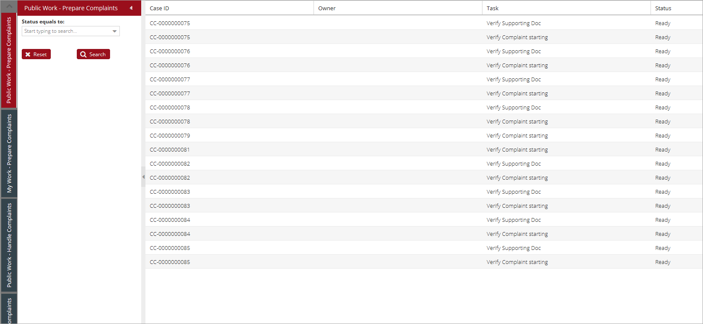
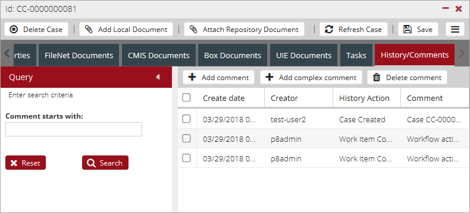
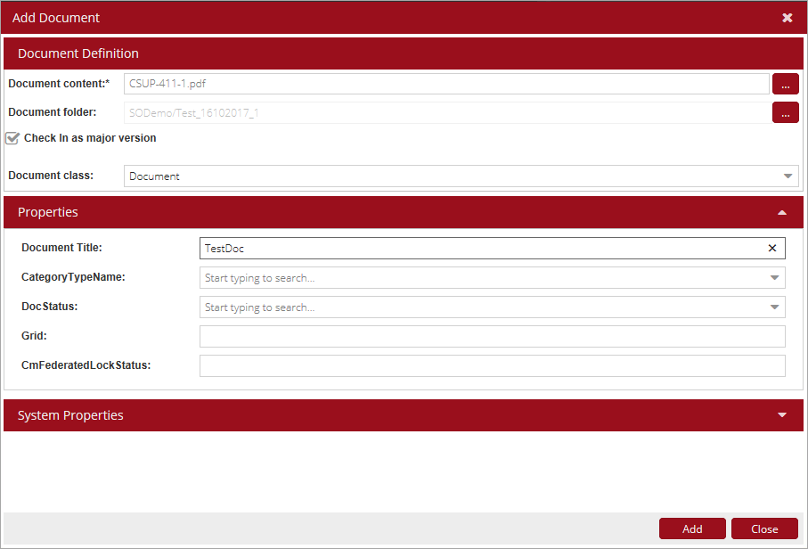

*content to be added*

# UCM/ICM Feature Guide

UI and configuration were changed in the frame of the current feature. All searching was implemented via SearchTemplates in the Unity configuration file. FileNet, CMIS Alfresco, BOX documents can be attached to the case also attached documents can be displayed using Enterprise Search indices.
The following UI elements were implemented:

- Case Search

    

- Inbasket Search

    - Horizontal:  

        

    - Vertical:  

        
    
- Case View

    

- Inbasket View

    

- Tasks Tab

    

- History/Comment Tab

    

- Add Local Document

    - Document source selection:  

        
 
    - Document adding:  
    
        
    
- Attach Repository Document

    

- Reassign

    - `Assign To` field as a Selector:  
    
        
   
    - `Assign To` field as a Lookup:  
    
        

# Versions Supported

This feature was added to Unity in Release 7.2.

ICM requires Case Manager version 5.3.0.0 or above, IBM WebSphere JDK 1.8, SQL Server
2012 or above.

# Configuration

[Unity Case Management Configuration](../configuration/unity-case-management.md)
