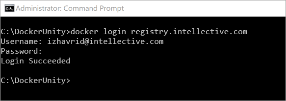
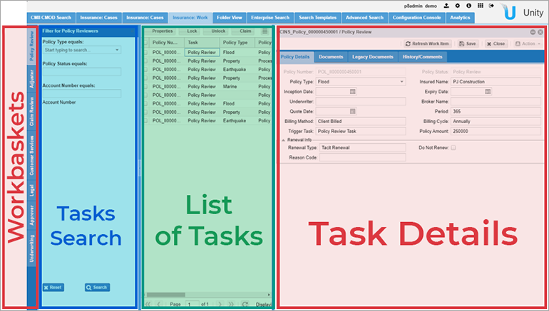

To try Unity demo version [install Docker](../tutorials/how-to-install-docker.md) and configure Unity Docker image. 

# Configure Unity Docker Image
 
## Configuration 

- Create a folder on the drive you shared to store Open Liberty & Unity configuration files, `C:\DockerUnity` for example 
- [Download](quick-start/downloads/unity-package.zip) Unity package, unpack and place files to folder you created 
- Open Command Prompt or PowerShell in admin mode and navigate to this folder, running command 
 `cd C:\DockerUnity\`
- Run `docker login registry.intellective.com` 

	Username: `serviceaccount`  
	Password: `password` 

	You should get the message `Login Succeeded` 

	 
	
- Run `docker run -it -v c:/<folder you created>:/opt/vu  -p 9080:9080  --rm registry.intellective.com/unity/unity:7.7.0.1`  

It will check if the docker image is available locally.
If not then it will be downloaded automatically.
For the first time, it will take some time to download the image.
Once downloaded, the local Unity instance will be up & running. 

## Access the Unity  

- Connect to Intellective VPN
- Make sure the FileNet environment is up and accessible, hit [here](http://172.31.27.3:9080/wsi/FNCEWS40MTOM/) to confirm.

- Hit [http://localhost:9080/vu](http://localhost:9080/vu) to access the Unity

	> Username: `p8admin_demo`  
	> Password: `password`
	
Wizard should guide you through establishing connection to FileNet, use the [endpoint](http://172.31.27.3:9080/wsi/FNCEWS40MTOM/) to connect to Filenet. 
Welcome to Unity! 
	
# Unity Interface ## 

## Tabs 

Tabs are the main building block of Unity user interface. 

- Tabs used to represent Folder View, Case Views, Search Templates, Workbaskets, Analytics and Configuration Console 
- Tabs also used to provide additional information like Properties, Documents, Security, etc inside of case and document details  
	
Access roles can be used to provide different groups of users with specific set of tabs to tailor different functionality to different groups/departments. 

 

## Search layout  

You will find on every search page: 

- Search panel, where you enter search criteria 
- Content List, where you view your search results 
- Actions to work with documents from content list 

 

## Case management - Case view 

- Case details allows user to perform actions on case
- Documents tab in case details shows all documents associated w/ case
- History/Comments tab will display history & comments associated w/ case 

## Case management - Task view 

 

- Task details allows user to perform actions defined in a workflow task
- Documents tab shows all documents associated with a task
- History/Comments tab will display history & comments associated with a task 