Charts are UI components designed for graphical representation of data.  

# Plot Charts

## Bar Chart

The **Bar Chart** presents categorical data with rectangular bars with heights or lengths proportional to the values that they represent. The bars can be plotted vertically or horizontally. A vertical bar chart is sometimes called a **Column Chart**.

The Bar Chart shows comparisons among discrete categories. One axis of the chart shows the specific categories being compared, and the other axis represents a measured value: 

 

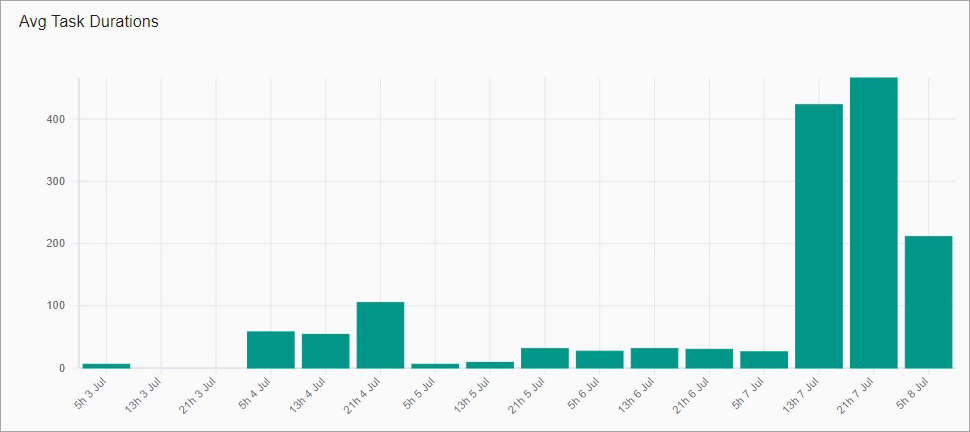

The Bar Chart component is built based on [React-Vis Bar chart](https://uber.github.io/react-vis/documentation/series-reference/bar-series).

## Line Chart

The **Line Chart** displays information as a line segments. The Line Chart is often used to visualize a trend in data over intervals of time. The lines can be plotted vertically or horizontally: 

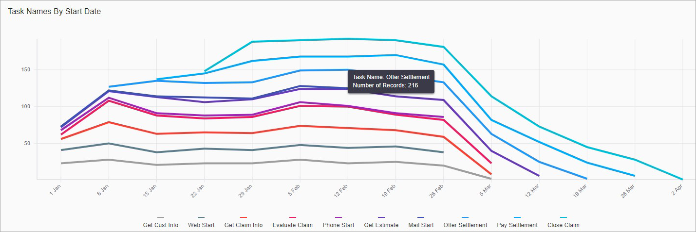 

The Line Chart component is built based on [React-Vis Line chart](https://uber.github.io/react-vis/documentation/series-reference/line-series).

## Mark Chart

The **Mark Chart** displays discrete information. The marks can be plotted vertically or horizontally: 

 

The Mark Chart component is built based on [React-Vis Mark chart](https://uber.github.io/react-vis/documentation/series-reference/mark-series).

## LineMark Chart

The **LineMark Chart** displays information as a series of data points called 'marks' connected by straight line segments. The LineMark Chart is often used to visualize a trend in data over intervals of time. The lines and marks can be plotted vertically or horizontally.

The LineMark Chart is a combination of a [Line Chart](#line-chart) and a [Mark Chart](#mark-chart): 

 

The LineMark Chart component is built based on [React-Vis LineMark chart](https://uber.github.io/react-vis/documentation/series-reference/line-mark-series).

## Area Chart

The **Area Chart** displays graphically quantitative data. It is based on the [Line Chart](#line-chart). 
The Area Chart is often used to visualize a trend in data over intervals of time. The areas can be plotted vertically or horizontally: 

 

The Area Chart component is built based on [React-Vis Area chart](https://uber.github.io/react-vis/documentation/series-reference/area-series).

## Composite Chart

Several Plot charts can be combined into one Composite Chart.

*Content to be added*

# Radial Charts

## Pie Chart

The **Pie Chart** (Radial/Circle Chart) is a circular statistical graphic, which is divided into slices to illustrate numerical proportion. 
In the Pie Chart, the arc length of each slice (and consequently its central angle and area), is proportional to the quantity it represents: 

You can configure the Pie Chart to illustrate the numerical distribution of facet data.

The recommended type of information to display in this way is groups of less **6** or so. More than that becomes pretty hard to compare, and the reader just sees visual noise.

Pie charts can be replaced in most cases by other charts such as the [Bar Chart](#bar-chart), [Line Chart](#line-chart), [Area Chart](#area-chart), etc.

The Pie Chart component is built based on [React-Vis Radial chart](https://uber.github.io/react-vis/documentation/other-charts/radial-chart).

# Hierarchical Charts
    
## Tree Map

*Content to be added*

## Table Heat Map

*Content to be added*

## Sunburst

The **Sunburst Chart** is a hierarchical graphic, where each data node of a tree is represented by an annular segment within multi-layered rings.

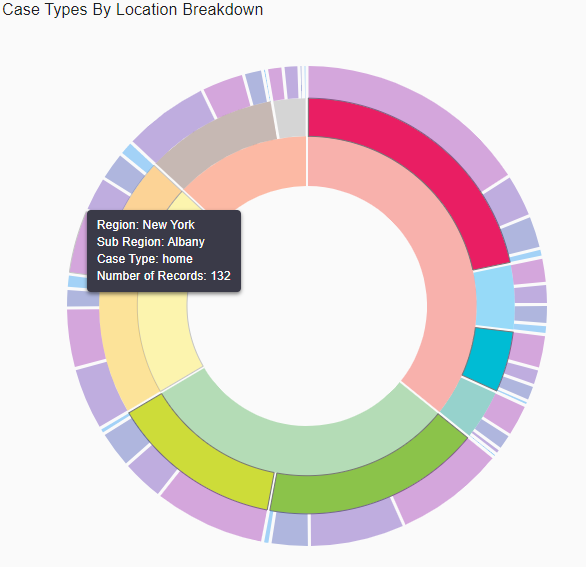

You can configure the Sunburst Chart to illustrate the part to whole relationships. 

Sunburst charts allow for at a glance understanding of distributions of nested groups.

The Sunburst Chart component is built based on [React-Vis Sunburst diagram](https://uber.github.io/react-vis/documentation/other-charts/sunburst-diagram).

## Zoomable Sunburst

*Content to be added*

# How To Use Charts

Each chart consists of several colored segments, every displays particular group of data on the page. 
Charts provide an interactive way to use and work with datasets:

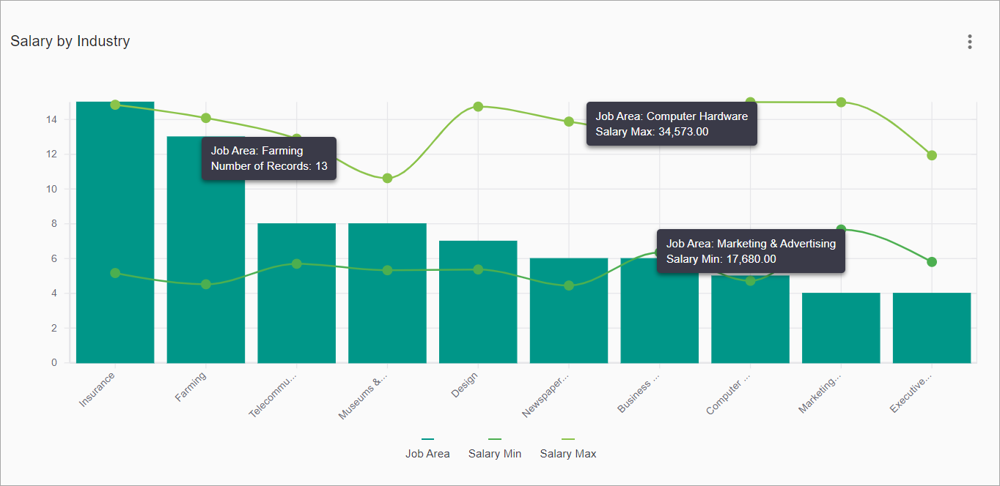

## Chart data filtering

Charts support filtering data by clicking on one or more segments. 
It works like [Search criteria panel](./search-criteria-panel.md) but gives opportunity to do it right on chart.

E.g. clicking on "*Telecommunications*" segment on "*Salary by Industry*" chart will cause selection 
only records with "*Telecommunications*" in "*Industry*" column on the grid 
and displaying only "*Telecommunications*" segment on "*Jobs by Industry*" chart:

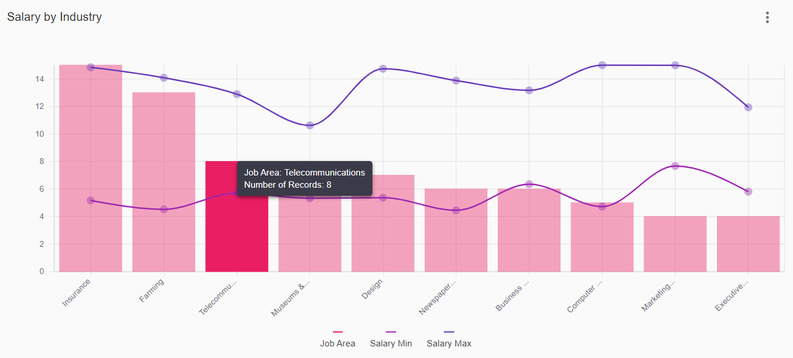
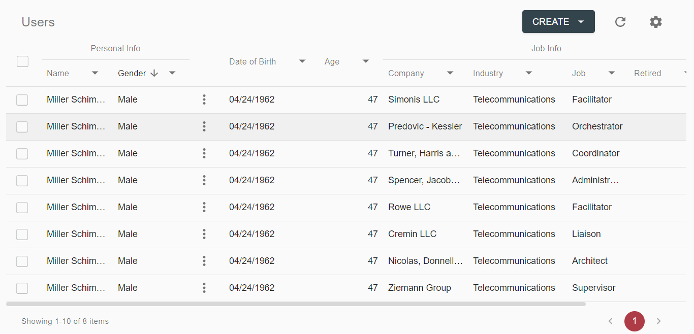
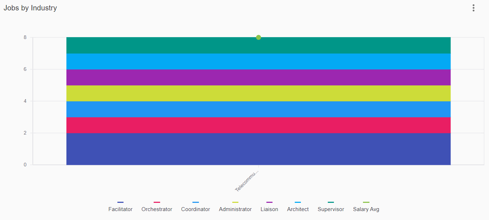

## Chart legend

The legend is associated with a graphical display of data in the graph area. 
Each specific entry in the legend contains a legend key that displays the color of a specific data group. 
Some charts, that doesn't follow hierarchical structure, are using legend to operate with groups of data. 
Click on it enables/disables several data group view:

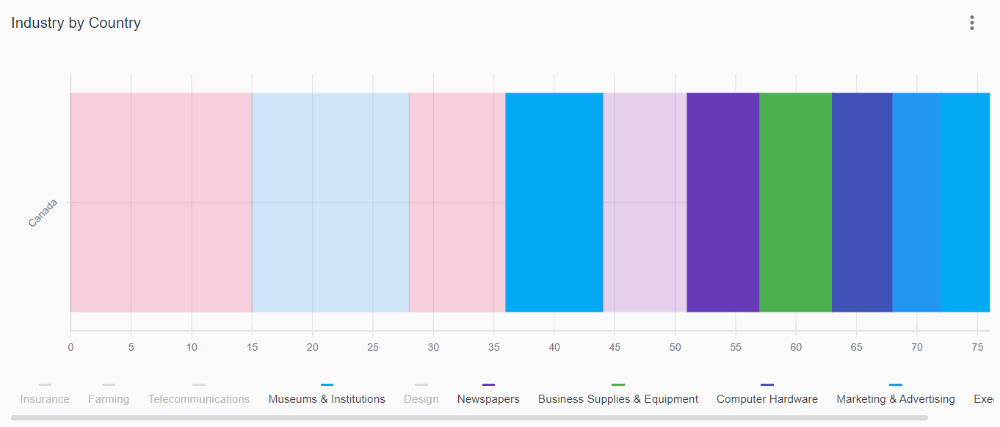

## Chart settings

By default, charts support settings with some preset configurations.

[Radial charts](#radial-charts) support:

- Enable/Disable chart legend,
- Enable/Disable chart labels.

[Plot charts](#plot-charts) support:

- Enable/Disable chart legend.

To open chart settings you need to click on an icon on top right corner of a chart:

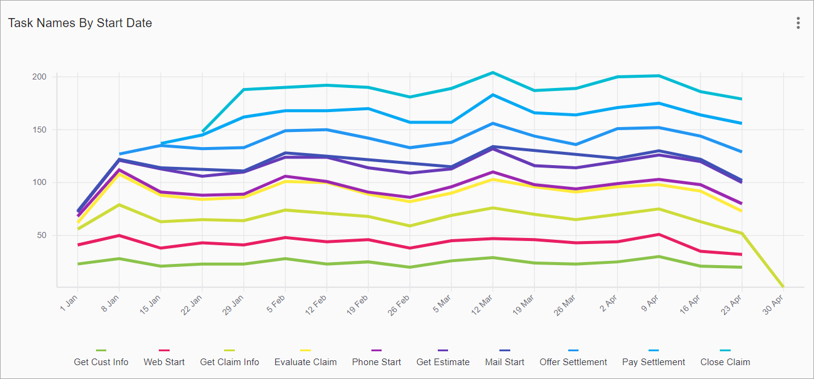

On icon click dropdown with settings of particular chart will open. All changes are saving to browser localStorage on fly, 
so even after reopening page all your chart customizations will apply:

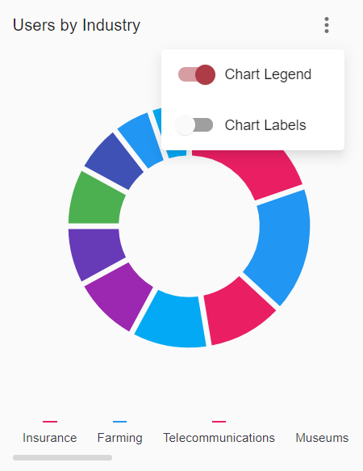

If data is empty or has no values, `No content to display` warning message will be shown below the chart title:

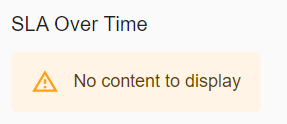

# Configuration

[Charts Configuration](../configuration/charts.md)