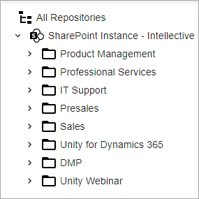

Folders View is a [Folder Management](../features/folder-management.md) component to display hierarchical set of data. In the specific case, FoldersView operates with folder structure:

# Folders View Features

- Single folder action
- Ability to add a custom foldersView action
- Single folder context menu
- Ability to compose with other components

# Configuration

[Folders View Configuration](../configuration/folders-view.md)
