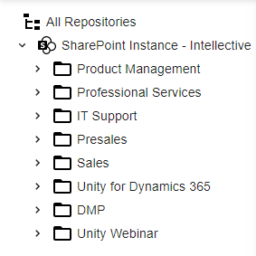

## Unity Components - FoldersView

FoldersView is a component to display hierarchical set of data:

# FoldersView Features

- FoldersView action
- Single folder action
- Ability to add a custom foldersView action
- Single folder context menu
- Ability to compose with other components

# Configuration

[FoldersViews Configuration](../configuration/foldersViews.md)
