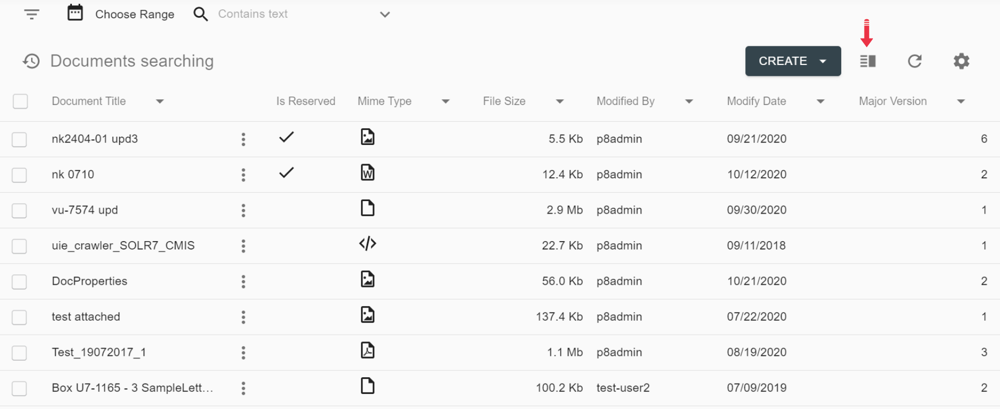
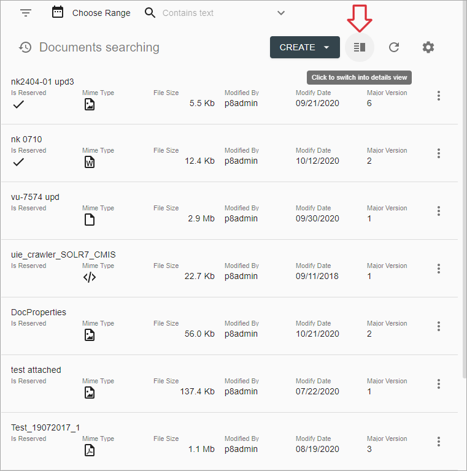
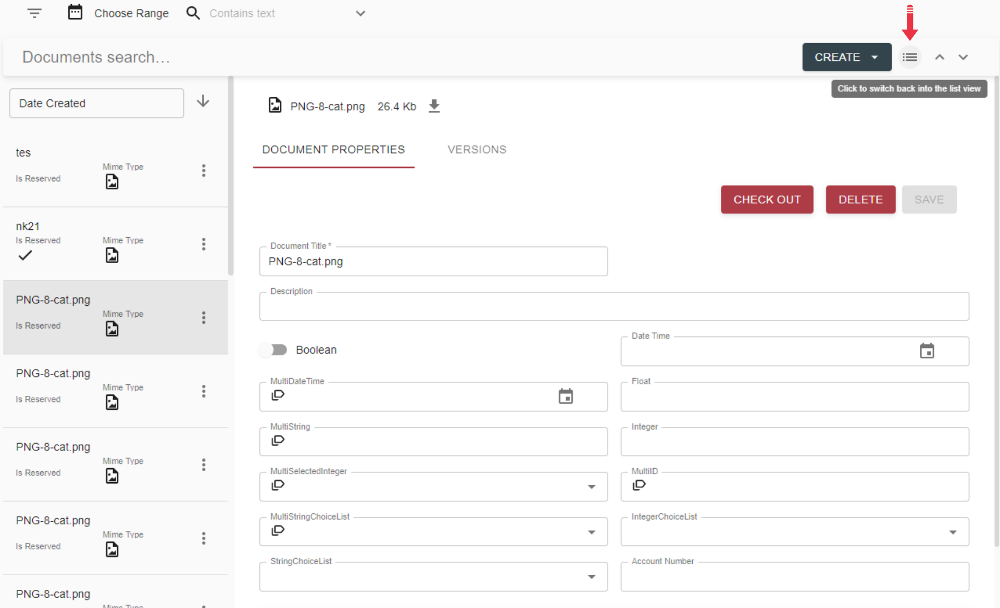
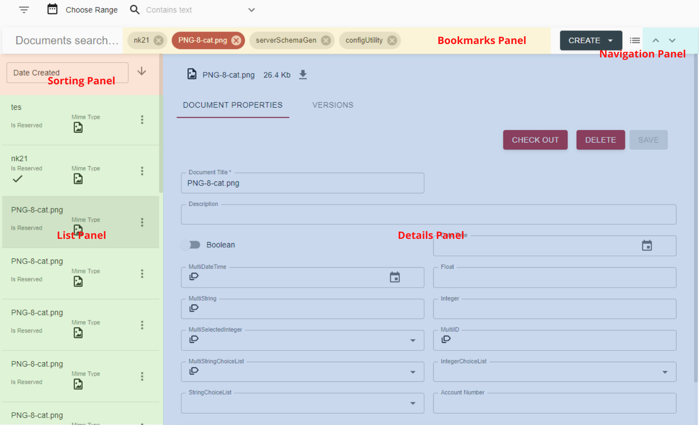
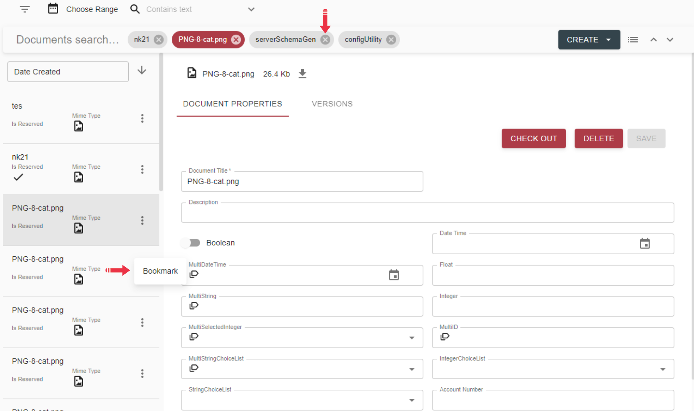
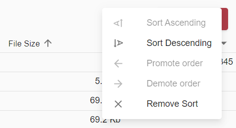
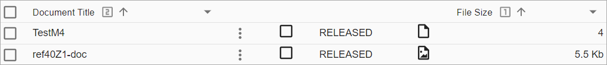
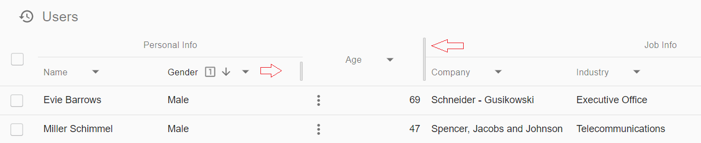
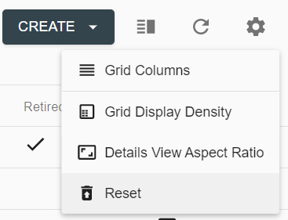
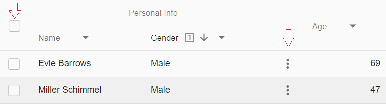

# Overview

*content to be added*

# Grid Features

## Display Modes

Out of the box, the Grid supports three display modes: **Table View**, **List View** and **Details View**. No any specific configuration required to enable all these modes.

### Table View

Table View is a default grid view mode which displays data in a tabular view (including table columns and rows).

Click the Details View icon to switch grid into the Details View mode:

 

### List View

In case the window size is not enough for the correct display of the grid in Table View mode, the grid is automatically switched into List View mode. 

Click the Details View icon to switch grid into the Details View mode:

 

### Details View

Details View mode allows to combine the view of the list of items and the view/edit form of the selected item.

Click the List View icon to switch grid back into the List/Table View mode:

 

Details View screen is divided into several panels as shown below:

 

- List Panel - displays a list of available items.

- Navigation Panel - allows to navigate through the list by clicking the corresponding `Up/Down` buttons.

- Sorting Panel - allows to sort the list by the selected field and sorting direction.

- Details Panel - displays the view/edit form of the selected item.

- Bookmarks Bar - displays the Bookmarks. Bookmarks allow to quickly switch between selected items. List item can be added to Bookmarks bar by clicking `Bookmark` action in the item actions menu. A bookmark can also be removed from the Bookmarks bar:

 

## Grouping  
*Content to be added*

## Multiple Column Sorting

Default grid allows multiple columns to be sorted at a time within the content list. Grid column can be configured as sortable or not.

To sort grid by a sortable column, move mouse over the column header and grayed out arrow (sorting direction indicator) will appear. Clicking to the column header or the arrow will activate ascending sorting and its icon will become contrast. Next click will toggle sorting to descending, and third click will remove sorting for the column, and so on.

 

Sorting direction may be changed also via column menu. To open the menu, click to down-pointing triangle in the column header. There are options _Sort Ascending_, _Sort Descending_ and _Remove sort_ that work as per above. 

 

Activating sort by a column when already having another column sorted will show columns sorting order numbers along with sorting direction arrows. Data firstly will be sorted by column with order number 1, then by column with number 2 etc.  

It is allowed to have up to 6 columns sorted simultaneously per grid. To change column sorting order number there are commands _Promote order_ and _Demote order_ in the column menu. Promoting reorders sorting by decrementing column order and demoting increments it. 

 

Per each grid, user defined sorting order is saved into browser storage and restored on next session. 

Default sorting order may be configured on a per-grid or per-SearchTemplate basis. It is used until user overrides it.

This feature implemented for:

- Tabs: Search Template, Folder View
- Data Providers: FileNet, CMIS, Unity Enterprise Search (except JOIN function) 

[Configure Multiple Column Sorting](../configuration/grids.md)

## Column resizing

Normally grid columns width is set automatically in order to fill whole grid horizontal space. The columns may be resized by mouse by dragging column separators. To show the separators, move mouse over the column heading and left and right side separators will be shown. Hold a separator with mouse and move horizontally to resize the column:  

 

Last column width may not be changed. If grid occupies whole container form width, the last column takes all the remaining width till the right side of the grid. However, if grid is wider than its container, the last column width is set automatically by actual content.

The minimum size of the columns is determined by column header, the actual column data in the grid rows may be shortened when shown in too narrow columns.

Width of a column becomes fixed once it was resized. Other columns width remains automatically maintained. To reset the columns width to default (and revert the visible state of the columns and their order) use `Reset` command from grid menu: 

 

Per each grid, changed columns width is saved into browser storage and restored on next session. Width units are pixels, so if in next session the grid will be shown in narrower window or in smaller screen resolution, horizontal scrollbars may appear. 

Auxiliary columns, such as leftmost checkbox column and action menu (ellipsis) column, are not resizable: 

 

The column resizing feature is not configurable.

## Column locking 
*Content to be added*

## Column spanning 
*Content to be added*

## Column reordering
*Content to be added*

## Column menu
*Content to be added*

## Column cell formatting 
*Content to be added*

## Column cell tools and actions 
*Content to be added*

## Column cell rendering customization
*Content to be added*

## Record text links
*Content to be added*
 
## Multiple row selection
*Content to be added*
	
## Row action	
*Content to be added*

## Bulk action 
*Content to be added*

## Ability to add a custom grid action 
*Content to be added*

## Row actions menu 
*Content to be added*

## Expandable rows
*Content to be added*

## Pagination
*Content to be added*
	
## Ability to use a custom grid pagination 
*Content to be added*

## Infinite scrolling
*Content to be added*
	
## Data export 
*Content to be added*

## Display density settings
*Content to be added*
 
## Ability to compose with other components 
*Content to be added*

## Adaptive
*Content to be added*

## Responsive
*Content to be added*
	
## Configurable 
*Content to be added*

