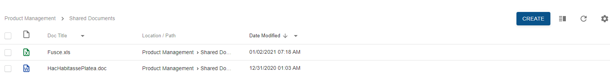
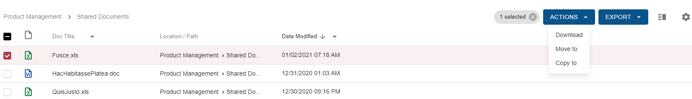

Model actions are actions, which are supposed to create the resource, e.g. a document or a case. By default, it is an action with create or attach type.

Bulk actions are actions, related to the group of grid rows.

To invoke model action click on the appropriate button in the grid toolbar. 

 

To invoke bulk action select at least one row and click on the appropriate button appeared in the grid toolbar.

 

If there are more than one bulk action available, dropdown with actions will be displayed.

Single bulk action considered as available only if **link key** from the component links array **matches** any action **name or type property** from whole actions list. 

 

Choosing an action targets to show configured view and pass some declared resource by actual uri property, defined in an appropriate action from all actions list.

For more information check 'Download Multiple Documents' action and generic action configuration:

[Download multiple documents action](../../features/document-management/multiple-document-download.md)
[Action Configuration](../../configuration/actions.md)

