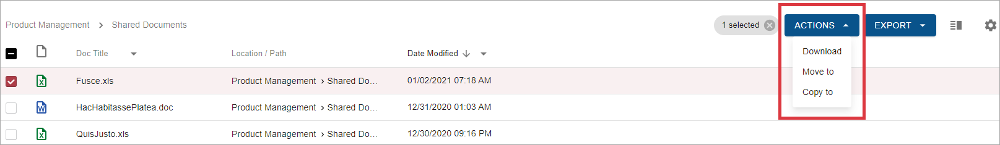

Bulk actions are actions, related to the group of grid rows.

To invoke bulk action select at least one row and click on the appropriate button appeared in the grid toolbar.

If there are more than one bulk action available, dropdown with actions will be displayed:

 

Single bulk action considered as available only if `link key` from the component links array `matches` any action `name` or `type` property from the list of all actions.  
Choosing an action targets to show configured view and pass some declared resource by actual `Uri` property, defined in an appropriate action from the list of all actions.

Examples of bulk actions:

- [Download multiple documents action](../../features/document-management/multiple-document-download.md)
