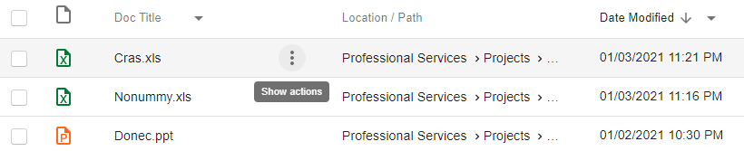
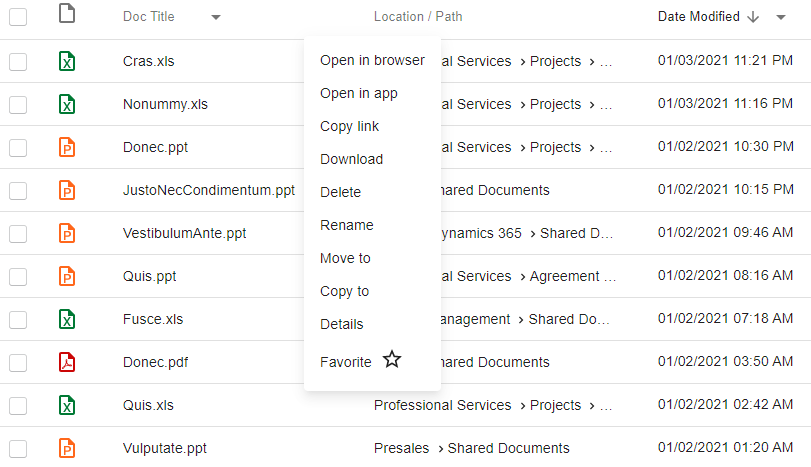

Row actions are actions, related to single grid row. By default, they are available from grid row context menu.

To invoke row action hover over row content and click on three-dots appeared. 

 

Dropdown menu with available actions should be displayed. Single action considered as available only if **link key** from the component links array **matches** any action **name or type property** from whole actions list. 

 

Choosing an action targets to show configured view and pass some declared resource by actual href, defined in component links.

For more information check 'Download' action and generic action configuration:

[Download document action](../../features/document-management/document-download.md)
[Action Configuration](../../configuration/actions.md)

