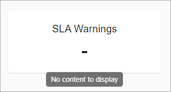

# Unity Components - Indicator

Indicators are UI components designed for graphical representation of different metrics. 

*Content to be added*

# How To Use Indicator

*Content to be added*

If the metric is empty, `-` will be shown below the indicator title with `No content to display` tooltip:

# Configuration

[Indicators Configuration](../configuration/tags/indicators-tag.md)