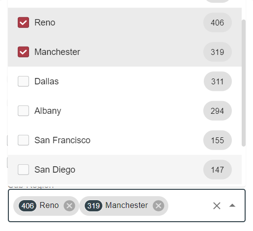

# Facet (Category) Field

## Radio

## Toggle

## Checkbox

## Combobox

This type of field is represented by dropdown with ability to select 1 or more options. 
Each option has checkbox, label and count badge:

## Configuration

[Category field configuration](../../configuration/search-templates/facet-category-field.md)