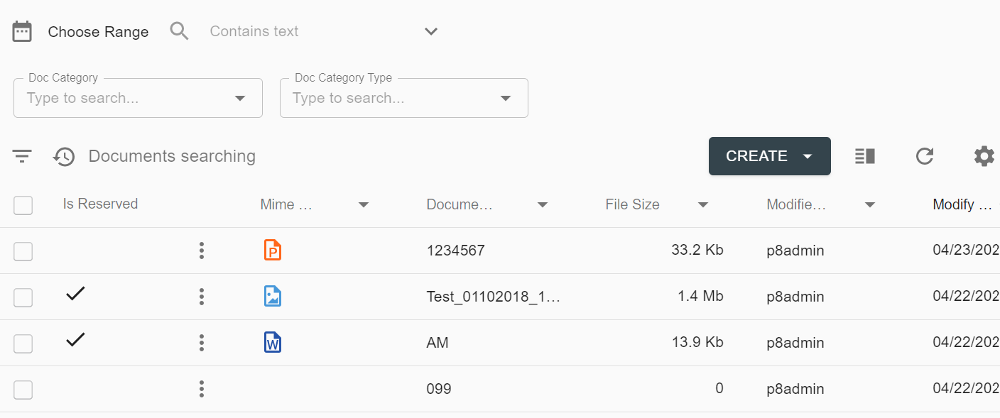
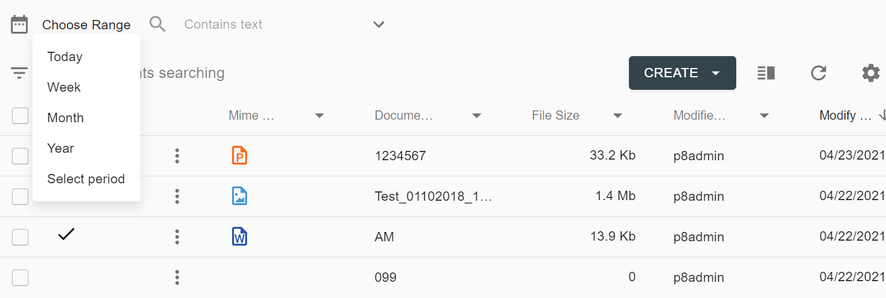
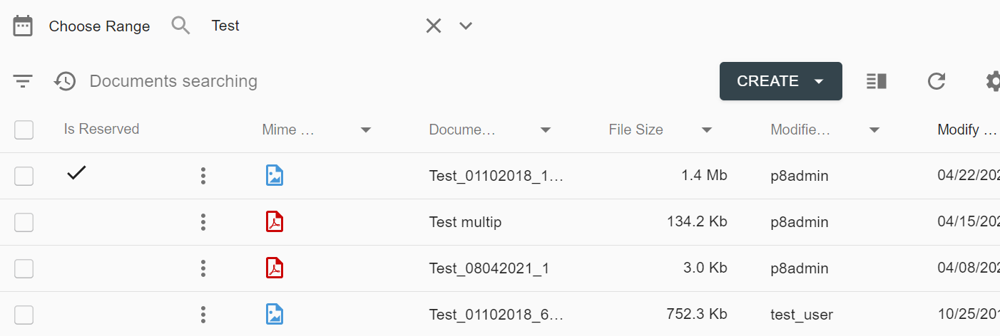
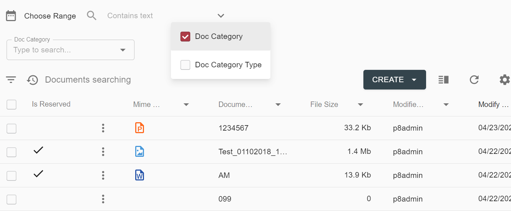

# Description

Quick search feature allows quickly filter the data in the grid.

The Quick search panel can include the following sections:

- Date range section
- Text input section
- Choices and categories section

# How to enable Quick search

Quick search feature appears when at least one search template criterion is marked as `QuickSearch`.

- Date range section appears when at least one **date**/**datetime** criterion is marked as `QuickSearch`.

    

- Text input section appears when at least one **string** criterion is marked as `QuickSearch`.

    

- Choices and categories section appears when at least one **selector** criterion is marked as `QuickSearch`.

    

# Configuration

[Quick Search Configuration](../../configuration/search-templates.md#quick-search-criteria)