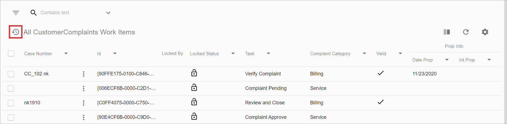
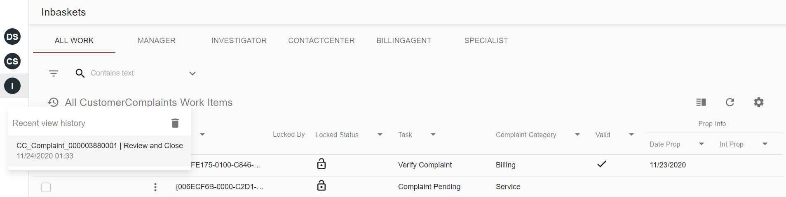
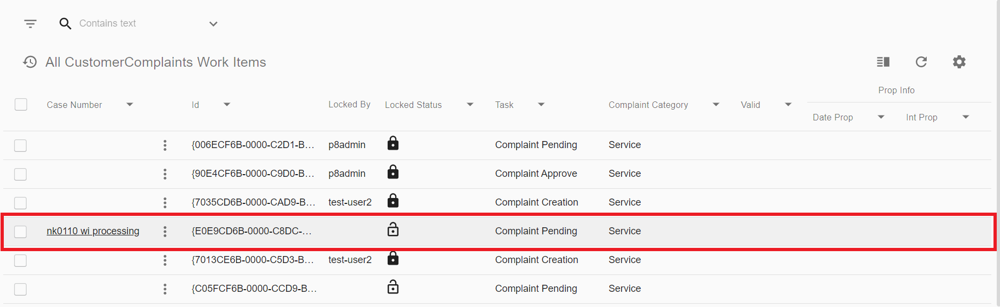
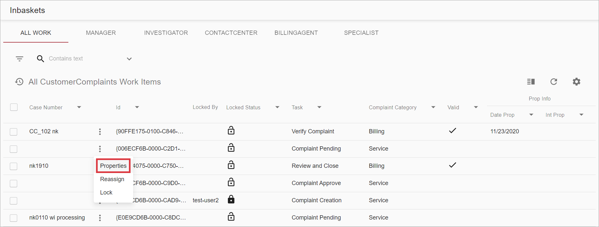
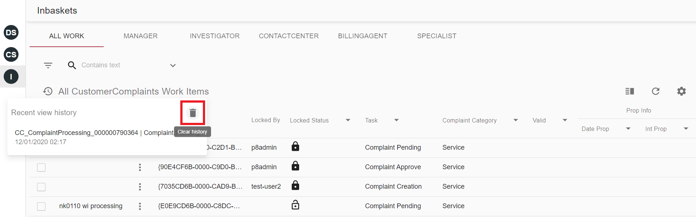

# Description

Recent view history saves and shows links to recently viewed items. For example, here is how history icon looks on Workitems grid:

# How To Open Recent View History

Click on history icon to view list of recent items.

History titles of items are different for different grids, depending on their content. Usually it's just a title of an item,
but for some grids it can be other item parameter or even be composed of several parameters like it used by Workitems grid. 

It composes case title parameter value and own title parameter for better readability and uniqueness:

# How To Add New Item To History

To add new item to history you should click on grid item 

or choose "Properties" in context menu of an item:

# How To clear History

To clear history you should open history dropdown and click on a clear icon:

# Configuration

Recent view history feature appears automatically, no configuration is required.
