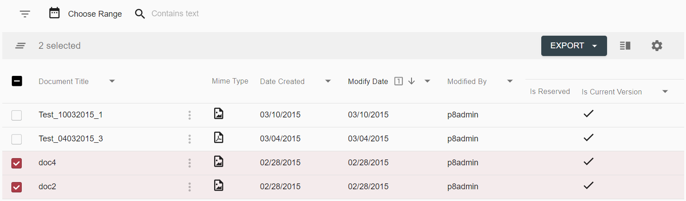

*content to be added*

# DBRepositoryDataProvider

Search templates based on the DB connector allow to make searches against db records. Only `Export` action can
be found on a grid toolbar, no row actions available:

