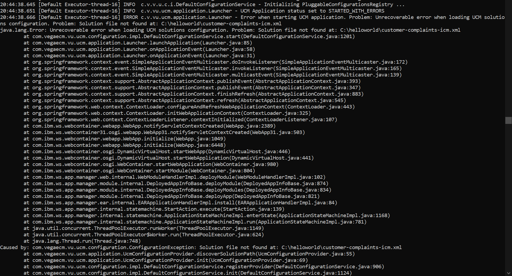

# Overview

*content to be added*

# Deployment Wizard

## Solution Configuration

### Link with Unity

ConfigFolder tag in the main configuration file has to point to the full path of the solution configuration file.  
Make sure that the path includes the drive letter.
If it is not valid, you may see the following errors. Please also note that, in this case also the default profile for Unity would be jbpm.

# Macros Configuration

*content to be added*

# Environment Variables

[Environment Variables](basic-steps/environment-variables.md)
