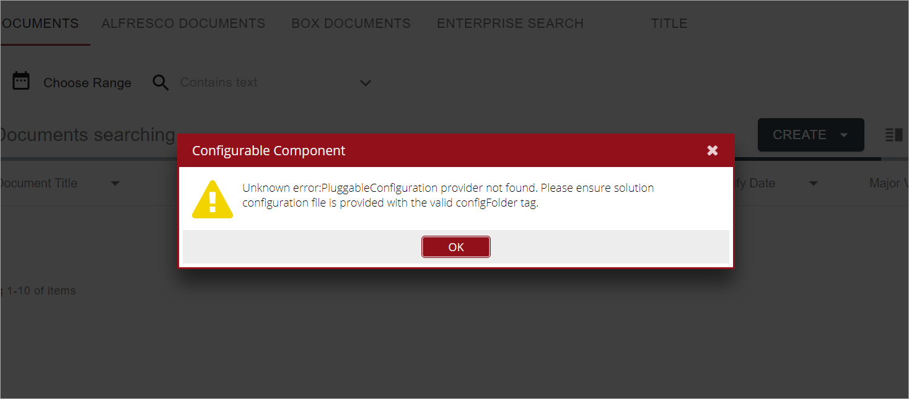

# Overview

*content to be added*

# Deployment Wizard

*content to be added*

# Solution Configuration

*content to be added*

## Possible errors

### Wrong path of the solution configuration file

In the main configuration XML file `configFolder` tag has to point to the full path of the solution configuration file.  
Make sure the path includes the drive letter.

If the path is not valid, the following error message is shown: 

`Unknown error:PluggableConfiguration provider not found. Please ensure solution configuration file is provided with the valid configFolder tag.`  

Also logs contain the following error messages: 

| **Note**: in this case `jbpm` is the default profile for Unity.

# Macros Configuration

*content to be added*

# Environment Variables

[Environment Variables](basic-steps/environment-variables.md)
