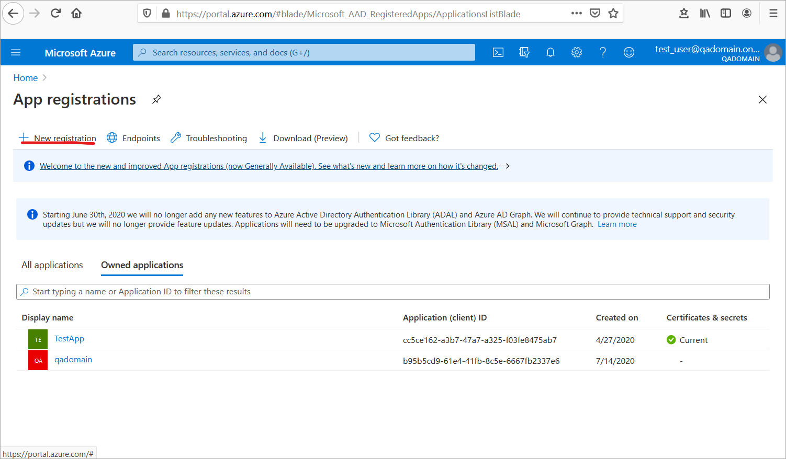
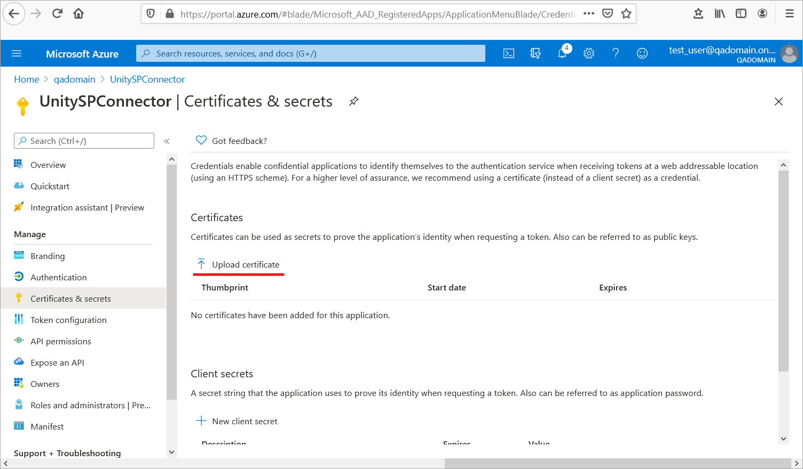
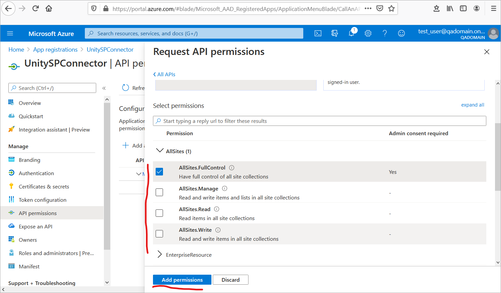
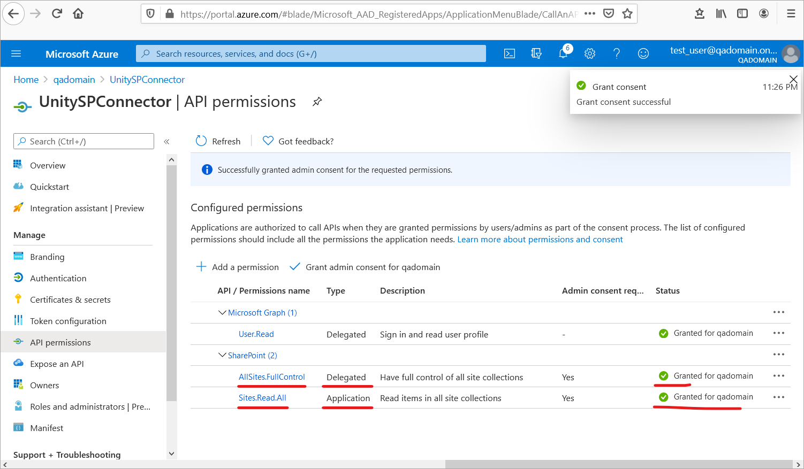

# Description
Authorization Code flow used by Unity SharePoint connector to call SP on behalf of user. 
It uses additional authentication request to present Azure login page redirecting to Unity callback endpoint with authentication code after that.
There are two points where additional authentication requested:
 - New user session redirected to Azure login immediately after Unity login form or session initialized by SSO.  
 - Popup presented when access token expired, Unity web app refreshed after that. 
User access token is refreshed in background using refresh token, please check [Token Lifetime](https://docs.microsoft.com/en-us/azure/active-directory/develop/active-directory-configurable-token-lifetimes) for details. 

Unity backend uses authentication code to get access token for session user and call SP REST API afterward. 
App registration certificate and application grants also used as system read only user to cache SP metadata.  

 
 | Datasource Configuration | Description | Example|
 |--------------------------|-------------|--------|
 | RootUrl | Required. Root Sharepoint URL. Note: site path configured at RepositoryDataProvider level and should not be included. | https://yourdomain.sharepoint.com |
 | ApplicationId | Required. Azure App registration applicationId(aka clientId) | f1d7c8bc-6284-4db8-968f-e88a9bca70e1 |
 | AuthorityUrl | Required. `https://login.microsoftonline.com/${AzureTenantId}`. Please find Directory (tenant) Id value at "App registration" -> "Overview" page | https://login.microsoftonline.com/b128c161-3661-441c-8212-5116e40ef414 |
 | RedirectUrl | Required. `http://${UnityServer}:${UnityPort}/${ContextRoot}/services/oauth2/callback`. UnityServer - host name for the web unity application. UnityPort - port value for the unity web application. ContextRoot - server path unity web application mapped. **Note:** http could be only used for localhost, https MUST be used otherwise. | https://unity.server.com:9443/vu/services/oauth2/callback |
 | ClientCert | Required. Signed client certificate password protected. Certificate used to get access code from Azure authority url. It's also used to authenticate system user to SP. Please see [Create Self Signed Certificate](#self-signed-certificate) page for details |  |
 | Password | Required. Password for certificate above. Should be stored encrypted (use Unity config console to encrypt the value)  |  |
 | AzureDomain| Required. Domain name to be added/replaced for unity user session if container authenticate user by simple name. This map username like 'myuser' to 'myuser@yourdomain.com' known to Azure AD. **Note:** this is case sensitive value. Unity connector validates Azure access token from auth popup belongs to the session user. | yourdomain.com |
 | OAuthPrompt | Optional. `[login|none]`. Defaults to the behaviour - sso credentials will be used. login - will force the user to enter their credentials, negating single-sign on.  Please check [prompt option documentation](https://docs.microsoft.com/en-us/azure/active-directory/develop/v2-oauth2-auth-code-flow) for details | ```<OAuthPrompt>login</OAuthPrompt>``` |
 | OAuthDisableMessage | Optional. `[true|false]`. Defaults to false - additional Unity message will be presented before Azure popup | `<OAuthDisableMessage>true</OAuthDisableMessage>` |
 
Example datasource configuration:
```
<Datasource ID="sharepoint_ds" class="com.vegaecm.vspace.datasources.SharepointDatasource">
            <RootUrl>https://yourdomaincom.sharepoint.com</RootUrl>
            <AuthorityUrl>https://login.microsoftonline.com/${AzureTenantId}</AuthorityUrl>
            <ClientCert>${PasswordProtectedBase64EncodedCert}</ClientCert>
            <Password>${EncryptedCertPassword}</Password>
            <ApplicationId>${appRegistrationId}</ApplicationId>
            <RedirectUrl>https://${UnityServer}:${UnityPort}/${ContextRoot}/services/oauth2/callback</RedirectUrl>
            <AzureDomain>yourdomain.com</AzureDomain>
        </Datasource>
```
   
# Create App Registration 
To create App Registration  in Azure Portal for new Unity connector Authorization Code flow:   

 - Login to [Azure Portal](https://portal.azure.com) with your domain admin account
 - Navigate to `Azure Active Directory > App registrations`:
  
    

## New App registration  

 - Click `New registration`: 
 
    
 
 - Enter `Name` for the application and select `Single tenant` option:
 
    
 
 - At `App registration > Authentication` add web platform:
 
    
 
    and set redirect Url to `https://${UnityServer}:${UnityPort}/${ContextRoot}/services/oauth2/callback`:  
  
     
 
    **Note:** https MUST be enabled for the Unity web application.

## Self Signed Certificate

 - Generate Client Certificate
  
   Use powershell script to generate self signed certificate. 
   Copy script: [Create-SelfSignedCertificate.ps1](authcode/downloads/Create-SelfSignedCertificate.ps1) to local folder.
   Open Windows PowerShell (Admin) command line at that folder end execute:   
```shell
PS C:\Code> .\Create-SelfSignedCertificate.ps1 -CommonName "UnitySpConnector" -StartDate 2020-09-21 -EndDate 2022-09-22 -Force
```
 - Use proper `StartDate` and `EndDate` for a certificate and enter a password:    

   
   
 - Copy content of the `UnitySpConnector.b64` file to clipboard and paste it to `<ClientCert>` connector datasource configuration. 
   Encode the password using Unity config console and put it to `<Password>` tag for SP connector datasource configuration.
 
 - Upload `UnitySpConnector.cer` file to Azure `App registrations > Certificats & secrets` page: 
 
    
 
## App permissions
  
 - At `App registrations > API permissions` select `Add permission`:

    
 
- Select `Delegated permissions`:
 
    
  
 - Select `SharePoint` API:
 
    
 
 - Check `AllSites.FullControl` (if users need to manage permissions) or `AllSites.Read`, `AllSites.Write` and apply:
  
    

 - Add `Sites.Read.All` with `Application` type Sharepoint API permissions same way.
 Grant `Admin consent` to selected api permissions:
 
     

- Use App registration data to fill in Unity `<DataSource>` configuration section.   

# Collect and verify existing Azure App registration settings

Use App registration data to fill in Unity DataSource configuration section. Following parameters required to configure Unity Sharepoint connector with Authorization Code flow: 
 - Read `Application ID` and `tenant Id` from Azure app registration: 
 
     

 - Verify application API permission settings has SharePoint API Delegation Permission.  
 **Note:** For Users to be able to manage document permissions `AllSites.FullControl` required to be consented. 
 This does not give users FullControl permission in SP but allows to apply any actual user permission on behalf of user. 
 - Verify application API permission settings has SharePoint API Application `Sites.Read.All` Permission:
  
    

 - Verify redirect Url filled with value matching unity deployment: 
 
      
    
 - Verify on the same page below `Treat application as public client` set to `No`. 
 - Use base64 encoded certificate (private part) with valid password in unity configuration. See [Self Signed Certificate](#self-signed-certificate) above.   
