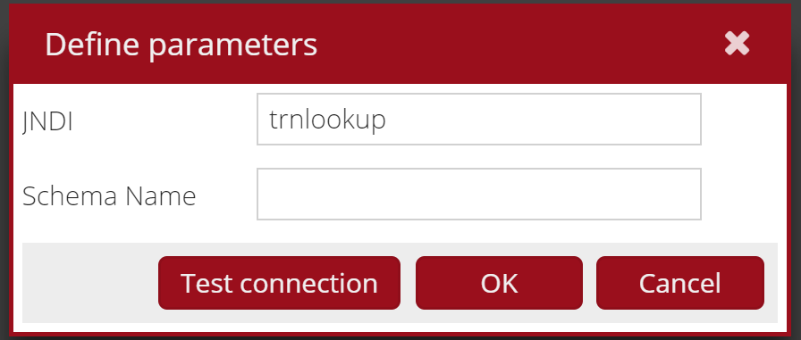
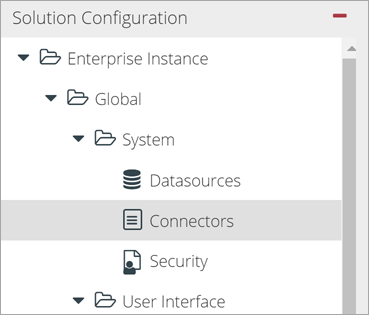
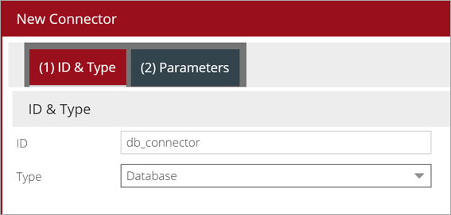
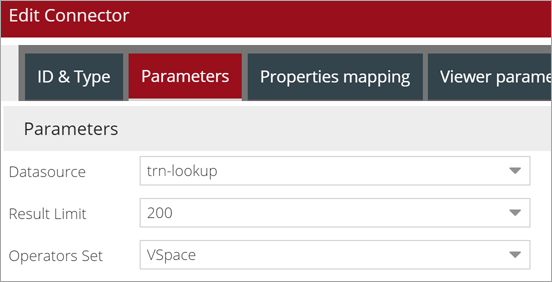
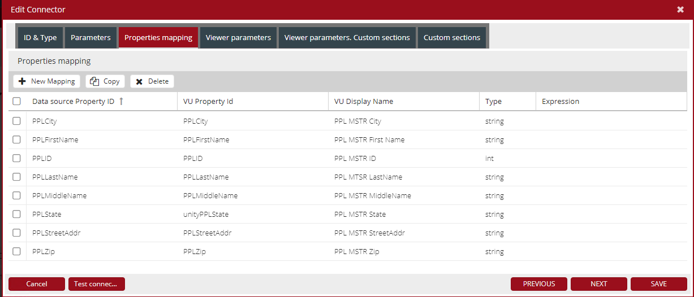
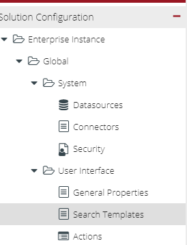
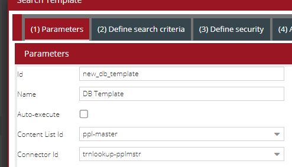
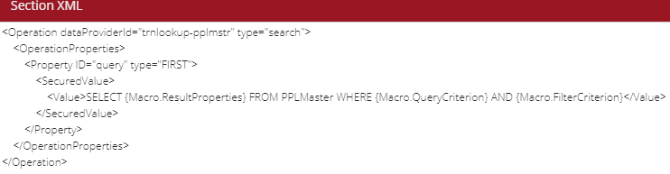

|**Note**: Database Data Provider Configuration is the same for Unity ExtJS and Unity React.

# Introduction

Unity can connect with a variety of data storage methods. 
One of the options is to use relational databases to provide data to Unity. 
The Unity DB connector uses JNDI, so it can be configured for multiple database "flavors". 
The connector can then be used in the same ways that other Unity connectors can be used, as a data provider for example search templates or selection lists.

|**Note**: The database connector does not support updating the database OOTB; it is read only.
 
# Versions Supported

This is an original feature of Unity. 
Unity 7.2.1 added support for PostgreSQL.

# Installation Impact

The database connector is available OOTB and can be configured at anytime after the installation of the Unity application. 
It requires an existing database that the connector will use to provide data to the application.
If not already done, you will need to install and configure the JDBC drivers for your database to be used when creating the JNDI definition on your web application server.

# Configuration

## JNDI Configuration
 
To use the Unity database connector, you will need to define a JNDI definition on the web application server that the connector will reference.
This process is different for each web application server and you should follow the process for your server, a sample is provided here using the WebSphere Liberty web application server.

### WebSphere Liberty Profile

- Open the `server.xml`
- Add `library` tag with parameters below for a reference to the JDBC jar for your database:

    ```xml
    <library id="MSSQLLib">
          <fileset dir="C:/wlp/lib.custom" includes="sqljdbc4-4.1.jar"/>
    </library>  
    ``` 
    
    |Parameter|Description|Value|
    |:--------|:----------|:----|
    |id       |Library ID |MSSQLLib|
    |dir      |absolute path to the containing folder for the jar |C:/wlp/lib.custom|
    |includes |the name of the JDBC jar file |sqljbdc4-4.1.jar|

- Add the data source JNDI with parameters below and database access information:
        
    ```xml
    <dataSource id="trn-lookupdb" jndiName="trnlookup"
          <jbdcDriver libraryRef="MSSQLLib"/>
          <properties.microsoft.sqlserver databaseName="trn-lookupdb" serverName="localhost" portNumber="1433" user="user" password="password"/>
    </dataSource>
    ```
 
    |Parameter|Description|Value|
    |:--------|:----------|:----|
    |id       |dataSourse ID |trn-lookupdb|
    |jndiName |JNDI name | trnlookup |
    |libraryRef | Library ID previously created| MSSQLLib |
    
  - Save the file

## Unity Configuration – Configuration Console

### Add Data Source

- Navigate to `System` > `Datasources`:

    
 
- Click `New`
- Enter an Id for the data source, this ID is used by Unity, it is recommended you use consistent data source IDs between the JNDI and Unity definitions. 
- Select DB for the type:

    

- Click `OK`
- Click to edit the parameters of the data source:

    
    
- Enter the JNDI you configured for the database:

    
    
- Click `OK`
- Click `Apply` to save your changes

After creating the data source, you will create a new connector that uses the data source.

### Add Connector

- Navigate to `System` > `Connectors`:
 
    

- Click `New`
- Enter an Id for the connector
- Select Database for the type:
 
    

- Click `Next`
- Select the data source that was created for the database
- Select a result limit and operators set:
 
    

- Click `Next`
- Define the property mappings for the database properties. 

    The Datasource Property ID is the data field as it appears in the database, the VU Property ID is the defined value in Unity. 
    Type is the data type Unity will use for the field, it does not have to be the same as the type that is used in the database. 

    |**Note**:  When using the Configuration Console, if adding new Properties that are not already defined in Unity, the  `Property` definition is added to the configuration. 
    If adding all  XML manually (direct editing or using Advance Editor), you must add the Properties definition before you can do the Property Mapping. 
 
    

- Click `Save`
- Click `Apply` to save your changes
- Click `Activate` to activate the new configuration

After creating the new connector, you can confirm that it is working by clicking on the icon in the "Test connection" column of the connector.

### Search Template

When using the database connector for searching, you will need to define which table/view in the database you want to search in. 
This configuration can be done by directly editing the XML in the Advanced Editor or using the Configuration Console to setup the search template 
and then using the Advanced Editor to modify the default search template parameters to function with a database.

- Navigate to `User Interface` > `Search Templates`:
 
    

- Click `New`
- Enter an `Id` and `Name` for the search template
- Select a `Content List`
- Select your database connector for the `Connector Id`:
 
    

- Click `Next`
- Define the search criteria
- Click `Next`
- Assign security roles to the tab
- Click `Next`
- Assign the search template to the desired tabs
- Click `Next`
- Optionally, provide instructions for the search template
- Click `Save`
- Click `Apply` to save the changes

As mentioned, we will now need to open the Advanced Editor to do some additional configuration.

- Click the `Advanced Editor` button at the top of the Configuration Console
 
    

- Navigate to `Configuration` > `Search Templates`
- Find and expand the node for the search template you created
- Select the Operation node
- In the editor, configure the query to be used when executing the search
    - Add a new `Property` element. Refer to the figure below for an example.
    - Enter "query" for the Id attribute
    - Enter "FIRST" for the type attribute
    - Add a `SecuredValue` element.
    - Add a `Value` element
    - For the value of the <Value> element, enter the following SQL query. Replace table-name with the database table you want to search.
    SELECT {Macro.ResultProperties} FROM table-name WHERE {Macro.QueryCriterion} AND {Macro.FilterCriteiron}
 
    

- Click `Apply` to save your changes
- Click `Activate` to activate the new configuration

## Unity Configuration - XML Configuration

### Add Data Source

Add a new Datasource element to the configuration. 

```xml
<Datasource ID="datasource_id" class="com.vegaecm.vspace.datasources.JndiDatasource">
	<Jndi>Jndi Name</Jndi>
</Datasource>
```

|Parameter|Description|Value|
|:--------|:----------|:----|
|ID 	|Id for the data source| datasource_id|
|class	|Java class used for the data source|com.vegaecm.vspace.datasources.JndiDatasource|
|Jndi	|JNDI name created for the database|Jndi Name|

### Add Properties

Each new property must be defined before it can be used in the property mapping of the connector. 

```xml
<Properties>
…
<Property ID="unityPPLState">
    <Name>PPL MSTR State</Name>
    <Type>string</Type>
    <Resizable>true</Resizable>
    <Sortable>true</Sortable>
    <MultiValue>false</MultiValue>
    <XType/>
    <Tooltip/>
    <Header>unityPPLState</Header>
</Property>
…
</Properties>
```

|Parameter|Description|Example|
|:--------|:----------|:------|
|ID 	|Id for the metadata property element|unityPPLState|
|Name	|Name for the metadata property element|PPL MSTR State|
|Type	|Data type for the metadata property element|string|
	
### Add Connector

To add the database connector, add the following to the repository data providers section of the configuration:

```xml
<RepositoryDataProvider ID="connector_id" class="com.vegaecm.vspace.providers.db.DBRepositoryDataProvider">
	<OperatorsSet>VSpace</OperatorsSet>
	<Operations/>
	<ViewerParameters/>
	<ResultLimit>200</ResultLimit>
	<DBTimeZone>UTC</DBTimeZone>
	<DateTimePattern>M/d/yy h:mm a</DateTimePattern>
	<CaseInsensitiveSearch>true</CaseInsensitiveSearch>
	<Datasource>datasource_id</Datasource>
	<PropertyNameMapper>
		…
		<Mapping external="Unity Property Id" internal="DB Property Id"/>
		…
	</PropertyNameMapper>
</RepositoryDataProvider>
```

|Parameter|Description|Value|
|:--------|:----------|:----|
|ID 	|Id for the connector|connector_id|
|class	|Java class to be used for the connector |com.vegaecm.vspace.providers.db.DBRepositoryDataProvider|
|OperatorsSet	|Connector operators set for the connector. Refer to the OperatorTypes section of the config for available sets|VSpace|
|ResultLimit	|Result set size limit|200|
|DBTimeZone	|Time zone for datetimes in the database|UTC|
|DateTimePattern	|Pattern for datetimes in the database|M/d/yy h:mm a|
|CaseInsensitiveSearch	|Boolean value that tells the application to perform case insensitive search or not|true|
|Datasource	|Id of the data source to use for the connector|datasource_id|
|external	|Unity property Id being mapped to|Unity Property Id|
|internal	|Database property Id that is being mapped|DB Property Id|

### Search Template

The search template configuration is mostly the same as other search template configurations. 
The only difference is that you need to define the query operation property to tell the application which table in the database to use. 

An example of defining the query operation:

```xml
 <SearchTemplate ID="template_id">
  <DataProviderId>db_connector_id</DataProviderId>
  <Description>Template Title</Description>
  <Comment>Template Instructions</Comment>
  <Autoexecute>true</Autoexecute>
  <Security>
    …
  </Security>
  <Operation dataProviderId="db_connector_id" type="search">
    <OperationProperties>
      <Property>
        <SecuredValue>
          <Value>SELECT {Macro.ResultProperties} FROM table-name WHERE {Macro.QueryCriterion} AND {Macro.FilterCriterion}</Value>
        </SecuredValue>
      </Property>
    </OperationProperties>
  </Operation>
  <SortFields/>
  <Grid ID="grid_id"/>
  <Criteria>
    …
  </Criteria>
</SearchTemplate>
```

|Parameter|Description|Example|
|:--------|:----------|:------|
| ID 	|Id for the search template| template_id|
| DataProviderId	|Id for the connector that the search template uses|db_connector_id|
| Description	|Description for template that is displayed when selecting the template from the dropdown menu on a search template tab|Template Title|
| Comment	|Comments/instructions displayed when the template is selected|Template Instructions|
| Autoexecute	|Boolean value for if the application should execute the search when the template is first selected|true|
| dataProviderId	|Id of the connector for the operation|db_connector_id|
| type	|The operation type|search|
| Value	|Value of the Operation property|SELECT {Macro.ResultProperties} FROM table-name WHERE {Macro.QueryCriterion} AND {Macro.FilterCriterion}|

# Limitations

The DB connector is read only. There are no OOTB actions to update the database from Unity. 


Perform configuration steps [common to all Unity data providers](../repository-data-providers.md#common-steps-to-configure-data-provider).   

*content to be added*

# Mapping

Repository data provider should specify mapping for all columns from select clause (if external and internal names 
don't match):

```xml
    <RepositoryDataProvider ID="db_repository" class="com.vegaecm.vspace.providers.db.DBRepositoryDataProvider">
      <!-- not relevant nodes skipped -->
      <Datasource>db2_sodemo</Datasource>
      <PropertyNameMapper>
        <Mapping external="Id" internal="OBJECT_ID"/>
        <Mapping external="DocumentTitle" internal="U1708_DOCUMENTTITLE"/>
        <Mapping external="MimeType" internal="MIME_TYPE"/>
        <Mapping external="DateCreated" internal="CREATE_DATE"/>
        <Mapping external="DateLastModified" internal="MODIFY_DATE"/>
        <Mapping external="LastModifier" internal="MODIFY_USER"/>
        <Mapping external="IsReserved" internal="IS_RESERVED_DOC"/>
        <Mapping external="IsCurrentVersion" internal="IS_CURRENT_DOC"/>
        <Mapping external="ContentSize" internal="CONTENT_SIZE"/>
        <Mapping external="MajorVersionNumber" internal="MAJOR_VERSION_NUMBER"/>
        <Mapping external="MinorVersionNumber" internal="MINOR_VERSION_NUMBER"/>
        <Mapping external="IsVersioningEnabled" internal="VERSIONING_ENABLED"/>
        <Mapping external="VersionStatus" internal="VERSION_STATUS"/>
      </PropertyNameMapper>
    </RepositoryDataProvider>
```


