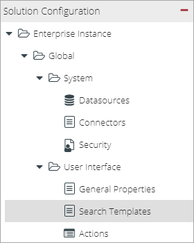
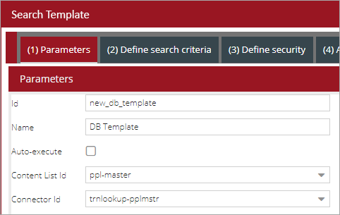
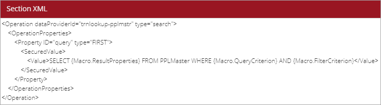

[DBRepositoryDataProvider for Search Template component description in Unity React](../../components/search-template/supported-data-providers/dbrepository-data-provider.md)

# XML Configuration

Example of configuration:

```xml
<SearchTemplate ID="document_Search_db2">
  <DataProviderId>db_repository</DataProviderId>
  <Description>Documents searching</Description>
  <Comment>Enter search criteria</Comment>
  <Autoexecute>false</Autoexecute>
  <Hidden>false</Hidden>
  <Security>
    <AllowRole>Unity Users</AllowRole>
  </Security>
  <Operation dataProviderId="db_repository" type="search">
    <OperationProperties>
      <Property ID="query" value="
                    select
                          OBJECT_ID,
                          U1708_DOCUMENTTITLE,
                          MIME_TYPE,
                          CREATE_DATE,
                          MODIFY_DATE,
                          MODIFY_USER,
                          (CASE WHEN IS_RESERVED = 1 THEN 'True' ELSE 'False' END) AS IS_RESERVED_DOC,
                          (CASE WHEN IS_CURRENT = 1 THEN 'True' ELSE 'False' END) AS IS_CURRENT_DOC,
                          CONTENT_SIZE,
                          MAJOR_VERSION_NUMBER,
                          MINOR_VERSION_NUMBER,
                          VERSIONING_ENABLED,
                          VERSION_STATUS
                    from DOCVERSION WHERE {Macro.QueryCriterion}"/>
      <Property ID="idField" value="Id"/>
    </OperationProperties>
  </Operation>
  <SortFields>
    <SortField Order="desc">DateLastModified</SortField>
  </SortFields>
  <Grid ID="document_search_db2"/>
  <Criteria>
    <Criterion>
      <FieldName>DocumentTitle</FieldName>
      <Type>string</Type>
      <Operator>starts</Operator>
      <Required>false</Required>
      <Hidden>false</Hidden>
      <Readonly>false</Readonly>
      <MultiValue>false</MultiValue>
    </Criterion>
  </Criteria>
  <SavePanel>false</SavePanel>
</SearchTemplate>
```

List of available properties for search template is in the table below:

| Parameter   | Description|
|:------------|:------------|
|query        |Query for data selection <sup>1</sup>|
|idField      |Identifier field name. Equals `Id`, `ID`, `id` or `document_id` depending on mapping in repository data provider|

<sup>1</sup> List of column names in select clause should always contain id column 
(OBJECT_ID in the sample above). Inside repository data provider those properties
should be [mapped](../repository-data-providers/db.md#mapping) to external names, defined inside [`Properties`](../tags-list/properties-tag.md) section (in case internal 
and external names are different). Use `Id`, `ID`, `id` or `document_id` external name for id column.

If database doesn't support a particular data type, value in select clause should be casted 
to string (example above is for db2, which doesn't support BOOLEAN, that's why `IS_RESERVED_DOC` 
and `IS_CURRENT_DOC` are returned as `True` / `False` text).

# Configuration Console

When using the database connector for searching, you will need to define which table/view in the database you want to search in. 
This configuration can be done by directly editing the XML in the Advanced Editor or using the Configuration Console to setup the search template 
and then using the Advanced Editor to modify the default search template parameters to function with a database.

- Navigate to `User Interface` > `Search Templates`:
 
    

- Click `New`
- Enter an `Id` and `Name` for the search template
- Select a `Content List`
- Select your database connector for the `Connector Id` and click `Next`:
 
    

- Define the search criteria and click `Next`
- Assign security roles to the tab and click `Next`
- Assign the search template to the desired tabs and click `Next`
- Optionally, provide instructions for the search template
- Click `Save`
- Click `Apply` to save the changes

As mentioned, we will now need to open the Advanced Editor to do some additional configuration.

- Click the `Advanced Editor` button at the top of the Configuration Console:
 
    

- Navigate to `Configuration` > `Search Templates`
- Find and expand the node for the search template you created
- Select the `Operation` node
- In the editor, configure the query to be used when executing the search
    - Add a new `Property` element, refer to an example below
    - Enter `query` for the `Id` attribute
    - Enter `FIRST` for the `type` attribute
    - Add a `SecuredValue` element
    - Add a `Value` element
    - For the value of the `Value` element, enter the following SQL query. Replace `table-name` with the database table you want to search:
    `SELECT {Macro.ResultProperties} FROM table-name WHERE {Macro.QueryCriterion} AND {Macro.FilterCriteiron}`
    - An example of query configuration:
    
        

- Click `Apply` to save your changes
- Click `Activate` to activate the new configuration
