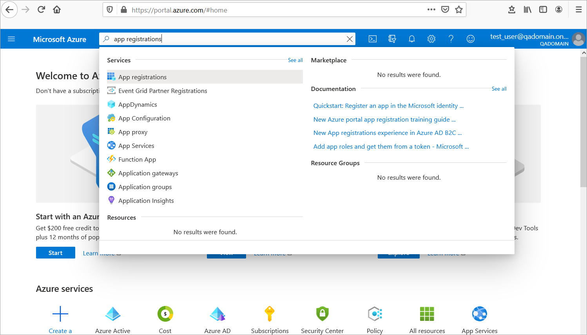
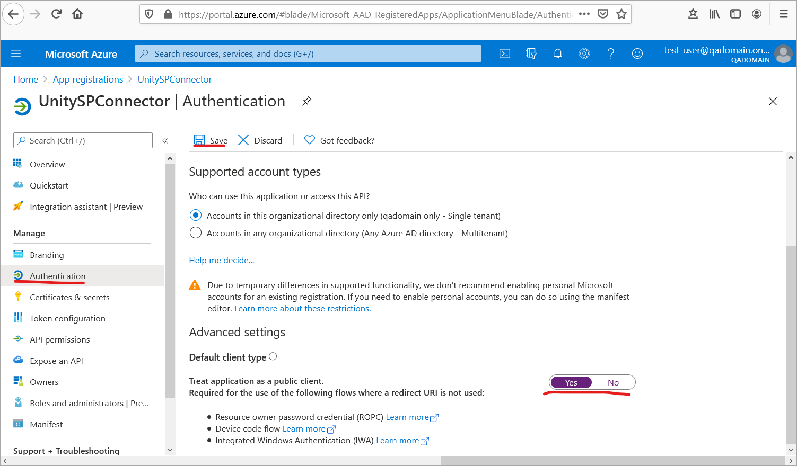
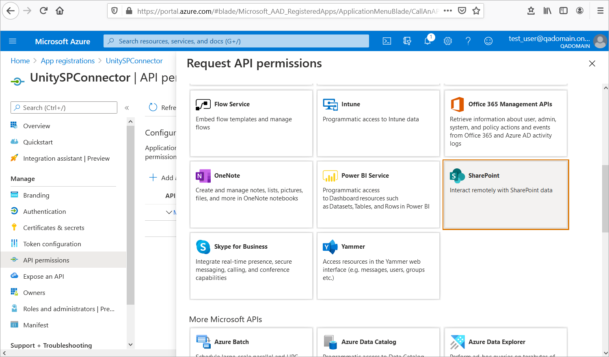

# Description
Username Password flow used by Unity connector to call SP on behalf of user. It uses logged in session credentials data 
to generate Azure authentication token in background without any additional popup. 
Unity needs additional system account Read only SP permissions level to manage SP metadata cache.  

 
 | Datasource Configuration | Description | Example |
 |--------------------------|-------------|---------|
 | RootUrl | Root Sharepoint URL. **Note:** site path configured at RepositoryDataProvider level and should not be included. | https://yourdomaincom.sharepoint.com |
 | ApplicationId | Azure App registration applicationId (aka clientId) | f1d7c8bc-6284-4db8-968f-e88a9bca70e1 |
 | Login | System account used internally by a connector to cache SP metadata. Read SP permission level is enough for this account.  | read_only@yourdomain.com |
 | Password | Password for system account above. Should be stored encrypted (use Unity config console to encrypt the value)  |  |
 | AzureDomain| Domain name to be added/replaced for unity user session if container authenticate user by simple name. This map username like 'myuser' to 'myuser@yourdomain.com' known to Azure AD. **Note:** this is case sensitive value. | yourdomain.com |
 
Example datasource configuration:
```
        <Datasource ID="sharepoint_ds" class="com.vegaecm.vspace.datasources.SharepointDatasource">
            <RootUrl>https://yourdomaincom.sharepoint.com</RootUrl>
            <Login>read_only@yourdomain.com</Login>
            <Password>${EncryptedPassword}</Password>
            <ApplicationId>${appRegistrationId}</ApplicationId>
            <AzureDomain>yourdomain.com</AzureDomain>
        </Datasource>
```
  
# Add new Connector App Registration in Azure Portal for Username Password flow   
 - Login to [Azure Portal](https://portal.azure.com) with your domain admin account
 - Navigate to `Azure Active Directory > App registrations`:
  
    
  
 - Click `New registration`: 
 
    
 
 - Enter `Name` for the application and select `Single tenant` option: 
 
    

- At `App registration > Authentication` make the application to be a public client and save changes: 

    

- At `App registration > API permissions` select `Add a permission`: 

    
 
- Select `Delegated permissions`: 
 
    
  
- Select `SharePoint` API: 
 
    
 
- Check `AllSites.FullControl` (if users need to manage permissions) or `AllSites.Read`, `AllSites.Write` and apply:
  
    

- Grant admin consent to selected api permissions: 
  
    
 
- Create system user and add it to SP sites Visitor group for all sites.  
 Go to Azure AD and create user, set user name and password 
 then login to SP with site owner rights and add this user to site visitor group.

An existing user with proper SP permissions could be also used.   

# Collect and verify existing Azure App registration settings
Use App registration data to fill in Unity DataSource configuration section. Following parameters required to configure Unity Sharepoint connector with Username Password flow:    
 - Read `applicationID` from Azure app registration:  
 
    
 
 - Verify application authentication settings `Treat application as public client` set to `Yes` 
 
    
    
 - Verify application API permission settings has SharePoint API Delegation Permission.  
 **Note:** For Users to be able to manage document permissions `AllSites.FullControl` required to be consented. 
 This does not give users FullControl permission in SP but allows to apply any actual user permission on behalf of user. 
 
    
