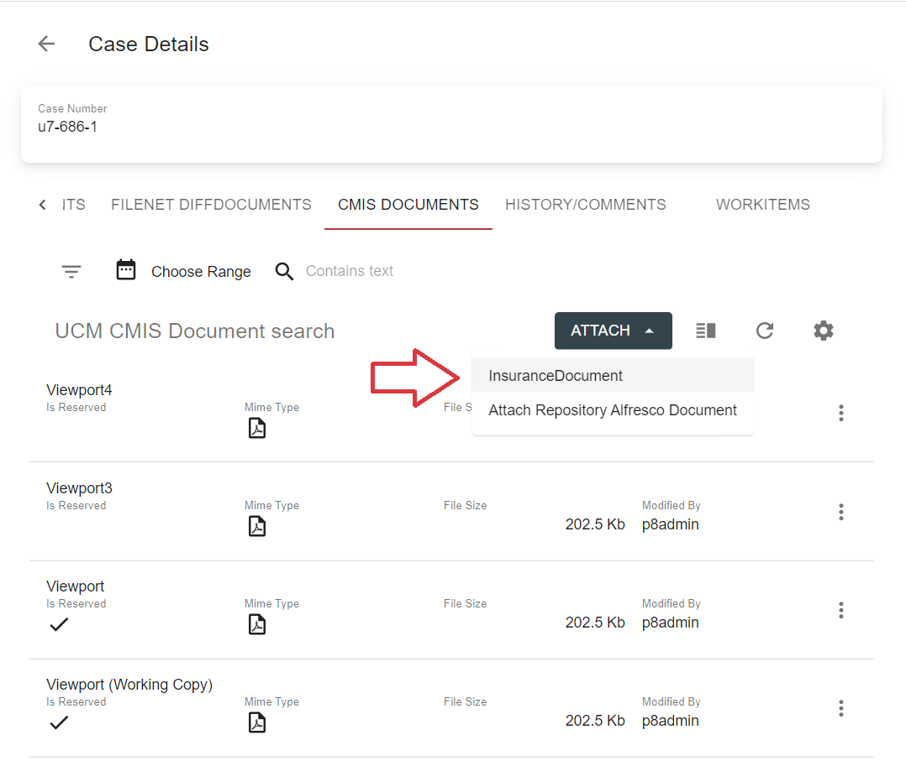
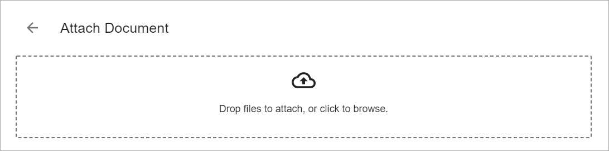
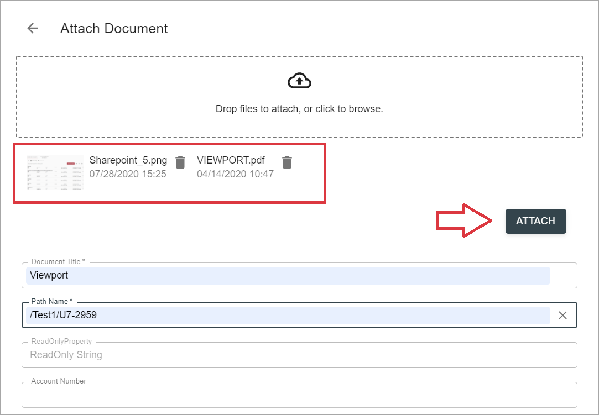
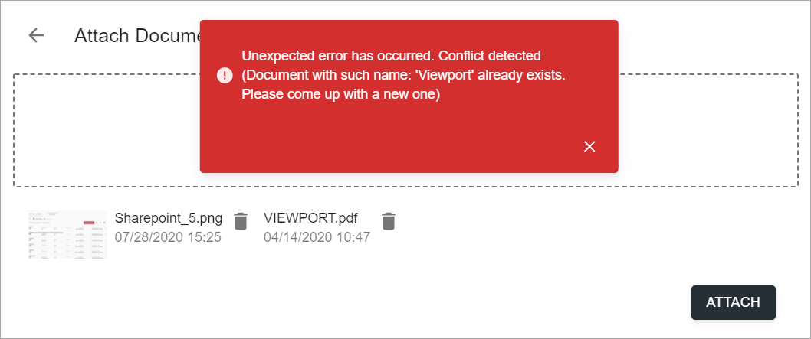
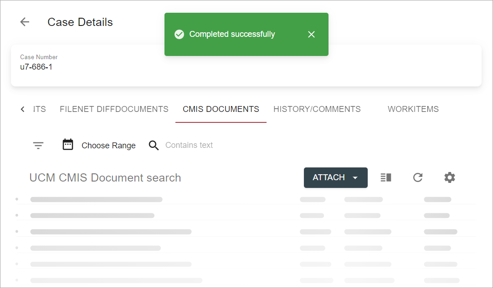

# Description

Attach document feature allows to upload a file (set of files) into a particular data provider and link uploaded 
document(-s) to selected case. This type of action can be added on `Attachments` tab on a grid toolbar and will 
be rendered as a separate button (if only one attach action is bound to the grid) or a dropdown (in case grid contains 
2 or more actions with `ActionType` custom parameter = `attach`).

*content to be added*

# How to attach a document(-s)

- Open case for edit and switch to one of `Attachments` tab 

- Click `attach` action on a grid toolbar and select particular type of document to be uploaded and attached 
(if dropdown is available): 

    

- Drop files into drop zone or click it to select files for upload:

    

- Selected files info will appear below the drop zone area. Fill in properties and click `Attach` button:

    
    
- In case of failure form remains opened, toast with error message appears:

    
    
- If no errors occurred during action execution, user will see the message, that action completed successfully:

    
    
    Successful action execution will also lead to grid refresh.
    
# Configuration

[Attach document action configuration](../../configuration/actions/attach-document.md)
