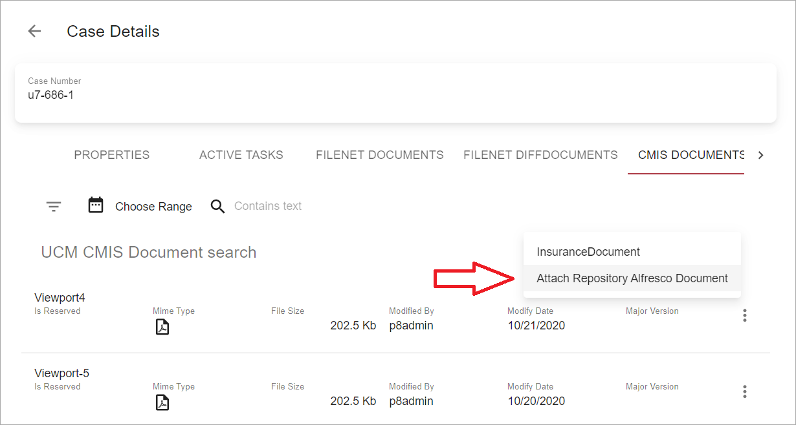
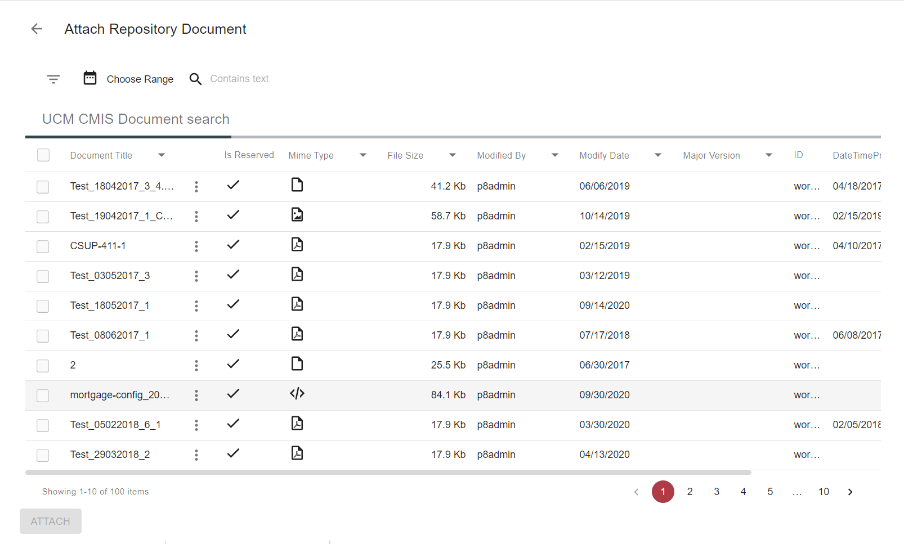
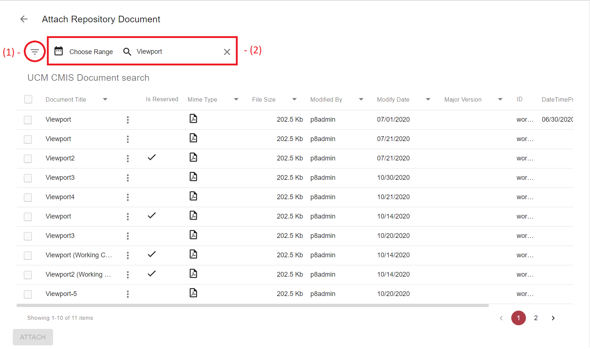
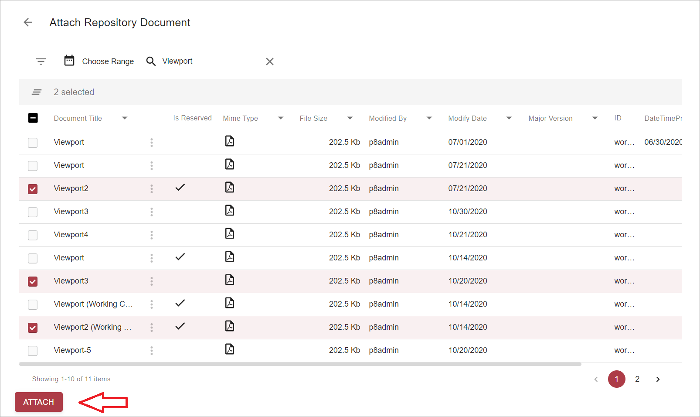
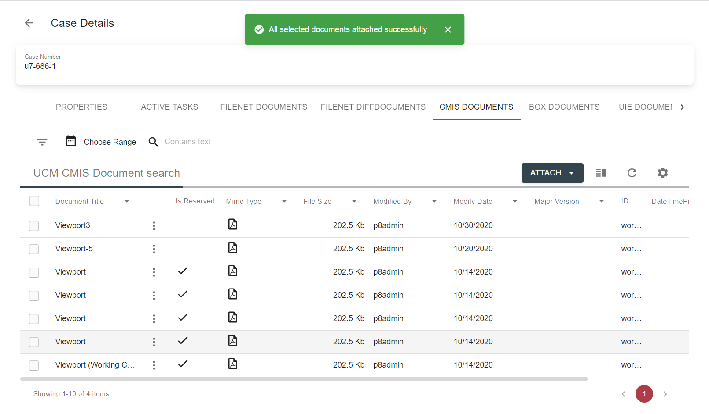
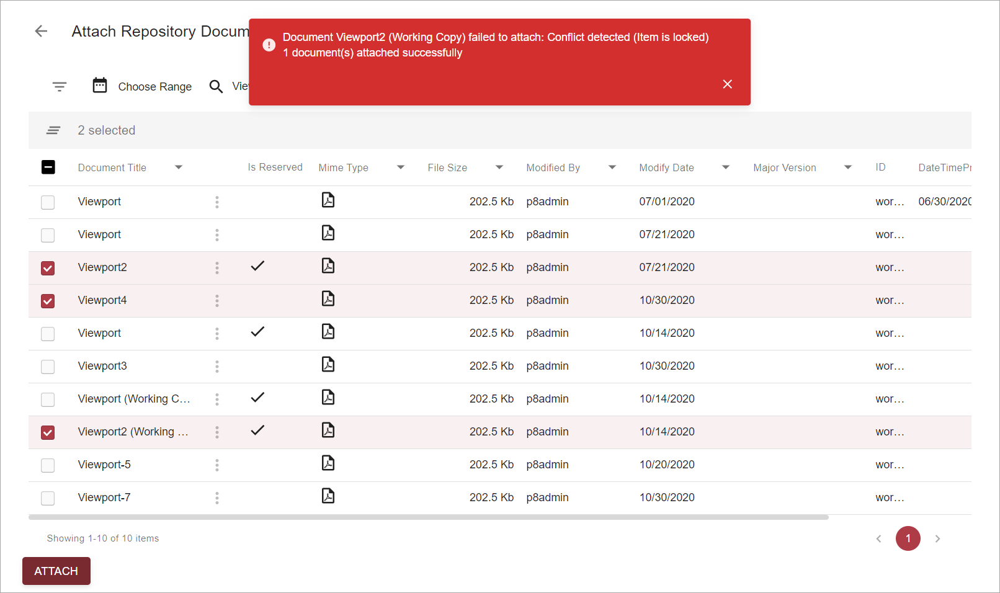

# Description

`Attach` existing document action allows linking document(-s) from different data providers to selected case. 
This type of action can be added on `Attachments` tab on a grid toolbar and will be rendered as a separate button 
(if only one attach action is bound to the grid) or a dropdown (in case grid contains 2 or more actions with 
`ActionType` custom parameter = `attach`).

*content to be added*

# How to Attach a Document(-s)

- Open case for edit and switch to one of `Attachments` tab 

- Click `attach` action on a grid toolbar and select an action: 

    

- It will open a page with search template action is linked to: 

    

- Search results may be filtered by using search criteria panel (1) or quick search (2):

    
    
- Choose one or more files to attach and click `Attach` button, which becomes enabled once at least 1 document is 
selected:

    
    
- If no errors occurred during action execution, than `Attach Repository Document` page will be closed, user will see 
the message, that action completed successfully, and grid on `Attachments` tab will be refreshed:

    
    
- If at least one error occurred during the operation, error message with failure reasons will appear. It will also 
display information on number of successfully uploaded documents, if there are any.

    

    `Attach Repository Document` page will remain opened on failure, grid on `Attachments` tab won't be refreshed.
    
# Configuration

[Attach existing document to case action configuration](../../configuration/actions/attach-existing-document.md)
