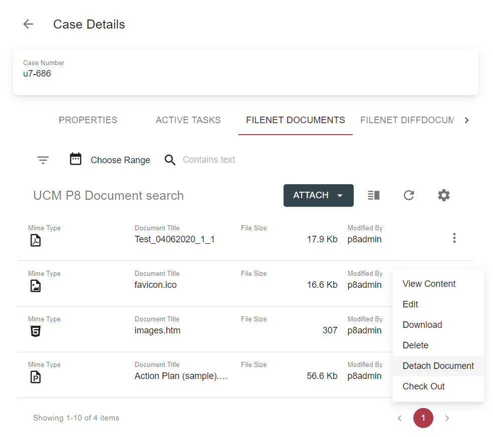
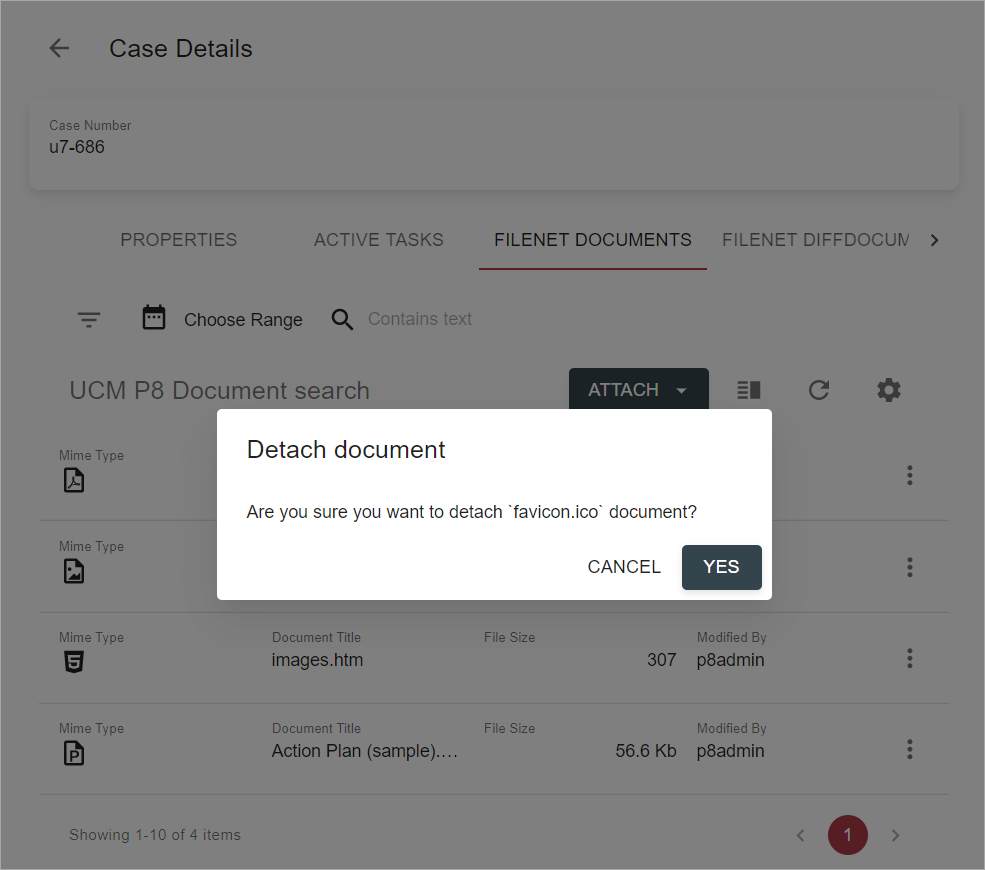

# Overview

Case attachments tab displays attached to the case documents inside search template. Depending on configuration 
it may have Folder View with case folder structure on the right side.  

# Search

*link to be provided on template's [search feature / criteria panel] description*

# Navigate

*link to be provided on grid navigation options*

# Attach

2 types of attach actions are available from the grid toolbar:

- [Attach a Local Document](./attach-document.md)  
- [Attach an Existing Document](./attach-existing-document.md) 

# Detach

Detach action is available from context-menu and allows to detach selected document from case:

After `Detach Document` action is selected confirmation dialog will appear:

Clicking on `Cancel` button will lead to closing confirmation dialog without detaching the document.

By selecting `Yes` button, user triggers `detach` action execution. After document is detached, grid page will be 
refreshed.

# Configuration

[Case attachments search template configuration](../../configuration/search-templates/case-attachments.md)  
[Attach local document action configuration](../../configuration/actions/attach-document.md)  
[Attach existing documents action configuration](../../configuration/actions/attach-existing-documents.md)  
[Detach action configuration](../../configuration/actions/detach-document.md)  
