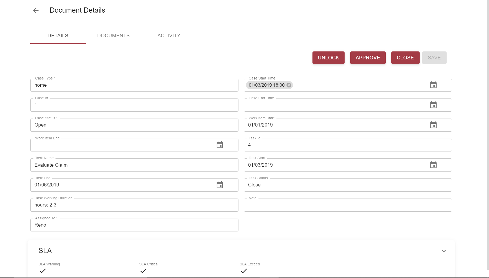
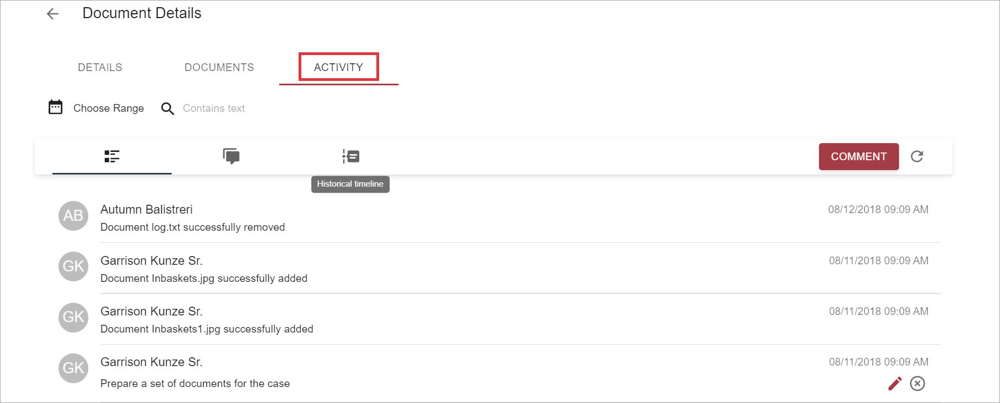
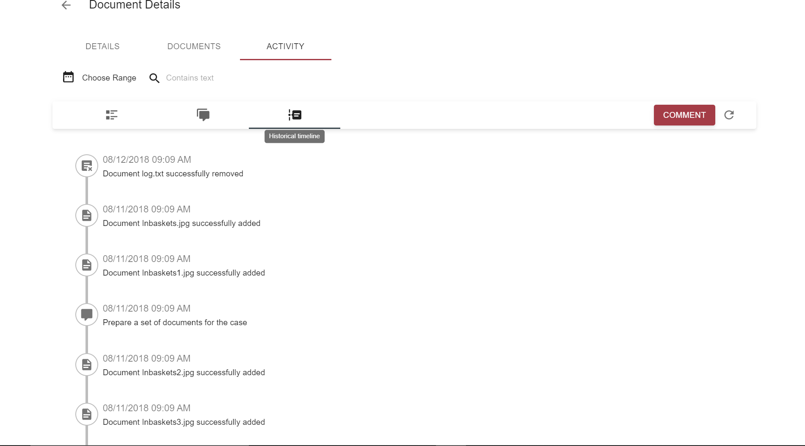

# Overview

Each case has timeline comments. The table below shows the type of each comment.
Each type has corresponding icon except `CASE UPDATED` and `TASK CREATED` ones.
Please note that instead of `ID` in each template, you'll see actual ID.

| Comment Type | Code | Template | Icon |
|-------|--------|---------|---------|
| CASE CREATED | 101 | Case ID successfully created |  |
| CASE UPDATED | 102 | Case ID successfully updated |no icon |
| CASE CLOSED | 103 | Case ID successfully closed |  |
| CASE REOPENED | 104 | Case ID successfully reopened |  |
| CASE SPLITTED | 105 | Case successfully created by splitting ID case |  |
| CASE COPIED | 106 | Case successfully created by copying ID case |  |
| WORK ITEM COMPLETED| 301 | Workitem ID completed |  |
| WORK ITEM ACTION EXECUTED | 301 | Workflow action ID executed successfully |  |
| DOCUMENT ADDED | 401 | Document ID successfully added |  |
| DOCUMENT REMOVED | 402 | Document ID successfully removed |  |
| TASK CREATED | 501 | Task ID successfully created |no icon |

# How to See Case Historical Timeline

- Open a case to see its timeline:

    

- Click on `ACTIVITY`:

    

- Click on `Historical timeline` icon:

    

# Configuration

Case history timeline feature appears automatically after configuring `ACTIVITY` tab.
