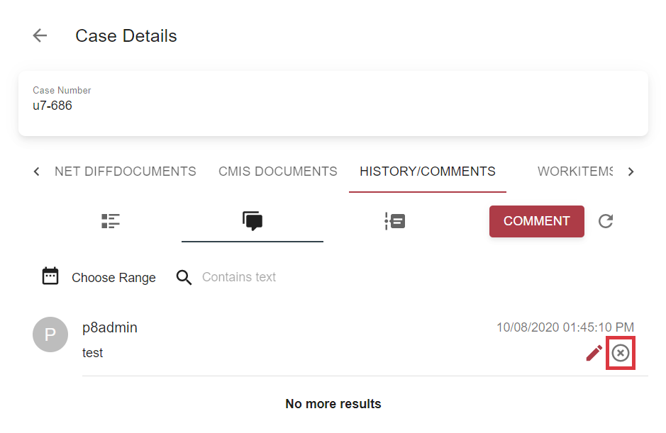
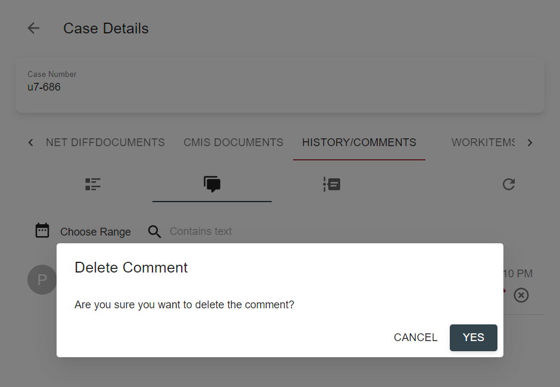

# Description

*content to be added*

# Search

*content to be added*

# Add

*content to be added*

# View

*content to be added*

# Update

*content to be added*

# Delete

Each user comment row has delete icon button on the right bottom corner:

If user doesn't have enough permissions, this button will be shown as disabled.

To remove the comment click on that button and confirm deletion by choosing `Yes` on modal dialog:

It will lead to comment deletion and grid refresh.

`Cancel` button is intended for action cancellation.

Action appears automatically, no configuration is required.