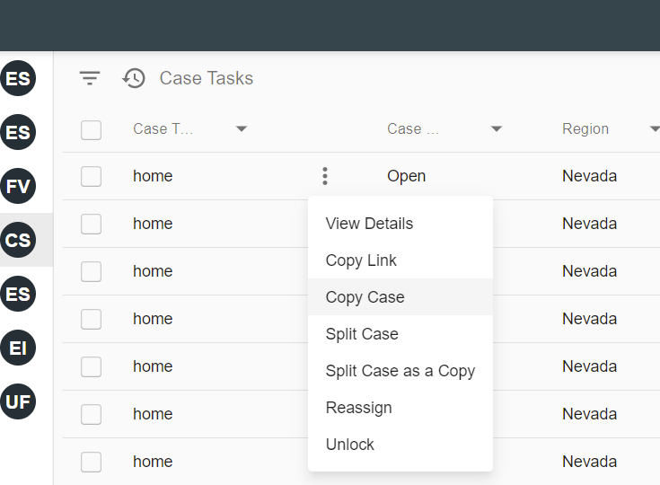
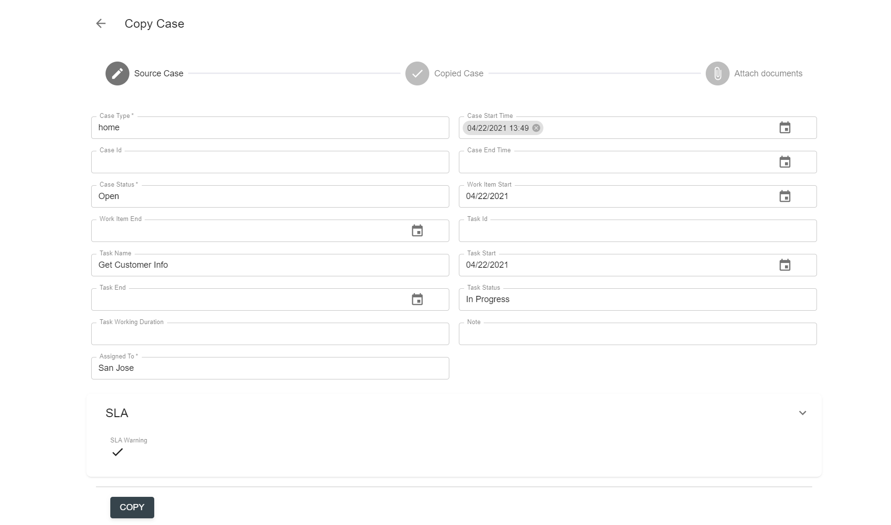
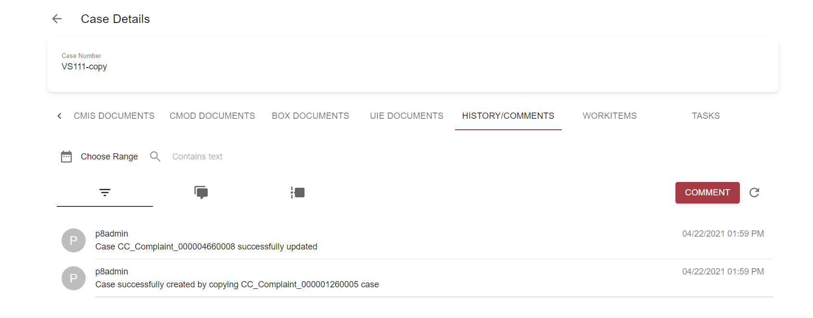

# Description

`Copy case` action allows to create a copy of a case in case manager and optionally attach files from the original case to it. 

# How to Copy a Case

`Copy case` action in React UI is implemented as a grid action available for Cases resources via a grid's context menu:

 

Once selected, the action will be executed as a wizard with several steps:

- The first step is `Source Case` with form details of selected case. User can edit data if needed or leave as is in original case. 

              

By selecting `Copy` button in this screen, user actually triggers Copy Case action execution in a backend system (i.e. IBM ICM).

- Upon successful completion the wizard opens next step `Copied Case` form with details of a new case. User can edit and save data if needed or leave it as is.

- Third optional step `Attach documents` is a screen where user is able to choose documents from source case and, by selecting 'Attach' button, link these documents with copied case as well.

As a result, new case will be created as a copy of existing case. Relevant information will be tracked in the history of the case:

# Configuration

[Copy case action configuration](../../configuration/actions/copy-case.md)
