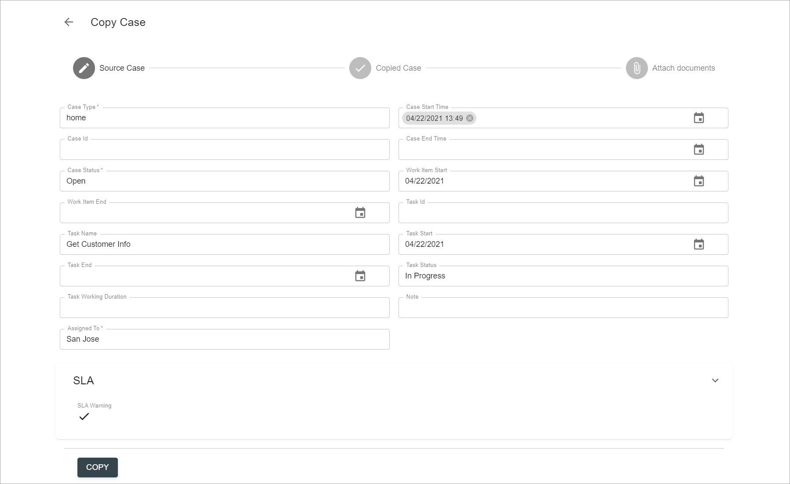

# Description

`Copy case` action allows to create a copy of a case in case manager and optionally attach files from the original case to it. 

# How to Copy a Case

`Copy case` action in React UI is implemented as a grid action available for Cases resources via a grid's context menu:

 

Once selected, the action will be executed as a wizard with several steps:

- Step 1. `Source Case` form with details of selected case. User can edit data if needed or leave it as is in original case. 

              

    By clicking the `Copy` button in this screen, user actually triggers Copy Case action execution in a backend system (i.e. IBM ICM).  
    Upon successful completion, the wizard opens the next step.
    
- Step 2. `Copied Case` form with details of a new case. User can edit and save data if needed or leave it as is.

- Step 3 (optional). `Attach documents` is a screen where user can choose documents from source case and, by clicking the `Attach` button, link these documents with copied case as well.

As a result, a new case will be created as a copy of existing case. Relevant information will be tracked in the history of the case:

# Configuration

[Copy case action configuration](../../configuration/actions/copy-case.md)
