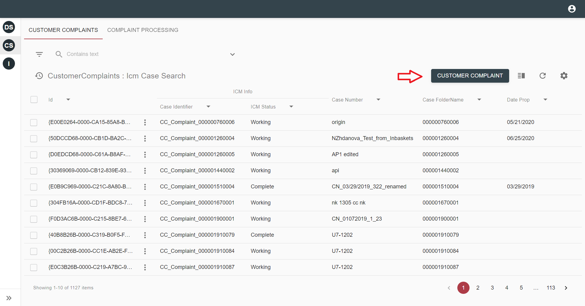
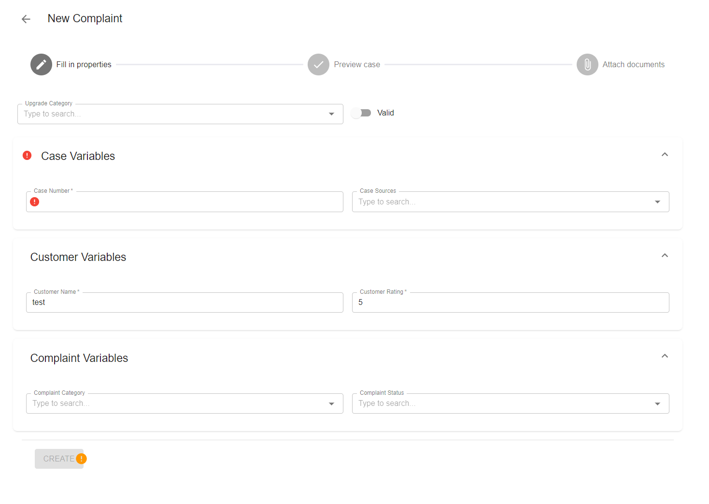
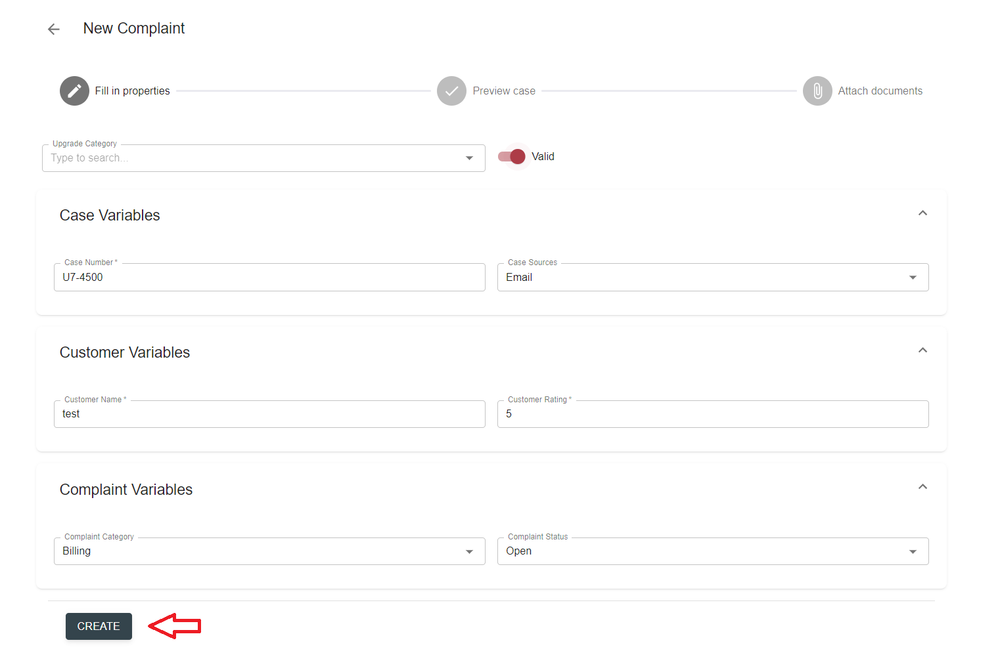
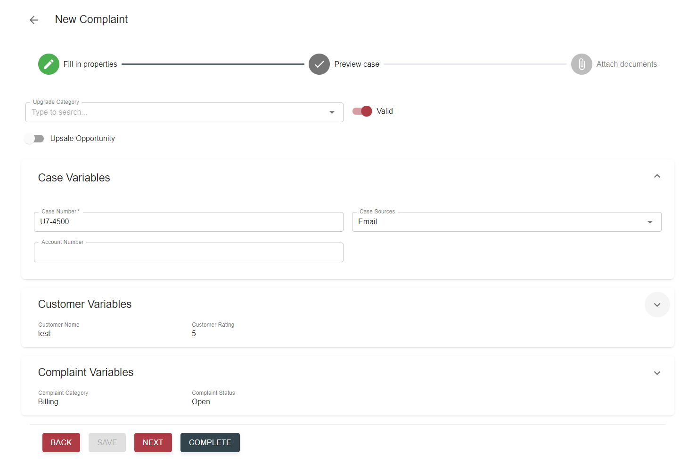
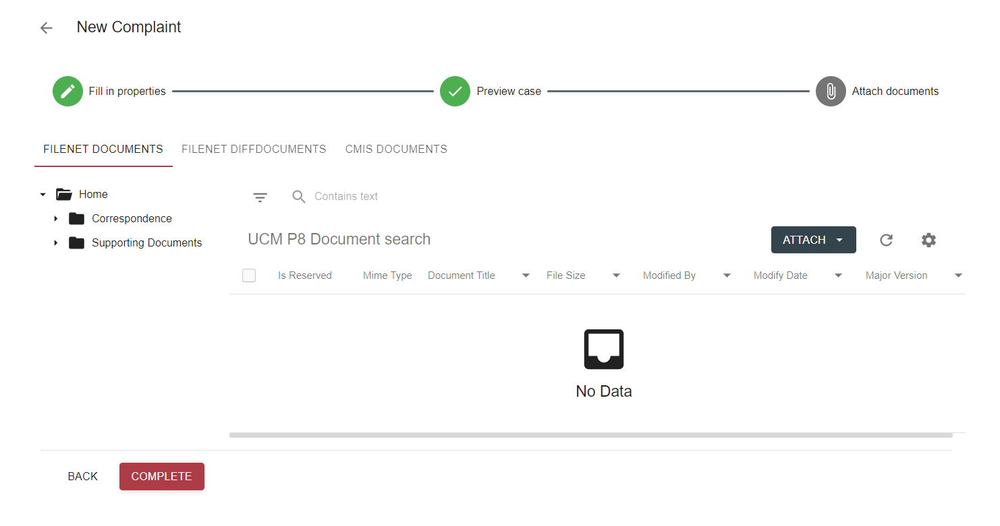

# Description

`Create case` action allows to create a case in case manager and attach files to it. It can be executed from a grid 
toolbar.

# How to create a case

- Find create case associated button on grid toolbar and click it:

    
    
    On screenshot above this button has `Customer Complaint` label.
    
- Once clicked, the action will be executed as a wizard with several steps.

- The first step is `Fill in properties` form where properties for new case can be specified:

    

- Fill in the properties and click `Create` button:

    
    
- Next step is a `Preview case` form. It's similar to form on previous step, however uses different set of fields, 
unless the same fieldset is specified for both `Create` and `Active` case views.

    
    
    Available actions: back (remove just created case and return to previous step), save (update case properties), 
    next (move to next step), complete (complete case creation wizard).

- Third step allows to attach documents to just created case. View is based on tabs with Type = `Attachments`, which
are defined in solution configuration file for `Active` cases.

    
    
    Available actions: back (move to previous step), complete (complete case creation wizard).
    
# Configuration

[Create case action configuration](../../configuration/actions/create-case.md)

[Defining view for create case action](../../configuration/tags-list/views-tag.md)

[Attachments search template configuration](../../configuration/search-templates/case-attachments.md)