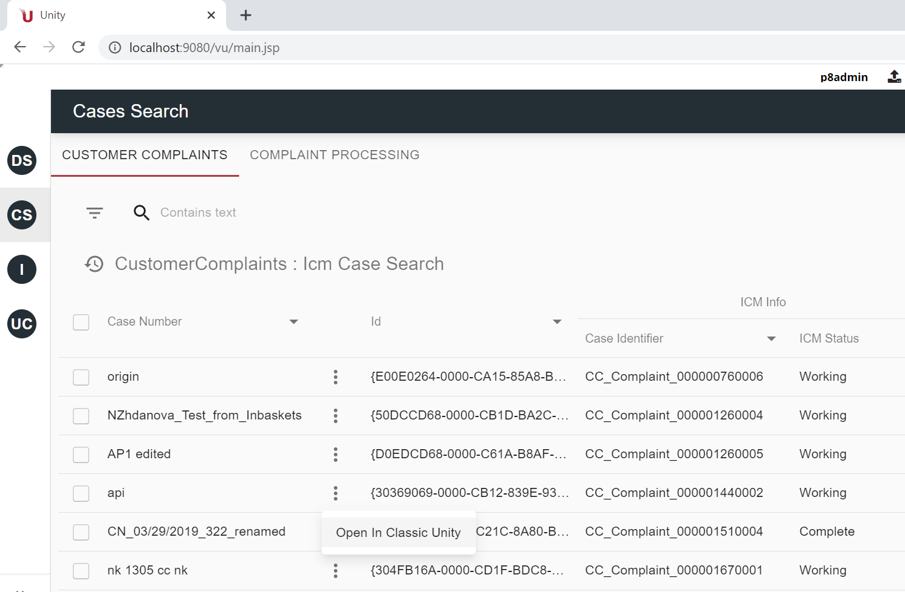
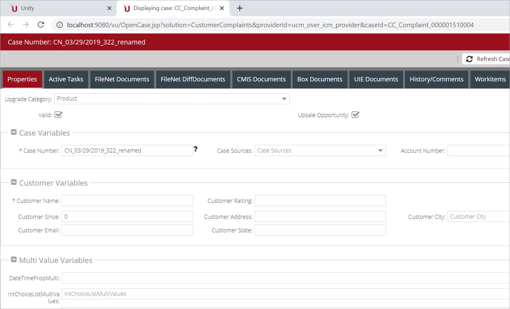

Open Case By URL feature provides an alternative way to open the case for viewing or editing.

Case will be opened in a new browser tab by URL, which is provided in [action configuration](../../configuration/actions/open-by-url.md).

Open Case By URL feature in React UI is implemented as a grid row action:

 

An example of using this feature can be opening a case from the React UI grid in the ExtJS UI.

