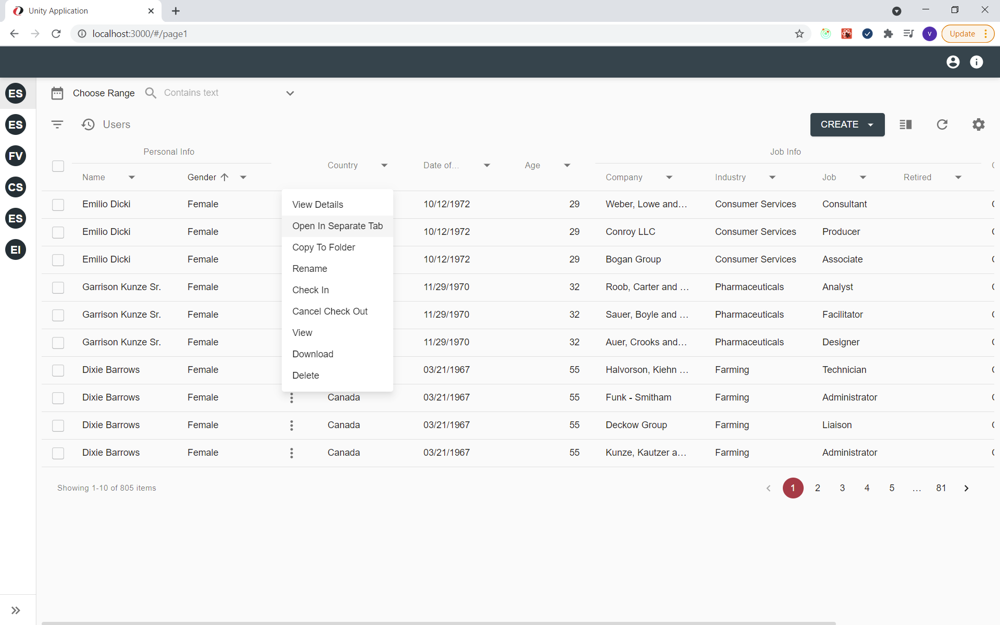
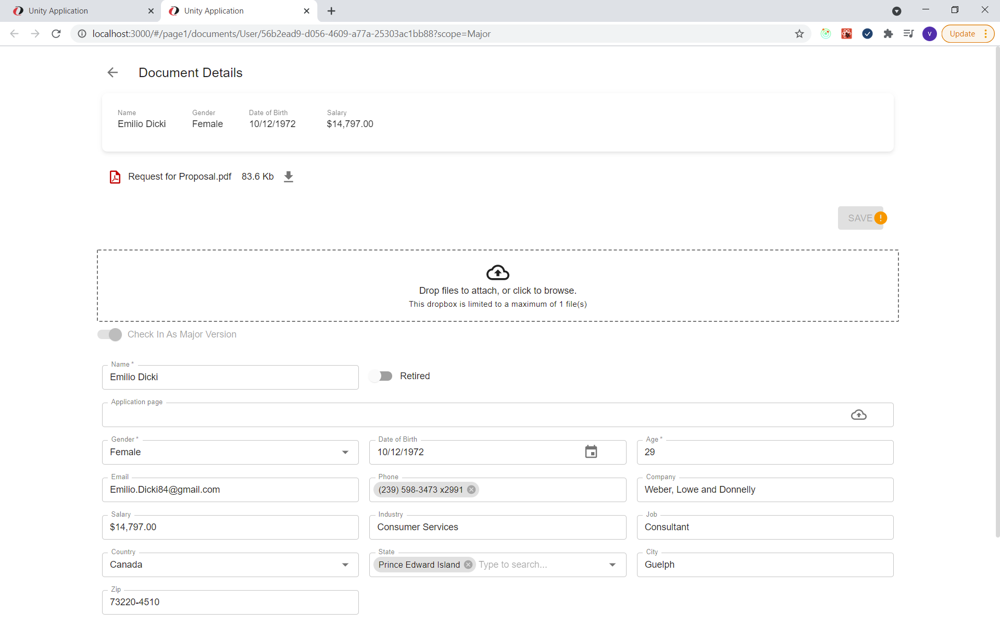

# Description

`Open in separate tab` action provides an alternative way to open (or other resources like document or workitem) the case for viewing or editing in separate browser tab. 

# How to open a resource in separate browser tab

`Open in separate tab` action in React UI is implemented as a grid row action available via a grid's context menu:

Once selected, a new browser tab with selected resource details will be opened:

# Configuration

[React UI Open In Separate Tab action configuration](../../configuration/actions/open-in-separate-tab.md)
