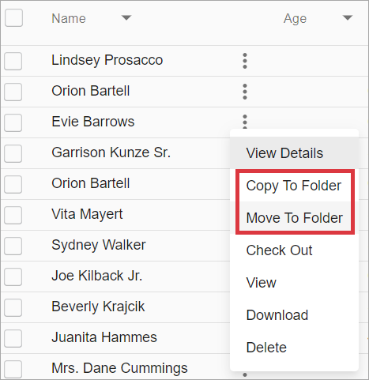
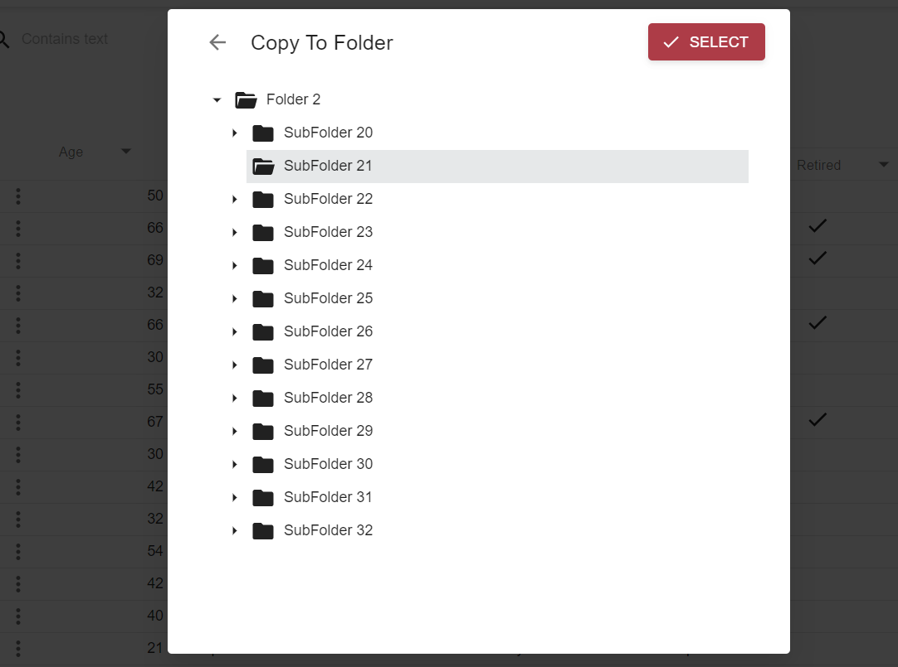
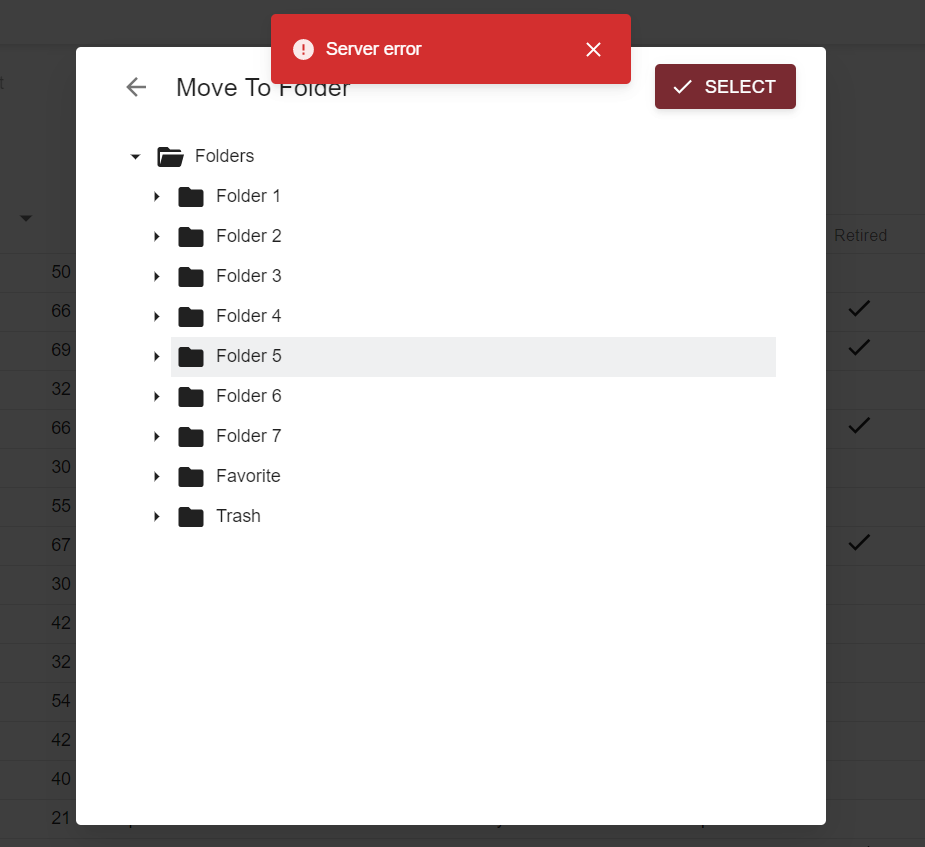
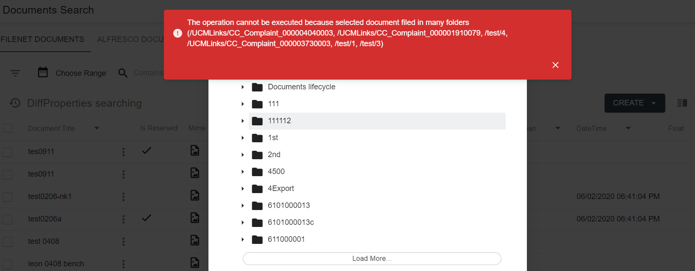

# Description

Copy/Move document To Folder feature allows to copy or move a document from one folder to another within its repository data provider. It can be executed from grid context-menu.

Copy document action will keep document filed wherever it is currently and additionally file it into selected folder. As the result, the document will be filed into more than one folder.

Move document action will unfile document from the folder where it is filed and file it into selected folder. But if document is already filed into more that one folder, error will be shown with the list of folders where it is currently filed into.

*content to be added*

# How to copy or move a document to folder

- Click on context menu icon of the document, that should be deleted

- Click `Copy To Folder` or `Move To Folder` action

     

- Folder tree will appear. Select a destination folder and click `Select` button:

     

- In case of failure the tree remains opened, toast with error message appears:

     

- In case if document is moved to folder while being filed into more than one folder already, the tree remains opened and toast with error message appears:
     

- If no errors occurred during action execution, user will see the message, that action completed successfully:

     

Successful action execution will also lead to grid refresh.

# Configuration

[Copy document to folder action configuration](../../configuration/actions/copy-document-to-folder.md)

[Move document to folder action configuration](../../configuration/actions/move-document-to-folder.md)
