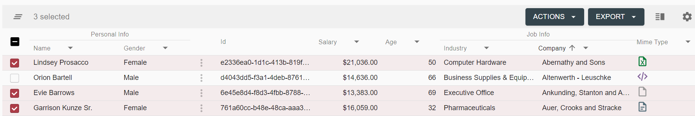
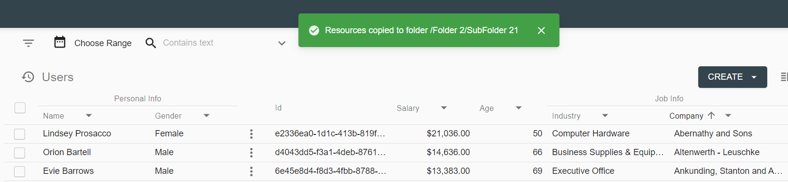

# Description

Copy/Move document to Folder feature allows to copy or move a document from one folder to another within its repository data provider. It can be executed from grid context-menu.

`Copy` document action will keep document filed wherever it is currently and additionally file it into selected folder. As the result, the document will be filed into more than one folder.

`Move` document action will unfile document from the folder where it is filed and file it into selected folder. But if document is already filed into more that one folder, error will be shown with the list of folders where it is currently filed into.

These actions may be executed in [row mode](#how-to-copy-or-move-a-document-to-folder) and [bulk mode](#how-to-bulk-copy-or-move-documents-to-folder).

# How to Copy or Move a Document to Folder

This describes how action works in row mode.
- Click on context menu icon of the document, that should be copied or moved

- Click `Copy to Folder` or `Move to Folder` action:

     

- Folder tree will appear. Select a destination folder and click `Select` button:

     

- In case of failure the tree remains opened, toast with error message `Server error` appears:

     

- In case if document is moved to folder while being filed into more than one folder already, the tree remains opened and toast with error message
`The operation cannot be executed because selected document filed in many folders` appears:

     

- If no errors occurred during action execution, user will see the message `Resource moved to ...` or `Resource copied to ...`, the action completed successfully:

     

Successful action execution will also lead to grid refresh.

# How to Bulk Copy or Move Documents to Folder
This describes how copy or move several documents at once using bulk mode.
- Using row checkboxes or Select All checkbox in the grid header, select documents that should be copied or moved.
     

- Select `Copy to Folder` or `Move to Folder` action from `Actions` bulk mode menu in the grid header.
     

- Folder tree will appear. Select a destination folder and click `Select` button:

     

- In case of failure the tree remains opened, toast with error message `Server error` appears:

     

- In case if document(s) moved to folder while being filed into more than one folder already, the tree remains opened and toast with error message
`The operation cannot be executed because selected document filed in many folders` appears:

     

- If no errors occurred during action execution, user will see the message `Resources moved to ...` or `Resources copied to ...`, the action completed successfully:

     

Successful action execution will also lead to grid refresh.

# Configuration

Copy document to folder action configuration in [row mode](../../configuration/actions/copy-document-to-folder.md#row-action configuration) and [bulk mode](../../configuration/actions/copy-document-to-folder.md#bulk-action configuration).

Move document to folder action configuration in [row mode](../../configuration/actions/move-document-to-folder.md#row-action configuration) and [bulk mode](../../configuration/actions/move-document-to-folder.md#bulk-action configuration).
