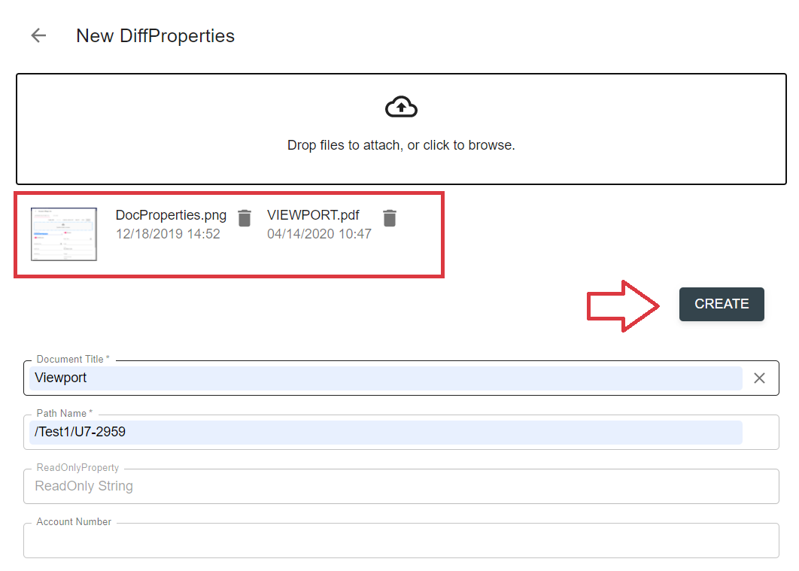
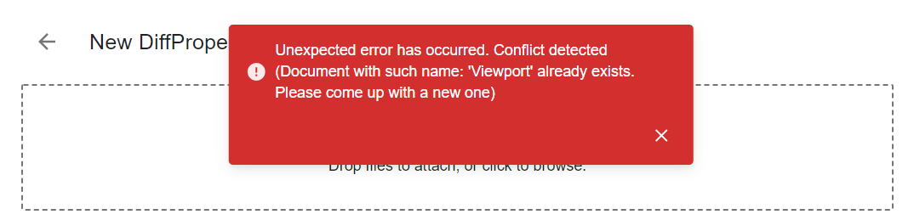
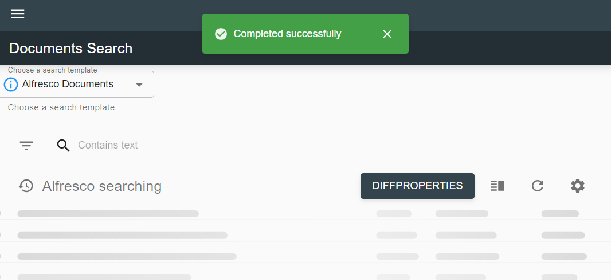

# Description

Create document feature allows to upload a file (set of files) into a particular data provider with ability to specify 
document properties. This type of action can be added on a grid toolbar and will be rendered as a separate button 
(if only one create action is bound to the grid) or a dropdown (in case grid contains many create actions).

*content to be added*

# How to create a document(-s)

- Click `create` action on a grid toolbar and select particular type of document to be created (if dropdown is 
available).

- Drop files into drop zone or click it to select files for upload:

    

- Selected files info will appear below the drop zone area. Fill in properties and click `Create` button:

    
    
- In case of failure form remains opened, toast with error message appears:

    
    
- If no errors occurred during action execution, user will see the message, that action completed successfully:

    
    
    Successful action execution will also lead to grid refresh.
    
# Configuration

[Create document action configuration](../../configuration/actions/create-document.md)
