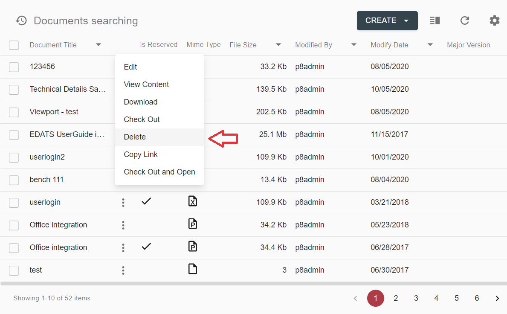
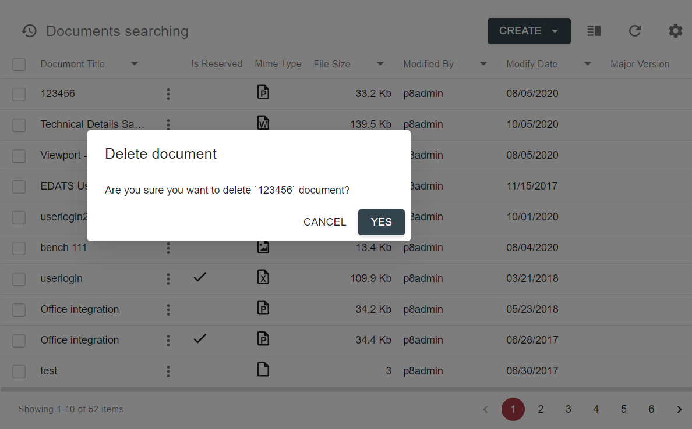
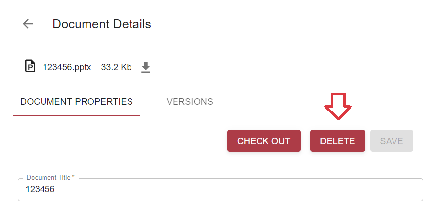
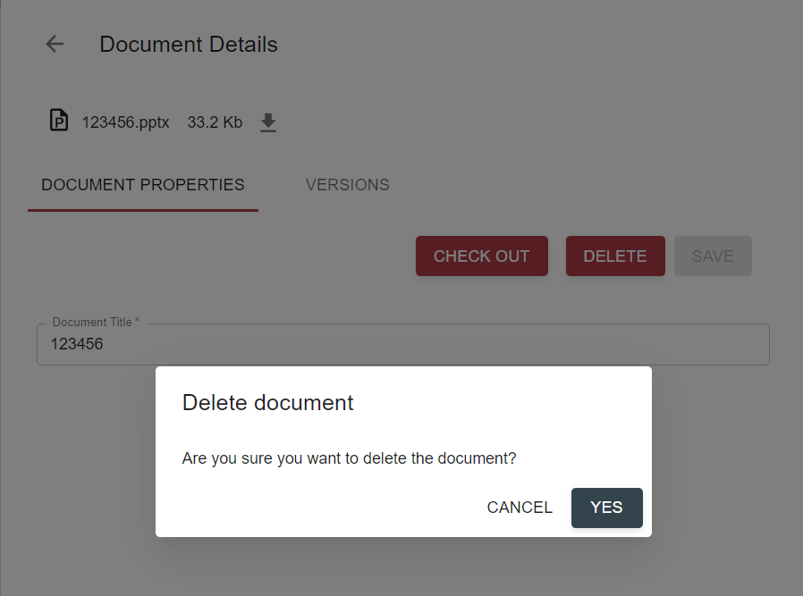

# Description

Delete document action allows to delete a document from repository data provider. It can be executed from grid 
context-menu or `Properties` tab of `Document Details` page. 

*content to be added*

# How to Delete a Document

## Delete a Document from Grid

1. Click on context menu icon of the document, that should be deleted

2. Click `Delete` action

3. Confirmation dialog will appear:

Clicking on `Cancel` button will lead to closing confirmation dialog without document deleting.

By selecting `Yes` button, user triggers `delete` action execution. After document is deleted, grid page will be 
refreshed.

## Delete a Document from Document Details

1. Open `Document Details` by clicking row in grid / selecting `Edit` action from context-menu / opening document 
in a separate tab ...

2. Click `Delete` button

3. Confirmation dialog will appear:

Clicking on `Cancel` button will lead to closing confirmation dialog without document deleting.

By selecting `Yes` button, user triggers `delete` action execution. After document is deleted, `Document Details` 
will be closed. In case document is opened from grid (via context menu `Edit` action or by clicking on a row), grid will be 
refreshed as well.
