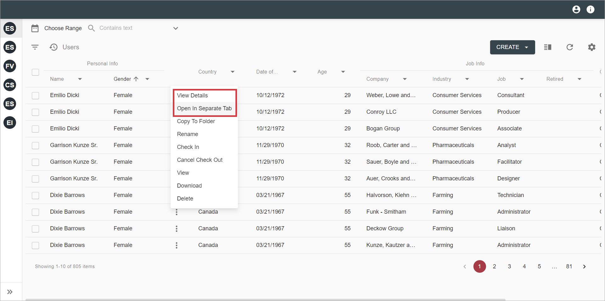
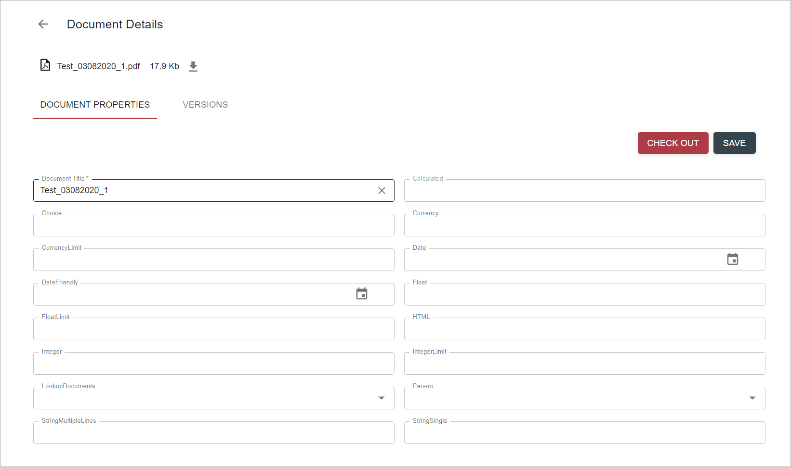

# Description

`Document details` feature allows to: 

- view and edit document properties

- view versions

- perform some actions on document like `check out`, `check in`, `cancel check out`, `view content`, `download`, `delete`, 
`open in office`, etc. List of document actions depends on action view configuration and data provider

- perform some actions on document versions like `promote`, `demote`, `make version current`, `delete version`. List of 
actions depends on configuration and data provider

# How to Use Document Details

To open Document Details:

- In the grid click on Document Title, or click a dropdown icon in the document row and select `Edit` action:

    

- `Open in separate tab` action provides an alternative way to open the document details (or details of other resources like a case or a workitem):
  
    

- `Document Details` view will be opened in a modal or separate tab:

    

`Document Properties` tab is shown by default, user can switch to `Versions`.

Edit available fields and save changes by clicking `Save` button.

# Configuration

[Document details action configuration](../../configuration/actions/document-details.md)

[Open In Separate Tab action configuration](../../configuration/actions/open-in-separate-tab.md)
